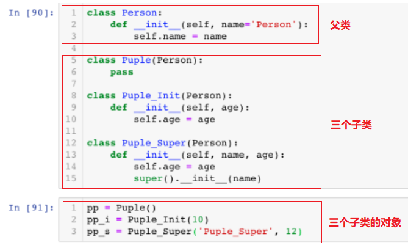
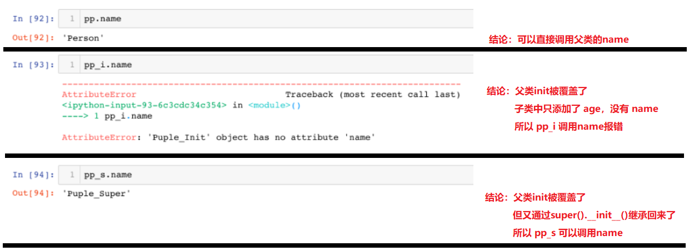
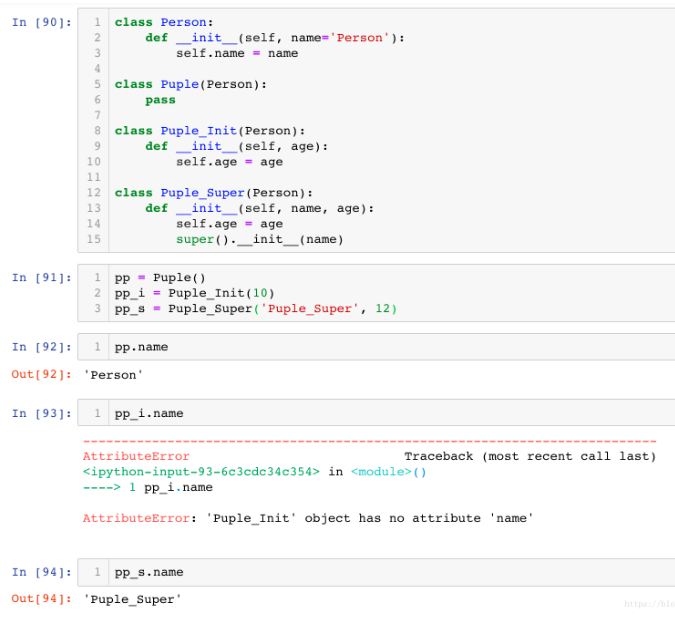
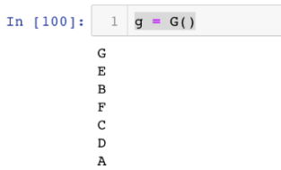
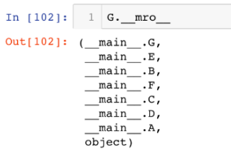

# Python继承初始化


> [!info] 来源
> [CSDN - python中的super init](https://blog.csdn.net/a__int__/article/details/104600972)


### 文章目录

- - [python里的super().__init__()有什么用？](https://blog.csdn.net/a__int__/article/details/104600972#pythonsuper__init___2)
  - - [1、从实例中对比（python3）](https://blog.csdn.net/a__int__/article/details/104600972#1python3_8)
    - - [1.1、实例](https://blog.csdn.net/a__int__/article/details/104600972#11_9)
      - [1.2、运行结果与对比](https://blog.csdn.net/a__int__/article/details/104600972#12_19)
      - [1.3、完整代码](https://blog.csdn.net/a__int__/article/details/104600972#13_22)
    - [2、关于继承顺序](https://blog.csdn.net/a__int__/article/details/104600972#2_25)
    - [3、super() 在 python2、3中的区别](https://blog.csdn.net/a__int__/article/details/104600972#3super__python23_73)


# python中super().__init__()

## python里的super().**init**()有什么用？

对于python里的super().__init__()有什么作用，很多同学没有弄清楚。

简单的说super().__init__()，就是继承父类的init方法，同样可以使用super()去继承其他方法。

> 下面是三种不同的继承、调用，对比他们的区别，搞清楚super().__init__()的用途。

### 1、从实例中对比（python3）

#### 1.1、实例



| 子类名称    | 继承内容                                                     |
| ----------- | ------------------------------------------------------------ |
| Puple       | 继承所有                                                     |
| Puple_Init  | 继承，但覆盖了init方法                                       |
| Puple_Super | 继承，但覆盖了init方法，并在init里面添加了super().__init__() |

#### 1.2、运行结果与对比



#### 1.3、完整代码



### 2、关于继承顺序

最底层：先写一个父类A

```
class A:
    def __init__(self):
        print('A')
123
```

第二层：让 B、C、D 继承自A

```
class B(A):
    def __init__(self):
        print('B')
        super().__init__()

class C(A):
    def __init__(self):
        print('C')
        super().__init__()

class D(A):
    def __init__(self):
        print('D')
        super().__init__()
1234567891011121314
```

第三层： E、F、G 继承

```
class E(B, C):
    def __init__(self):
        print('E')
        super().__init__()

class F(C, D):
    def __init__(self):
        print('F')
        super().__init__()

class G(E, F):
    def __init__(self):
        print('G')
        super().__init__()
1234567891011121314
```

看看G的继承顺序
我们发现G继承自E, F是并列的，初始化的时候不会先把E初始化完毕才初始化F。

### 3、super() 在 python2、3中的区别

Python3.x 和 Python2.x 的一个区别: Python 3 可以使用直接使用 super().xxx 代替 super(Class, self).xxx :

> 例：
> python3 直接写成 ： super().__init__()
> python2 必须写成 ：super(本类名,self).__init__()

Python3.x 实例：

```
class A:
     def add(self, x):
         y = x+1
         print(y)
class B(A):
    def add(self, x):
        super().add(x)
b = B()
b.add(2)  
123456789
```

Python2.x 实例：

```
class A(object):   
    def add(self, x):
         y = x+1
         print(y)
class B(A):
    def add(self, x):
        super(B, self).add(x)
b = B()
b.add(2)  
123456789101112
```

文章知识点与官方知识档案匹配，可进一步学习相关知识


