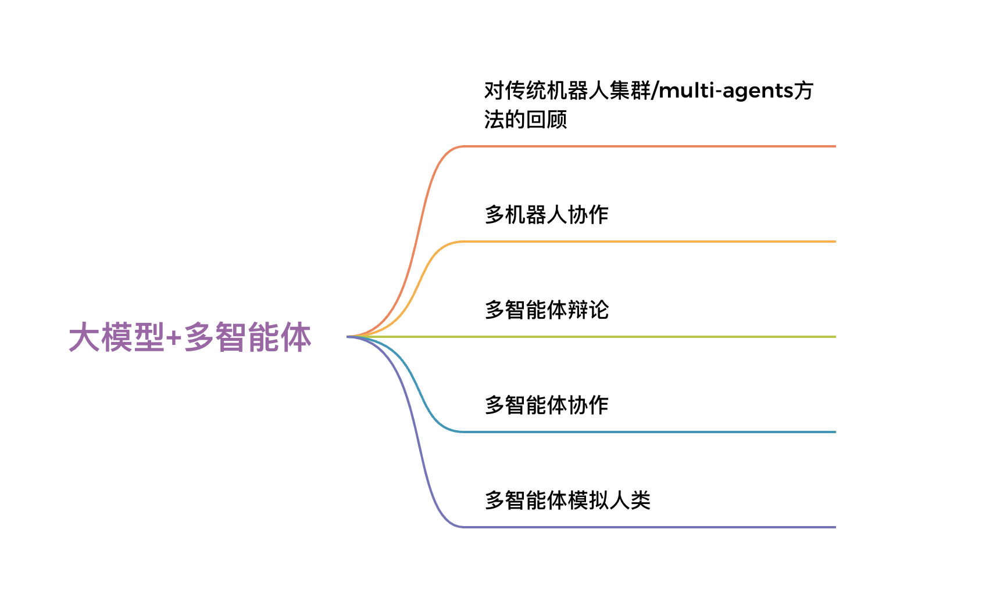

---
title:
  - 集智俱乐部读书会《大语言模型与多智能体系统》
authors: Ethan Lin
year: 2024-03-01
tags:
  - 类型/笔记
  - 日期/2024-03-01
  - 来源/转载
  - 内容/大语言模型
  - 内容/多主体强化学习
  - 内容/多主体建模
  - 类型/教学
  - 类型/资料
---

# 集智俱乐部读书会《大语言模型与多智能体系统》

本路径是 [大语言模型与多智能体系统读书会](https://pattern.swarma.org/study_group/38) 的参考文献列表。读书会由西湖大学工学院特聘研究员赵世钰、浙江大学教授任沁源、鹏城实验室高级工程师崔金强发起，探究大语言模型给机器人领域带来的新思想新价值。希望能够聚集起对机器人控制与决策、集群智能、深度学习、强化学习、大模型/大语言模型/多模态大模型、通用人工智能等方向的研究者共同探讨。

# 读书会背景

随着人工智能技术迅速发展和算力提升，机器人技术正经历从机械执行任务到智能交互的演进。大型语言模型如GPT系列的涌现为机器人注入新活力，通过强大的自然语言处理和生成能力提升了对话、语言理解等任务。大模型不仅能处理海量语言信息，更为机器人赋予了深层次的语境理解能力，使其更准确地解读用户指令，表现出更自然的语言表达。
然而，机器人的真正智能不仅仅体现在语言处理上，还需要通过感知和行动来与环境进行交互。在这一点上，机器人与大模型形成了互补性的关系。机器人可以充分利用大模型的语言处理优势，更智能地解读和回应用户的指令，同时通过传感器等技术感知环境的变化，并基于大模型的输出做出相应的决策和行动。
为了更好地实现这种互补性，具身智能的概念应运而生。具身智能不仅注重语言理解，更将机器人的智能嵌入到具有身体结构的实体中，使其能够更自然地与周围的环境进行交互。这一趋势使得机器人不仅在语言处理上更为智能，同时也在感知和行动方面取得了更全面的进展。
解决问题范式的变革是这一趋势的重要体现。大模型的出现改变了传统机器人问题求解范式，不再追求严格推导，而更关注在复杂环境中找到人类可接受的解决方案。大模型还带来了通用性和泛化性的增强，为机器人在不同场景中更好地适应和应对挑战提供了可能。
在具身智能的引领下，机器人与大模型的结合不仅为人机交互提供了更自然、更高效的体验，也推动了机器人在多领域应用中的更为深远的影响。我们将谈论大模型在机器人领域的具体联系及应用场景，希望能对你有所启发。

# 读书会框架介绍

传统机器人/智能体设计针对特定任务需要独立训练，涉及场景建模、数学推导、证明、仿真检验等繁琐环节，导致流程复杂且适用范围有限。大模型的出现极大简化了这一流程，采用预训练大模型加特定任务微调，提升了开发部署速度，降低了成本。
值得注意的是，大模型与传统方法并非二选一，而是相互补充。大模型适合规划，不擅长底层精确控制，而传统方法在这方面表现卓越。它们形成了良好的互补关系，进一步降低了机器人的使用和部署门槛。
本次读书会将介绍大模型与智能体的话题，涵盖内容包括大语言模型赋能下智能体之间的辩论、协作、模拟人类，以及实际场景中的多机器人协作等问题。主要目的是希望能够帮助各个不同学科领域的学者了解大模型与智能机器人的这个交叉领域，尤其是机器人控制与决策、集群智能等方向的研究者，同时揭示未来可能的研究发展方向。

读书会框架图

# 阅读论文清单

**材料由徐璐峰、季文康提供材料**

### 多机器人协作

**这个领域主要是介绍大模型赋能的实体机器人通过合作来完成复杂任务。**
[RoCo: Dialectic Multi-Robot Collaboration with Large Language Models*Zhao Mandi,Shreeya Jain,Shuran Song**arXiv*（2023）](https://pattern.swarma.org/paper/e479c1cc-af9b-11ee-85ed-0242ac170008)这篇论文提出了一种新的多机器人协作方法，该方法利用预训练的大语言模型（LLMs）的强大功能进行高级通信和低级路径规划。机器人配备了LLMs讨论和集体推理任务策略的能力。

[Building Cooperative Embodied Agents Modularly with Large Language Models*Hongxin Zhang,Weihua Du,Jiaming Shan.et al.**arXiv*（2023）](https://pattern.swarma.org/paper/78429f9e-b06b-11ee-9733-0242ac170008)实体智能体之间规划、沟通、协作，完成长期任务。这篇论文提出了一个新的框架，利用LLMs进行多智能体协作，并在不同的具体环境中进行测试。该框架允许智能体规划、沟通，并与其他智能体或人类有效合作，以高效完成长时程任务。

[Embodied Foundation Models for Large Scale Orchestration of Robotic Agents*Michael Ahn, Debidatta Dwibedi, Chelsea Finn.et al.*](https://pattern.swarma.org/paper/fe5abff8-b06b-11ee-92e9-0242ac170008)Google Deepmind: 大规模机器人代理协同自动化。AutoRT利用视觉-语言模型（VLMs）进行场景理解和基础定位，并进一步利用大语言模型（LLMs）提出多样化和新颖的指令，以供机器人队列执行。通过借助基础模型的知识引导数据收集，AutoRT能够有效地思考自主权权衡和安全性，并显著扩大机器人学习的数据收集。

### 多智能体辩论

**这个领域主要是介绍大模型赋能的多个agent通过辩论等提升自我认知水平，降低大模型输出幻觉等问题。**
[Encouraging Divergent Thinking in Large Language Models through Multi-Agent Debate*Tian Liang,Zhiwei He,Wenxiang Jiao.et al.**arXiv*（2023）](https://pattern.swarma.org/paper/1fc5dcb8-b06c-11ee-ae78-0242ac170008)多智能体之间持续辩论，从不同角度思考问题，解决复杂任务。论文提出了一个名为Multi-Agent Debate（MAD）的框架，其中多个智能体以“以牙还牙”的状态表达其论点，而一名裁判管理辩论过程以获得最终解决方案。MAD框架鼓励LLMs进行分歧思考，对需要深度思考的任务有帮助。

[Improving Factuality and Reasoning in Language Models through Multiagent Debate*Yilun Du,Shuang Li,Antonio Torralba.et al.**arXiv*（2023）](https://pattern.swarma.org/paper/2ea4d6bc-b06c-11ee-bcf0-0242ac170008)多智能体之间持续辩论，提高了生成内容的真实性，减少幻觉。文章提出了一种互补的方法，通过多个语言模型实例在多轮中提出和辩论各自的回答和推理过程，最终达成共同的最终答案。这种方法明显提升了在多个任务中的数学和战略推理能力。

[ChatEval: Towards Better LLM-based Evaluators through Multi-Agent Debate*Chi-Min Chan,Weize Chen,Yusheng Su.et al.**arXiv*（2023）](https://pattern.swarma.org/paper/393cde62-b06c-11ee-933f-0242ac170008)使用多智能体辩论的方式评估LLM在开放式问题以及NLG任务中的相应质量。提出了一种多代理辩论框架，超越了单一代理的提示策略。多代理的方法使一组LLMs能够与一系列智能对手协同工作，利用其独特的能力和专业知识，提高处理复杂任务的效率和效果。

[ReConcile: Round-Table Conference Improves Reasoning via Consensus among Diverse LLMs*Justin Chih-Yao Chen,Swarnadeep Saha,Mohit Bansal**arXiv*（2023）](https://pattern.swarma.org/paper/464831ec-b06c-11ee-9463-0242ac170008)多智能体圆桌辩论，解决复杂问题。RECONCILE通过多轮讨论，学习说服其他代理改进其答案，并采用置信度加权投票机制，增强了LLMs的推理能力。

[Are we going MAD? Benchmarking Multi-Agent Debate between Language Models for Medical Q&A*Andries Smit,Paul Duckworth,Nathan Grinsztajn.et al.**arXiv*（2023）](https://pattern.swarma.org/paper/8b907f16-b06c-11ee-8ba0-0242ac170008)- InstaDeep: 对医学问答语言模型之间的多智能体辩论进行基准测试。

### 多智能体协作

**这个领域主要是介绍大模型赋能的多个agent通过对话、角色扮演等进行分工协作，共同完成一些复杂任务。**
[ChatLLM Network: More brains, More intelligence*Rui Hao,Linmei Hu,Weijian Qi.et al.**arXiv*（2023）](https://pattern.swarma.org/paper/9b2ccd80-b06c-11ee-8aff-0242ac170008)提出了ChatLLM网络，允许多个基于对话的语言模型进行交互、提供反馈和共同思考。具体而言，网络中ChatLLM的各个实例可能对同一问题具有不 同的观点，通过通过一个独立的ChatLLM整合这些不同的观点，网络的优化使用基于语言的反向传播机制。

[CAMEL: Communicative Agents for "Mind" Exploration of Large Language Model Society*Guohao Li,Hasan Abed Al Kader Hammoud,Hani Itani.et al.**arXiv*（2023）](https://pattern.swarma.org/paper/3e6e746e-d1e1-11ed-867d-0242ac17000d)- 提出了一种基于角色扮演的多智能体协作框架。提供了一种可扩展的方法来研究多代理系统的合作行为和能力，并开源了一个支持沟通代理研究的库。

[Unleashing the Emergent Cognitive Synergy in Large Language Models: A Task-Solving Agent through Multi-Persona Self-Collaboration*Zhenhailong Wang,Shaoguang Mao,Wenshan Wu.et al.**arXiv*（2024）](https://pattern.swarma.org/paper/c1f3d1fc-b06c-11ee-b13d-0242ac170008)让单个Agent分裂成不同的角色，不同角色扮演了不同的Critic,共同完成复杂任务。

[Self-collaboration Code Generation via ChatGPT*Yihong Dong,Xue Jiang,Zhi Jin.et al.**arXiv*（2023）](https://pattern.swarma.org/paper/d2c41c62-b06c-11ee-8a63-0242ac170008)多个Agent分工协作生成代码。具体来说，多个LLMs角色通过角色指令来组建团队，以协作和交互方式处理代码生成任务，而无需人工干预。组建了一个由三个 ChatGPT 角色（即分析师、编码员和测试员）组成的基本团队，分别对应软件开发的分析、编码和测试阶段。

[Communicative Agents for Software Development*Chen Qian,Xin Cong,Wei Liu.et al.**arXiv*（2023）](https://pattern.swarma.org/paper/67ab461e-252d-11ee-931d-0242ac17000d)多个Agent分工协作生成代码。论文核心是ChatDev框架，一个虚拟的基于聊天的软件开发公司，模仿了传统的瀑布模型，将开发过程细分为设计、编码、测试和文档四个明确定义的阶段。

[Exploring Collaboration Mechanisms for LLM Agents: A Social Psychology View*Jintian Zhang,Xin Xu,Shumin Deng**arXiv*（2023）](https://pattern.swarma.org/paper/572b5774-6278-11ee-8200-0242ac17000d)探索代理人的协作机制LLM：社会心理学观点。论文虚构了四个由LLM智能体组成的独特“社会”，其中每个智能体都具有特定的“特质”（随和或过度自信），并以独特的“思维模式”（辩论或反思）进行合作。

[Corex: Pushing the Boundaries of Complex Reasoning through Multi-Model Collaboration*Qiushi Sun,Zhangyue Yin,Xiang Li.et al.**arXiv*（2023）](https://pattern.swarma.org/paper/0cd1be8c-b06d-11ee-bc75-0242ac170008)通过多模型协作突破复杂推理的界限。受人类行为的启发，Corex 由多种协作范式组成，包括辩论、审查和检索模式，这些模式共同致力于提高推理过程的事实性、忠实度和可靠性。这些范式促进了与任务无关的方法，使LLM能够“跳出框框思考”，从而克服幻觉并提供更好的解决方案。

[XUAT-Copilot: Multi-Agent Collaborative System for Automated User Acceptance Testing with Large Language Model*Zhitao Wang,Wei Wang,Zirao Li.et al.**arXiv*（2024）](https://pattern.swarma.org/paper/25e80188-b06d-11ee-b701-0242ac170008)Tencent： 基于大型语言模型的自动化用户验收测试的多智能体协作系统。

### 多智能体模拟人类

**在这个领域，我们将展示大模型赋能的agent具备一系列人类的品性和行为，包括记忆、反思，欺骗、伪装、领导、沟通协调等，借此来研究大模型与人类行为的异同。**
[Exploring Large Language Models for Communication Games: An Empirical Study on Werewolf*Yuzhuang Xu,Shuo Wang,Peng Li.et al.**arXiv*（2023）](https://pattern.swarma.org/paper/32a65d98-b06d-11ee-8f4d-0242ac170008)多个Agent玩狼人杀游戏。论文中展示了LLM具有的欺骗、伪装、领导等特质。

[Generative Agents Interactive Simulacra of Human Behavior*Joon Sung Park,Joseph C. O Brien,Carrie J. Cai.et al.**arXiv*（2023）](https://pattern.swarma.org/paper/816a5710-df1a-11ed-965a-0242ac170006)Stanford University：25个Agent构成模拟社会，这些Agent自发涌现出各种人类行为，如早起、做早餐、上班、绘画、写作、形成观点、注意他人、发起对话等。它们具有记忆、反思以及通过自然语言规划行为的能力。

[Improving Language Model Negotiation with Self-Play and In-Context Learning from AI Feedback*Yao Fu,Hao Peng,Tushar Khot.et al.**arXiv*（2023）](https://pattern.swarma.org/paper/1a078244-3101-11ee-ba49-0242ac170006)University of Edinburgh: 两个LLMs扮演买方和卖方的角色进行谈判。他们的 目标是与买方达成一个较低价格，与卖方达成一个较高价格。第三个语言 模型扮演评论家的角色，为玩家提供反馈以改进他们的谈判策略。

[Humanoid Agents: Platform for Simulating Human-like Generative Agents*Zhilin Wang,Yu Ying Chiu,Yu Cheung Chiu**arXiv*（2023）](https://pattern.swarma.org/paper/7b6c281e-b06d-11ee-a0d8-0242ac170008)模拟人类的饥饿，健康，能力，情感需求，是Generative Agent的延续之作。

[Playing repeated games with Large Language Models*Elif Akata,Lion Schulz,Julian Coda-Forno.et al.**arXiv*（2023）](https://pattern.swarma.org/paper/94e1d3ac-b06d-11ee-afd8-0242ac170008)研究LLM进行博弈论游戏时的表现。采用行为博弈理论来研究LLMs的合作和协调行为。通过让不同的LLMs（GPT-3、GPT-3.5和GPT-4）在有限重复的游戏中相互对战，以及与其他类似人类的策略进行对战，来了解它们的行为。

# 来源

> 

