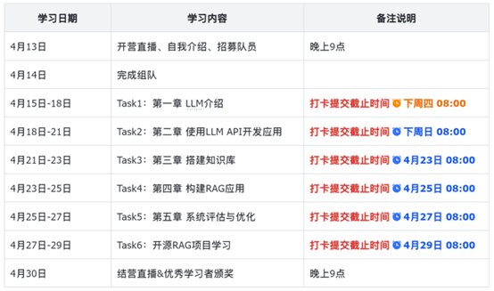

---
title:
  - 项目：动手学大模型应用开发_RAG_2024年04月
authors: Ethan Lin
year: 2024-04-13
tags:
  - 类型/项目
  - 日期/2024-04-13
  - 传播/暂时不公开
---
# 项目：动手学大模型应用开发_RAG_2024年04月

## 计划与进度

- [ ] ★打卡截止时间：4月18日08:00   📅  2024-04-18

# 简介

## 说明

★具体学习内容请参考《课程手册》和《课程项目地址》，请大家合理安排好时间，认真输出笔记，按时打卡，本次学习不再提供补打卡的机会！

★提问注意事项：
按照“【问题】：具体问题描述”的格式在群内提问，同时在《提问链接》中进行登记问题或者对课程、流程的建议，登记情况作为评优的重要参考。

★打卡注意事项：
1.课程使用小程序组队和打卡，使用笔记链接打卡才可以获得评优资格；
2.记录笔记不限平台，但是要确保笔记链接公开，且可在国内访问；
3.笔记内容包括但不限于：知识总结、解决问题的方法和学习感受，内容尽量原创，请不要完全照搬。

链接导航栏：
[【学习者手册】](https://mp.weixin.qq.com/s/pwWg0w1DL2C1i_Hs3SZedg) 
[【小程序手册】](https://mp.weixin.qq.com/s/iPmzb72Yk0mhIA2NYezXDg )
[【课程手册】](https://datawhalechina.github.io/llm-universe/#/)
[【课程项目地址】](https://github.com/datawhalechina/llm-universe)
[【提问链接】](https://qixiangxingqiu.feishu.cn/docx/VLY4dpsKOo96WexUZSlc4Tzwnub?from=from_copylink)

# 学习笔记

[[动手学大模型应用开发之RAG]]

关于 [[LangGraph 文档]]

# 交流笔记

# 疑问

- 学习 RAG 有什么前置知识吗？比如需要懂知识图谱吗？

# 相关文件

#### 设计与开发文件
- [[]]

#### 工程文件
- [本地仓库](file://~)
- [远程仓库](https://)

#### 演示文件
- [[]]

