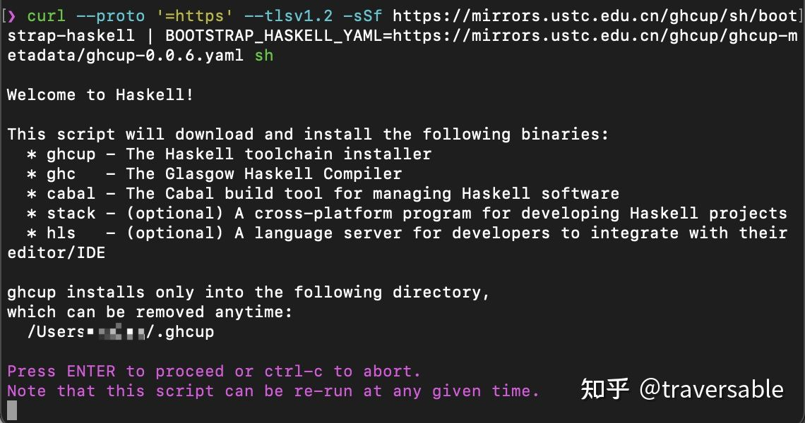
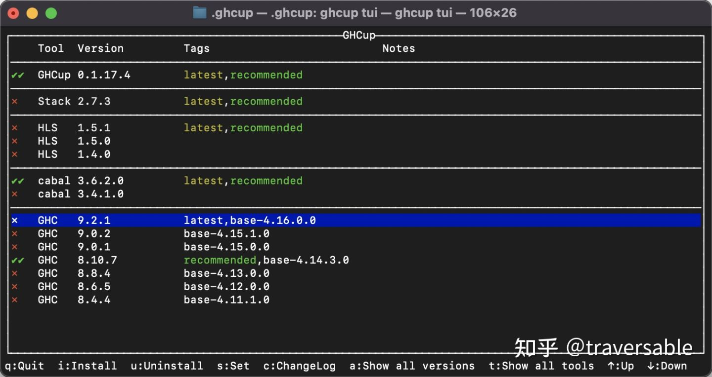
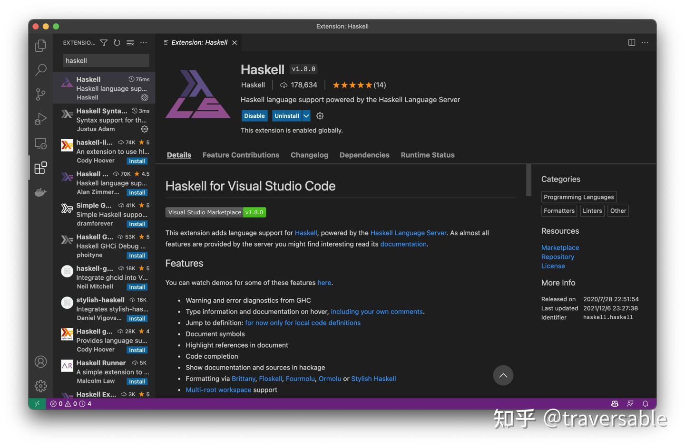
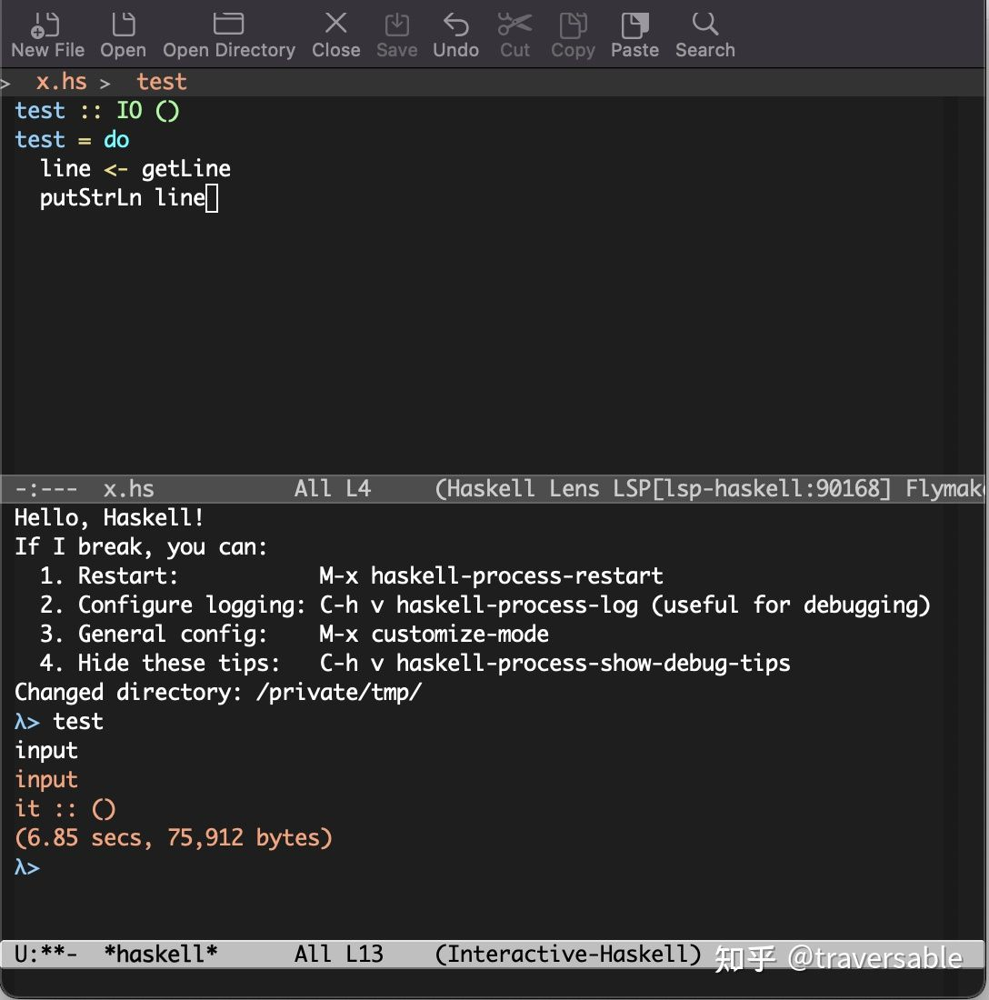

# 部署Haskell语言


> 来源：
>[如何安装 Haskell 工具链（2022 年版） - 知乎](https://zhuanlan.zhihu.com/p/455688955)
> 

本文介绍如何在类 UNIX 系统上（Linux、MacOS、FreeBSD）从零开始一步步安装 Haskell 工具链（编译器、构建工具、编辑器），特别是考虑到国内特殊网络环境，会介绍如何使用国内源。注意：

- 在 2022 年的今天，Cabal 已经取得了长足进步，因此本文将完全不涉及 Stack。
- 如果你使用 Windows，好消息是 Haskell 工具链完整支持 Windows，但超出本文范围之外。尽管如此，本文仍然适用于 WSL。
- 目前国内只有上海交大和中科大有 Haskell 工具链的完整镜像（GHCup、Hackage、Stackage）。本文采用中科大镜像，你可以手动修改命令来使用其他镜像。

本文的目标读者是对计算机不甚了解的 Haskell 初学者（尤其是以 Haskell 为第一语言的学习者），因此下文讲解会比较啰嗦（但是实际上操作非常简单！！）。文末附有 Cabal 快速使用说明，帮助初学者快速上手。本文应当涵盖了以 “学习 Haskell” 为目的的所有使用场景，也就是说，你可以凭这些配置无障碍学完任何一本入门教材，甚至还能做一些实用软件。

俗话说：师傅领进门，修行靠个人。我希望本文能起到降低 Haskell 入门门槛的作用（特别是在中国），但 Haskell 是一个真正的工业级编程语言，不可能是这篇文章能完全覆盖的。在本文帮助下，学习者应当有能力独立进行更深入的探索。

<del>欢迎转载。由于本文可能不时更新，请务必附上出处链接。如有任何疑问，请在评论区提出，我会酌情考虑引入文章本身。</del> 本知乎专栏在本账号注销后无法更新，出处链接请使用 [mirror.xyz](https://link.zhihu.com/?target=http%3A//mirror.xyz) 版本，谢谢！

[如何安装 Haskell 工具链？mirror.xyz/0xdB4907968b599f0fb530693eF457BdE801544031/sG9PAIIVhL7urJNSze_xnjg409QYGZFgvmnqxUriuOk](https://link.zhihu.com/?target=https%3A//mirror.xyz/0xdB4907968b599f0fb530693eF457BdE801544031/sG9PAIIVhL7urJNSze_xnjg409QYGZFgvmnqxUriuOk)

## 安装 GHCup、GHC 和其他工具

GHCup 是一个 Haskell 工具链的版本管理器。简单来说，它可用于安装不同版本的 GHC、Cabal、HLS 等工具。

### 准备工作

GHCup 是一个近期出现的工具，因此国内目前只有中科大和上海交大有镜像。在安装 GHCup 之前，我们要做一件额外的工作，创建 `~/.cabal` 目录，并创建 `~/.cabal/config` 文件，填入如下内容：

```text
repository mirrors.ustc.edu.cn
  url: https://mirrors.ustc.edu.cn/hackage/
  secure: True
```

这是因为 GHCup 在安装 Cabal 时会进行初始化（会下载一个 100MB 的文件），但此时我们还没有替换 Hackage 源！这一步首先替换 Hackage 源。之后安装过程就会如丝般顺滑。

⚠️警告：上面的 `secure: True` 是必须的，否则 Cabal 将不能下载到新的包索引！

### 执行安装

在终端中运行如下命令：

```bash
curl --proto '=https' --tlsv1.2 -sSf https://mirrors.ustc.edu.cn/ghcup/sh/bootstrap-haskell | BOOTSTRAP_HASKELL_YAML=https://mirrors.ustc.edu.cn/ghcup/ghcup-metadata/ghcup-0.0.6.yaml sh
```

（是的，一行，就是这么长。）

很快，你会看到如下界面：


**安装过程请仔细阅读所有提示。**针对三个问题，下面是我的推荐：

1. 是否将 ghcup 目录加入 PATH？直接回车接受默认值，如果你在看这篇文章，说明你一定会用到。
1. 是否安装 Haskell Language Server？安装与否均可，之后想装也很容易。这里输入 Y 安装（你大概是希望使用更高级的 IDE 功能的）。
1. 是否安装 Stack？输入 N，不安装。

之后一路回车，GHCup 将下载安装推荐版本的 GHC 和 Cabal，并完成初始化。（截至本文写作时，GHC 版本是 8.10.7）。结束后，你会看到一大片提示，**请仔细阅读所有输出**。这里必做的事情是设置当前 shell 的 `PATH` （或者重启 shell 也可以）：

```text
source ~/.ghcup/env
```

### 测试安装

搞定，你已经可以用起来 Haskell 了。

```console
$ ghc --version
The Glorious Glasgow Haskell Compilation System, version 8.10.7

$ cabal --version
cabal-install version 3.6.2.0
compiled using version 3.6.2.0 of the Cabal library

$ ghci
GHCi, version 8.10.7: https://www.haskell.org/ghc/  :? for help
Prelude> putStrLn "Hello, Haskell!"
Hello, Haskell!
Prelude> 
Leaving GHCi.
```

### 配置 GHCup 源

我们上面用了环境变量临时修改了 GHCup 元数据地址，这里我们把镜像写到配置里让国内源永久生效。修改 `~/.ghcup/config.yaml`（如不存在就创建），添加如下内容：

```yaml
url-source:
    OwnSource: https://mirrors.ustc.edu.cn/ghcup/ghcup-metadata/ghcup-0.0.6.yaml
```

（其实到这里，工具链已经算彻底安装、配置完成了。下面的内容仅供初学者参考。）

### GHCup 的用法

`ghcup` 有一个很好用的命令叫 `tui`，所有 ghcup 的操作均可以从这里完成，运行 `ghcup tui` 会显示如下界面。



其中打双对勾的是**当前选中版本**。比如你安装了 GHC 9.2.1 和 GHC 8.10.7 两个版本，但是目前选中的是 8.10.7，那么运行 ghc 命令会调用 8.10.7 版本而非 9.2.1 版本。你可以安装多个版本，但一次只能选中一个版本（用 `s` 键选中别的版本）。好了，剩下的命令都顾名思义，自己试试即可。

如果想安装 HLS 的话，随时可以从这里安装。

## 配置编辑器

本文的重点不是配置编辑器，下面只给出一些提示。请参阅其他资料（尤其是相应插件自己的文档）了解如何配置、如何使用。

### Visual Studio Code

Visual Studio Code 是目前最流行的代码编辑器之一，Haskell 语言服务器则为 LSP 提供了较好的支持，两者相得益彰。只需在扩展市场中搜索名为 Haskell 的扩展并安装即可。



之后，任意打开一个 .hs 文件，Visual Studio Code 就会自动调用 GHCup 已经安装的 HLS，可以充分体验 Haskell 的 IDE 编辑体验了！（如果 VSCode 提示你要下载 HLS，请下转故障排除章节。）

恭喜，至此你已经完成配置了 2022 年最先进的 Haskell 工具链+编辑环境！尽情享受吧！

### GNU Emacs

Emacs 默认没有 Haskell 代码高亮，但可以安装 haskell-mode。它的功能非常丰富，推荐阅读其文档。比如一个很有用的命令是 `haskell-process-load-or-reload` ，可以用来快速打开一个 ghci 并载入当前文件。

如果想要使用 HLS：

1. 先手动通过 ghcup 安装 HLS。
1. 再安装 lsp-mode、lsp-haskell。



### Vim 和 Neovim

vim 原生支持 Haskell 的代码高亮。要与 HLS 集成，可使用 [coc.nvim](https://link.zhihu.com/?target=https%3A//github.com/neoclide/coc.nvim)。

## Cabal 应急生存手册

使用 Haskell 时，**强烈建议首先创建一个项目**。这是因为 Cabal 让使用第三方库非常方便。Cabal 有一个不错的使用指南，值得收藏：

[Welcome to the Cabal User Guidecabal.readthedocs.io/](https://link.zhihu.com/?target=https%3A//cabal.readthedocs.io/)

### 创建项目

```text
$ mkdir my-first-haskell-project
$ cd my-first-haskell-project
$ cabal init     # 在当前目录下初始化一个 Cabal 项目

Guessing dependencies...

Generating LICENSE...
Warning: unknown license type, you must put a copy in LICENSE yourself.
Generating CHANGELOG.md...
Generating app/Main.hs...
Generating my-first-haskell-project.cabal...

Warning: no synopsis given. You should edit the .cabal file and add one.
You may want to edit the .cabal file and add a Description field.

$ tree .
.
├── CHANGELOG.md
├── app
│   └── Main.hs
└── my-first-haskell-project.cabal

1 directory, 3 files
```

可以看到，Cabal 创建了 3 个文件。其中 [CHANGELOG.md](https://link.zhihu.com/?target=http%3A//changelog.md/) 对初学者来说不用关心。

### 增加第三方依赖

打开 .cabal 文件，除去基本的项目信息外，有一个 `executable` 段落：

```yaml
executable my-first-haskell-project
    main-is:          Main.hs               -- 入口文件名
    build-depends:    base ^>=4.14.3.0      -- 依赖
    hs-source-dirs:   app                   -- 代码目录
    default-language: Haskell2010           -- 默认语言
```

其中， `^>=` 对 `base` （Haskell 标准库） 的版本增加了限制。对学习者来说，可以忽视这些限制（直接去掉版本限制）。下面我们增加 [time](https://link.zhihu.com/?target=https%3A//hackage.haskell.org/package/time) 这个库为一个依赖：

```text
executable my-first-haskell-project
    main-is:          Main.hs
    build-depends:    base, time     -- 这里添加了 time 库
    hs-source-dirs:   app
    default-language: Haskell2010
```

然后，就可以在代码文件 `app/Main.hs` 中使用了：

```haskell
module Main where

import Data.Time.LocalTime   -- 来自 time 库

main :: IO ()
main = do
  now <- getZonedTime
  print now
```

（这里必须说明，Cabal 在编译时会自动求解一套兼容的包版本，因此不写版本限制对学习者来说最方便，因为出问题的概率小了很多。但同时要注意这是不好的开发实践，在发布软件时最好使用 `cabal gen-bounds` 命令并填上兼容的版本范围。尽管不写版本范围让可行解的范围大了不少，但仍然有可能出现不兼容问题——会输出大量令人生畏的报错信息——这是因为你的某个依赖实在是太旧了，最好换一个新的同类包。）

### 编译、运行和 REPL

```console
$ cabal build # 编译
[一大堆输出]
[1 of 1] Compiling Main [一堆输出]
Linking ..../my-first-haskell-project

$ cabal run   # 运行
[cabal run 会自动调用 cabal build，所以这里可能是 Up to date 也可能是和 cabal build 一样的一大堆输出]
2022-01-11 01:38:32.87706 CST

$ cabal repl
[一大堆输出]
*Main>        # ghci，但自动载入 Main 模块，并且可以自由用任何第三方依赖里的模块
```

Cabal 在编译时会自动从 Hackage 上下载并构建第三方依赖。因此你可以自由地在 Hackage 上找自己感兴趣的包，然后加到项目依赖里来实验。比如下面这些好玩的包，可以试试看！

- [gloss](https://link.zhihu.com/?target=https%3A//hackage.haskell.org/package/gloss), 2D 图形库
- [reanimate](https://link.zhihu.com/?target=https%3A//hackage.haskell.org/package/reanimate), 类似 manim 的动画库 -> [主页有很多酷炫例子](https://link.zhihu.com/?target=https%3A//reanimate.github.io/) <-
- [gi-gtk-declarative](https://link.zhihu.com/?target=https%3A//hackage.haskell.org/package/gi-gtk-declarative), GUI 库（基于 GTK+）
- [inline-r](https://link.zhihu.com/?target=https%3A//hackage.haskell.org/package/inline-r), 与 R 语言无缝协作
- [Chart](https://link.zhihu.com/?target=https%3A//hackage.haskell.org/package/Chart), 绘制 2D 图表
- [accelerate](https://link.zhihu.com/?target=https%3A//hackage.haskell.org/package/accelerate), 硬件加速的数组处理（可以编译到 GPU 上执行！）
- [ad](https://link.zhihu.com/?target=https%3A//hackage.haskell.org/package/ad), 自动微分
- 等等等等…………

Hackage 上有很多有趣的包，现在都是你的了。

## 故障排除

### 如何彻底重装

最简单的故障排除方法就是重装，但是 GHC 往往会遗留不少文件，因此一次完整的重装需要删除下面这些目录：

- ~/.ghcup
- ~/.cabal
- ~/.ghc （这个文件夹可别忘了）

然后，大侠请重新来过吧。

### VSCode 提示我要下载 HLS

有如下原因：

1. 你没有使用 GHCup 安装 HLS。现在去安装一下？如果还不行，再看下面的。
1. 你没有添加 GHCup 的路径到 PATH 中。如果始终不行，参考下面的配置。

在 Haskell 扩展页面，点击页面上的小齿轮打开扩展配置。

1. 找到 “Haskell: Server Executable Path” 配置项。
1. 输入 `~/.ghcup/bin/haskell-language-server-wrapper` 。
1. 重启 VSCode。

这时候重新打开文件应该就可以正确调用到 GHCup 安装的 HLS 上了。

### 编辑器提示我 HLS 反复重启都失败了，怎么回事？

最可能的原因是你启用了 HLS 目前不支持的新版本 GHC。如果想使用 HLS，请务必在 ghcup tui 中选中一个有 hls-powered 标记的 GHC 版本（比如 9.0.1, 8.10.7 等）。

### GHC 安装失败

Mac 上安装时，出现以下错误，是因为没有安装 Xcode Command Line Tools。安装后即可恢复正常。


