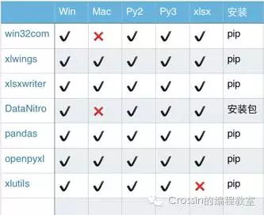
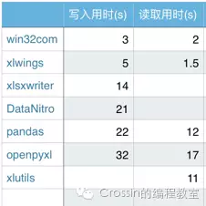

# Python处理Excel表格


这里推荐`xlwings`、`openpyxl`。


[[xlwings教程]]


![[6E13B17D-E415-4D65-A01E-DD7C36EFCC40_1_102_o.jpeg]]


> 转载：[知乎：Python-Excel 模块哪家强？](https://zhuanlan.zhihu.com/p/23998083)


# Python-Excel 模块哪家强？

## **0. 前言**

从网页爬下来的大量数据需要清洗？

成堆的科学实验数据需要导入 Excel 进行分析？

有成堆的表格等待统计？

作为人生苦短的 Python 程序员，该如何优雅地操作 Excel？


得益于前人的辛勤劳作，Python 处理 Excel 已有很多现成的轮子，使用较多的有：

**xlwings**

[http://docs.xlwings.org/en/stable/](https://link.zhihu.com/?target=http%3A//docs.xlwings.org/en/stable/)

**openpyxl**

[https://openpyxl.readthedocs.io/en/latest/](https://link.zhihu.com/?target=https%3A//openpyxl.readthedocs.io/en/latest/)

**pandas**

[http://pandas.pydata.org/](https://link.zhihu.com/?target=http%3A//pandas.pydata.org/)

**win32com**

[http://pythonexcels.com/python-excel-mini-cookbook/](https://link.zhihu.com/?target=http%3A//pythonexcels.com/python-excel-mini-cookbook/)

**xlsxwriter**

[https://xlsxwriter.readthedocs.io/](https://link.zhihu.com/?target=https%3A//xlsxwriter.readthedocs.io/)

**DataNitro**

[https://datanitro.com/](https://link.zhihu.com/?target=https%3A//datanitro.com/)

**xlutils**

[https://pypi.python.org/pypi/xlutils/](https://link.zhihu.com/?target=https%3A//pypi.python.org/pypi/xlutils/)


上次我们介绍了下 [xlutils](https://zhuanlan.zhihu.com/p/22261597)，不少读者留言表示有比它更好使的模块，于是我们又把另外几个都体验了一遍。

本文将从运行环境、文档操作、基本功能和性能等方面对以上模块进行一次粗浅的比较，供大家参考。


## **1. 环境配置**

再好的模块，也需要在正确的 Python 版本以及 Excel 版本才可运行。



提醒及注意：

- xlutils 仅支持 xls 文件，即2003以下版本；
- win32com 与 DataNitro 仅支持 windows 系统；
- xlwings 安装成功后，如果运行提示报错“ImportError: no module named win32api”，请再安装 pypiwin32 或者 pywin32 包；
- win32com 不是独立的扩展库，而是集成在其他库中，安装 pypiwin32 或者 pywin32 包即可使用；
- DataNitro 是 Excel 的插件，安装需到官网下载。


## **2. 文档操作**

虽然大家都是操作 Excel，但即使最基本的新建文件、修改文件、保存文件等功能，在不同的库中也存在差异。比如 xlsxwriter 并不支持打开或修改现有文件，xlwings 不支持对新建文件的命名，DataNitro 作为 Excel 插件需依托于软件本身，pandas 新建文档需要依赖其他库等等。


## **3. 基本功能**

由于设计目的不同，每个模块通常着重于某一方面功能，各有所长。

**xlwings**

可结合 VBA 实现对 Excel 编程，强大的数据输入分析能力，同时拥有丰富的接口，结合 pandas/numpy/matplotlib 轻松应对 Excel 数据处理工作。

**openpyxl**

简单易用，功能广泛，单元格格式/图片/表格/公式/筛选/批注/文件保护等等功能应有尽有，图表功能是其一大亮点，缺点是对 VBA 支持的不够好。

**pandas**

数据处理是 pandas 的立身之本，Excel 作为 pandas 输入/输出数据的容器。

**win32com**

从命名上就可以看出，这是一个处理 windows 应用的扩展，Excel 只是该库能实现的一小部分功能。该库还支持 office 的众多操作。需要注意的是，该库不单独存在，可通过安装 pypiwin32 或者 pywin32 获取。

**xlsxwriter**

拥有丰富的特性，支持图片/表格/图表/筛选/格式/公式等，功能与openpyxl相似，优点是相比 openpyxl 还支持 VBA 文件导入，迷你图等功能，缺点是不能打开/修改已有文件，意味着使用 xlsxwriter 需要从零开始。

**DataNitro**

作为插件内嵌到 Excel 中，可完全替代 VBA，在 Excel 中使用 python 脚本。既然被称为 Excel 中的 python，协同其他 python 库亦是小事一桩。然而，这是付费插件...

**xlutils**

基于 xlrd/xlwt，老牌 python 包，算是该领域的先驱，功能特点中规中矩，比较大的缺点是仅支持 xls 文件。


## **4.性能**

我们对几个库做了最基本的写入和读取测试，分别使用不同库进行添加及读取 1000行 * 700列 数据操作，得到所用时间，重复操作取平均值。另外在不同的电脑配置，不同的环境下结果肯定会有出入，数据仅供参考。



注：

- xlutils 最多只能写入 256 列，即 1000*256，用时3.8秒，表现不错；
- DataNitro 与 xlsxwriter 不能打开 Excel 文件。


## **5. 小结**

通过以上的分析，相信大家对几个库都有了简单的了解。在编写文章的过程中，笔者也在思考各个库最适合的应用场景。

- 不想使用 GUI 而又希望赋予 Excel 更多的功能，openpyxl 与 xlsxwriter，你可二者选其一；
- 需要进行科学计算，处理大量数据，建议 pandas+xlsxwriter 或者 pandas+openpyxl；
- 想要写 Excel 脚本，会 Python 但不会 VBA 的同学，可考虑 xlwings 或 DataNitro；
- 至于 win32com，不管是功能还是性能都很强大，有 windows 编程经验的同学可以使用。不过它相当于是 windows COM 的封装，自身并没有很完善的文档，新手使用起来略有些痛苦。


你可根据自己的需求和生产环境，选择合适的 Python-Excel 模块。


## **6. 代码示例**

最后，附上一些演示代码，大家可自行体会下不同模块的使用。

**6.1 xlwings基本代码**

```python
import xlwings as xw
#连接到excel
workbook = xw.Book(r'path/myexcel.xlsx')#连接excel文件
#连接到指定单元格
data_range = workbook.sheets('Sheet1').range('A1')
#写入数据
data_range.value = [1,2,3]
#保存
workbook.save()
```

**6.2 xlsxwriter基本代码**

```python
import xlsxwriter as xw
#新建excel
workbook  = xw.Workbook('myexcel.xlsx')
#新建工作薄
worksheet = workbook.add_worksheet()
#写入数据
worksheet.write('A1',1)
#关闭保存
workbook.close()
```

**6.3 xlutils基本代码

```python
import xlrd #读取数据
import xlwt #写入数据
import xlutils #操作excel
#----xlrd库
#打开excel文件
workbook = xlrd.open_workbook('myexcel.xls')
#获取表单
worksheet = workbook.sheet_by_index(0)
#读取数据
data = worksheet.cell_value(0,0)
#----xlwt库
#新建excel
wb = xlwt.Workbook()
#添加工作薄
sh = wb.add_sheet('Sheet1')
#写入数据
sh.write(0,0,'data')
#保存文件
wb.save('myexcel.xls')
#----xlutils库
#打开excel文件
book = xlrd.open_workbook('myexcel.xls')
#复制一份
new_book = xlutils.copy(book)
#拿到工作薄
worksheet = new_book.getsheet(0)
#写入数据
worksheet.write(0,0,'new data')
#保存
new_book.save()
```

**6.4 win32com基本代码**

```python
import win32com.client as wc
#启动Excel应用
excel_app = wc.Dispatch('Excel.Application')
#连接excel
workbook = excel_app.Workbooks.Open(r'e:/myexcel.xlsx' )
#写入数据
workbook.Worksheets('Sheet1').Cells(1,1).Value = 'data'
#关闭并保存
workbook.SaveAs('newexcel.xlsx')
excel_app.Application.Quit()
```

**6.5 openpyxl基本代码** 

```python
import openpyxl
# 新建文件
workbook = openpyxl.Workbook() 
# 写入文件
sheet = workbook.activesheet['A1']='data'
# 保存文件 
workbook.save('test.xlsx')
```

**6.6 DataNitro基本代码**

```python
#单一单元格赋值
Cell('A1').value = 'data'
#单元区域赋值
CellRange('A1:B2').value = 'data'
```
