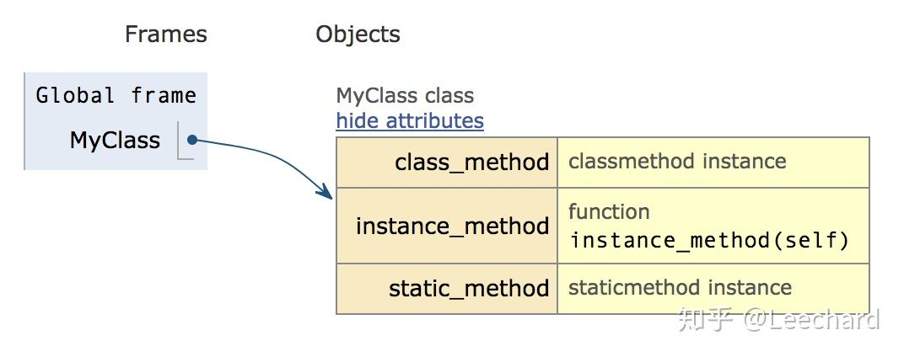
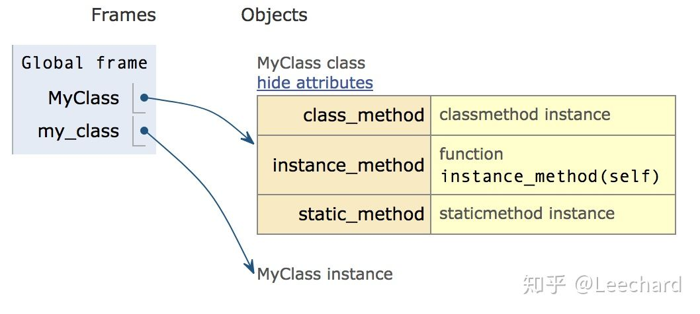
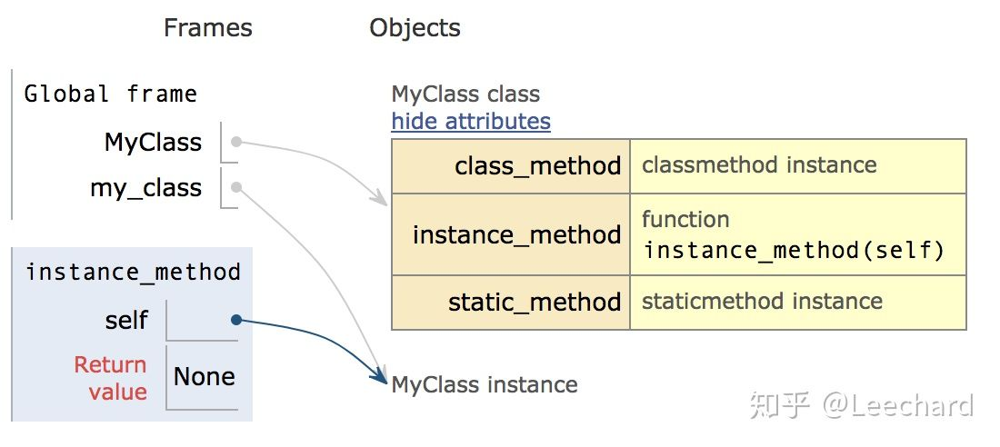
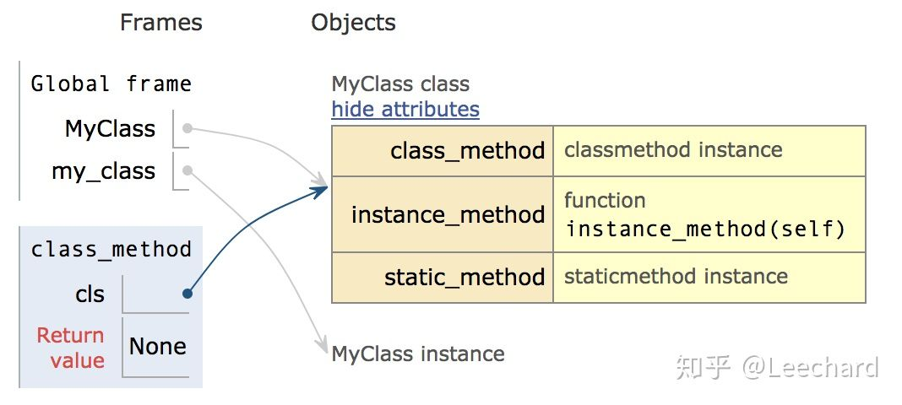
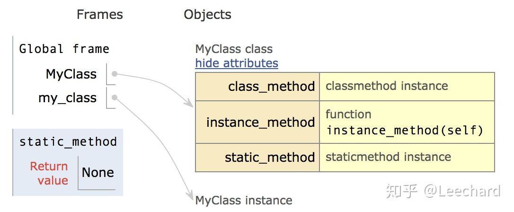
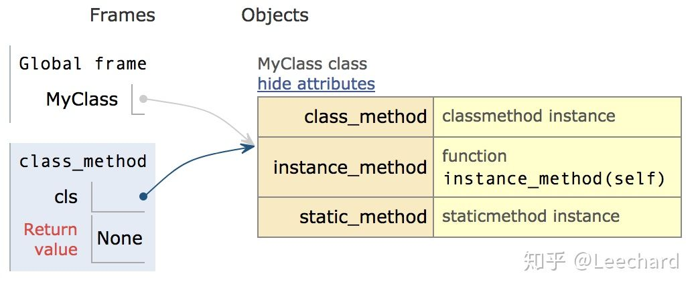
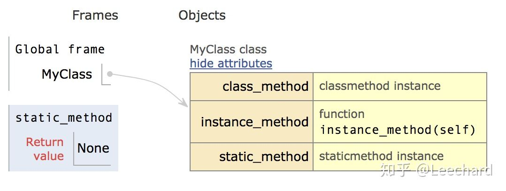

# Python实例方法、类方法、静态方法


> [!info] 来源
> [Python实例方法、类方法、静态方法 - 知乎](https://zhuanlan.zhihu.com/p/40162669)


文章目录：

一、类和实例:

简单阐述类和实例的概念

二、初探实例方法、类方法、静态方法

从三种方法的**定义形式上**比较其不同之处

三、再探实例方法、类方法、静态方法

从三种方法的**调用形式上**比较其异同

四、类方法使用场景

五、静态方法使用场景

六、小结


## 一、类(class)和实例(instance)

类是创建实例的模板，而实例则是一个一个具体的对象，各个实例拥有的数据都互相独立，互不影响。以Dog类为例，类就像一个对象工厂，可以生产一个或多个实例对象。

```python
>>> class Dog(object):
...     pass
...
>>> Dog
<class '__main__.Dog'>

>>> dog = Dog()
>>> dog
<__main__.Dog object at 0x10cd194a8>

>>> dog2 = Dog()
>>> dog2
<__main__.Dog object at 0x10cd19518>
```


## 二、初探实例方法、类方法、静态方法

先直接上代码：

```python
class MyClass(object):
    # 实例方法
    def instance_method(self):
        print('instance method called', self)
    
    # 类方法
    @classmethod
    def class_method(cls):
        print('class method called', cls)
    
    # 静态方法
    @staticmethod
    def static_method():
        print('static method called')
```



上述MyClass类中分别定义了三种不同类型的方法。

这三种方法在**定义上（形式上）**有如下的不同之处：

1. **实例方法是一个普通的函数，类方法和静态方法都是通过函数装饰器的方式实现的；**
1. **实例方法需要传入self，类方法需要传入cls参数，静态方法无需传入self参数或者是cls参数（但不等同于不能传入参数）**

**注意：self参数和cls参数的区别，下文会提到。**

下面分别尝试调用三个方法：

```python
my_class = MyClass()        # 实例化

my_class.instance_method()  # 实例方法
my_class.class_method()     # 类方法
my_class.static_method()    # 静态方法
```

**1️⃣当实例化时，my_class指向实例化对象：**



**2️⃣当调用实例方法(instance method)时，self参数指向的是刚刚实例化出的my_class实例对象:**



**3️⃣当调用类方法(class method)时，cls参数指向的是一开始定义的MyClass类对象（注意不是实例对象）：**



**4️⃣当调用静态方法(static method)时：**



本小节内容，主要区别了实例方法、类方法、静态方法的定义形式，以及区别了self、cls参数的指向对象。

**注意：不管self参数，还是cls参数，都是一种约定俗成的用法，其实是可以使用其他的参数名代替。但是不建议使用其他参数名，毕竟代码不是只是写给自己看的。**


## 三、再探实例方法、类方法、静态方法

上文都是通过实例化出的对象，对三种方法进行的调用，并且都得到了我们想要的结果；如果不通过实例化对象，而是直接通过类对象（Python中一切皆对象，包括类本身）调用，会有什么结果呢？

```python
MyClass.instance_method()   # 实例方法
MyClass.class_method()      # 类方法
MyClass.static_method()     # 静态方法
```

**1️⃣当通过类对象调用实例方法时，直接报错，提示缺参数self。**

因为**点语法**会将类对象MyClass传给instance_method()方法，但是instance_method()参数需要指向的是一个实例对象，而非类对象。

```python
TypeError: static_method() missing 1 required positional argument: 'self'
```

2️⃣**当通过类对象调用类方法时，这里的结果与通过实例对象调用是完全一样的。**

Python官方文档的解释：It can be called either on the class (such as`C.f()`) or on an instance (such as`C().f()`). The instance is ignored except for its class. If a class method is called for a derived class, the derived class object is passed as the implied first argument. 

大致意思，**类方法可以通过类对象或者实例对象调用。如果是通过实例对象调用的，那么实例对象会被忽略，而是转而通过其类对象进行调用。类对象，会以参数形式传给类方法（点语法），作为类方法的第一个参数，也就是cls参数。**



3️⃣**当通过类对象调用静态方法时，这里的结果与通过实例对象调用是完全一样的。通过实例对象调用静态方法时，实例对象也会被忽略，而是通过其类对象进行调用，这一点与类方法的调用是一样的。**



说明：为了简化所举的例子，本文中所定义的MyClass类并没有采用self或者cls之外的参数，三种方法都可以使用额外的参数，跟函数定义参数是一样的。


## 四、类方法使用场景

由于类方法无须创建实例对象调用，所以类方法的调用较实例方法更为灵活。以Django中View视图类源码举例：

```python
class View(object):
    """
    Intentionally simple parent class for all views. Only implements
    dispatch-by-method and simple sanity checking.
    """

    http_method_names = ['get', 'post', 'put', 'patch', 'delete', 'head', 'options', 'trace']

    def __init__(self, **kwargs):
        """
        Constructor. Called in the URLconf; can contain helpful extra
        keyword arguments, and other things.
        """
        # Go through keyword arguments, and either save their values to our
        # instance, or raise an error.
        for key, value in six.iteritems(kwargs):
            setattr(self, key, value)

    @classonlymethod
    def as_view(cls, **initkwargs):
        """
        Main entry point for a request-response process.
        """
        for key in initkwargs:
            if key in cls.http_method_names:
                raise TypeError("You tried to pass in the %s method name as a "
                                "keyword argument to %s(). Don't do that."
                                % (key, cls.__name__))
            if not hasattr(cls, key):
                raise TypeError("%s() received an invalid keyword %r. as_view "
                                "only accepts arguments that are already "
                                "attributes of the class." % (cls.__name__, key))

        def view(request, *args, **kwargs):
            self = cls(**initkwargs)
            if hasattr(self, 'get') and not hasattr(self, 'head'):
                self.head = self.get
            self.request = request
            self.args = args
            self.kwargs = kwargs
            return self.dispatch(request, *args, **kwargs)
        view.view_class = cls
        view.view_initkwargs = initkwargs

        # take name and docstring from class
        update_wrapper(view, cls, updated=())

        # and possible attributes set by decorators
        # like csrf_exempt from dispatch
        update_wrapper(view, cls.dispatch, assigned=())
        return view

    def dispatch(self, request, *args, **kwargs):
        # 省略部分代码
        pass

    def http_method_not_allowed(self, request, *args, **kwargs):
        # 省略部分代码
        pass

    def options(self, request, *args, **kwargs):
        # 省略部分代码
        pass

    def _allowed_methods(self):
        return [m.upper() for m in self.http_method_names if hasattr(self, m)]
```

Django中通过类对视图方法实现了封装，上述代码就是Django中定义的View视图的部分源码，其中as_view()方法就使用了类方法。但是如果观察仔细的话，你会发现，as_view()方法并不是使用的@classmethod装饰器，而是使用的@classonlymethod。在定义形式上，传入的参数是cls类对象，而不是self实例对象，那么这里as_view()方法是不是类方法呢？是的。

因为Django中classonlymethod继承了classmethod，但是classonlymethod只能通过类对象调用，而不能通过实例对象调用as_view()方法，即‘阉割’了实例调用的方式。

```python
class classonlymethod(classmethod):
    def __get__(self, instance, cls=None):
        if instance is not None:
            raise AttributeError("This method is available only on the class, not on instances.")
        return super(classonlymethod, self).__get__(instance, cls)
```

在调用as_view()方法时，无需创建实例对象，只需传入cls类对象，就能针对不同请求方法实现自动派发视图处理逻辑。


## 五、静态方法使用场景

静态方法既不需要传入self参数，也不需要传入cls参数，这使得调用静态方法并不能获得类中定义的属性和其他方法，也就是说并不会影响类对象或实例对象的状态，这点与实例方法或类方法不一样。

**静态方法有点像附属于类对象的“工具”。**与普通函数不同，调用静态方法时，只能通过类对象（或者实例对象），而不能脱离类对象使用，即静态方法被‘束缚’在类对象中。比如，创建一个pizza类对象：

```python
import math


class Pizza(object):
    """模拟pizza店接收顾客自定义订购pizza"""

    def __init__(self, ingredients, radius):
        self.ingredients = ingredients
        self.radius = radius

    def show_ingredients(self):
        # 选购pizza食材
        pass

    def show_size(self):
        # 选购pizza大小
        pizza_size = self.cal_area(self.radius)
        return pizza_size

    @staticmethod
    def cal_area(r):
        return int(math.pi * r * r)


if __name__ == '__main__':
    # 测试一下，半径为20厘米的pizza大小，如果顾客觉得大了，订一个小一点的
    print(Pizza.cal_area(20))
    # 经过上述测试，发现半径为20厘米的pizza有点大，订购一个小一点的
    # 创建pizza实例对象
    my_pizza = Pizza('番茄牛肉pizza', 15)
    pizza_size = my_pizza.show_size()
    # pizza大小合适，满意
    print(pizza_size)
```

上述Pizza类中的静态方法，不仅提供了**测试功能**，还**将计算pizza大小的逻辑从show_size()方法中抽离出来**，如果需要修改cal_area()方法的内部处理逻辑，只需要修改该方法，而不需要修改show_size()，这样有利于代码的后期维护。

如果把cal_area()方法定义在Pizza类对象之外，也是可以的，不过这样也不利于代码维护，将对象的相关处理逻辑“束缚”在对象体内，这样封装得会更好些。


## 六、小结

1. **定义形式上：**

a. 类方法和静态方法都是通过装饰器实现的，实例方法不是;

b. 实例方法需要传入self参数，类方法需要传入cls参数，而静态方法不需要传self或者cls参数。

**2. 调用方式上：**

实例方法只能通过实例对象调用；类方法和静态方法可以通过类对象或者实例对象调用，如果是使用实例对象调用的类方法或静态方法，最终都会转而通过类对象调用。

**3. 应用场景：**

a. 实例方法使用最多，可以直接处理实例对象的逻辑；类方法不需要创建实例对象，直接处理类对象的逻辑；静态方法将与类对象相关的某些逻辑抽离出来，不仅可以用于测试，还能便于代码后期维护。

b. 实例方法和类方法，能够改变实例对象或类对象的状态，而静态方法不能。


参考资料：

[Python's Instance, Class, and Static Methods Demystified – Real Pythonrealpython.com/instance-class-and-static-methods-demystified/](https://link.zhihu.com/?target=https%3A//realpython.com/instance-class-and-static-methods-demystified/)

[2. Built-in Functionsdocs.python.org/3/library/functions.html](https://link.zhihu.com/?target=https%3A//docs.python.org/3/library/functions.html)


发布于 2018-07-23 12:50
