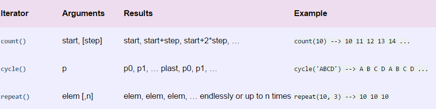

# python生成器和迭代器有这篇就够了


PS：这篇博客是我上网课做的笔记，也是参考网课老师的博客，就是学习笔记而已，不喜勿喷！（为什么写这句话呢？被喷子恶心到了）

　　本节主要记录一下列表生成式，生成器和迭代器的知识点

### 　　**列表生成器**

　　**首先举个例子**

现在有个需求，看列表 [0，1，2，3，4，5，6，7，8，9]，要求你把列表里面的每个值加1，你怎么实现呢？

方法一（简单）：

[+ View Code](https://www.cnblogs.com/wj-1314/p/8490822.html#)

方法二（一般）：

[+ View Code](https://www.cnblogs.com/wj-1314/p/8490822.html#)

方法三（高级）：

[+ View Code](https://www.cnblogs.com/wj-1314/p/8490822.html#)

### 　　生成器

#### 什么是生成器？

　　通过列表生成式，我们可以直接创建一个列表，但是，受到内存限制，列表容量肯定是有限的，而且创建一个包含100万个元素的列表，不仅占用很大的存储空间，如果我们仅仅需要访问前面几个元素，那后面绝大多数元素占用的空间都白白浪费了。

　　所以，如果列表元素可以按照某种算法推算出来，那我们是否可以在循环的过程中不断推算出后续的元素呢？这样就不必创建完整的list，从而节省大量的空间，在Python中，这种一边循环一边计算的机制，称为生成器：generator

　　生成器是一个特殊的程序，可以被用作控制循环的迭代行为，python中生成器是迭代器的一种，使用yield返回值函数，每次调用yield会暂停，而可以使用next()函数和send()函数恢复生成器。

　　生成器类似于返回值为数组的一个函数，这个函数可以接受参数，可以被调用，但是，不同于一般的函数会一次性返回包括了所有数值的数组，生成器一次只能产生一个值，这样消耗的内存数量将大大减小，而且允许调用函数可以很快的处理前几个返回值，因此生成器看起来像是一个函数，但是表现得却像是迭代器

#### python中的生成器

　　要创建一个generator，有很多种方法，第一种方法很简单，**只有把一个列表生成式的[]中括号改为（）小括号，就创建一个generator**

　　举例如下：

```
#列表生成式``lis ``=` `[x``*``x ``for` `x ``in` `range``(``10``)]``print``(lis)``#生成器``generator_ex ``=` `(x``*``x ``for` `x ``in` `range``(``10``))``print``(generator_ex)` `结果：``[``0``, ``1``, ``4``, ``9``, ``16``, ``25``, ``36``, ``49``, ``64``, ``81``]``<generator ``object` `<genexpr> at ``0x000002A4CBF9EBA0``>
```

　　那么创建list和generator_ex，的区别是什么呢？从表面看就是[ ]和（）,但是结果却不一样，一个打印出来是列表（因为是列表生成式），而第二个打印出来却是<generator object <genexpr> at 0x000002A4CBF9EBA0>，那么如何打印出来generator_ex的每一个元素呢？

　　如果要一个个打印出来，可以通过next（）函数获得generator的下一个返回值：

```
#生成器``generator_ex ``=` `(x``*``x ``for` `x ``in` `range``(``10``))``print``(``next``(generator_ex))``print``(``next``(generator_ex))``print``(``next``(generator_ex))``print``(``next``(generator_ex))``print``(``next``(generator_ex))``print``(``next``(generator_ex))``print``(``next``(generator_ex))``print``(``next``(generator_ex))``print``(``next``(generator_ex))``print``(``next``(generator_ex))``print``(``next``(generator_ex))``结果：``0``1``4``9``16``25``36``49``64``81``Traceback (most recent call last):` ` ``File` `"列表生成式.py"``, line ``42``, ``in` `<module>` `  ``print``(``next``(generator_ex))` `StopIteration
```

　　大家可以看到，generator保存的是算法，每次调用next(generaotr_ex)就计算出他的下一个元素的值，直到计算出最后一个元素，没有更多的元素时，抛出StopIteration的错误，而且上面这样不断调用是一个不好的习惯，正确的方法是使用for循环，因为generator也是可迭代对象：

```
#生成器``generator_ex ``=` `(x``*``x ``for` `x ``in` `range``(``10``))``for` `i ``in` `generator_ex:``  ``print``(i)``  ` `结果：``0``1``4``9``16``25``36``49``64``81
```

　　所以我们创建一个generator后，基本上永远不会调用next()，而是通过for循环来迭代，并且不需要关心StopIteration的错误，generator非常强大，如果推算的算法比较复杂，用类似列表生成式的for循环无法实现的时候，还可以用函数来实现。

比如著名的斐波那契数列，除第一个和第二个数外，任何一个数都可以由前两个相加得到：

1，1，2，3，5，8，12，21，34.....

斐波那契数列用列表生成式写不出来，但是，用函数把它打印出来却很容易：

```
#fibonacci数列``def fib(max):``  ``n,a,b =0,0,1``  ``while` `n < max:``    ``a,b =b,a+b``    ``n = n+1``    ``print(a)``  ``return` `'done'` `a = fib(10)``print(fib(10))
```

 

　　a,b = b ,a+b 其实相当于 t =a+b ,a =b ,b =t ，所以不必写显示写出临时变量t，就可以输出斐波那契数列的前N个数字。上面输出的结果如下：

[+ View Code](https://www.cnblogs.com/wj-1314/p/8490822.html#)

　　仔细观察，可以看出，`fib`函数实际上是定义了斐波拉契数列的推算规则，可以从第一个元素开始，推算出后续任意的元素，这种逻辑其实非常类似generator。

　　也就是说上面的函数也可以用generator来实现，上面我们发现，print(b)每次函数运行都要打印，占内存，所以为了不占内存，我们也可以使用生成器，这里叫yield。如下：

```
def` `fib(``max``):``  ``n,a,b ``=``0``,``0``,``1``  ``while` `n < ``max``:``    ``yield` `b``    ``a,b ``=``b,a``+``b``    ``n ``=` `n``+``1``  ``return` `'done'` `a ``=` `fib(``10``)``print``(fib(``10``))
```

　　但是返回的不再是一个值，而是一个生成器，和上面的例子一样，大家可以看一下结果：

```
<generator ``object` `fib at ``0x000001C03AC34FC0``>
```

　　那么这样就不占内存了，这里说一下generator和函数的执行流程，函数是顺序执行的，遇到return语句或者最后一行函数语句就返回。而变成generator的函数，在每次调用next()的时候执行，遇到yield语句返回，再次被next（）调用时候从上次的返回yield语句处急需执行，也就是用多少，取多少，不占内存。

```
def` `fib(``max``):``  ``n,a,b ``=``0``,``0``,``1``  ``while` `n < ``max``:``    ``yield` `b``    ``a,b ``=``b,a``+``b``    ``n ``=` `n``+``1``  ``return` `'done'` `a ``=` `fib(``10``)``print``(fib(``10``))``print``(a.__next__())``print``(a.__next__())``print``(a.__next__())``print``(``"可以顺便干其他事情"``)``print``(a.__next__())``print``(a.__next__())` `结果：``<generator ``object` `fib at ``0x0000023A21A34FC0``>``1``1``2``可以顺便干其他事情``3``5
```

　　在上面fib的例子，我们在循环过程中不断调用`yield`，就会不断中断。当然要给循环设置一个条件来退出循环，不然就会产生一个无限数列出来。同样的，把函数改成generator后，我们基本上从来不会用`next()`来获取下一个返回值，而是直接使用`for`循环来迭代：

```
def` `fib(``max``):``  ``n,a,b ``=``0``,``0``,``1``  ``while` `n < ``max``:``    ``yield` `b``    ``a,b ``=``b,a``+``b``    ``n ``=` `n``+``1``  ``return` `'done'``for` `i ``in` `fib(``6``):``  ``print``(i)``  ` `结果：``1``1``2``3``5``8
```

　　但是用for循环调用generator时，发现拿不到generator的return语句的返回值。如果拿不到返回值，那么就会报错，所以为了不让报错，就要进行异常处理，拿到返回值，如果想要拿到返回值，必须捕获StopIteration错误，返回值包含在StopIteration的value中：

```
def` `fib(``max``):``  ``n,a,b ``=``0``,``0``,``1``  ``while` `n < ``max``:``    ``yield` `b``    ``a,b ``=``b,a``+``b``    ``n ``=` `n``+``1``  ``return` `'done'``g ``=` `fib(``6``)``while` `True``:``  ``try``:``    ``x ``=` `next``(g)``    ``print``(``'generator: '``,x)``  ``except` `StopIteration as e:``    ``print``(``"生成器返回值："``,e.value)``    ``break` `结果：``generator: ``1``generator: ``1``generator: ``2``generator: ``3``generator: ``5``generator: ``8``生成器返回值： done
```

**还可以通过yield实现在单线程的情况下实现并发运算的效果**

[+ View Code](https://www.cnblogs.com/wj-1314/p/8490822.html#)

　　由上面的例子我么可以发现，python提供了两种基本的方式

  **生成器函数：也是用def定义的，利用关键字yield一次性返回一个结果，阻塞，重新开始**

  **生成器表达式：返回一个对象，这个对象只有在需要的时候才产生结果**

#### ——生成器函数

为什么叫生成器函数？因为它随着时间的推移生成了一个数值队列。一般的函数在执行完毕之后会返回一个值然后退出，但是生成器函数会自动挂起，然后重新拾起急需执行，他会利用yield关键字关起函数，给调用者返回一个值，同时保留了当前的足够多的状态，可以使函数继续执行，生成器和迭代协议是密切相关的，**迭代器都有一个__next__()__成员方法，**这个方法要么返回迭代的下一项，要买引起异常结束迭代。

```
# 函数有了yield之后，函数名+（）就变成了生成器``# return在生成器中代表生成器的中止，直接报错``# next的作用是唤醒并继续执行``# send的作用是唤醒并继续执行，发送一个信息到生成器内部``'''生成器'''` `def` `create_counter(n):``  ``print``(``"create_counter"``)``  ``while` `True``:``    ``yield` `n``    ``print``(``"increment n"``)``    ``n ``+``=``1` `gen ``=` `create_counter(``2``)``print``(gen)``print``(``next``(gen))``print``(``next``(gen))` `结果：``<generator ``object` `create_counter at ``0x0000023A1694A938``>``create_counter``2``increment n``3``Process finished with exit code ``0
```

　　

#### ——生成器表达式

生成器表达式来源于迭代和列表解析的组合，生成器和列表解析类似，但是它使用尖括号而不是方括号

```
>>> ``# 列表解析生成列表``>>> [ x ``*``*` `3` `for` `x ``in` `range``(``5``)]``[``0``, ``1``, ``8``, ``27``, ``64``]``>>> ``>>> ``# 生成器表达式``>>> (x ``*``*` `3` `for` `x ``in` `range``(``5``))``<generator ``object` `<genexpr> at ``0x000000000315F678``>``>>> ``# 两者之间转换``>>> ``list``(x ``*``*` `3` `for` `x ``in` `range``(``5``))``[``0``, ``1``, ``8``, ``27``, ``64``]
```

　　**一个迭代既可以被写成生成器函数，也可以被协程生成器表达式，均支持自动和手动迭代。而且这些生成器只支持一个active迭代，也就是说生成器的迭代器就是生成器本身。**

### 迭代器（迭代就是循环）

　　**迭代器包含有next方法的实现，在正确的范围内返回期待的数据以及超出范围后能够抛出StopIteration的错误停止迭代。**

　　我们已经知道，可以直接作用于for循环的数据类型有以下几种：

一类是集合数据类型，如list,tuple,dict,set,str等

一类是generator，包括生成器和带yield的generator function

这些可以直接作用于for 循环的对象统称为可迭代对象：Iterable

可以使用isinstance()判断一个对象是否为可**Iterable**对象

```
>>> ``from` `collections ``import` `Iterable``>>> ``isinstance``([], Iterable)``True``>>> ``isinstance``({}, Iterable)``True``>>> ``isinstance``(``'abc'``, Iterable)``True``>>> ``isinstance``((x ``for` `x ``in` `range``(``10``)), Iterable)``True``>>> ``isinstance``(``100``, Iterable)``False
```

　　而生成器不但可以作用于for循环，还可以被next()函数不断调用并返回下一个值，直到最后抛出StopIteration错误表示无法继续返回下一个值了。

所以这里讲一下迭代器

**一个实现了iter方法的对象是可迭代的，一个实现next方法并且是可迭代的对象是迭代器。**

**可以被next()函数调用并不断返回下一个值的对象称为迭代器：Iterator。**

**所以一个实现了iter方法和next方法的对象就是迭代器。**

可以使用isinstance()判断一个对象是否是**Iterator**对象：

```
>>> ``from` `collections ``import` `Iterator``>>> ``isinstance``((x ``for` `x ``in` `range``(``10``)), Iterator)``True``>>> ``isinstance``([], Iterator)``False``>>> ``isinstance``({}, Iterator)``False``>>> ``isinstance``(``'abc'``, Iterator)``False
```

　　

生成器都是`Iterator`对象，但`list`、`dict`、`str`虽然是`Iterable（可迭代对象）`，却不是`Iterator（迭代器）`。

**把`list`、`dict`、`str`等`Iterable`变成`Iterator`**可以使用`iter()`函数**：**

```
>>> ``isinstance``(``iter``([]), Iterator)``True``>>> ``isinstance``(``iter``(``'abc'``), Iterator)``True
```

　　

你可能会问，为什么`list`、`dict`、`str`等数据类型不是`Iterator`？

这是因为Python的`Iterator`对象表示的是一个**数据流**，Iterator对象可以被`next()`函数调用并不断返回下一个数据，直到没有数据时抛出`StopIteration`错误。可以把这个数据流看做是一个有序序列，但我们却不能提前知道序列的长度，只能不断通过`next()`函数实现按需计算下一个数据，所以`Iterator`的计算是惰性的，只有在需要返回下一个数据时它才会计算。

`Iterator`甚至可以表示一个无限大的数据流，例如全体自然数。而使用list是永远不可能存储全体自然数的。

　　**判断下列数据类型是可迭代对象or迭代器**

```
s``=``'hello'``l``=``[``1``,``2``,``3``,``4``]``t``=``(``1``,``2``,``3``)``d``=``{``'a'``:``1``}``set``=``{``1``,``2``,``3``}``f``=``open``(``'a.txt'``)
```

　　

```
s=``'hello'`   `#字符串是可迭代对象，但不是迭代器``l=[1,2,3,4]   #列表是可迭代对象，但不是迭代器``t=(1,2,3)    #元组是可迭代对象，但不是迭代器``d={``'a'``:1}    #字典是可迭代对象，但不是迭代器``set``={1,2,3}   #集合是可迭代对象，但不是迭代器``# *************************************``f=open(``'test.txt'``) #文件是可迭代对象，是迭代器` `#如何判断是可迭代对象，只有__iter__方法，执行该方法得到的迭代器对象。``# 及可迭代对象通过__iter__转成迭代器对象``from` `collections import Iterator #迭代器``from` `collections import Iterable #可迭代对象` `print(isinstance(s,Iterator))   #判断是不是迭代器``print(isinstance(s,Iterable))    #判断是不是可迭代对象` `#把可迭代对象转换为迭代器``print(isinstance(iter(s),Iterator))
```

　

　**注意：文件的判断**

```
f = open(``'housing.csv'``)``from` `collections import Iterator``from` `collections import Iterable` `print(isinstance(f,Iterator))``print(isinstance(f,Iterable))` `True``True
```

　　**结论：文件是可迭代对象，也是迭代器**

 

**小结：**

- 凡是可作用于`for`循环的对象都是`Iterable`类型；
- 凡是可作用于`next()`函数的对象都是`Iterator`类型，它们表示一个惰性计算的序列；
- 集合数据类型如`list`、`dict`、`str`等是`Iterable`但不是`Iterator`，不过可以通过`iter()`函数获得一个`Iterator`对象。

Python3的`for`循环本质上就是通过不断调用`next()`函数实现的，例如：

```
for` `x ``in` `[``1``, ``2``, ``3``, ``4``, ``5``]:``  ``pass
```

　实际上完全等价于

```
# 首先获得Iterator对象:``it ``=` `iter``([``1``, ``2``, ``3``, ``4``, ``5``])``# 循环:``while` `True``:``  ``try``:``    ``# 获得下一个值:``    ``x ``=` `next``(it)``  ``except` `StopIteration:``    ``# 遇到StopIteration就退出循环``    ``break
```

　　

### 对yield的总结

　　（1）通常的for..in...循环中，in后面是一个数组，这个数组就是一个可迭代对象，类似的还有链表，字符串，文件。他可以是a = [1,2,3]，也可以是a = [x*x for x in range(3)]。

它的缺点也很明显，就是所有数据都在内存里面，如果有海量的数据，将会非常耗内存。

　　（2）生成器是可以迭代的，但是只可以读取它一次。因为用的时候才生成，比如a = (x*x for x in range(3))。!!!!注意这里是小括号而不是方括号。

　　（3）生成器（generator）能够迭代的关键是他有next()方法，工作原理就是通过重复调用next()方法，直到捕获一个异常。

　　（4）带有yield的函数不再是一个普通的函数，而是一个生成器generator，可用于迭代

　　（5）yield是一个类似return 的关键字，迭代一次遇到yield的时候就返回yield后面或者右面的值。而且下一次迭代的时候，从上一次迭代遇到的yield后面的代码开始执行

　　（6）yield就是return返回的一个值，并且记住这个返回的位置。下一次迭代就从这个位置开始。

　　（7）带有yield的函数不仅仅是只用于for循环，而且可用于某个函数的参数，只要这个函数的参数也允许迭代参数。

　　（8）send()和next()的区别就在于send可传递参数给yield表达式，这时候传递的参数就会作为yield表达式的值，而yield的参数是返回给调用者的值，也就是说send可以强行修改上一个yield表达式值。

　　（9）send()和next()都有返回值，他们的返回值是当前迭代遇到的yield的时候，yield后面表达式的值，其实就是当前迭代yield后面的参数。

　　（10）第一次调用时候必须先next（）或send（）,否则会报错，send后之所以为None是因为这时候没有上一个yield，所以也可以认为next（）等同于send(None)

 

## 补充：itertools库学习

　　库的学习地址：https://pymotw.com/2/itertools/

　　库的官网地址：https://docs.python.org/2/library/itertools.html

　　（此部分笔记参考博客：https://www.jb51.net/article/123094.html， https://www.jianshu.com/p/34de5245aca5， https://www.liaoxuefeng.com/wiki/897692888725344/983420006222912）

　　在Python中，迭代器（生成器， iterator）在Python中是一种很常用也很好用的数据结构，比起列表(list)来说，迭代器最大的优势就是延迟计算，按需使用，从而提高开发体验和运行效率，以至于在Python 3中map,filter等操作返回的不再是列表而是迭代器，所以，对于读取大文件或者无限集合，最好是使用迭代器。

　　Python的内置模块 itertools 就是用来操作迭代器的一个模块，包含的函数都是能够创建迭代器来用于 for循环或者 next()，　**itertools用于高效循环的迭代函数集合**，其中很多函数的作用我们平时要写很多代码才能达到，而在运行效率上反而更低，毕竟人家是系统库。

　　其itertools库中的函数主要分为三类，分别为无限迭代器，有限迭代器，组合迭代器。

### 1，无限迭代器（Infinite Iterators）

　　这些函数可以生成无限的迭代器，概述如下：



 　下面详细学习：

#### 1.1 count()

　　count([start=0, step=1]) 接收两个可选整形参数，第一个指定了迭代开始的值，第二个指定了迭代的步长。此外，start参数默认为0，step参数默认为1，可以根据需要来把这两个指定为其他值，或者使用默认参数。

```
>>> import itertools``>>> natuals = itertools.count(1)``>>> ``for` `n ``in` `natuals:``...   print(n)``...   ``if` `n > 5:``...     ``break` `... ``1 ``2 ``3 ``4 ``5 ``...
```

 　因为count() 会创建一个无限的迭代器，所以上述代码会打印出自然数序列，根本停不下来，只能按Ctrl+C退出

#### 1.2 cycle()

　　cycle(iterable) 是用一个可迭代对象中的元素来创建一个迭代器，并且复制自己的值，一直无限的重复下去。

```
>>> import itertools``>>> cs = itertools.cycle(``'ABC'``) # 注意字符串也是序列的一种``>>> ``for` `c ``in` `cs:``...   print(c)  # 具有无限的输出，可以按ctrl+c来停止``...``'A'``'B'``'C'``'A'``'B'``'C'``...
```

 　cycle() 同样停不下来，需要Ctrl+C停止。

#### 1.3 repeat()

　　repeat(ele, [, n]) 是将一个元素重复 n 遍或者无穷多变，并返回一个迭代器。不过如果提供第二个参数就可以限定重复次数。

```
>>> ns = itertools.repeat(``'A'``, 5)``>>> ``for` `n ``in` `ns:``...   print n``...``A``A``A``A``A
```

 　无限序列只有在 for 迭代时才会无限的迭代下去，如果只是创建了一个迭代对象，它不会实现把无限个元素生成出来，事实上也不可能在内存中创建无限多个元素。无限序列虽然可以无限迭代下去，但是我们通常会通过 takewhile() 等函数根据条件判断来截取一个有限的序列：

```
>>> natuals = itertools.count(1)``>>> ns = itertools.takewhile(lambda x: x <= 5, natuals)``>>> ``for` `n ``in` `ns:``...   print n``...``1``2``3``4``5
```

 

### 2，有限迭代器（Iterators Terminating on the Shortest Input Sequence）

　　这里的函数有十来个，如下：


 

 　下面我们学习几个常用的：

#### 2.1 chain()

　　chain(*iterables) 可以把多个可迭代对象组合起来，形成一个更大的迭代器。比如：

```
for` `iter ``in` `itertools.chain(``'lebron'``, ``'james'``):``  ``print(iter)`` ` `...  ``l``e``b``r``o``n``j``a``m``e``s``...
```

 

#### 2.2 groupby()

　　groupby(iterable, key=None) 可以把相邻元素按照 key 函数分组，并返回相应的 key 和 groupby，如果key函数为None，则只有相同的元素才能放在一组。

```
>>> ``for` `key, ``group` `in` `itertools.groupby(``'AAABBBCCAAA'``):``...   print(key, list(``group``))  ``...``A [``'A'``, ``'A'``, ``'A'``]``B [``'B'``, ``'B'``, ``'B'``]``C [``'C'``, ``'C'``]``A [``'A'``, ``'A'``, ``'A'``]
```

　　实际上挑选规则是通过函数完成的，只要作用于函数的两个元素返回的值相等，这两个元素就被认为是在一组的，而函数返回值作为组的key。如果我们要忽略大小写分组，就可以让元素“A”和‘a’都返回相等的key。

```
>>> ``for` `key, ``group` `in` `itertools.groupby(``'AaaBBbcCAAa'``, lambda c: c.upper()):``...   print key, list(``group``)``...``A [``'A'``, ``'a'``, ``'a'``]``B [``'B'``, ``'B'``, ``'b'``]``C [``'c'``, ``'C'``]``A [``'A'``, ``'A'``, ``'a'``]
```

 

#### 2.3 itertools.accumulate()

　　accumulate(iterable, [, func]) 可以计算出一个迭代器，这个迭代器是由特定的二元函数的累计结果生成的，如果不指定的话，默认函数为**求和函数**。

```
from` `itertools import accumulate<br>``x = accumulate(range(10))``print(list(x))``[0, 1, 3, 6, 10, 15, 21, 28, 36, 45]
```

　　如果我们指定这个累计函数，则还能有不同的用法，例如，指定一个最大值函数，或者自己定义的函数。

```
from` `itertools import accumulate` `# x1 = accumulate(range(10), max)``# print(list(x1))``# [0, 1, 2, 3, 4, 5, 6, 7, 8, 9]` `x2 = accumulate(range(10), min)``print(list(x2))``# [0, 0, 0, 0, 0, 0, 0, 0, 0, 0]
```

 

### 3，组合迭代器（Combinatoric Iterators）

　　组合操作包括排列，笛卡尔积，或者一些离散元素的选择，组合迭代器就是产生这样序列的迭代器，概述如下：


 

 　下面我们来看看常用的几个函数：

#### 3.1 product()

　　product(*iterables, repeat=1) 得到的是可迭代对象的笛卡尔积，*iterables参数表示需要多个可迭代对象。这些可迭代对象之间的笛卡尔积，也可以使用 for 循环来实现例如 product(A, B) 与 ((x, y) for x in A for y in B)就实现一样的功能。

```
import itertools` `for` `i ``in` `itertools.product([1,2,3],[4,5,6]):``  ``print(i)` `''``'``(1, 4)``(1, 5)``(1, 6)``(2, 4)``(2, 5)``(2, 6)``(3, 4)``(3, 5)``(3, 6)``''``'
```

 　而 repeat() 参数则表示这些可迭代序列重复的次数。例如 product(A, repeat=4)与 product(A, A, A, A)实现的功能一样。

```
import itertools``for` `i ``in` `itertools.product(``'ab'``,``'cd'``,repeat = 2):``  ``print(i)` `''``'``(``'a'``, ``'c'``, ``'a'``, ``'c'``)``(``'a'``, ``'c'``, ``'a'``, ``'d'``)``(``'a'``, ``'c'``, ``'b'``, ``'c'``)``(``'a'``, ``'c'``, ``'b'``, ``'d'``)``(``'a'``, ``'d'``, ``'a'``, ``'c'``)``(``'a'``, ``'d'``, ``'a'``, ``'d'``)``(``'a'``, ``'d'``, ``'b'``, ``'c'``)``(``'a'``, ``'d'``, ``'b'``, ``'d'``)``(``'b'``, ``'c'``, ``'a'``, ``'c'``)``(``'b'``, ``'c'``, ``'a'``, ``'d'``)``(``'b'``, ``'c'``, ``'b'``, ``'c'``)``(``'b'``, ``'c'``, ``'b'``, ``'d'``)``(``'b'``, ``'d'``, ``'a'``, ``'c'``)``(``'b'``, ``'d'``, ``'a'``, ``'d'``)``(``'b'``, ``'d'``, ``'b'``, ``'c'``)``(``'b'``, ``'d'``, ``'b'``, ``'d'``)``''``'
```

 

#### 3.2 permutations()

　　permutations(iterable, r=None)返回的是一个可迭代元素的一个排列组合，并且是按照顺序的，且不包含重复的结果。

```
from` `itertools import permutations` `x = permutations((1,2,3))``print(list(x))``[(1, 2, 3), (1, 3, 2), (2, 1, 3), (2, 3, 1), (3, 1, 2), (3, 2, 1)]
```

　　当然，第二个参数默认为None，它表示的是返回元组（tuple）的长度，我们来尝试一下传入的第二个参数。

```
from` `itertools import permutations` `x = permutations((1, 2, 3), 2)``print(list(x))``# [(1, 2), (1, 3), (2, 1), (2, 3), (3, 1), (3, 2)]
```

 

#### 3.3 combinations()

　　combinations(iterable, r) 返回的是可迭代对象所有的长度为 r 的子序列，注意这个与前一个函数 permutations不同，permutations返回的是排列，而 combinations() 返回的是组合。

　　下面对比一下combinations() 与 permutations() 函数：

```
from` `itertools import permutations, combinations` `x1 = permutations((1, 2, 3))``x2 = combinations((1, 2, 3), 3)``x11 = permutations((1, 2, 3), 2)``x22 = combinations((1, 2, 3), 2)``print(list(x1))``print(list(x2))``print(list(x11))``print(list(x22))``# [(1, 2, 3), (1, 3, 2), (2, 1, 3), (2, 3, 1), (3, 1, 2), (3, 2, 1)]``# [(1, 2, 3)]``# [(1, 2), (1, 3), (2, 1), (2, 3), (3, 1), (3, 2)]``# [(1, 2), (1, 3), (2, 3)]
```

 

#### 3.4 combinations_with_replacement()

　　combinations_with_replacement(iterable, r) 返回一个可与自身重复的元素组合，用法类似于 combinations。

```
from` `itertools import combinations, combinations_with_replacement` `x1 = combinations((1, 2), 2)``x2 = combinations_with_replacement((1, 2), 2)``print(list(x1))``print(list(x2))``# [(1, 2)]``# [(1, 1), (1, 2), (2, 2)]
```

 

不经一番彻骨寒 怎得梅花扑鼻香
