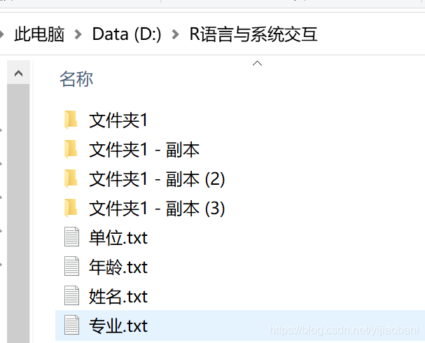
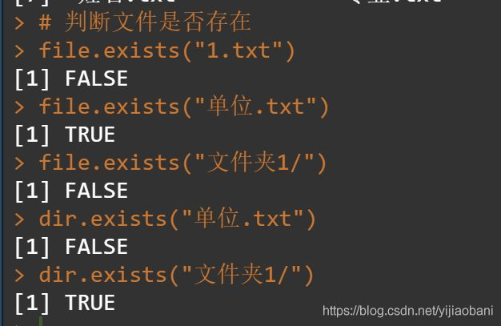
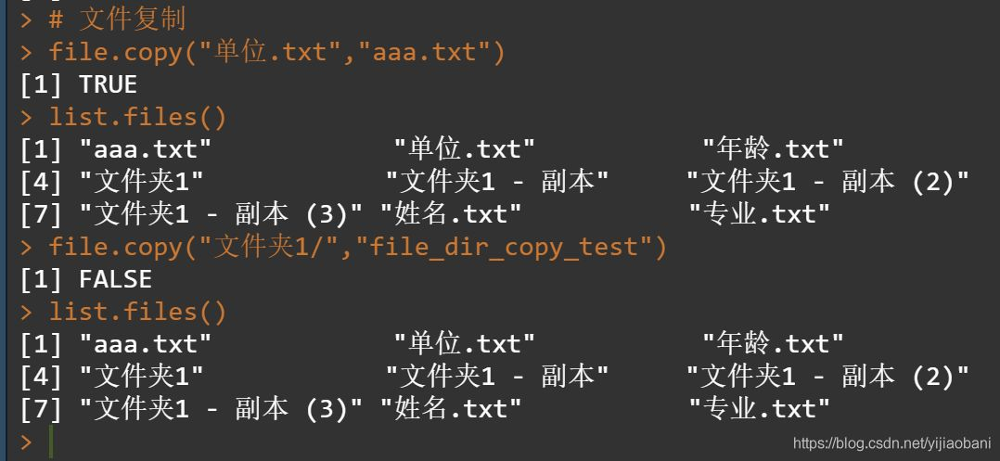
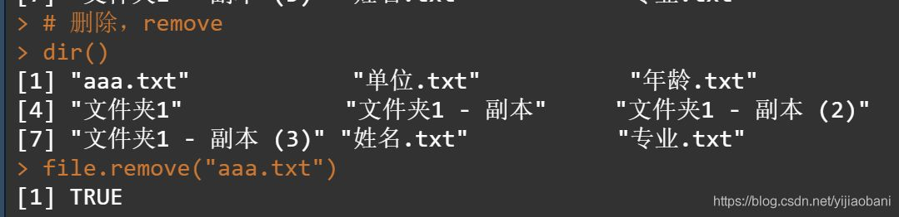
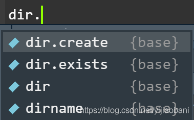
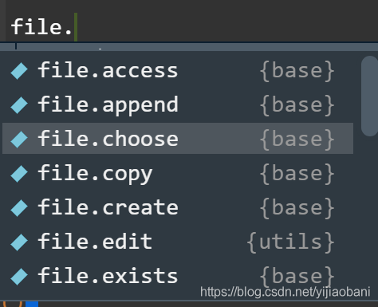
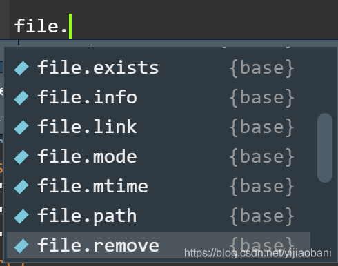
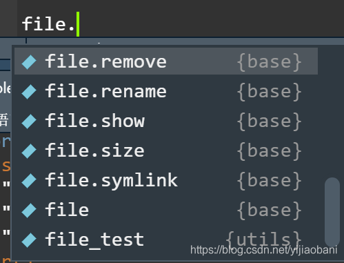
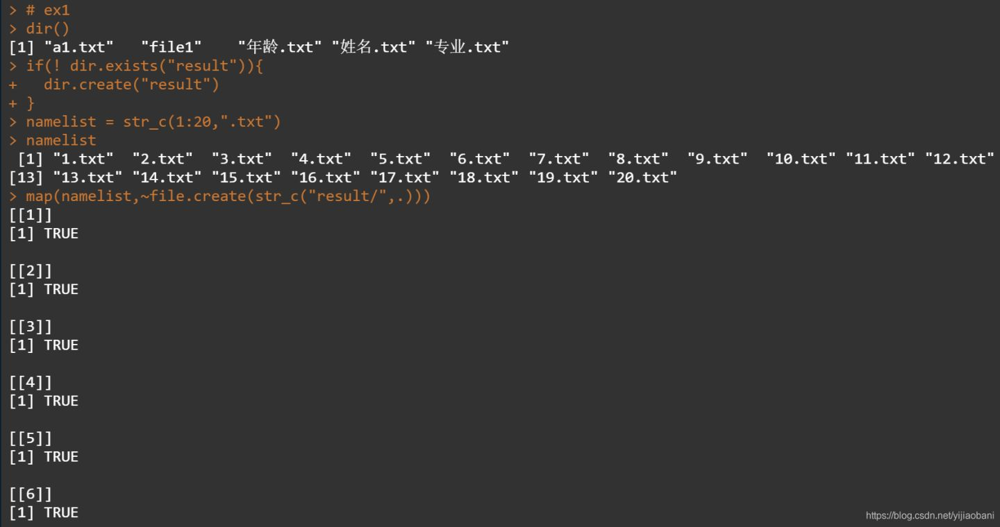

# R语言操作文件与文件夹

tags: #内容/编程/R语言 #来源/转载 


有时候，编写代码时，需要查看一下当前文件夹的内容，有时候需要创建文件或者文件夹，之前都是在windows系统或者Linux系统下创建好，但总不够原滋原味。这里，总结一下常用的文件创建，文件夹创建，判断是否存在，文件复制，文件删除等操作。

**「太长不看版：」**

```R
## 浏览功能
dir # 浏览整体文件及文件夹
list.files # 浏览文件
list.dirs # 浏览文件夹

## 判断功能
file.exists # 判断文件是否存在
dir.exists # 判断文件夹是否存在

## 创建功能
file.create # 创建文件
dir.create # 创建文件夹

## 重命名功能
file.rename # 重命名文件和文件夹

## 删除功能
file.remove # 删除文件
unlink # 删除文件夹

## 复制功能
file.copy # 复制文件
```

## **1. 文件浏览**

共有三个：

- dir() # 全部的文件和文件夹
- list.files() # 全部的文件
- list.dirs() # 全部的文件夹

**「语法：」**

```R
dir(path = ".", pattern = NULL, all.files = FALSE,
           full.names = FALSE, recursive = FALSE,
           ignore.case = FALSE, include.dirs = FALSE, no.. = FALSE)
           
list.files(path = ".", pattern = NULL, all.files = FALSE,
           full.names = FALSE, recursive = FALSE,
           ignore.case = FALSE, include.dirs = FALSE, no.. = FALSE)

list.dirs(path = ".", full.names = TRUE, recursive = TRUE)
```

**「举个例子：」**



**「R语言实现：」**


```R
# 浏览功能

## 浏览全部
dir()

## 浏览文件夹
list.dirs()

## 浏览文件
list.files()
```

## **2. 判断文件和文件夹是否存在**

编写代码时，经常用到，如果不存在文件夹，就创建文件夹。或者如果不存在某个文件，就怎么样……

**「file只能判断文件，dir只能判断文件夹」**

```R
file.exists("1.txt")
file.exists("单位.txt")

file.exists("文件夹1/")

dir.exists("单位.txt")
dir.exists("文件夹1/")
```



## **3. 文件复制**

file.copy只能复制文件，不能复制文件夹，如果复制成功，会出现TRUE，不成功是返回FALSE

```R
# 文件复制
file.copy("单位.txt","aaa.txt")
list.files()

file.copy("文件夹1/","file_dir_copy_test")
list.files()
```



## **4. 文件重命名**

file.rename，可以修改文件名，不可以修改文件夹名

```R
# 文件移动或重命名
file.rename("aaa.txt","bbb.txt")
dir()

file.remove("文件夹1 - 副本/","direc_test")
```


## **5. 文件和文件夹删除**

**「文件删除`file.remove`」**

```R
# 删除，remove
dir()
file.remove("aaa.txt")
dir()
```



**「文件夹删除`unlink`」**

文件夹删除： unlink

注意，要删除文件夹：

- 不要写/， 比如unlink("a/")，是不会成功的
- 要加上参数，recursive = T

完整的写法：

```R
dir()
unlink("新建文件夹/",recursive = T)
dir()

unlink("新建文件夹",recursive = T)
dir()
```


## **5. 文件和文件夹创建**


**「文件创建：`file.create`」**

```R
> file.create("a1.txt")
[1] TRUE
```

**「文件夹创建：`file.create`」**

```R
> dir.create("file1")
>
```


## **6. 汇总**

### **6.1 dir前缀的函数，是文件夹的操作**

- dir.create，创建
- dir.exists，是否存在
- dir，浏览



### **6.2 file前缀的函数，是文件的操作**







## **7. 举个例子**

**「创建文件夹写入文件」**

> ❝ 如果当前路径中，存在result文件夹，就往里面写入1.txt, 2.txt ……20.txt等20个文件。如果不存在result文件夹，就创建文件，然后往里面写入txt文件。
> ❞

```R
# ex1
dir()
if(! dir.exists("result")){
  dir.create("result")
}
namelist = str_c(1:20,".txt")
namelist

map(namelist,~file.create(str_c("result/",.)))
```

**「代码：」**

- 首先检查是否存在，如果不存在就创建
- 建立一个文件名
- 用map函数进行批量创建，里面用了str_c，里面用了匿名函数




看一下效果： 


搞定，666！

