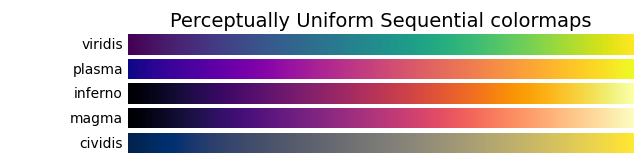
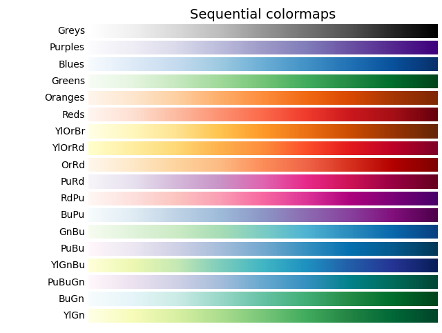
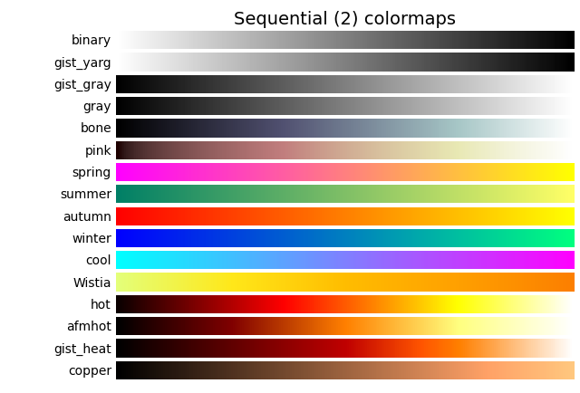
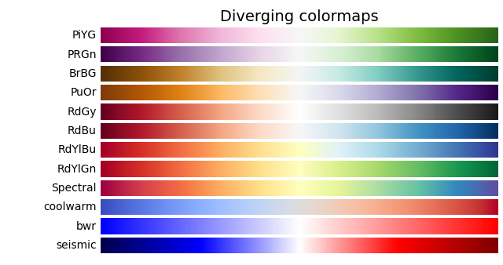
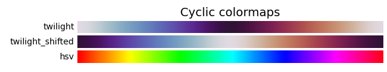
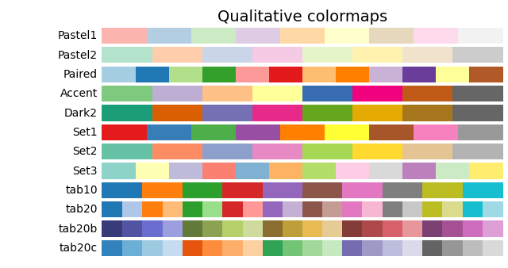
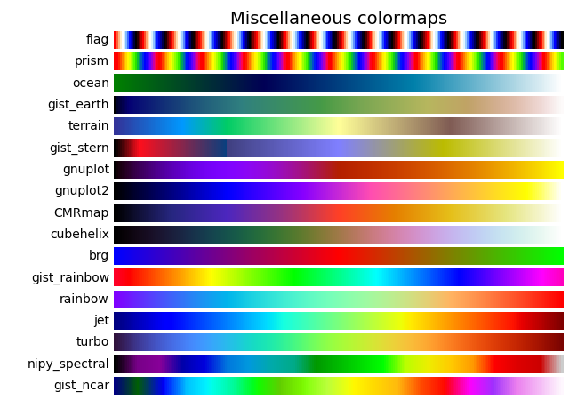

# Matplotlib 命名颜色列表

首先，我们定义一个用于制作颜色表的辅助函数，然后我们在一些常见的颜色类别上使用它。

```python
import math

import matplotlib.pyplot as plt

import matplotlib.colors as mcolors
from matplotlib.patches import Rectangle


def plot_colortable(colors, *, ncols=4, sort_colors=True):

    cell_width = 212
    cell_height = 22
    swatch_width = 48
    margin = 12

    # Sort colors by hue, saturation, value and name.
    if sort_colors is True:
        names = sorted(
            colors, key=lambda c: tuple(mcolors.rgb_to_hsv(mcolors.to_rgb(c))))
    else:
        names = list(colors)

    n = len(names)
    nrows = math.ceil(n / ncols)

    width = cell_width * ncols + 2 * margin
    height = cell_height * nrows + 2 * margin
    dpi = 72

    fig, ax = plt.subplots(figsize=(width / dpi, height / dpi), dpi=dpi)
    fig.subplots_adjust(margin/width, margin/height,
                        (width-margin)/width, (height-margin)/height)
    ax.set_xlim(0, cell_width * ncols)
    ax.set_ylim(cell_height * (nrows-0.5), -cell_height/2.)
    ax.yaxis.set_visible(False)
    ax.xaxis.set_visible(False)
    ax.set_axis_off()

    for i, name in enumerate(names):
        row = i % nrows
        col = i // nrows
        y = row * cell_height

        swatch_start_x = cell_width * col
        text_pos_x = cell_width * col + swatch_width + 7

        ax.text(text_pos_x, y, name, fontsize=14,
                horizontalalignment='left',
                verticalalignment='center')

        ax.add_patch(
            Rectangle(xy=(swatch_start_x, y-9), width=swatch_width,
                      height=18, facecolor=colors[name], edgecolor='0.7')
        )

    return fig
```


## Base colors[#](https://matplotlib.org/stable/gallery/color/named_colors.html#base-colors "Link to this heading") 基色#

```python
plot_colortable([mcolors.BASE_COLORS](https://docs.python.org/3/library/stdtypes.html#dict "builtins.dict"), ncols=3, sort_colors=False)
```


## Tableau Palette[](https://matplotlib.org/stable/gallery/color/named_colors.html#tableau-palette "Link to this heading") 调色板表#

```python
plot_colortable([mcolors.TABLEAU_COLORS](https://docs.python.org/3/library/stdtypes.html#dict "builtins.dict"), ncols=2, sort_colors=False)
```


## CSS Colors[](https://matplotlib.org/stable/gallery/color/named_colors.html#css-colors "Link to this heading") CSS 颜色#

```python
plot_colortable([mcolors.CSS4_COLORS](https://docs.python.org/3/library/stdtypes.html#dict "builtins.dict"))
[plt.show](https://matplotlib.org/stable/api/_as_gen/matplotlib.pyplot.show.html#matplotlib.pyplot.show "matplotlib.pyplot.show")()
```


Matplotlib 支持来自 xkcd 颜色调查的颜色，例如 `"xkcd:sky blue"` .由于它包含近 1000 种颜色，因此这个数字会非常大，因此此处省略。您可以使用以下代码自行生成概述

```python
xkcd_fig = plot_colortable(mcolors.XKCD_COLORS)
xkcd_fig.savefig("XKCD_Colors.png")
```


# Matplotlib 颜色映射图

> https://matplotlib.org/stable/gallery/color/colormap_reference.html#sphx-glr-gallery-color-colormap-reference-py


# 颜色图参考#

Matplotlib 附带的颜色图参考。

通过附加 `_r` 到名称，可以获得每个颜色图的反转版本，如反转颜色图中所示。

有关颜色图（包括色盲友好性）的深入讨论，请参阅选择颜色图，有关创建颜色图的指南，请参阅创建颜色图。

```
import matplotlib.pyplot as plt
import numpy as np

cmaps = [('Perceptually Uniform Sequential', [
            'viridis', 'plasma', 'inferno', 'magma', 'cividis']),
         ('Sequential', [
            'Greys', 'Purples', 'Blues', 'Greens', 'Oranges', 'Reds',
            'YlOrBr', 'YlOrRd', 'OrRd', 'PuRd', 'RdPu', 'BuPu',
            'GnBu', 'PuBu', 'YlGnBu', 'PuBuGn', 'BuGn', 'YlGn']),
         ('Sequential (2)', [
            'binary', 'gist_yarg', 'gist_gray', 'gray', 'bone', 'pink',
            'spring', 'summer', 'autumn', 'winter', 'cool', 'Wistia',
            'hot', 'afmhot', 'gist_heat', 'copper']),
         ('Diverging', [
            'PiYG', 'PRGn', 'BrBG', 'PuOr', 'RdGy', 'RdBu',
            'RdYlBu', 'RdYlGn', 'Spectral', 'coolwarm', 'bwr', 'seismic']),
         ('Cyclic', ['twilight', 'twilight_shifted', 'hsv']),
         ('Qualitative', [
            'Pastel1', 'Pastel2', 'Paired', 'Accent',
            'Dark2', 'Set1', 'Set2', 'Set3',
            'tab10', 'tab20', 'tab20b', 'tab20c']),
         ('Miscellaneous', [
            'flag', 'prism', 'ocean', 'gist_earth', 'terrain', 'gist_stern',
            'gnuplot', 'gnuplot2', 'CMRmap', 'cubehelix', 'brg',
            'gist_rainbow', 'rainbow', 'jet', 'turbo', 'nipy_spectral',
            'gist_ncar'])]

gradient = np.linspace(0, 1, 256)
gradient = np.vstack((gradient, gradient))


def plot_color_gradients(cmap_category, cmap_list):
    # Create figure and adjust figure height to number of colormaps
    nrows = len(cmap_list)
    figh = 0.35 + 0.15 + (nrows + (nrows-1)*0.1)*0.22
    fig, axs = plt.subplots(nrows=nrows, figsize=(6.4, figh))
    fig.subplots_adjust(top=1-.35/figh, bottom=.15/figh, left=0.2, right=0.99)

    axs[0].set_title(f"{cmap_category} colormaps", fontsize=14)

    for ax, cmap_name in zip(axs, cmap_list):
        ax.imshow(gradient, aspect='auto', cmap=cmap_name)
        ax.text(-.01, .5, cmap_name, va='center', ha='right', fontsize=10,
                transform=ax.transAxes)

    # Turn off *all* ticks & spines, not just the ones with colormaps.
    for ax in axs:
        ax.set_axis_off()


for cmap_category, cmap_list in cmaps:
    plot_color_gradients(cmap_category, cmap_list)
```


- 
- 
- 
- 
- 
- 
- 


##  反转颜色图#

附加 `_r` 到任何内置颜色图的名称以获取反转版本：

```
plot_color_gradients("Original and reversed ", ['viridis', 'viridis_r'])
```


内置的反转颜色图是使用 `Colormap.reversed` 生成的。有关示例，请参阅反转颜色图

 引用

此示例显示了以下函数、方法、类和模块的使用：

- [`matplotlib.colors`](https://matplotlib.org/stable/api/colors_api.html#module-matplotlib.colors)
- [`matplotlib.axes.Axes.imshow`](https://matplotlib.org/stable/api/_as_gen/matplotlib.axes.Axes.imshow.html#matplotlib.axes.Axes.imshow)
- [`matplotlib.figure.Figure.text`](https://matplotlib.org/stable/api/figure_api.html#matplotlib.figure.Figure.text)
- [`matplotlib.axes.Axes.set_axis_off`](https://matplotlib.org/stable/api/_as_gen/matplotlib.axes.Axes.set_axis_off.html#matplotlib.axes.Axes.set_axis_off)
