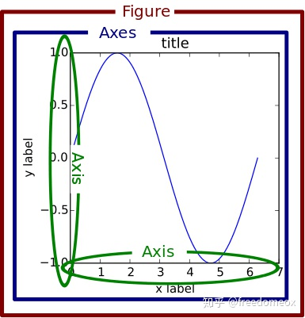
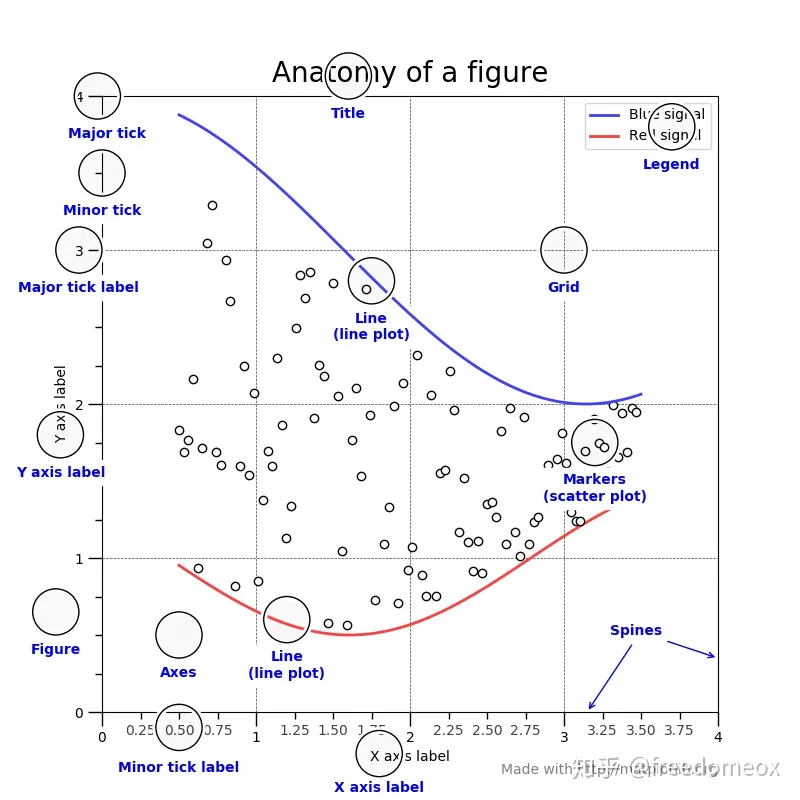
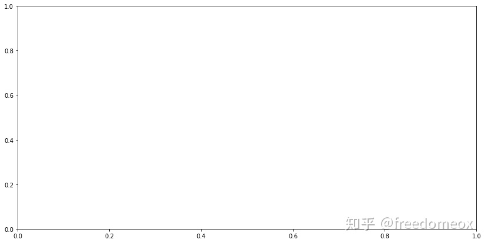
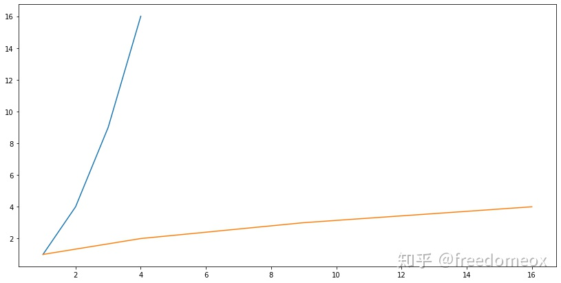
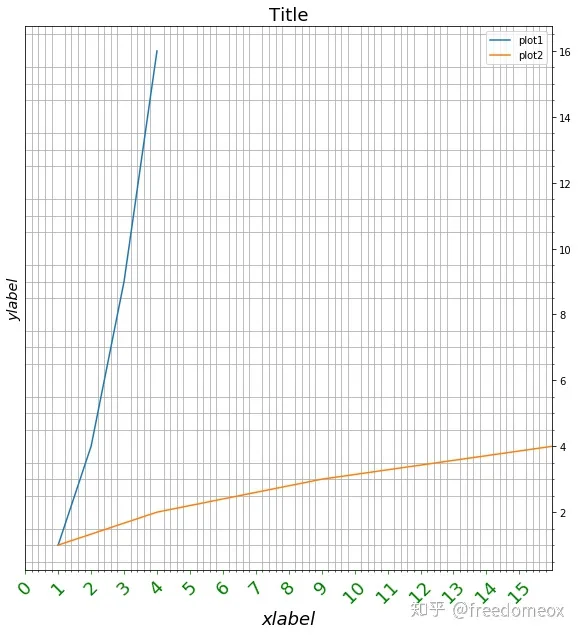

# Matplotlib辨析plt、fig、axes


---
title: Matplotlib辨析plt、fig、axes
authors: Ethan Lin
year:
tags:
  - 日期/2023-04-05 
  - 类型/笔记 
  - 来源/转载 
---


# 来源

> [matplotlib：先搞明白plt. /ax./ fig再画 - 知乎](https://zhuanlan.zhihu.com/p/93423829)


我这个傻子的matplotlib学习过程很神奇：

刚开始，找几个教程，呕吼，简单，plt.*** 一顿写。画完了。遇到坐标啊之类的细节不会调？

打开谷哥，要啥搜啥。

我最开始觉得这样蛮好的，这是一个很容易学的lib嘛。

然后问题出现了，matplotlib最烦人的地方就是，同样一个目标，你可以有N种不同的方法去实现他。比如说哦，加标题：

plt.set_title() 可以吧。

ax.title.set_text('title') 也可以吧。

ax.set_title()也可以啊。

所以到底要用哪个？?

当你在网上搜索答案的时候，你会遇到各种实现的方法，如果你只是单纯的把找到的答案copypaste，那总有一天你会和我一样崩溃。感觉自己就是个没有谷哥就不会画图的傻子。。。

所以，如果你：

- 学习matplotlib的时候是从标题类似于"五分钟教你matplotlib画图” 这种教程开始的
- 起码知道这一句 'import matplotlib.pyplot as plt'
- 遇到稍微复杂的细节就要一顿查，遇到修改xy坐标，名称，等等就头大
- 打开matplotlib的官方指南，不止一次，但是一脸懵逼
- 在这几个词 figure, axes, axis 在matplotlib出现时就一脸完了的表情

那么你不是一个人。我一直和你在一起。

所以这份指南是用来（尝试）解决这个问题的。我们花短短的时间，来从根本上了解一下matplotlib的架构，各种名词是什么意思，一个正常的画图程序是什么。

## `plt.***`和`ax.***`的区别 

我认为所有不先讲清楚plt.***和ax.*** 两种画图方式的区别的教程都是耍流氓。一上来就告诉你，plt.figure(), plt.plot(), plt.show()，这么画就对了的，都是不负责任的表现！ 

- 在matplotlib中，有两种画图方式：

- - plt.figure()： plt.***系列。通过[http://plt.xxx](https://link.zhihu.com/?target=http%3A//plt.xxx)来画图，其实是取了一个捷径。这是通过matplotlib提供的一个api，这个plt提供了很多基本的function可以让你很快的画出图来，但是如果你想要更细致的精调，就要使用另外一种方法。

```python
plt.figure(1)  
plt.subplot(211)   
plt.plot(A,B)   
plt.show()
```

- - fig, ax = plt.subplots(): 这个就是正统的稍微复杂一点的画图方法了。指定figure和axes，然后对axes单独操作。等下就讲figure和axes都神马意思。

```python
fig, ax = plt.subplots()   
ax.plot(A,B)
```

- 大部分的新手教程，都是以[http://plt.xxx](https://link.zhihu.com/?target=http%3A//plt.xxx)开始的。我个人认为这**不是**一个很好的方式。的确, [http://plt.xxx](https://link.zhihu.com/?target=http%3A//plt.xxx)简单易懂上手快，但是plt把matplotlib的结构看成一个blackbox，新手在不知道这个lib到底是如何运作的情况下以为自己上手了，可是当你需要细调你的图的时候，你就发现你完全不明白网上的人为什么要用[http://ax.xxx](https://link.zhihu.com/?target=http%3A//ax.xxx)， 为什么还有其他那么多种方式来加题目。这样的学习过程是非常不利于长期发展的。
- 因此，从我这个傻子的经验，我强烈建议在初学matplotlib的时候，**尽量避免使用[http://plt.xxx](https://link.zhihu.com/?target=http%3A//plt.xxx)系列**。当你明白figure/axes/axis都是控制什么的时候，如果你想要简单的制作一个quick and dirty的图，用[http://plt.xxx](https://link.zhihu.com/?target=http%3A//plt.xxx)才是OK。

## 名词解释 in matplotlib

matplotlib的名词定于对于非英语母语的人来说实在是太不友好了。尤其是axes。仰天长啸。

从官方借了个图

[official docmatplotlib.org/1.5.1/faq/usage_faq.html#parts-of-a-figure](https://link.zhihu.com/?target=https%3A//matplotlib.org/1.5.1/faq/usage_faq.html%23parts-of-a-figure)




- Figure `fig = plt.figure()`: 可以解释为画布。

- - 画图的第一件事，就是创建一个画布figure，然后在这个画布上加各种元素。

- Axes `ax = fig.add_subplot(1,1,1)`: 不想定义，没法定义，就叫他axes！

- - 首先，这个不是你画图的xy坐标抽！
  - 希望当初写这个lib的时候他们用一个更好的名字。。。
  - 可以把axes理解为你要放到画布上的各个物体。比如你要画一个太阳，一个房子，一个车在画布上，那么太阳是一个axes，房子是一个axes，etc。
  - 如果你的figure只有一张图，那么你只有一个axes。如果你的figure有subplot，那么每一个subplot就是一个axes
  - axes是matlibplot的宇宙中心！axes下可以修改编辑的变量非常多，基本上能包含你的所有需求。

- Axis `ax.xaxis/ax.yaxis`: 对，这才是你的xy坐标轴。

- - 每个坐标轴实际上也是由竖线和数字组成的，每一个竖线其实也是一个axis的subplot，因此`ax.xaxis也存在axes`这个对象。对这个axes进行编辑就会修改xaxis图像上的表现。 

## 图像的各个部位名称

再从使用指南 [User Guide](https://link.zhihu.com/?target=https%3A//matplotlib.org/tutorials/introductory/usage.html) 借个图。每个部分的名称指南，这样当你想修改一个部位的时候，起码知道关键字啊。




## 一步一步来，用传统方法画个图

下面就是实战。用调取ax的方式来画个图。不要用plt！！

## Import library and data for ploting

```python
import matplotlib.pyplot as plt
import numpy as np
%matplotlib inline
A = np.arange(1,5)
B = A**2
C = A**3
```

## 首先，搞个画布

我喜欢用这个命令来开始画图。哪怕你没有subplot，也可以用这个subplots来创建一个画布。

这个function创建了一个大小为（14，7）的画布，把这个画布赋值给变量fig，同时在这个画布上创建了一个axes，把这个axes赋值给ax。这样，所有未来的[http://fig.xxx](https://link.zhihu.com/?target=http%3A//fig.xxx)都是对这个画布的操作，所有[http://ax.xxx](https://link.zhihu.com/?target=http%3A//ax.xxx)都是对这个axes的操作。

如果你有两个图，那么ax是一个有两个元素ax[0],ax[1] 的list。ax[0]就对应第一个subplot的ax。

```python
fig, ax = plt.subplots(figsize=(14,7))
# fig, ax = plt.subplots(2,1,figsize(14,7))
# ax[0].***
# ax[1].***
```




## 好了画布搞好了，画数据。

注意，我们这里依然不使用plt！因为我们要在这个axes上画数据，因此就用ax.plot()来画。画完第一个再call一次，再画第二个。

```python
ax.plot(A,B)
ax.plot(B,A)
```




## 下面开始细节的处理

数据画好了就可以各种细调坐标轴啊，tick啊之类的。

首先把标题和xy坐标轴的标题搞定。Again, 不用plt。直接在axes上进行设定。

```python
ax.set_title('Title',fontsize=18)
ax.set_xlabel('xlabel', fontsize=18,fontfamily = 'sans-serif',fontstyle='italic')
ax.set_ylabel('ylabel', fontsize='x-large',fontstyle='oblique')
ax.legend()
```

然后是xy坐标轴的一些属性设定, 也是在axes level上完成的

```python
ax.set_aspect('equal') 
ax.minorticks_on() 
ax.set_xlim(0,16) 
ax.grid(which='minor', axis='both')
```

最后是坐标轴tick和细节，这个在axes.xaxis or axes.yaxis上完成。

```python
ax.xaxis.set_tick_params(rotation=45,labelsize=18,colors='w') 
start, end = ax.get_xlim() 
ax.xaxis.set_ticks(np.arange(start, end,1)) 
ax.yaxis.tick_right()
```



这样一个丑陋的基本图的绘画和编辑就完成了。如果有一些其他的细节调整，在搜索的时候，尽量选择不用plt的答案。原则上来说，plt和ax画图两者是可以互相转换的，然而转换过程让你的代码更复杂，有时还会产生难以理解的bug。因此画图的时候，请坚持使用一种格式。

搞定，吃饭去。


编辑于 2019-11-25 13:50


------

看出来了答主使劲想把 .plt 和 ax.plot 分开，但还是没有讲到点子上，没能触及为什么matplotlib 能用不同方式来实现同一功能的原因。  
  
首先 matplotlib 架构上分为三层  
底层：backend layer  
中层：artist layer  
最高层：scripting layer  
  
在任意一层操作都能够实现画图的目的，而且画出来还都一样。但越底层的操作越细节话，越高层越易于人机交互。  
  
.plt 对应的就是最高层 scripting layer。这就是为什么它简单上手，但要调细节就不灵了。  
  
ax.plot 是在 artist layer 上操作。基本上可以实现任何细节的调试。  
  
backend layer, 至今，我还没有见有人在这个layer上操作过。  
  
另外，对于axes (翻译就是 坐标系)，我看到有个评论写了很多，说的没有错，但也没说到点子上。  
如果大家学过大学物理的话，会知道每一个物体都有一个独立的坐标系。而matplotlib 就是引用这一理念。所以在artist layer上画多条曲线时，你会用 ax1.plot, ax2.plot ... 而最后显示在一张图上是因为所有独立坐标系对齐的结果。

2020-05-02 · 热评
