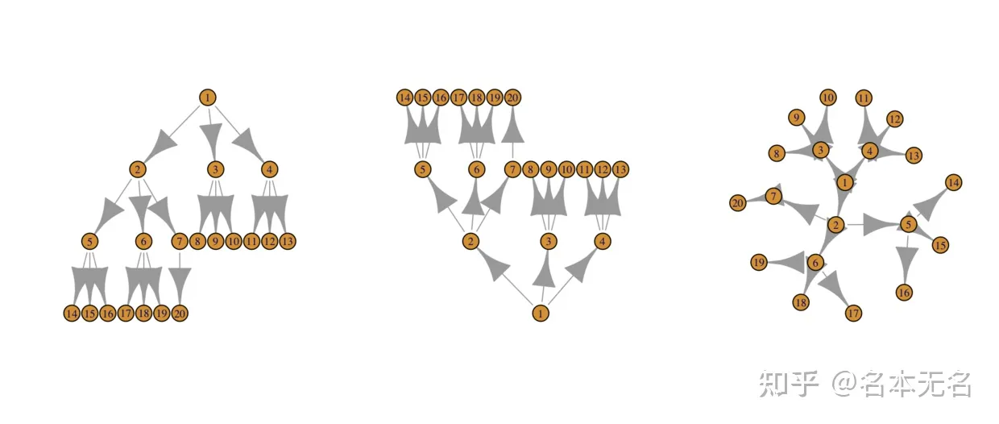
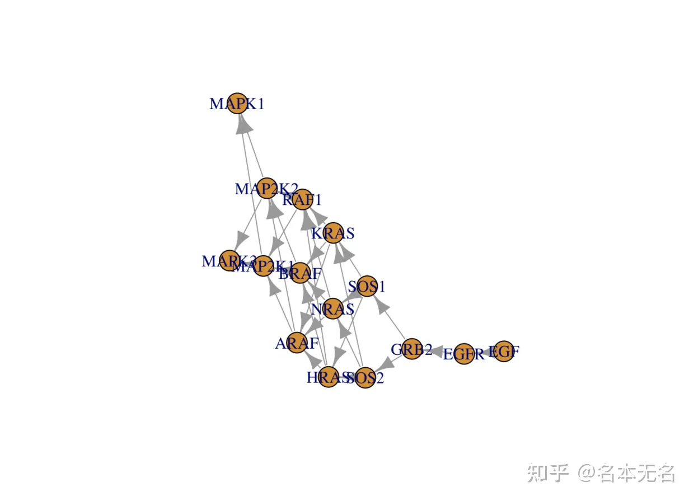

# igraph教程 R语言版


---
title: igraph教程 R语言版
authors: Ethan Lin
year:
tags:
  - 日期/2023-03-27 
  - 类型/笔记 
  - 来源/转载 
  - 内容/可视化 
  - 内容/igraph 
  - 内容/R语言 
---


# 来源

> [R 数据可视化 —— igraph 布局与绘图 - 知乎](https://zhuanlan.zhihu.com/p/374475209)

## **前言**

图是一种抽象的数学结构，不同对象之间通过线条连接起来，而对象在图中并没有固定的位置表示，不同的放置位置显示出的效果通常是不一样的。

选择一种优秀的布局方式，可以让图形呈现出更好的效果，而 `igraph` 的工作方式是通过一类 `node-edge` 的算法来进行布局的。

算法会将节点作为二维或三维空间上的点，使用直线或曲线来连接两个相邻的节点。对于有向图来说，带箭头的线表示连接方向。在边两端的节点可以由不同的几何图形来表示，而一些重要的节点或边的属性可以用来设置图形参数值。

图的可视化通常由三个步骤组成：

1. 找到节点在二维或三维空间上合适的排列方式，这一步可能是最重要的。好的布局往往能够解释一些有趣的现象，如对称性、密集连接区域。 


从上面的图可以看出，第一个随机布局，完全看不出什么有价值的信息，而从第二和第三幅可以看出存在某些对称性

1. 将节点和边的重要属性映射到图像上
2. 安排好节点与边的绘制顺序

## **布局**

布局算法用于寻找合适的排列方式，但是找到优秀的排列确实不容易，因此，大部分的算法都是通过间接测量来评估布局的好坏。而且是一种启发式的方法来求解，所以并不是每次都能找到最优解。

大部分的布局算法只适用于较小的图，较大的图需要一些特殊技术来处理。

`igraph` 中所有布局算法都是 `layout_*()` 形式，每个布局算法都会返回一个 `layout` 实例，类似列表型的对象，包含了每个节点在图中的 `x、y` 坐标。

布局函数 


布局是通过 `plot()` 函数的 `layout` 参数来控制的，例如

我们随机生成一张图

```text
g <- sample_gnm(n = 15, m = 25)
plot(g)
```


随机布局

```text
plot(g, layout = layout_randomly)
```


圆形布局

```text
plot(g, layout = layout_in_circle)
```


力导向布局，最常用的是 `Fruchterman-Reingold` 算法

```text
plot(g, layout = layout_with_fr)
```


另一种比较常用的力导向算法 `Kamada Kawai`

```text
plot(g, layout = layout_with_kk)
```


设置树状图

```text
par(mfrow=c(1, 3))
tree <- make_tree(20, 3)
plot(tree, layout=layout_as_tree)
# 自底向上
plot(tree, layout=layout_as_tree(tree, flip.y=FALSE))
# 圆形排列
plot(tree, layout=layout_as_tree(tree, circular=TRUE))
```



设置根节点

```text
par(mfrow = c(1, 2))
tree2 <- make_tree(10, 3) + make_tree(10, 2)
plot(tree2, layout = layout_as_tree)
plot(tree2, layout = 
       layout_as_tree(
         tree2, root = c(1, 11),
         rootlevel = c(2, 1)
         )
     )
```


传递位置矩阵

```text
g <- sample_gnm(n = 15, m = 25)

l <- cbind(1:vcount(g), c(1, vcount(g):2))
plot(g, layout = l)
```


## **绘制图形**

我们在前面的介绍中，都只用了 `plot()` 函数来绘制图形，所有的一切图形属性都是默认的，默认的颜色、大小、布局等。在我们设置了边和节点的颜色属性之后，图片才显示出了不同的颜色。

在这里，我们将介绍如何来调整节点和边的图形属性，`igraph` 的绘制参数包括


我们以 `KEEE` 数据库中的 `ErbB` 信号通路中的 `EGF-ERBB2-RAS-ERK` 信号通路为例。

利用 `KEGG` 官网提供的 `API` 接口，处理并获取通路的图结构，然后将其转换为基因 `symbol` 边列表，代码如下

```text
library(rvest)
library(tidyverse)

# 解析 ErbB signaling pathway 网络结构
kmgl <- read_html('http://rest.kegg.jp/get/hsa04012/kgml')
# 获取所有基因的 entry id
node <- kmgl %>% html_elements(xpath = '//entry[@type="gene"]') %>%
  html_attrs() %>%
  lapply(function (x) c(x['id'], x['name'])) %>%
  do.call(rbind, .) %>%
  as.data.frame()
# 获取所有 entry 之间的互作关系
edge <- kmgl %>% html_elements(xpath = '//relation') %>%
  html_attrs() %>%
  lapply(function (x) c(x['entry1'], x['entry2'])) %>%
  do.call(rbind, .) %>%
  as.data.frame()
# 将 entry id 转换为 KEGG gene ID
net <- inner_join(node, edge, by = c('id' = 'entry1')) %>%
  inner_join(node, by = c('entry2' = 'id')) %>%
  dplyr::select(name.x, name.y) %>%
  dplyr::rename(source = name.x, target = name.y)
# 将多对一转换为多个一对一
edges_list <- list()
for (i in seq_along(net[,1])) {
  gids <- str_split(gsub("hsa:", '', net[i,]), ' ')
  s <- data.frame('source' = gids[[1]])
  t <- data.frame('target' = gids[[2]])
  edges_list[[i]] <- crossing(s, t)
}
# 合并为边列表
all_edges <- do.call(rbind, edges_list)

# EGF-ERBB2-RAS-ERK signaling pathway genes
sub_path <- c(
  1950, 2064, 1956, 2885,
  6654, 6655, 3265, 3845,
  4893, 369, 673, 5894, 5604,
  5605, 5594, 5595
  )

path_id <- all_edges %>%
  filter(source %in% sub_path & target %in% sub_path)

# 将 ENTREZID 转换为 SYMBOL
library(org.Hs.eg.db)
s <- select(org.Hs.eg.db, keys = path_id$source, columns = 'SYMBOL', 'ENTREZID')
t <- select(org.Hs.eg.db, keys = path_id$target, columns = 'SYMBOL', 'ENTREZID')
# 获取最终的 SYMBOL 边结构
sub_path <- tibble(
  source = s$SYMBOL,
  target = t$SYMBOL
) %>%
  distinct()

# 设置基因的类型，是否癌基因或抑癌基因
genes <- unique(union(sub_path$source, sub_path$target))
gtype <- rep("other", length(genes))
gtype[grep("(RAS)|(RAF)", genes)] <- "proto-oncogene"

gene_type <- data.frame(
  genes = genes,
  type = gtype
)
# 获取突变信息
mut <- read_delim('~/Downloads/luad_broad/data_mutations_mskcc.txt', delim = '\t') %>%
  dplyr::select(Hugo_Symbol, Variant_Classification) %>%
  filter(Hugo_Symbol %in% genes)

# 每个基因的突变频数，即突变类型
mut_cnt <- group_by(mut, Hugo_Symbol) %>%
  summarise(mut_count = n())
mut_info <- distinct(mut) %>%
  group_by(Hugo_Symbol) %>%
  summarise(mut_class = n()) %>%
  left_join(mut_cnt)
# 将基因的所有信息整合在一起
node_attr <- left_join(gene_type, mut_info, by = c("genes" = "Hugo_Symbol")) %>%
  replace_na(list(mut_class = 0, mut_count = 0))
```

获取代码：`https://github.com/dxsbiocc/learn/blob/main/R/data_process/get_hsa04012_kgml.R`

突变数据：`https://github.com/dxsbiocc/learn/blob/main/data/mutation/data_mutations_mskcc.txt`

为了方便，我们并没有考虑通路中基因或蛋白复合物的情况。

创建图

```text
g <- graph_from_data_frame(d = sub_path, vertices = node_attr)
plot(g, layout = layout_with_fr)
```



有两种方法来设置节点和边的图形属性，第一种就是在 `plot()` 函数中传递对应的参数

例如，设置边的箭头大小和曲率

```text
plot(g, layout = layout_as_tree, 
     edge.arrow.size=.4, 
     edge.curved=.1
     )
```


```text
plot(g, layout = layout.circle, 
     edge.arrow.size=.2, 
     edge.color="#1f78b4",
     vertex.color="#33a02c", 
     vertex.frame.color="#fb9a99",
     vertex.label.color="#ff7f00"
     )
```


第二种方法，将图形属性添加到 `igraph` 对象中。

例如，我们想根据基因的类型设置不同的颜色，根据基因突变频率设置节点的大小

```text
# 设置基因的颜色
V(g)$color <- if_else(V(g)$type == "other", "#80b1d3", "#fb8072")
# 设置基因的大小
V(g)$size <- log10(V(g)$mut_count + 1) * 10
# 不显示基因名
V(g)$label <- NA
# 假设我们有基因之间的相关性，用于设置边的宽度
E(g)$width <- abs(rnorm(n = ecount(g)))
# 设置箭头大小和边的颜色
E(g)$arrow.size <- .2
E(g)$edge.color <- "gray80"
# 设置布局
graph_attr(g, "layout") <- layout_with_lgl

plot(g)
```


可以在 `plot` 中覆盖图形属性参数的值

```text
plot(g, edge.color="orange", vertex.color="gray50") 
```


添加图例

```text
legend(x=-1.5, y=-1.1, c("other","proto-oncogene"), pch=21,
       col="#777777", pt.bg=c("#80b1d3", "#fb8072"), 
       pt.cex=2, cex=.8, bty="n", ncol=1)
```


我们可以只显示节点的文本，而不添加形状

```text
plot(g, vertex.shape="none", 
     vertex.label.font=2, 
     vertex.label.color="gray40",
     vertex.label.cex=.7, 
     edge.color="gray85",
     edge.arrow.size = .2
     )
```


为基因之间的调控与被调控关系设置不同的颜色

```text
graph_attr(g, "layout") <- layout_with_lgl
V(g)$color <- if_else(V(g)$type == "other", "#80b1d3", "#fb8072")

edge.start <- ends(g, es=E(g), names=F)[,1]
edge.col <- V(g)$color[edge.start]

plot(g, edge.color=edge.col, edge.curved=.1, edge.arrow.size = .3) 
```


根据基因的度来设置基因的大小

```text
deg <- degree(g, mode="all")
V(g)$size <- deg * 6

plot(g, edge.color=edge.col, 
     edge.curved=.1, edge.arrow.size = .3)
```


大家可以根据需求自己设置不同的颜色属性，就不再一一列举了

\- END -