# 如何画出漂亮的神经网络图？神经网络可视化工具集锦搜集

---
title: 如何画出漂亮的神经网络图？神经网络可视化工具集锦搜集
authors: Ethan Lin
year:
tags:
  - 日期/2023-06-10 
  - 类型/笔记 
  - 来源/转载 
  - 内容/可视化 
  - 内容/神经网络 
  - 类型/资源 
---

# 来源

> [如何画出漂亮的神经网络图？神经网络可视化工具集锦搜集_深度学习基础与进阶_2023-06-07 14:30](https://mp.weixin.qq.com/s/64qcTqN-PuhivUVhkBnTDA)

# 正文

1. draw_convnet

一个用于画卷积神经网络的Python脚本

- https://github.com/gwding/draw_convnet

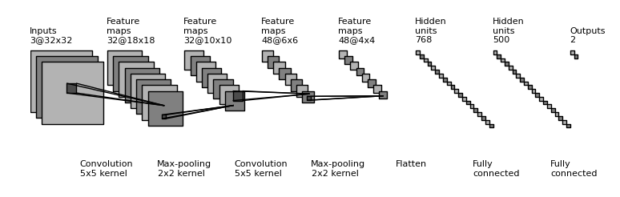

**2. NNSVG**

- http://alexlenail.me/NN-SVG/LeNet.html

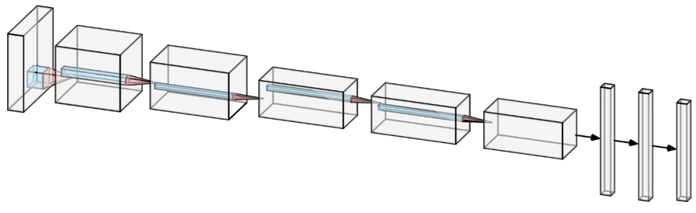

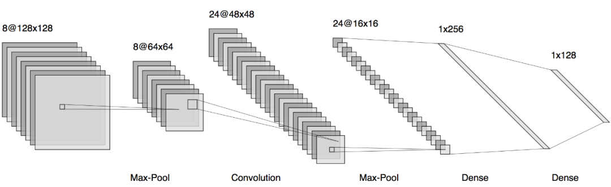

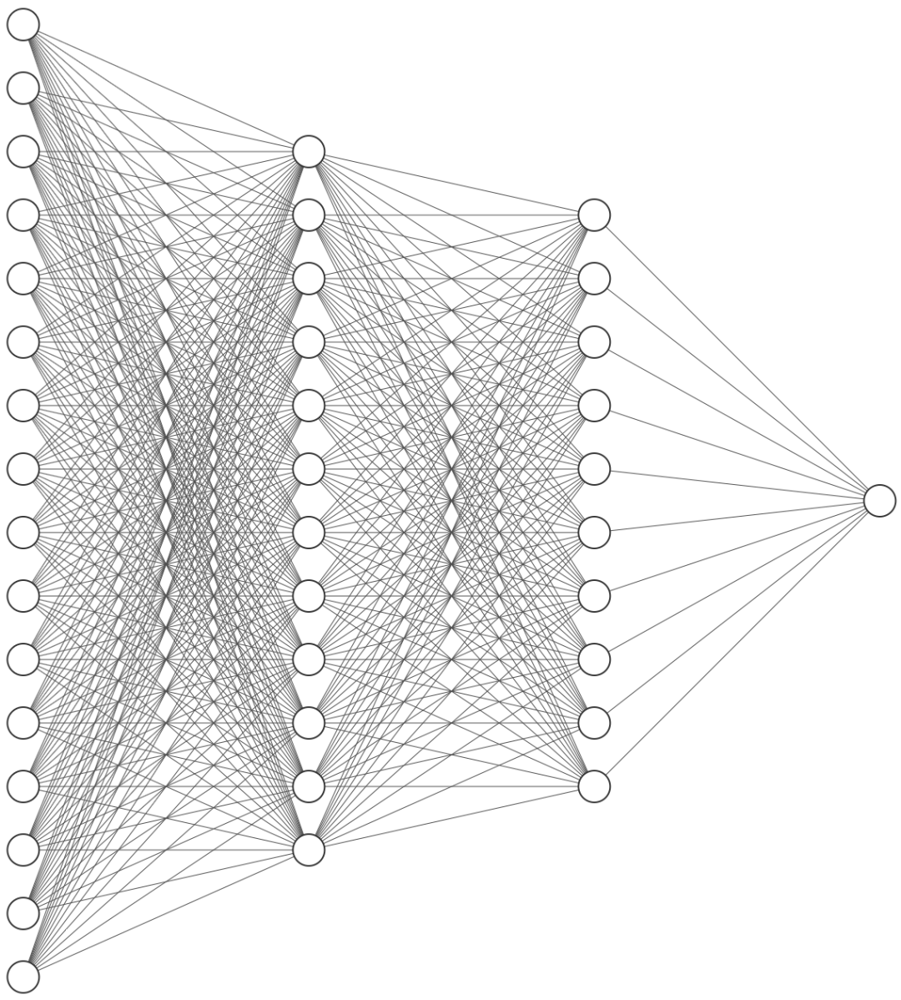

**3. PlotNeuralNet**

- https://github.com/HarisIqbal88/PlotNeuralNet

使用latex 来展示神经网络

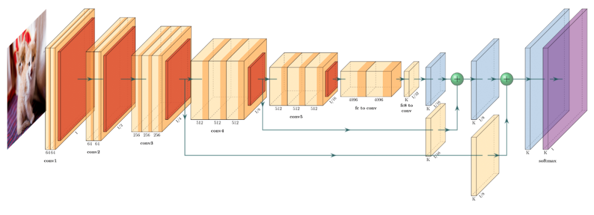

**4. Tensorboard**

- https://www.tensorflow.org/tensorboard/graphs

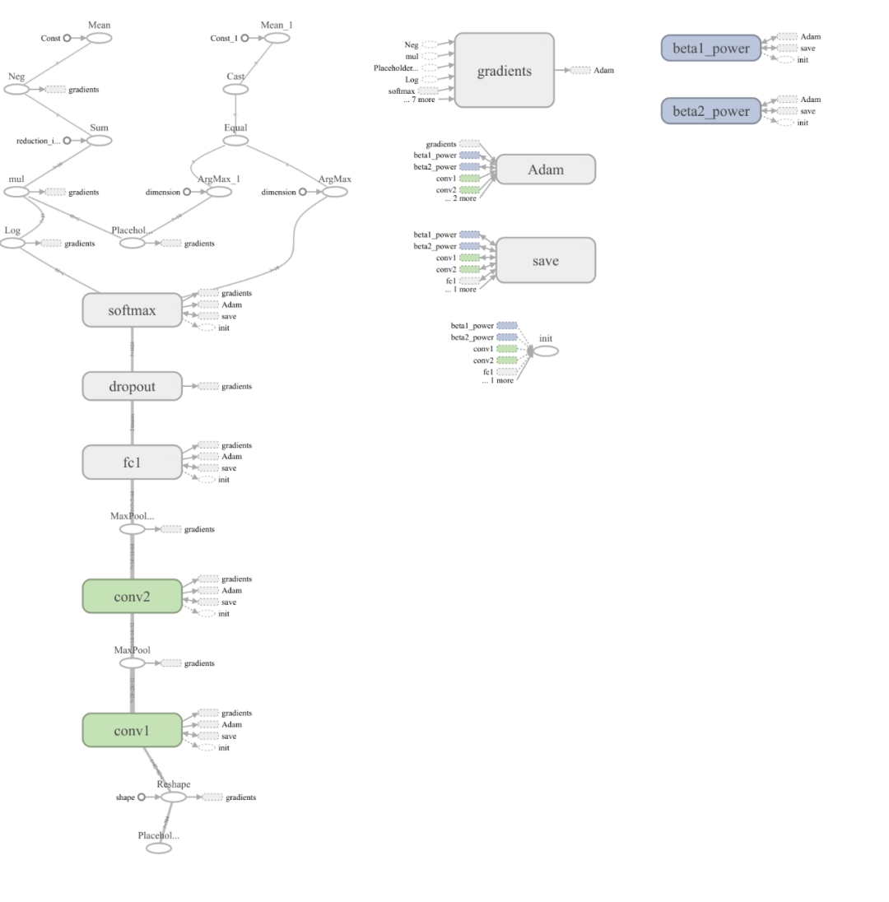

**5. Caffe**

- https://github.com/BVLC/caffe/blob/master/python/caffe/draw.py

使用Caffe/draw.py

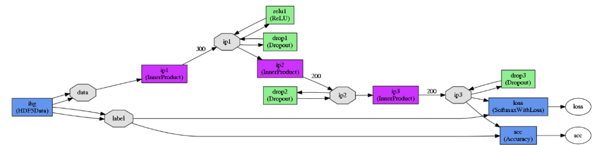

**6.Matlab**

- http://www.mathworks.com/help/nnet/ref/view.html

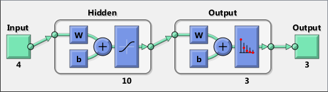

**7.Keras.js**

- https://transcranial.github.io/keras-js/#/inception-v3

  

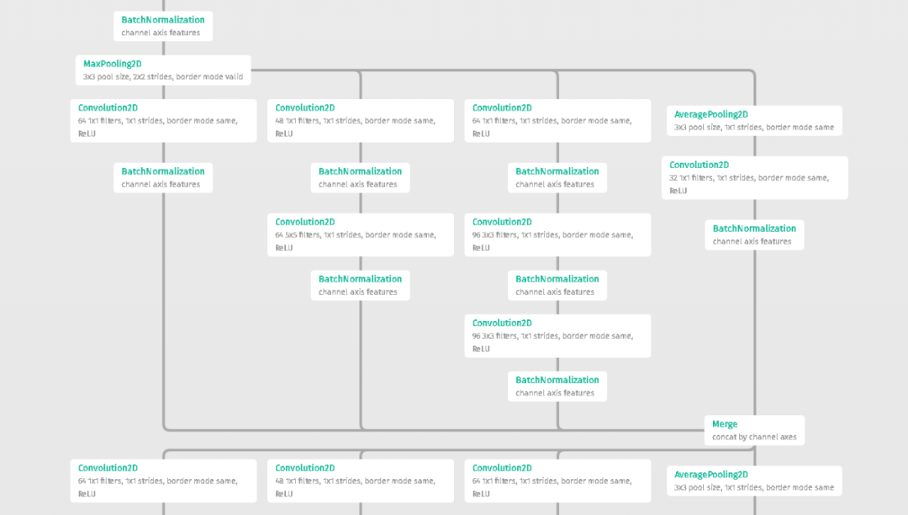

**8. DotNet**

- https://github.com/martisak/dotnets

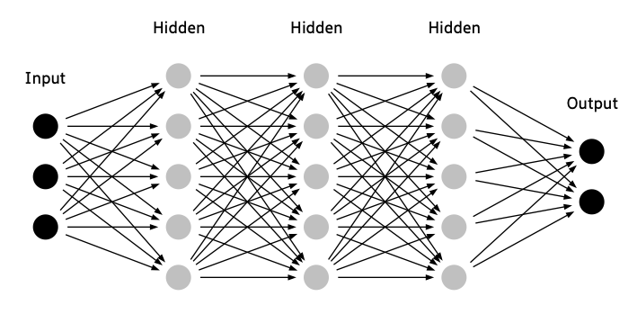

**9. Graphviz**

- http://www.graphviz.org/

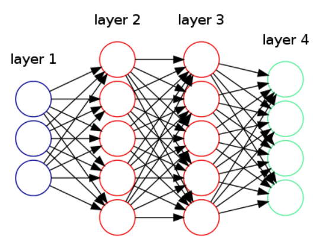

**10. ConX**

- https://conx.readthedocs.io/en/latest/index.html

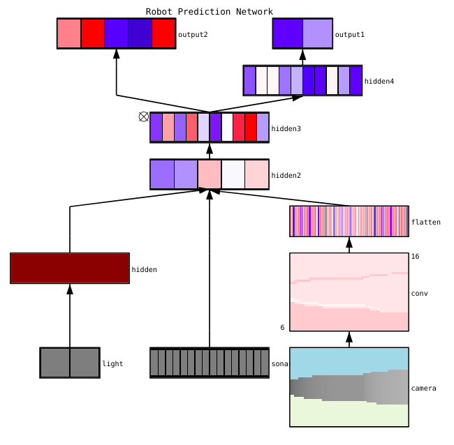

**11. ENNUI** 

- https://math.mit.edu/ennui/

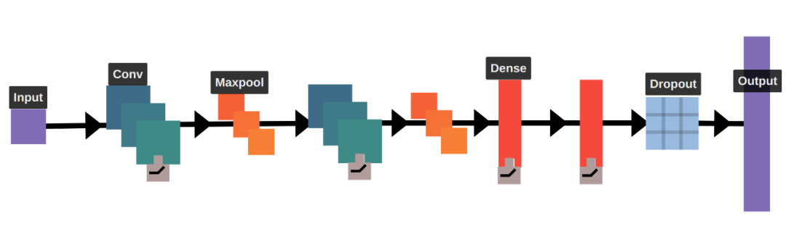

12. Neataptic

- https://wagenaartje.github.io/neataptic/

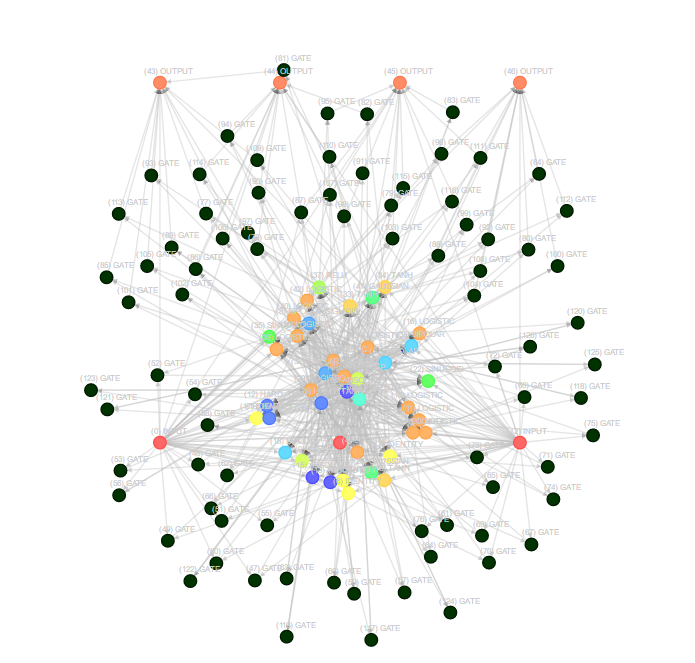

转载自：深度学习初学者
