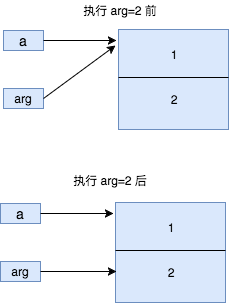
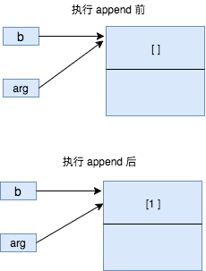
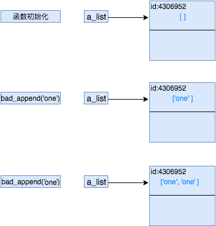
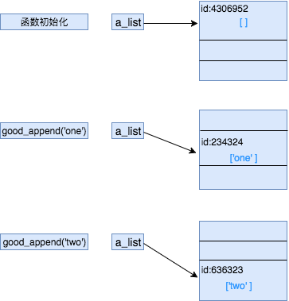

#内容/Python 
#知识 
#来源/转载 


# Python函数传参方式


[来源](https://www.cnblogs.com/shizhengwen/p/6972183.html)


在 C/C++ 中，传值和传引用是函数参数传递的两种方式，在Python中参数是如何传递的？回答这个问题前，不如先来看两段代码。

 

代码段1：


```python
def foo(arg):

    arg = 2

    print(arg)

 

a = 1

foo(a)  # 输出：2

print(a) # 输出：1
```


看了代码段1的同学可能会说参数是值传递。

 

代码段2：


```python
def bar(args):

    args.append(1)

 

b = []

print(b)#　输出：[]

print(id(b)) # 输出：4324106952

bar(b)

print(b) ＃　输出：[1]

print(id(b))  # 输出：4324106952
```


看了代码段2，这时可能又有人会说，参数是传引用，那么问题来了，参数传递到底是传值还是传引用或者两者都不是？为了把这个问题弄清楚，先了解 Python 中变量与对象之间的关系。

 

变量与对象

 

Python 中一切皆为对象，数字是对象，列表是对象，函数也是对象，任何东西都是对象。而变量是对象的一个引用（又称为名字或者标签），对象的操作都是通过引用来完成的。例如，[]是一个空列表对象，变量 a 是该对象的一个引用

```python
a = []
a.append(1)
```

在 Python 中，「变量」更准确叫法是「名字」，赋值操作 = 就是把一个名字绑定到一个对象上。就像给对象添加一个标签。

```python
a = 1
```


 

整数 1 赋值给变量 a 就相当于是在整数1上绑定了一个 a 标签。

```
a = 2
```


 

整数 2 赋值给变量 a，相当于把原来整数 1 身上的 a 标签撕掉，贴到整数 2 身上。

```
b = a
```


 

把变量 a 赋值给另外一个变量 b，相当于在对象 2 上贴了 a，b 两个标签，通过这两个变量都可以对对象 2 进行操作。

 

变量本身没有类型信息，类型信息存储在对象中，这和C/C++中的变量有非常大的出入（C中的变量是一段内存区域）

 

函数参数

 

Python 函数中，**参数的传递本质上是一种赋值操作**，而赋值操作是一种名字到对象的绑定过程，清楚了赋值和参数传递的本质之后，现在再来分析前面两段代码。

```
def foo(arg):
 
    arg = 2
 
    print(arg)
 
  
 
a = 1
 
foo(a)  # 输出：2
 
print(a) # 输出：1
```



 

在代码段1中，变量 a 绑定了 1，调用函数 foo(a) 时，相当于给参数 arg 赋值 arg=1，这时两个变量都绑定了 1。在函数里面 arg 重新赋值为 2 之后，相当于把 1 上的 arg 标签撕掉，贴到 2 身上，而 1 上的另外一个标签 a 一直存在。因此 print(a) 还是 1。

 

再来看一下代码段2

```
def bar(args):
 
    args.append(1)
 
  
 
b = []
 
print(b)#　输出：[]
 
print(id(b)) # 输出：4324106952
 
bar(b)
 
print(b) ＃　输出：[1]
 
print(id(b))  # 输出：4324106952
```



 

执行 append 方法前 b 和 arg 都指向（绑定）同一个对象，执行 append 方法时，并没有重新赋值操作，也就没有新的绑定过程，append 方法只是对列表对象插入一个元素，对象还是那个对象，只是对象里面的内容变了。因为 b 和 arg 都是绑定在同一个对象上，执行 b.append 或者 arg.append 方法本质上都是对同一个对象进行操作，因此 b 的内容在调用函数后发生了变化（但id没有变，还是原来那个对象）

 

最后，回到问题本身，究竟是是传值还是传引用呢？说传值或者传引用都不准确。非要安一个确切的叫法的话，叫传对象（call by object）。如果作为面试官，非要考察候选人对 Python 函数参数传递掌握与否，与其讨论字面上的意思，还不如来点实际代码。

 

show me the code

 

```
def bad_append(new_item, a_list=[]):
 
    a_list.append(new_item)
 
    return a_list
```

 

这段代码是初学者最容易犯的错误，用可变(mutable)对象作为参数的默认值。函数定义好之后，默认参数 a_list 就会指向（绑定）到一个空列表对象，每次调用函数时，都是对同一个对象进行 append 操作。因此这样写就会有潜在的bug，同样的调用方式返回了不一样的结果。

```
>>> print bad_append('one')
 
['one']
 
>>> print bad_append('one')
 
['one', 'one']
```

 



 

而正确的方式是，把参数默认值指定为None

```
def good_append(new_item, a_list=None):
 
    if a_list is None:
 
        a_list = []
 
    a_list.append(new_item)
 
    return a_list
```

　　



参考：http://python.net/~goodger/projects/pycon/2007/idiomatic/handout.html#other-languages-have-variables
