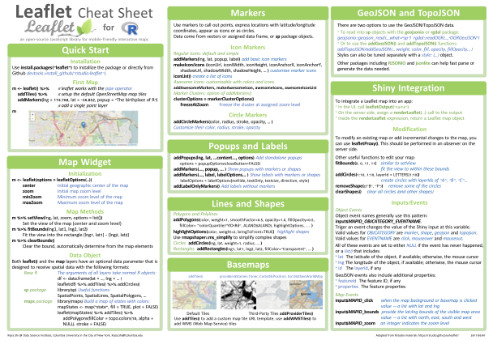

# R cheatsheets

#知识 

#查阅 

#内容/编程/R语言 

# 概览R cheatsheets

简介：R语言的基本教程与各常用工具包干货。来源：[来源：Rstudio网站](https://www.rstudio.com/resources/cheatsheets/)

# Data visualization with ggplot2 cheatsheet 

The [ggplot2](https://ggplot2.tidyverse.org/) package lets you make beautiful and customizable plots of your data. It implements the grammar of graphics, an easy to use system for building plots. Updated August 2021.

[DOWNLOAD](https://raw.githubusercontent.com/rstudio/cheatsheets/main/data-visualization.pdf)

# Data transformation with dplyr cheatsheet 

The [dplyr](https://dplyr.tidyverse.org/) package provides a grammar for manipulating tables in R. This cheatsheet will guide you through the grammar, reminding you how to select, filter, arrange, mutate, summarise, group, and join data frames and tibbles. Updated July 2021.

[DOWNLOAD](https://raw.githubusercontent.com/rstudio/cheatsheets/main/data-transformation.pdf)

# Data tidying with tidyr cheatsheet 

The [tidyr](https://tidyr.tidyverse.org/) package provides a framework for creating and shaping tidy data, the data format that works the most seamlessly with R and the [tidyverse](https://www.tidyverse.org/). The front page of this cheatsheet provides an overview of tibbles and reshaping tidy data. The back page provides an overview of creating, reshaping, and transforming nested data and list-columns with tidyr, tibble, and dplyr. With list-columns, you can use a simple data frame to organize any collection of objects in R. Updated August 2021.

[DOWNLOAD](https://raw.githubusercontent.com/rstudio/cheatsheets/main/tidyr.pdf)

# Data import with readr, readxl, and googlesheets4 cheatsheet 

The tidyverse provides several packages for importing data into R and this cheatsheet covers three of them. On the front page: read and parse text files including csv, tsv, or fwf with [readr](http://readr.tidyverse.org/). On the back page: read and write Excel spreadsheets with [readxl](https://readxl.tidyverse.org/) and work with Google Sheets files with [googlesheets4](https://googlesheets4.tidyverse.org/). Updated August 2021.

[DOWNLOAD](https://raw.githubusercontent.com/rstudio/cheatsheets/main/data-import.pdf)

# Apply functions with purrr cheatsheet 

The [purrr](https://purrr.tidyverse.org/) package makes it easy to work with lists and functions. This cheatsheet will remind you how to manipulate lists with purrr functions as well as how to apply functions iteratively to each element of a list or vector using map functions. Updated July 2021.

[DOWNLOAD](https://raw.githubusercontent.com/rstudio/cheatsheets/main/purrr.pdf)

# String manipulation with stringr cheatsheet 

The [stringr](http://stringr.tidyverse.org/) package provides an easy to use toolkit for working with strings, i.e. character data, in R. This cheatsheet guides you through stringr’s functions for manipulating strings. The back page provides a concise reference to *regular expressions*, a mini-language for describing, finding, and matching patterns in strings. Updated August 2021.

[DOWNLOAD](https://raw.githubusercontent.com/rstudio/cheatsheets/main/strings.pdf)

# Factors with forcats cheatsheet 

Factors are R’s data structure for categorical data. The [forcats](https://forcats.tidyverse.org/) package makes it easy to work with factors. This cheatsheet reminds you how to make factors, reorder their levels, recode their values, and more. Updated July 2021.

[DOWNLOAD](https://raw.githubusercontent.com/rstudio/cheatsheets/main/factors.pdf)

# Dates and times with lubridate cheatsheet 

The [lubridate](http://lubridate.tidyverse.org/) package makes it easier to work with dates and times in R. This cheatsheet covers how to round dates, work with time zones, extract elements of a date or time, parse dates into R and more. The back of the cheatsheet describes lubridate’s three timespan classes: periods, durations, and intervals; and explains how to do math with date-times. Updated July 2021.

[DOWNLOAD](https://raw.githubusercontent.com/rstudio/cheatsheets/main/lubridate.pdf)

# Dynamic documents with rmarkdown cheatsheet 

[R Markdown](https://rmarkdown.rstudio.com/) is an authoring format that makes it easy to write reproducible reports with R. You combine your R code with narration written in markdown (an easy-to-write plain text format) and then export the results as an HTML, PDF, or Word file. You can even use R Markdown to build interactive documents and slide decks. Updated August 2021.

[DOWNLOAD](https://raw.githubusercontent.com/rstudio/cheatsheets/main/rmarkdown.pdf)

# Interactive wep apps with shiny cheatsheet 

If you’re ready to build interactive web apps with R, say hello to [Shiny](https://shiny.rstudio.com/). This cheatsheet provides a tour of the shiny package and explains how to build and customize an interactive app. Be sure to follow the links on the sheet for [even more information](http://shiny.rstudio.com/). Updated July 2021.

[DOWNLOAD](https://raw.githubusercontent.com/rstudio/cheatsheets/main/shiny.pdf)

# RStudio IDE cheatsheet 

The [RStudio IDE](https://www.rstudio.com/products/rstudio/) is the most popular integrated development environment for R. Do you want to write, run, and debug your own R code? Work collaboratively on R projects with version control? Build packages or create documents and apps? No matter what you do with R, the RStudio IDE can help you do it faster. This cheatsheet will guide you through the most useful features of the IDE, as well as the long list of keyboard shortcuts built into the RStudio IDE. Updated July 2021.

[DOWNLOAD](https://raw.githubusercontent.com/rstudio/cheatsheets/main/rstudio-ide.pdf)

# Web APIs for R with plumber cheatsheet 

The [plumber](https://www.rplumber.io/) package enables R developers to build web APIs. Plumber uses special R comments combined with standard R functions to create API endpoints. This cheatsheet provides everything you need to get started building APIs in R with Plumber. Updated March 2021.

[DOWNLOAD](https://raw.githubusercontent.com/rstudio/cheatsheets/main/plumber.pdf)

# Python with R and reticulate cheatsheet 

The [reticulate](https://rstudio.github.io/reticulate/index.html) package provides a comprehensive set of tools for interoperability between Python and R. With reticulate, you can call Python from R in a variety of ways including importing Python modules into R scripts, writing R Markdown Python chunks, sourcing Python scripts, and using Python interactively within the RStudio IDE. This cheatsheet will remind you how. Updated August 2021.

[DOWNLOAD](https://raw.githubusercontent.com/rstudio/cheatsheets/main/reticulate.pdf)

# Deep learning with Keras cheatsheet 

[Keras](https://keras.io/) is a high-level neural networks API developed with a focus on enabling fast experimentation. Keras supports both convolution based networks and recurrent networks (as well as combinations of the two), runs seamlessly on both CPU and GPU devices, and is capable of running on top of multiple back-ends including [TensorFlow](https://github.com/tensorflow/tensorflow), [CNTK](https://github.com/Microsoft/cntk), and [Theano](https://github.com/Theano/Theano). Updated December 2017.

[DOWNLOAD](https://raw.githubusercontent.com/rstudio/cheatsheets/main/keras.pdf)

# Data science in Spark with sparklyr cheatsheet 

The [sparklyr](http://spark.rstudio.com/) package provides an R interface to Apache Spark, a fast and general engine for processing Big Data. With sparklyr, you can connect to a local or remote Spark session, use dplyr to manipulate data in Spark, and run Spark’s built-in machine learning algorithms. Updated October 2019.

[DOWNLOAD](https://raw.githubusercontent.com/rstudio/cheatsheets/main/sparklyr.pdf)

# Package development with devtools cheatsheet 

The [devtools](https://devtools.r-lib.org/) package makes it easy to build your own R packages, and packages make it easy to share your R code. Supplement this cheatsheet with [r-pkgs.had.co.nz](http://r-pkgs.had.co.nz/), Hadley’s book on package development. Updated January 2015.

[DOWNLOAD](https://raw.githubusercontent.com/rstudio/cheatsheets/main/package-development.pdf)

## Contributed Cheatsheets

These cheatsheets have been generously contributed by R users.

#### Advanced R

Environments, data structures, functions, subsetting and more, by Arianne Colton and Sean Chen. Updated February 2016.

[DOWNLOAD](https://www.rstudio.com/wp-content/uploads/2016/02/advancedR.pdf)

#### Base R

Vectors, matrices, lists, data frames, functions and more in base R, by [Mhairi McNeill](http://mhairihmcneill.com/). Updated March 2015.

[DOWNLOAD](http://github.com/rstudio/cheatsheets/blob/main/base-r.pdf)

#### bayesplot

Plotting for Bayesian Models in R, by Edward A. Roualdes. Updated May 2020.

[DOWNLOAD](https://raw.githubusercontent.com/rstudio/cheatsheets/main/bayesplot.pdf)

#### BCEA

Bayesian cost effective analysis in R, by Gianluca Baio. Updated February 2021.

[DOWNLOAD](https://raw.githubusercontent.com/rstudio/cheatsheets/main/bcea.pdf)

#### caret

Modeling and machine learning in R with the caret package, by Max Kuhn. Updated September 2017.

[DOWNLOAD](https://raw.githubusercontent.com/rstudio/cheatsheets/main/caret.pdf)

#### cartography

Thematic maps with spatial objects, by Timothée Giraud. Updated July 2018.

[DOWNLOAD](https://raw.githubusercontent.com/rstudio/cheatsheets/main/cartography.pdf)

#### collapse

Advanced and fast data transformation with R, by Sebastian Krantz. Updated July 2021.

[DOWNLOAD](https://raw.githubusercontent.com/rstudio/cheatsheets/main/collapse.pdf)

#### data.table

Data manipulation with data.table, by Erik Petrovski. Updated January 2019.

[DOWNLOAD](https://raw.githubusercontent.com/rstudio/cheatsheets/main/datatable.pdf)

#### DeclareDesign

Tools to test research designs that use a MIDA framework. Updated April 2019.

[DOWNLOAD](https://raw.githubusercontent.com/rstudio/cheatsheets/main/declaredesign.pdf)

#### distr6

An object-oriented interface for probability distributions, by Raphael Sonabend. Updated August 2019.

[DOWNLOAD](https://raw.githubusercontent.com/rstudio/cheatsheets/main/distr6.pdf)

#### estimatr

Fast, robust [estimators](https://declaredesign.org/r/estimatr/) for common models. Updated November 2018.

[DOWNLOAD](https://raw.githubusercontent.com/rstudio/cheatsheets/main/estimatr.pdf)

#### eurostat

R tools to access the eurostat database, by [rOpenGov](http://ropengov.org/). Updated November 2019.

[DOWNLOAD](https://raw.githubusercontent.com/rstudio/cheatsheets/main/eurostat.pdf)

#### gganimate

Extend ggplot2’s grammar of graphics with functions for animation, by Karl Hailperin. Updated May 2019.

[DOWNLOAD](https://raw.githubusercontent.com/rstudio/cheatsheets/main/gganimate.pdf)

#### gwasrapidd

Provides programmatic access to the NHGRI-EBI Catalog of published genome-wide association studies, by Ramiro Magno. Updated April 2019.

[DOWNLOAD](https://raw.githubusercontent.com/rstudio/cheatsheets/main/gwasrapidd.pdf)

#### golem

A framework for building robust Shiny apps, by [ThinkR](https://rtask.thinkr.fr/consultants-r-experts/). Updated September 2019.

[DOWNLOAD](https://raw.githubusercontent.com/rstudio/cheatsheets/main/golem.pdf)

#### h2o

The R interface to h20’s algorithms for big data and parallel computing, by Juan Telleria. Updated June 2018.

[DOWNLOAD](https://raw.githubusercontent.com/rstudio/cheatsheets/main/h2o.pdf)

#### How big is your graph?

Graph sizing with base R, by [Stephen Simon](http://blog.pmean.com/cheatsheets/). Updated August 2017.

[DOWNLOAD](https://raw.githubusercontent.com/rstudio/cheatsheets/main/how-big-is-your-graph.pdf)

#### imputeTS

Impute missing data in time series, by Steffen Moritz. Updated July 2020.

[DOWNLOAD](https://raw.githubusercontent.com/rstudio/cheatsheets/main/imputeTS.pdf)

#### jfa

Work with bayesian and classical statistical audit samples, by Koen Derks. Updated July 2021.

[DOWNLOAD](https://raw.githubusercontent.com/rstudio/cheatsheets/main/jfa.pdf)

#### labelled

Manipulate labelled data, by Joseph Larmarange. Updated June 2020.

[DOWNLOAD](https://raw.githubusercontent.com/rstudio/cheatsheets/main/labelled.pdf)

#### LaTeX

A reference to the LaTeX typesetting language, useful in combination with knitr and R Markdown, by Winston Chang. Updated January 2018.

[DOWNLOAD](https://wch.github.io/latexsheet/)

#### leaflet

Interactive maps in R with leaflet, by Kejia Shi. Updated May 2017.

[DOWNLOAD](https://raw.githubusercontent.com/rstudio/cheatsheets/main/leaflet.pdf)

#### Machine Learning Modelling

A tabular guide to machine learning algorithms in R, by Arnaud Amsellem. Updated March 2018.

[DOWNLOAD](https://raw.githubusercontent.com/rstudio/cheatsheets/main/Machine Learning Modelling in R.pdf)

#### mlr

The mlr package offers a unified interface to R’s machine learning capabilities, by [Aaron Cooley](https://github.com/Prometheus77). Updated February 2018.

[DOWNLOAD](https://raw.githubusercontent.com/rstudio/cheatsheets/main/mlr.pdf)

#### mosaic

The [mosaic package](http://www.mosaic-web.org/) is for teaching mathematics, statistics, computation and modeling, by Michael Laviolette. Updated June 2020.

[DOWNLOAD](https://github.com/mlaviolet/Mosaic-cheatsheets/blob/main/mosaic-cheatsheet-gf.pdf)

#### nardl

The nardl package estimates the nonlinear cointegrating autoregressive distributed lag model, by Taha Zaghdoudi. Updated October 2018.

[DOWNLOAD](https://raw.githubusercontent.com/rstudio/cheatsheets/main/nardl.pdf)

#### nimble

Hierarchical statistical models that extend BUGS and JAGS, by the Nimble development team. Updated May 2020.

[DOWNLOAD](https://raw.githubusercontent.com/rstudio/cheatsheets/main/nimble.pdf)

#### oSCR

Work with Spatial Capture Recapture models, by Gabriella Palomo-Munoz.

[DOWNLOAD](https://raw.githubusercontent.com/rstudio/cheatsheets/main/oSCR.pdf)

#### overvieweR

Display descriptive information about a data set, by Cosima Meyer and Dennis Hammerschmidt. Updated August 2020.

[DOWNLOAD](https://raw.githubusercontent.com/rstudio/cheatsheets/main/overviewR.pdf)

#### packagefinder

Search CRAN with R, by Joachim Zuckarelli.

[DOWNLOAD](https://raw.githubusercontent.com/rstudio/cheatsheets/main/packagefinder.pdf)

#### Parallel Computation

Parallel computing in R with the parallel, foreach, and future packages, by Ardalan Mirshani. Updated March 2019.

[DOWNLOAD](https://raw.githubusercontent.com/rstudio/cheatsheets/main/parallel_computation.pdf)

#### quanteda

Quantitative Analysis of Textual Data in R with the quanteda package, by Stefan Müller and Kenneth Benoit. Updated May 2020.

[DOWNLOAD](https://raw.githubusercontent.com/rstudio/cheatsheets/main/quanteda.pdf)

#### randomizr

Automate random assignment and sampling with [randomizr](https://declaredesign.org/r/randomizr/), by Alex Coppock. Updated June 2018.

[DOWNLOAD](https://raw.githubusercontent.com/rstudio/cheatsheets/main/randomizr.pdf)

#### Regular Expressions

Basics of regular expressions and pattern matching in R, by Ian Kopacka. Updated July 2019.

[DOWNLOAD](https://raw.githubusercontent.com/rstudio/cheatsheets/main/regex.pdf)

#### rphylopic

Add species’ silhouettes from phlopic to R plots, by Gabriela Palomo-Munoz.

[DOWNLOAD](https://raw.githubusercontent.com/rstudio/cheatsheets/main/rphylopic.pdf)

#### SAS-R

A guide to familiarise SAS users with R, and vice versa, by [Brendan O’Dowd](https://github.com/brendanjodowd/). Updated August 2021.

[DOWNLOAD](https://raw.githubusercontent.com/rstudio/cheatsheets/main/sas-r.pdf)

#### SamplingStrata

Optimal stratification for survey sampling, by Giulio Barcaroli. Updated January 2020.

[DOWNLOAD](https://raw.githubusercontent.com/rstudio/cheatsheets/main/SamplingStrata.pdf)

#### Simple Features (sf)

Tools for working with spatial vector data: points, lines, polygons, etc, by Ryan Garnett. Updated October 2018.

[DOWNLOAD](https://raw.githubusercontent.com/rstudio/cheatsheets/main/sf.pdf)

#### sjmisc

dplyr friendly data and variable transformation, by [Daniel Lüdecke](https://github.com/strengejacke). Updated February 2018.

[DOWNLOAD](http://github.com/rstudio/cheatsheets/blob/main/sjmisc.pdf)

#### slackr

Send files, messages, R objects, and images to Slack directly from R, by Daniel M. Villarreal. Updated March 2021.

[DOWNLOAD](http://github.com/rstudio/cheatsheets/blob/main/slackr.pdf)

#### stata2r

Common translations from Stata to R, by Anthony Nguyen. Updated October 2019.

[DOWNLOAD](http://github.com/rstudio/cheatsheets/blob/main/stata2r.pdf)

#### survminer

Elegant survival plots, by Przemyslaw Biecek. Updated March 2017.

[DOWNLOAD](https://raw.githubusercontent.com/rstudio/cheatsheets/main/survminer.pdf)

#### Syntax Comparison

Three code styles compared: $, formula, and tidyverse, by [Amelia McNamara](http://www.science.smith.edu/~amcnamara/). Updated January 2018.

[DOWNLOAD](https://raw.githubusercontent.com/rstudio/cheatsheets/main/syntax.pdf)

#### Teach R

Concise advice on how to teach R or anything else, by Adi Sarid. Updated March 2019.

[DOWNLOAD](https://raw.githubusercontent.com/rstudio/cheatsheets/main/teachR.pdf)

#### Time Series

A reference to time series in R, by Yunjun Xia and Shuyu Huang. Updated October 2019.

[DOWNLOAD](https://raw.githubusercontent.com/rstudio/cheatsheets/main/time-series.pdf)

- [ ]  #today  下载进展

#### tsbox

A time series toolkit for conversions, piping, and more, by Christoph Sax. Updated April 2019.

[DOWNLOAD](https://raw.githubusercontent.com/rstudio/cheatsheets/main/tsbox.pdf)

#### vegan

Tools for descriptive community ecology, by Bruna L. Silva. Updated April 2020.

[DOWNLOAD](https://raw.githubusercontent.com/rstudio/cheatsheets/main/vegan.pdf)

#### vtree

Visualize hierarchical subsets of data with variable trees, by Nick Barrowman. Updated July 2020.

[DOWNLOAD](https://raw.githubusercontent.com/rstudio/cheatsheets/main/vtree.pdf)

#### xplain

Explain statistical functions with XML files and xplain, by Joachim Zuckarelli. Updated May 2018.

[DOWNLOAD](https://raw.githubusercontent.com/rstudio/cheatsheets/main/xplain.pdf)

