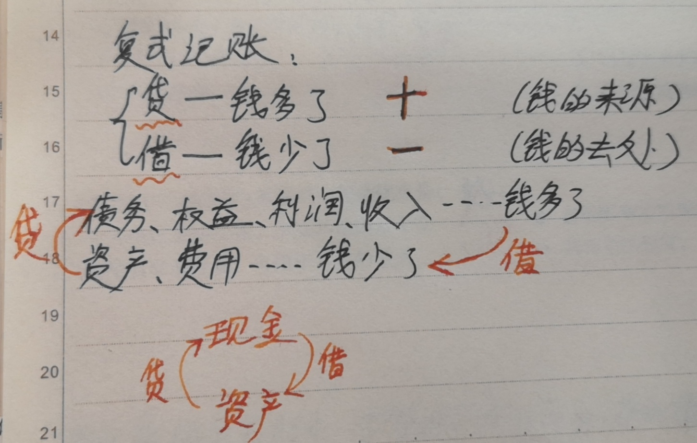

# 复式记账法之「借」、「贷」

---
title: 复式记账法之「借」、「贷」
authors: Ethan Lin
year:
tags:
  - 日期/2022-12-31 
  - 类型/笔记 
  - 类型/转载 
  - 内容/记账 
  - 内容/会计 
  - 学科/经济学 
  - 学科/管理学
---

复式记账法之「借」、「贷」无关字面意义，是单纯的记账符号。也可以代替以「甲」、「乙」等。

作为借贷记账法的记账符号的「借」表示资金运动的去向、用途、现有状态、驻点状态，而作为借贷记账法的记账符号的「贷」表示资金运动的来源、原有状态、起点状态。

哪些账户计入借贷方呢？

资产、成本费用的增加，导致现金的流出，记入借方，反之记入贷方；负债、所有者权益和收入的增加，导致现金的流入，记入贷方，反之记入借方。

换句话说：

对于「负债」、「所有者权益」、「收入」、「利润」的账本，「借」代表减少，「贷」代表增加；对于「资产」、「费用」的账本，「借」代表增加，「贷」代表减少。

> 收录一个评论里之笔记：
>
> 
>
> 
>

> 来源：
> [正确理解会计中的“借贷记账法” - 知乎](https://zhuanlan.zhihu.com/p/35030305#:~:text=资产、成本费用的,，反之记入借方%E3%80%82)

# 资源

[[科普贴：最通俗地说清楚「复式记账法」]]