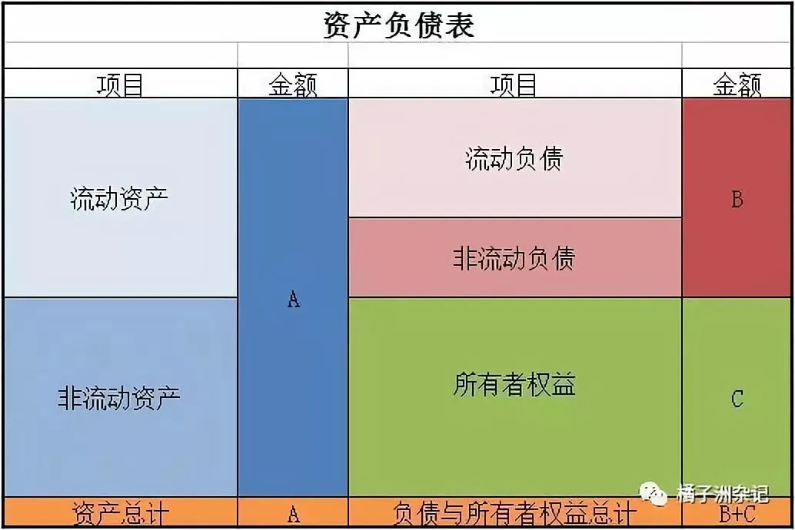
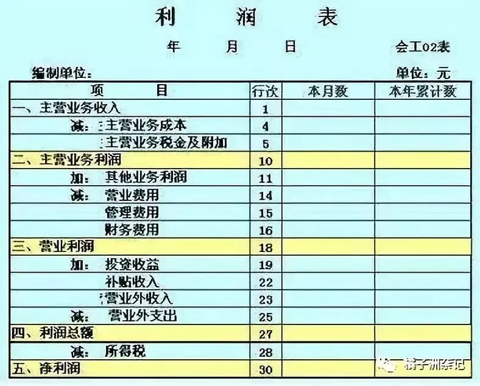
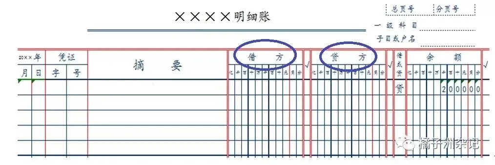
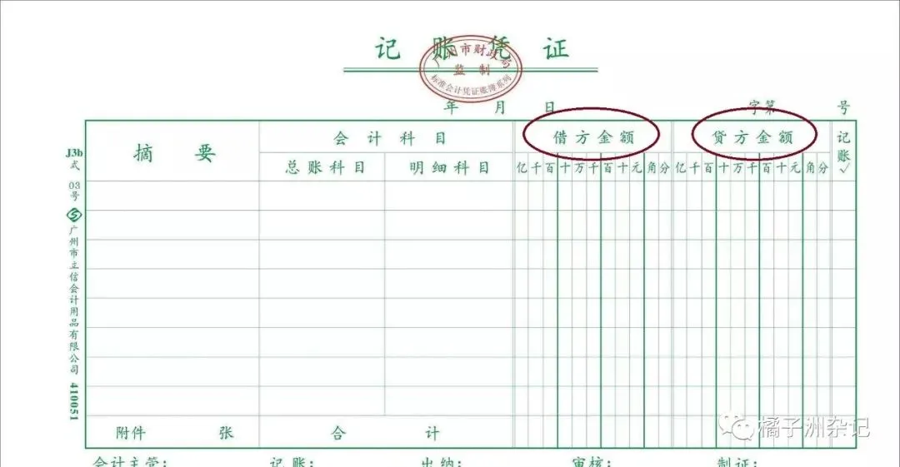

# 科普贴：最通俗地说清楚「复式记账法」

tags: #日期/2022-12-31 #类型/笔记 #类型/转载 #内容/记账 #内容/会计 #学科/经济学 #学科/管理学

**“复式记账法”**，又叫“借贷记账法”，是目前世界大部分国家（包括中国）的通用记账方法，是会计的入门基本功。举个复式记账法的典型例子：

**借：**固定资产 8000

**贷：**银行存款 8000

广大吃瓜群众了解一点“复式记账法”，对管理自身经济事项是大有好处的。不过，目前解释“复式记账法”的文章，要么故弄玄虚故作高深，要么照搬教科书废话连篇，相当的不人性化。本文就是要用最通俗的语言，把这个“复式记账法”说透，让大家觉得“会计核算也不过尔尔”。

**一、记账就记账，为啥要“复式”**

有些精细的童鞋喜欢记账，甚至坚持用手机记账软件。比如：今天发了8000元工资，心情大好，记上！明天买本书花80，本子上记上“—80”；后天买个手机花2000，记上“—2000”……月底再结余。就像这样式儿的——

**6月1日** **＋8000元** **（工资）**

**6月2日** **—80元** **（买书）**

**6月3日** **—2000元** **（买手机）**

**……**

这种记账方式俗称“流水账”，日常应用无可厚非，但最大的问题是：只设置了关于“钱”（存款、现金等）的“账”，至于用钱买了啥，买的东西值多少钱，以后会不会贬值……等等，并没有设置“账”去记录。毕竟，作为普通消费者，只要东西买到了手，一般就不再关心这东西的市场价是多少，反正我用着顺手就好。（房地产、金银饰品等是个例外，因为这些东西具有投资属性，很可能进入二手流通市场。）

但是，**上面说的“流水账”，并不能满足企业赚钱的需要。**为什么？因为企业不仅关心今天账上剩多少存款，更关心昨天“进的货”是多少钱买的、能卖多少钱、卖了之后能赚多少。**这就必须对“进的货”再设置一本账。在这本账上，不仅要记录“进的货”的规格、数量，更要记录“进的货”是多少钱买的。**

好，总结一下，现在“进货”这个事需要用**两个账本**了。第一本账，记录“钱”是怎么花出去的；第二本账，记录“货”是怎么买进来的。**像这种一件事要登记在两个账本（甚至更多账本）上的记账方法，就叫做“复式记账法”。**

**举个栗子：**刷卡买了一部手机，花了2000元——①在“银行存款”账本上记上：减少2000元；②在“存货”账本上记上：手机，增加2000元。

说点稍微学理的：企业的目的是营利，而企业的钱必须流动起来，形成循环，才能营利。如果钱长期沉淀，比如“进的货”长期积压卖不出去，企业很快就会陷入困境。因此，必须要用复式记账法，记清楚“钱”的来龙去脉，从而监督企业经营。

**二、需要设置哪些账**

企业的日常业务名目繁多，买东西、卖货、付工资、交税……等等，这些业务需要设置五花八门的账，最常见的例如：银行存款、存货、应收账款、短期借款、股本、管理费用等等。不用慌，这些账其实基本可以分为两大类：①关于“企业拿什么来赚钱”的账。②关于“企业怎么实现赚钱”的账。

**“企业拿什么来赚钱”的账，**记载的是企业赚钱的物质基础。分3个部分：股东投入的钱、企业借的钱，以及用“钱”购买的资产。（会计术语依次为：所有者权益、负债、资产，这些账最终汇总成“资产负债表”。）

**“企业怎么实现赚钱”的账，**记载的是企业赚钱的具体活动。也分3个部分：卖货得到的钱、投入的本钱、利润。（会计术语依次为：收入、费用、利润，这些账最终汇总成“利润表”。）

所有复式记账法的账本结构都是一样一样的：分成两列，一列记载金额的增加，一列记载金额的减少。企业只要有业务活动，分别计在两个账本（甚至更多账本）上即可。年终的时候，把这些账本汇总，就形成了我们常说的**“资产负债表”**、**“利润表”**。稍加分析计算，就可以得出**“现金流量表”**、**“所有者权益变动表”**，再加上个文字说明（**“附注”**），一个年度财务报告就做成了，叫做**“四表一注”**。

（插一句题外话，现在很多上市公司的年报喜欢弄得花里胡哨，用大量文字描述“企业愿景”、“公司文化”等虚头巴脑的玩意，企业经营的核心“四表”却可怜地藏在年报最后，散户投资者也很少关注。）

**三、记账工具：会计分录**

现在各类账本都准备好了，具体怎么记录各种业务活动呢？表担心，复式记账法的伟大发明者们已经设计了一整套精巧的记账方法，保证记账清晰，不出错误。这就是记账工具：**“会计分录”**；以及记账原则：**“有借必有贷，借贷必相等”**。

**借和贷**

前边说了，账本都分成两列，一列记载金额的增加，一列记载金额的减少。借贷记账法规定，左边的列，叫做**“借”**（*英文：Debit*）；右边的列，叫做**“贷”**（*英文：Credit*）。

别误会，这里的“借”、“贷”，真的真的纯粹就是个记账符号，跟它的汉语意思没一点关系。你换成“A”、“B”，或者“甲”、“乙”，实际上都是可以的。那么“借”代表金额的增加，“贷”代表金额的减少？

**不完全对。**

复式记账法之所以伟大，就是因为它深刻洞察了经济业务的实质，做出了如下规定：

**对于“负债”、“所有者权益”、“收入”、“利润”的账本，“借”代表减少，“贷”代表增加；**

**对于“资产”、“费用”的账本，“借”代表增加，“贷”代表减少。**

为什么这样规定？背后的会计原理比较复杂，在此不赘述。简单说，就是“负债”、“所有者权益”、“收入”“利润”具有同样的本质，都是指**“钱从哪来”**；“资产”、“费用”也具有同样的本质，都是指**“钱花到哪里去”**。来来去去，利润出焉。

也只有这么规定，记账时才能实现“有借必有贷，借贷必相等”，从而确保记账不出错误，总账户最终实现借贷平衡。通过审查是否平衡，也能反向证明记账是否有误。

电视剧里（现实里），经常有违法乱纪分子带着意味深长的微笑说道：“没关系，账已经做平了。”实际上，就是用一些假发票、假欠条等道具，虚构业务活动，让账本实现表面的借贷平衡，蒙骗大众和监管者。

**会计分录**

为了辅助记账，复式记账法设计了一个记账工具：“会计分录”。学习不同经济业务的“会计分录”，是会计专业的主要研习内容。**实践中，会计分录记载在“记账凭证”上**。

发生一项经济业务，应该计入哪两个（或者多个）账本？计入借方还是贷方？通过“会计分录”能看的一清二楚。**还是举买手机的栗子：**刷卡买了一部手机，花了2000元——①在“银行存款”账本上记上：减少2000元；②在“存货”账本上记上：手机，增加2000元。“会计分录”是：

**借：**存货——手机 2000

**贷：**银行存款 2000

注意，这里的借方、贷方的金额是完全相等的。这实质上是从一种资产（银行存款）转换成另一种资产（手机），依然是“企业拿什么来赚钱”的范畴。

**哪天我要是把手机卖掉呢？**假设卖了2500，赚了500，银行账户立即收到款项（不考虑税收问题）。这已经进入了“企业怎么实现赚钱”的范畴，需要开启新的账本：“主营业务收入”、“主营业务成本”。

**首先，**把“存货”账本上的“手机”冲销掉（贷：存货——手机），同时增加“主营业务成本”（借：主营业务成本）。注意，企业开始准备赚钱了！会计分录：

**借：**主营业务成本 2000

**贷：**存货——手机 2000

**其次，**增加营业收入（贷：主营业务收入），同时增加“银行存款”（借：银行存款）。

**借：**银行存款 2500

**贷：**主营业务收入 2500

“主营业务成本”和“主营业务成本”的差额500元，就是营业利润。

**再扩展一下，如果考虑缴纳增值税呢？**假设增值税税率是13%，需要缴纳2500×13%=325元的税。那么，总共向买家收取2500+325=2825元。这就要设置一个新的账本：“应交税费——应交增值税”（应交，指的是“应”向税务局“交”）。一方面，增加银行存款325元（借：银行存款）；另一方面，增加“应交税费——应交增值税”325元（贷：应交税费——应交增值税）。会计分录变成了：

**借：**银行存款 2825

**贷：**主营业务收入 2500

应交税费——应交增值税 325

**看，账做平了。**

> 来源：
> [科普贴：最通俗地说清楚“复式记账法” - 知乎](https://zhuanlan.zhihu.com/p/63822047)