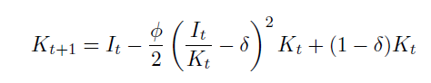
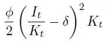
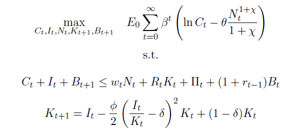
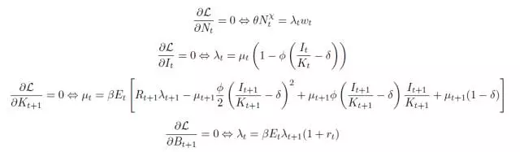
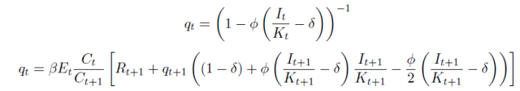
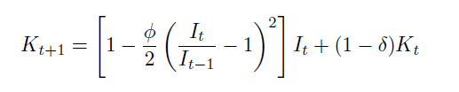
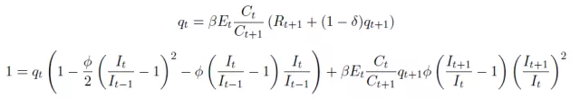

#类型/教程

#知识 

#资料 

#来源/转载

[[宏观经济]]

[[DSGE]]

[[DSGE宏观经济理论]]

许文立  武汉大学经济与管理学院  xuweny87@163.com

DSGE的模块化可以使得建模变成像肯德基一样的标准化程序——目标函数+约束条件的建模。

前面，我们呈现了不可分劳动，不可分偏好，这都是在家庭的效用函数中进行变化，也就是变化目标函数。那么，其它的模块呢？今天就来看看约束条件的变化。

回忆一下标准RBC中，资本演化方程

Kt+1=It+（1-delta）Kt

这就意味着资本品相对于消费的价格为1，下面会看到就是Hayashi'q=1。

此外，标准RBC并不能产生“驼峰”型脉冲响应。

这次和下次，我们改变上述资本演化方程，引入调整资本存量的成本，即是说相对于正常水平，调整资本或者投资都会产生一定的成本。

今天先给大家呈现“资本调整成本”，即按照Hayashi（1982）的设置。此时，资本积累方程变为

也就是在标准形式的资本积累方程中加入了一项成本：

FI是参数，平方项是调整率，Kt可以理解成以资本为单位，这也就是为什么要叫“资本调整成本”的原因，大家可以记着这点，下次我们呈现“投资调整成本”的时候来进行对比。

当FI=0时，“资本调整成本”也为0，这就变成了标准形式。如果FI>0，那么，偏离稳态（稳态中，It/Kt=delta）的投资调整就会产生成本。这也可以理解成，使得资本折旧更快，因为当吧Kt提出来，合并折旧率时，新折旧率会更大，有兴趣的人可以去试试。

需要注意的是，（1）成本项是以资本为单位，顾名思义“资本调整成本”；

（2）投资和资本调整具有对称性，虽然叫“资本调整成本”，但是一旦投资少了，偏离稳态，还是会产生以资本定价的成本。

偏好还是标准设置。家庭问题是

拉格朗日算式为

FOC

由上面的一阶条件可以看出，miu是资本安装的边际效用；lamda是消费的边际效用。

定义qt=miu/lamda，经济含义就是，你要获得额外一单位未来资本，要放弃的消费。也就是资本相对于消费的价格，大家可以看看最前面提到的q。

再回忆一下，调整参数FI=0，就是标准的资本积累方程，此时，资本相对于消费的价格为1，把FI=0代入投资的FOC，得到lamda=miu，因此，q=1。如果FI不等于0时，q就不等于零，这就是“资本调整成本”设定的结果。那么，我们把FOC变成

第一个表达式意味着，投资与资本比率 I/K是q的增函数，只要I/K大于折旧率，q肯定大于1；

第二个表达式说明，当期的q是未来资本边际产出、未来调整成本、以及未来q的贴现值。

可以预期到，Fi越大，资本调整成本越大，面对生产率冲击，投资jump更小，此时，消费就jump更多。还有一种解释就是，Fi越大，q就jump越大，这就意味着资本相对于消费的价格jump也越高。

还有一点需要注意的是，Fi不等于0，打破了实际利率与资本边际产出之间的紧密联系。

下一次，我们来看看CEE（2005）（也可以参考我们之前推送的[重读经典(10):名义粘性与货币政策冲击的动态效应(CEE,2005)](http://mp.weixin.qq.com/s?__biz=MzAwODY5MDA3NA==&mid=2455726777&idx=1&sn=36dc032d487e17e638a7259d3e345ed0&chksm=8cc0ca4cbbb7435a2d15c2b585dc390132d41ecc962350320d253e230ee51fc55722a09a74b9&scene=21#wechat_redirect)）的“投资调整成本”。

第十八讲中，我们给出了Hayashi（1982）的资本调整成本设定。今天就向大家介绍另一种——CEE（2005）的投资调整成本。有兴趣的同仁可以去看看[重读经典(10):名义粘性与货币政策冲击的动态效应(CEE,2005)](http://mp.weixin.qq.com/s?__biz=MzAwODY5MDA3NA==&mid=2455726777&idx=1&sn=36dc032d487e17e638a7259d3e345ed0&chksm=8cc0ca4cbbb7435a2d15c2b585dc390132d41ecc962350320d253e230ee51fc55722a09a74b9&scene=21#wechat_redirect)的设定：（1）与资本调整成本不同，投资调整成本以投资为度量衡；（2）调整成本并不依赖于投资与资本存量的相对比率，而依赖于投资增长率。

投资调整成本的形式为

在上述资本积累方程中，与Hayashi（1982）的形式不同在于平方项，大家可以去对比一下。在Hayashi形式中，稳态时***It/Kt=delta\***,而在CEE形式中，***It/It+1=1\***，此时，变为标准RBC中的资本积累方程。由上式可知，调整成本依赖于投资增长率，而不是投资与资本的相对水平。

其他设定不变，那么家庭问题就为

一阶条件为

与Hayashi*1982的形式一样，定义qt=miu/lamda，那么，上述FOC变为

此时，lamda=1/C，且与Hayashi相比，资本的FOC变得更简单，I的FOC变得更复杂，且q是资本租赁价格的贴现值

与Hayasi类似，调整成本参数Fi越大，q变化越大，K积累越缓慢。

但是，在投资调整成本的设定下，投资和产出都呈现出“驼峰型”脉冲响应。这就意味着投资和产出的增长率都是自相关的。就这一点来说，标准的RBC是无法实现的

这是因为投资增长率是凸成本形式。

这种形式下，最值得注意的是，实际利率的响应。存在投资调整成本的情况下，面对正的生产率冲击，实际利率下降而不是上升。与Hayashi一样，这种调整成本也打破了实际利率与资本边际产出之间的紧密联系，而且投资调整成本比资本调整成本更甚。

在DSGE建模中，投资调整成本比资本调整成本使用得更多，可能是因为它能产生“驼峰型”响应（由于凸成本形式）以及打破了实际利率的顺周期性结论。

下一讲，给出‘可变资本利用’设定。