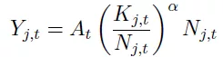

#类型/教程

#知识 

#资料 

#来源/转载

[[宏观经济]]

[[DSGE]]

[[DSGE宏观经济理论]]

许文立，xuweny87@163.com

在前面的内容中，我们呈现的是完全竞争条件。但是完全竞争与现实经济结构并不相符。因此，DSGE中也可以引入不完全竞争。Blanchard et al.（1987）将Dixit and Stigliz（1977）的产品加总形式引入新凯恩斯模型中。

这种设定形式把生产部门划分成两个部门——最终产品部门和中间产品部门。最终产品部门处于完全竞争市场中，因此，我们还是将其设定为代表性厂商，但是它并不使用劳动和资本等生产要素，而是利用中间产品来组合成单一的最终产品。中间产品厂商使用劳动和资本来生产产品，因此，它们处在垄断竞争的市场环境中。中间产品厂商有很多，且生产有差别的中间产品（**注：垄断竞争的厂商的数量有无穷多个，这一点尤其重要，下一期，我们引入寡头竞争市场结构的时候，再来回顾这个就会发现其特殊性**）。假设中间厂商标准化为单位区间上的连续统（注：这一点在后面也会提到，后面再来论述这个假设的好处。）。其他设定与前面的标准RBC一样。因此，我们可以看到，不完全竞争结构是中间产品厂商面临的市场环境。

***1、最终产品厂商***

生产最终产品的代表性生产商以中间产品为要素，本文采用Dixit和Stigliz（1977）综合函数形式

其中，Y_t为最终产品产量，Y_it为第i个中间产品厂商生产的中间产品产量，phi为中间产品的替代弹性。积分可以理解为求和。当phi趋向于无穷的时候，上式变成线性形式；当phi趋向于0的时候，就是列昂惕夫形式；当phi=1时，就是CD形式。具体可以参见[DSGE建模与编程入门(2):厂商理论](http://mp.weixin.qq.com/s?__biz=MzAwODY5MDA3NA==&mid=2455725487&idx=1&sn=5a3cde8d9109c817a07f27e8ca55b33a&scene=21#wechat_redirect)。Zhang（2008）测算了中国的产品替代弹性为6，这一结果也被许多DSGE文献引用。

最终产品在产品市场中被居民消费，且处于完全竞争环境中，在给定所有中间产品价格*P_it*和最终产品价格*P_t*的情况下，那么，在生产函数（14）的约束下，最终产品生产者面对的最大化问题为

将公式（14）代入公式（15），得到

对Y_it求导，得到

对于两种类型中间厂商i和j，上式两边相除，得到

因此，

两边取积分，得到

均衡中，企业的零利润意味着，，那么

因此，最终产品厂商的投入需求函数为

公式（16）是最终产品厂商对中间产品i的需求函数，且需求函数向右下方倾斜，即Dixit-Stigliz需求函数，随着产品价格的上升，产品的需求量下降。从公式（16）也可以看出，随着经济总产量的上升，中间产品需求也上升。

为了求解出一般价格，我们再次利用零利润条件，结合公式（14）和（16），得到

由上式可得到，产品市场中的一般价格水平为

***2、中间产品厂商\***

中间产品厂商使用劳动和资本来生产有差异的中间产品。采用标准的CD生产技术

所有中间厂商的劳动和资本之和分布等于总劳动和总资本。

所有的中间厂商都面对相同的资本租赁价格和劳动价格。因为中间厂商的产品具有差异，因此具有一定的市场力量，可以设定中间产品价格。那么，中间厂商面对的问题如下：

其中，phi=v,都是中间产品替代弹性。构建拉格朗日算式

那么，FOC为

化简上述FOC，得到

最后，化简可以得到

其中，，是边际成本。上式表明，中间厂商的最优定价为在边际成本的基础上增加一个**价格加成(markup)**:。由此，可以看出，垄断竞争条件下，产品价格会高于其边际成本。而且产品替代弹性越小，价格加成越高。

将这个条件代入劳动和资本的一阶条件中，得到实际工资和实际租赁价格：

因为，(v-1)/v<1，所以要素的实际价格都比它们的边际产出要小。这就是使得中间产品厂商拥有了经济利润。

下面，我们用劳动和资本的FOC消掉***lamda\***

最后一个条件表明，所有的中间厂商都会以相同的比率来雇佣劳动和资本。由此，得到

因为，所有的中间厂商面对相同的资本劳动比率，所以所有的中间厂商都有相同的边际成本。那么，根据上面的最优定价，所有的中间厂商都会设定相同的中间产品价格，那么，总的价格水平为

***P_t=P_jt\***，对所有的j都成立

也就是说，所有的中间产品价格都等于最终产品价格。那么，根据需求函数，所有的中间厂商都会生产相同的产品数量

***Y_jt=Y_t\***

到此，可能有很多人觉得很奇怪，每个中间厂商怎么会与最终产品数量相同呢？大家回忆一下，我们前面假设中间厂商是单位区间上，也就是说，任何一个厂商的产出都等于总产出，也就是平均产出。那么，单一中间厂商的生产函数为

因为每个中间厂商面对中相同的资本劳动比率，且生产相同的产出，因此，每个产生也要雇佣相同的劳动和资本

***K_jt=K_t
\***

***N_jt=N_t\***

这就意味着，总生产函数能被当做与单个中间厂商的生产函数相同：

因为每个中间产品价格相同，都等于最终产品价格，因此，我们把价格标准化为1。那么，要素的需求函数为

通常，假设v是常数，也就是中间厂商会收取一个恒定的价格加成。

下一期，我们会内生化这个价格加成，也就是以寡头竞争的形式，来讨论不完全竞争市场结构。我们会发现一个更一般的形式。这也是这些模型吸引人的地方，也是让人兴奋的地方。