#类型/教程

#知识 

#资料 

#来源/转载

[[宏观经济]]

[[DSGE]]

[[DSGE方法]]

许文立，安徽大学经济学院/CIMERS，cimers_dsge@econmod.cn

引用格式如下：“***许文立等，2019，财政政策与经济周期——基于中等规模DSGE模型，CIMERS工作论文，No.0012.\***”

前面，我们已经向大家介绍RBC模型，以及各种形式的实际摩擦和名义摩擦，参见[DSGE建模与编程汇总](http://mp.weixin.qq.com/s?__biz=MzAwODY5MDA3NA==&mid=2455729030&idx=1&sn=254a8c1e359b242660dc9e405485fce3&chksm=8cc0d373bbb75a6502c892a49c84a71b6aa5caf6ff7eb6b415579ffdefcc9fc6f81d810387de&scene=21#wechat_redirect)。今天，我们把这些实际和名义摩擦都结合在一个模型——中等规模DSGE模型。今天讲解的这个模型是金融危机前，最流行的基准DSGE模型。模型主要扩展了CEE（2005，JPE)，SW(2007,AER)和Sims（2017），

% 模型的主要特征包括：

% （1）物资资本积累；

% （2）价格粘性，[DSGE建模与编程入门(27):价格粘性（一）](http://mp.weixin.qq.com/s?__biz=MzAwODY5MDA3NA==&mid=2455727683&idx=1&sn=4632d7323130ff10ac7e4e4653e8d60c&chksm=8cc0ceb6bbb747a0334b88e57e47b28edbb352e04330211682173869da10a55dc1b333b4fc35&scene=21#wechat_redirect)；

% （3）工资粘性；

% （4）价格和工资的指数化；

% （5）消费习惯，[DSGE建模与编程入门(16)：习惯形成](http://mp.weixin.qq.com/s?__biz=MzAwODY5MDA3NA==&mid=2455726967&idx=1&sn=69b1da1cd83ea6b3bb52ffbf1faed70b&chksm=8cc0cb82bbb742942cbbed7e9c7f24c162c5564b17daa9a71b891c82c2643cc3a8acda018603&scene=21#wechat_redirect)；

% （6）投资调整成本，[DSGE建模与编程入门(19)：投资调整成本CEE，2005](http://mp.weixin.qq.com/s?__biz=MzAwODY5MDA3NA==&mid=2455727081&idx=1&sn=cb4c5a716d3110ec6c51504437426a76&chksm=8cc0cb1cbbb7420abc44e77b3515dd3956df485e2c5d62d6466671c358030d664cb5f3c955d4&scene=21#wechat_redirect)；

% （7）可变资本利用程度，[DSGE建模与编程入门(20):可变资本利用](http://mp.weixin.qq.com/s?__biz=MzAwODY5MDA3NA==&mid=2455727123&idx=1&sn=652177dc2800ce00202329f90e83445f&chksm=8cc0cce6bbb745f02eaa6acfe17f637fa9b7409630135f504ed41a4ea74b17957e0c56ee280d&scene=21#wechat_redirect)；

% （8）固定生产成本；

% （9）泰勒规则型货币政策；

% （10）四种财政政策，[DSGE建模与编程入门(30)：最优财政政策](http://mp.weixin.qq.com/s?__biz=MzAwODY5MDA3NA==&mid=2455727820&idx=1&sn=15ec94de699bd4484a6c400ac0cbfe76&chksm=8cc0ce39bbb7472f44461e89c5d23300e9ac0808bb683b5513db0d7379a36d0b01a8484a8a52&scene=21#wechat_redirect)：

%   （a）顺周期性财政支出政策；

%   （b）增值税；

%   （c）累进劳动所得税；

%   （d）累进资本所得税；

% （11）九种冲击：

%   （a）财政支出政策冲击；

%   （b）增值税冲击；

%   （c）劳动所得税冲击；

%   （d）资本所得税冲击；

%   （e）货币政策冲击；

%   （f）生产率冲击；

%   （g）投资的边际效率冲击；

%   （h）跨期偏好冲击；

%   （i）期内偏好冲击（劳动供给冲击）；

1、工会

连续统的家庭供给有差异的劳动Nt(l)，这些劳动力组成工会，工会利用Nt(l)来“整合”成同质的劳动Ndt，然后作为企业的劳动投入。即，工会的“合成”函数为

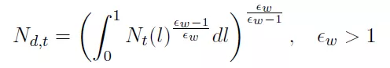

epsilon_w是有差别的劳动之间的替代率。由此，可以得到家庭l的劳动需求函数

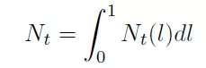

总的工资为

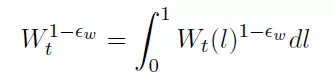

家庭供给的总劳动为

将l家庭的劳动需求函数带入上式，得到

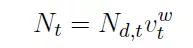

其中，v^w表示工资粘性扩散指数

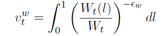

2、家庭

家庭可以供给有差别的劳动，因此，其工资也存在差异。家庭拥有资本，然后选择资本利用程度，将产生的资本服务租借给企业进行生产。家庭的跨期贴现效用为

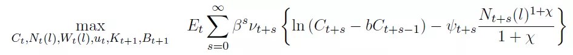

vt是跨期偏好冲击，psi_t是期内偏好（劳动供给）冲击。

家庭的预算约束为

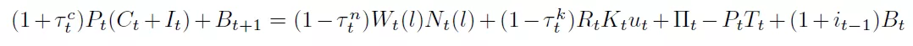

其中，tauc是增值税率，taun是劳动所得税率，tauk是资本所得税率，u为资本利用程度，其它变量与以前的相同。

除此之外，家庭的资本积累方程、劳动需求函数以及资本利用程度分别为

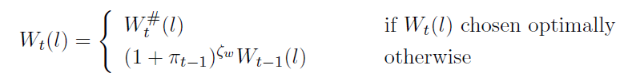

与以前讲解的NK模型不同，我们分成两步来求解家庭的最优决策：

***第一步，我们首先来求解出最优工资设定以外的其它最优决策：***

构建拉格朗日算式

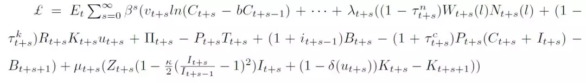

对消费C、债券持有、资本利用率、投资和资本积累求导，得到家庭的一阶条件

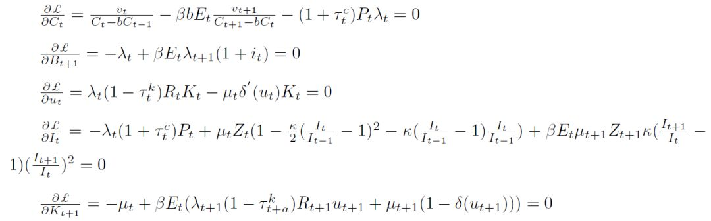

注意：上面的拉格朗日算式，我们忽略了家庭的工资设定决策。

**第二步，我们来看看家庭关于工资设定的最优决策。**

家庭对工资的设定也采用Calvo定价方式，即随机选择一部分家庭来调整其工资水平，假设比例为1-phi_w，那么，剩余的phi_w比例的家庭不能调整工资。但是，由于经济中存在通货膨胀，因此，我们还是假设不能调整工资的家庭也会以速率zeta_w来根据上一期的通胀率升级工资，也就是说，家庭l在时期t的名义工资为

经过数学变换，我们可以得到在时期t+s，非调整工资为

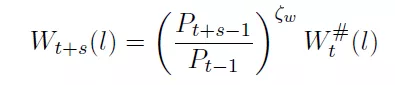

然后，我们可以构建关于家庭工资设定的拉格朗日算式

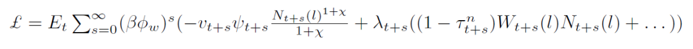

我们将l家庭的劳动需求函数和工资方程带入上述拉格朗日算式，解出家庭的最优工资方程

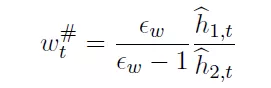

其中

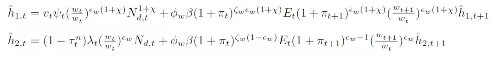

3、最终产品企业

最终产品生产函数

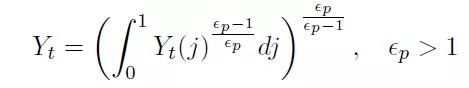

由此，可以得到中间产品的需求函数

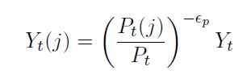

总价格水平为

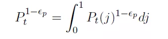

4、中间产品企业

中间产品生产函数采用CD形式

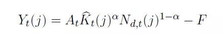

其中，F为固定成本。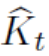表示家庭供给的资本服务，它是资本利用程度与资本存量的乘积，即

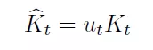

由此，我们可得到中间产品企业的最优要素需求

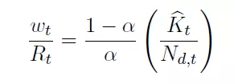

还可以得到企业的边际成本

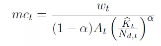

中间产品企业也按照Calvo定价来设定期最优价格。即每一期有部分企业1-phi_p可以调整价格至最优水平。剩余的企业都不能调整价格，但其可以速率zeta_p来根据上一期通胀率升级名义价格，即

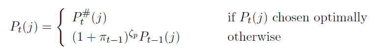

那么，总的通胀率为

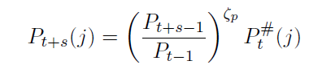

中间产品企业的最优定价策略的拉格朗日算式为

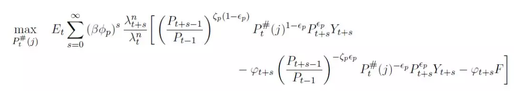

由此，解出中间产品企业的最优定价

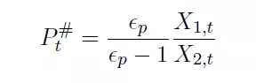

其中

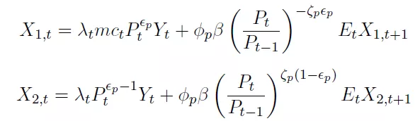

5、央行

央行按照泰勒规则来实施货币政策

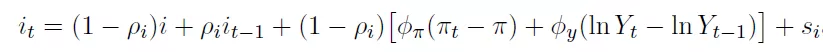

6、财政部门

政府支出政策

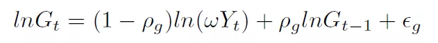

政府部门的收入来自于一次性总付税、债券、增值税、劳动所得税和资本所得税。因此，财政部门的预算约束为

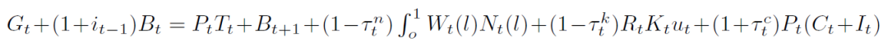

且财政部门还可以调整税率，它们也遵循AR(1)过程，劳动所得税和资本所得税还具有累进性。

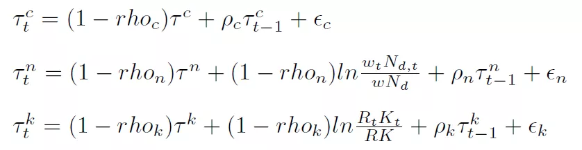

其它的外生冲击为

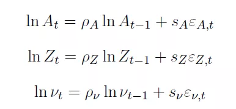

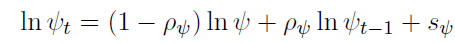

7、加总条件

（略）与往期推送的加总方法一致。

8、稳态

（略）详细的稳态求解过程，请参见请参见CIMERS的网站：“量化经济分析平台”——宏观模型模块。

9、结果

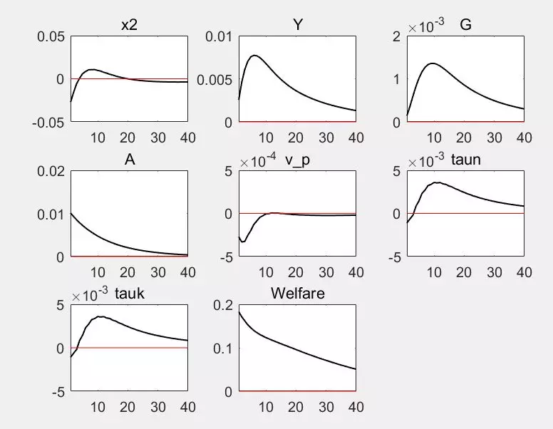

10、Dynare code

（略）请参见请参见CIMERS的网站：“量化经济分析平台”——宏观模型模块。

注：由于整个中等规模DSGE模型内容较多，关于模型设定，经济学含义，均衡条件推导，稳态值的计算过程，结果的解释——***完整PDF版本上传到CIMERS的网站：“量化经济分析平台”（www.econmod.cn）——宏观模型模块。***