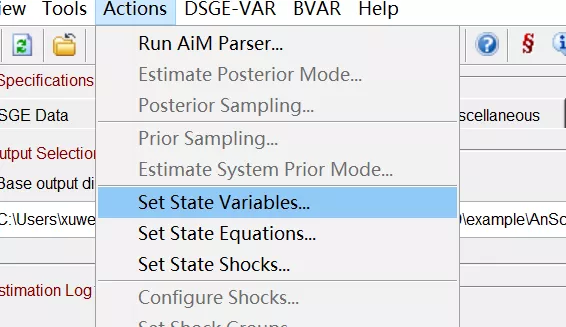
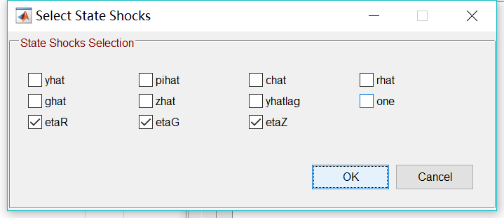

#类型/教程

#知识 

#资料 

#来源/转载

[[宏观经济]]

[[DSGE]]

[[DSGE编程]]

许文立，安徽大学经济学院/CIMERS，cimers_dsge@econmod.cn

祝大家新年快乐！

DSGE作为当今宏观经济学领域最主流的模型，其重要性不用再多说。但是，Matlab和Python等编程语言却让绝大部分国内学者和学生望而却步。为了消除这种非经济专业因素的障碍，已经有很多学者团队试图推出“傻瓜式”的菜单操作界面来执行DSGE模拟和估计。最著名的就是Wieland等开发的MMB（Macroeconomic Model Data Base，目前最新版本2.2.3，包含114个模型，多种货币政策规则，财政政策规则和自适应学习等）。有兴趣的人可以去看看，如果想“偷懒”的人，我们强烈推荐MMB，界面如图1所示。

图1 MMB GUI界面

其实，Dyanre团队也在开发Dynare GUI，如图2所示。只是目前还有很多Bugs。等到成熟之后，我们CIMERS也会第一时间推荐给大家，敬请关注！

图2 Dynare GUI界面

当然，Github上还有很多，除上述两种外，我个人还特别喜欢使用Python的DSGE GUI。但是，今天我们向大家推荐的DSGE GUI app不是MMB，Dynare GUI或者Python DSGE，而是一款更简易的DSGE估计的图形用户界面App——***YADA（Yet Another DSGE Application），如图3所示***。从这个名字就能看出来，这么接地气，老司机就是老司机。既然开发者都这么“随意”了，那我就将其***中文定名为“鸭蛋”吧\***！

图3 鸭蛋（YADA）界面

鸭蛋（YADA）是一款对DSGE和VAR模型进行贝叶斯估计和评价的图形用户界面应用。其开发者是欧洲央行的NAWM团队。其GUI界面非常干脆，如图3所示。

目前，鸭蛋（YADA）集成了9个模型，其模型数量不如MMB，功能肯定也没有Dynare那么强大（例如，参数mode的算法只有三种）。正如开发团队所说，其GUI算是优势之一，但我今天将其推荐给大家，主要是用于教学。说实在的，这款app并不适合做研究，但是对于学习DSGE和教学还是非常有用。9个模型分别为

| 1.   | An and Schorfheide (2007) |
| ---- | ------------------------- |
|      |                           |

| 2.   | Lubik and Schorfheide (2007) |
| ---- | ---------------------------- |
|      |                              |

| 3.   | Smets and Wouters (2007) |
| ---- | ------------------------ |
|      |                          |

| 4.   | Fagan, Lothian and McNelis (2013) |
| ---- | --------------------------------- |
|      |                                   |

| 5.   | Galí, Smets and Wouters (2012)、Smets, Warne and Wouters (2014) |
| ---- | ------------------------------------------------------------ |
|      |                                                              |

| 6.   | Del Negro and Schorfheide (2013) |
| ---- | -------------------------------- |
|      |                                  |

| 7.   | Small-scale version of the Smets and Wouters (2007) |
| ---- | --------------------------------------------------- |
|      |                                                     |

| 8.   | Herbst and Schorfheide (2016) |
| ---- | ----------------------------- |
|      |                               |

| 9.   | Leeper, Plante and Traum (2010) |
| ---- | ------------------------------- |
|      |                                 |

以SW为基准模型，扩展到了包含金融因素、开放经济、货币政策和财政政策等，它们不仅用于政策分析，还主要用于预测。因此，这款DSGE GUI app用于教学完全足够。更重要的是，其对于DSGE模型的贝叶斯估计和评价操作演示十分简单，下面就利用鸭蛋（YADA）官网上的AS（2007）例子来说明。

第一步，系统要求

Windows、Linux和Mac OS均可。其中，在Windows里，Matlab5.3及以后版本均可。例如，我使用的是Win 10，Matlab 2017b。

第二步，下载和配置鸭蛋（YADA）

去官网（http://texlips.net/yada/index.html）下载最新版本鸭蛋（YADA 4.60，2019年2月1号更新）。下载后，

（1）解压“鸭蛋（YADA 4.60）”，可以放在电脑硬盘的任何位置，例如：

（2）打开Matlab，将Matlab的工作路径设置到（1）中鸭蛋文件夹路径，例如

（3）在Matlab的命令窗口的光标处输入***YADA，***然后回车键，例如

（4）首次配置鸭蛋时，输入YADA之后，会弹出一个许可和免责条款的窗口，我们必须点击“接受”，然后就可以看到图3中的鸭蛋界面。例如

鸭蛋界面分为三大部分：

1. 菜单

   

1. 选项

   

1. 模型设置

   

第三步，配置完成后，我们就可以使用鸭蛋来“玩玩”DSGE的贝叶斯估计了。以An and Schorfheide (2007)为例：

1. 点击“选项”模块中的DSGE Data，然后配置“Observation Data”中的“Data construction file”，点击方框后面的“浏览”按钮，会出现

   

   选择“example”文件夹，打开该文件夹里的AnSchorfheide文件夹，选择**DataConstFile.m**文件

   

1. 配置“Observation Data”中的“ measurement equation file”，点击方框后面的“浏览”按钮，同样打开“example”文件夹，打开该文件夹里的AnSchorfheide文件夹，选择***\*MeasurementEqFile.m\****文件

1. 接下来，配置“Prior Distribution Data”中的“Marginal prior distribution specification file”，打开“example”文件夹，打开该文件夹里的AnSchorfheide文件夹，选择**AnSchorfheidePrior.wk1**文件

1. 接下来，配置“Parameter Data”中的“file with parameters to update”，打开“example”文件夹，打开该文件夹里的AnSchorfheide文件夹，选择**MoreASParameters.m**文件

1. 接下来，配置“DSGE Model Data”中的“AiM model file”，打开“example”文件夹，打开该文件夹里的AnSchorfheide文件夹，选择**AnSchorfheideModel.aim**文件

1. 点击“菜单”栏中的“run AiM parser”按钮

   

   

或者点击“菜单”中的“Actions”，选择“run AiM parser”

会弹出以下窗口，点击“OK”

7.点击“set state variables”

或者点击“菜单”中的“Actions”，选择“set state variables”

会弹出以下窗口，请确保以下7个变量前面打钩，点击“OK”

8.点击“set state shocks”

或者点击“菜单”中的“Actions”，选择“set state shocks”

会弹出以下窗口，请确保以下7个变量前面打钩，点击“OK”

9.点击“ estimate posterior mode”

 

或者点击“菜单”中的“Actions”，选择“estimate posterior mode”

***到此，我们就可以等着出结果了***！

估计结束后，我们可以在“选项”栏的“output”处看到详细的DSGE模型估计信息：

然后，我们还可以看到估计结果：

参数的后验mode估计图

还有后验模估计的详细信息：

