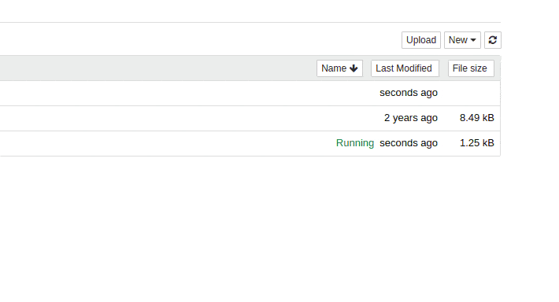

Jupyter Notebook Kernels: How to Add, Change, Remove/转载 

[来源网页](https://queirozf.com/entries/jupyter-kernels-how-to-add-change-remove)

## Jupyter Notebook Kernels: How to Add, Change, Remove

*Last updated:       02 Nov 2021*                                                                  

Table of Contents 

- [Add Virtualenv as Python Kernel](https://queirozf.com/entries/jupyter-kernels-how-to-add-change-remove#add-virtualenv-as-python-kernel)
- [Add Spark Kernel](https://queirozf.com/entries/jupyter-kernels-how-to-add-change-remove#add-spark-kernel)
- [Add Scala Kernel](https://queirozf.com/entries/jupyter-kernels-how-to-add-change-remove#add-scala-kernel)
- [List kernels](https://queirozf.com/entries/jupyter-kernels-how-to-add-change-remove#list-kernels)
- [Remove kernel](https://queirozf.com/entries/jupyter-kernels-how-to-add-change-remove#remove-kernel)
- [Change Kernel name](https://queirozf.com/entries/jupyter-kernels-how-to-add-change-remove#change-kernel-name)
- [Troubleshooting](https://queirozf.com/entries/jupyter-kernels-how-to-add-change-remove#troubleshooting)

> Examples were run on Ubuntu Linux

## Add Virtualenv as Python Kernel[ Permalink](https://queirozf.com/entries/jupyter-kernels-how-to-add-change-remove#add-virtualenv-as-python-kernel)

> Replace `your-venv` with your virtualenv name

- Activate the virtualenv

  ```
  $ source your-venv/bin/activate
  ```

- Install jupyter in the virtualenv

  ```
  (your-venv)$ pip install jupyter
  ```

- Add the virtualenv as a jupyter kernel

  ```
  (your-venv)$ ipython kernel install --name "local-venv" --user
  ```

- You can now select the created kernel `your-env` when you start Jupyter


## Add Spark Kernel[ Permalink](https://queirozf.com/entries/jupyter-kernels-how-to-add-change-remove#add-spark-kernel)

> **Prerequisites**: **Java** and a local [**Spark installation**](https://spark.apache.org/downloads.html)

To add **Spache Spark** Use a Jupyter plugin called **Apache Toree**.

Install the plugin into jupyter (replace Spark path with your installation directory):

```
$ pip install jupyter 
$ pip install --upgrade toree
$ jupyter toree install --user --spark_home=/home/felipe/Downloads/spark-2.4.3-bin-hadoop2.7
$ jupyter notebook
```


*Start jupyter with the toree plugin 
 and you'll be able to link jupyter to 
 an existing local spark installation*  


## Add Scala Kernel[ Permalink](https://queirozf.com/entries/jupyter-kernels-how-to-add-change-remove#add-scala-kernel)

> Updated 2021

**Example:** install Scala 2.12.11 kernel with almond version 0.10.0:

- **Download almond and scala libs**

  (coursier is a scala tool used to install almond)

  ```
  $ curl -Lo coursier https://git.io/coursier-cli && chmod +x coursier
  ```

  (replace scala and almond versions if you need to)

  ```
  $ ./coursier bootstrap \
      -r jitpack \
      -i user -I user:sh.almond:scala-kernel-api_2.12.11:0.10.0 \
      sh.almond:scala-kernel_2.12.11:0.10.0 \
      -o almond
  ```

- **Install Scala kernel in Jupyter**

  ```
  $ ./almond --install --id scala_2_12_11  --display-name "Scala 2.12.11"
  ```

- **Open Jupyter notebook and select Scala kernel**

  ```
  $ jupyter notebook
  ```


    *Create Scala notebooks just as you 
 would python ones*  


## List kernels[ Permalink](https://queirozf.com/entries/jupyter-kernels-how-to-add-change-remove#list-kernels)

Use `jupyter kernelspec list`

```
$ jupyter kernelspec list
Available kernels:
  global-tf-python-3    /home/felipe/.local/share/jupyter/kernels/global-tf-python-3
  local_venv2           /home/felipe/.local/share/jupyter/kernels/local_venv2
  python2               /home/felipe/.local/share/jupyter/kernels/python2
  python36              /home/felipe/.local/share/jupyter/kernels/python36
  scala                 /home/felipe/.local/share/jupyter/kernels/scala
```

## Remove kernel[ Permalink](https://queirozf.com/entries/jupyter-kernels-how-to-add-change-remove#remove-kernel)

Use `jupyter kernelspec remove <kernel-name>`

```
$ jupyter kernelspec remove old_kernel
Kernel specs to remove:
  old_kernel            /home/felipe/.local/share/jupyter/kernels/old_kernel
Remove 1 kernel specs [y/N]: y
[RemoveKernelSpec] Removed /home/felipe/.local/share/jupyter/kernels/old_kernel
```

## Change Kernel name[ Permalink](https://queirozf.com/entries/jupyter-kernels-how-to-add-change-remove#change-kernel-name)

- \1) Use `$ jupyter kernelspec list` to see the folder the kernel is located in
- \2) In that folder, open up file `kernel.json` and edit option `"display_name"` 


------

## Troubleshooting[ Permalink](https://queirozf.com/entries/jupyter-kernels-how-to-add-change-remove#troubleshooting)

### java.lang.NoClassDefFoundError: scala/App$class[ Permalink](https://queirozf.com/entries/jupyter-kernels-how-to-add-change-remove#java-lang-noclassdeffounderror-scala-app-class)

You are probably trying to run Spark 3.0+ on an older Toree version.

**Upgrade** Toree to 0.5 or 0.6+


