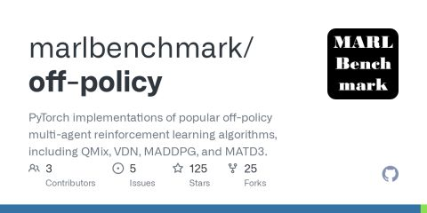
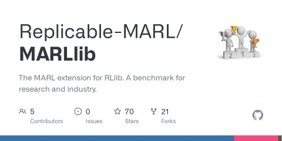

# 多智能体强化学习代码汇总

---
title: 多智能体强化学习代码汇总
authors: Ethan Lin
year:
tags:
  - 类型/转载 
  - 内容/多智能体强化学习 
  - 类型/资源 
---

> 来源：[多智能体强化学习代码汇总（pytorch） - 知乎](https://zhuanlan.zhihu.com/p/541151047)

前段时间忙着写各种材料，一直没时间做自己的课题，今天总算是可以开始看看多智能体的东西了。万分感谢之前给我推荐代码的各位老铁，我把大家推荐的代码都汇总在了这篇文章里。因为我自己还没有对这些代码进行过研究，所以暂时还没有办法给出我自己的评价，希望各位友友们能够在评论区多多交流呀~

------

下面这个表示MARLLib给出的各个MARL代码库的comparison，其中CP代表cooperative，CM代表competitive，MI代表mixed task learning modes；VD代表value decomposition，CC代表centralized critic，SP代表self-play，Comm代表communication-based learning。

| Benchmark       | Learning Mode | Available Env | Algorithm Type | Algorithm Number | Continues Control | Distributed Training | Framework                  |
| --------------- | ------------- | ------------- | -------------- | ---------------- | ----------------- | -------------------- | -------------------------- |
| PyMARL          | CP            | 1             | VD             | 5                |                   |                      | *                          |
| PyMARL2         | CP            | 1             | VD             | 12               |                   |                      | PyMARL                     |
| MARL-Algorithms | CP            | 1             | VD+Comm        | 9                |                   |                      | *                          |
| EPyMARL         | CP            | 4             | IL+VD+CC       | 10               |                   |                      | PyMARL                     |
| Marlbenchmark   | CP+CL         | 4             | VD+CC          | 5                | ✔️                 |                      | pytorch-a2c-ppo-acktr-gail |
| MAlib           | SP            | 8             | SP             | 9                | ✔️                 |                      | *                          |
| MARLlib         | CP+CL+CM+MI   | 10            | IL+VD+CC       | 18               | ✔️                 | ✔️                    | Ray/RLlib                  |

1. starry-sky6688（758星）

据说这套代码简单易上手，适合初学者入门。包含IQL、QMIX、VDN、COMA、QTRAN、MAVEN、CommNet、DyMA-CL、G2ANet和MADDPG。

[GitHub - starry-sky6688/MARL-Algorithms: Implementations of IQL, QMIX, VDN, COMA, QTRAN, MAVEN, CommNet, DyMA-CL, and G2ANet on SMAC, the decentralised micromanagement scenario of StarCraft IIgithub.com/starry-sky6688/MARL-Algorithms](https://link.zhihu.com/?target=https%3A//github.com/starry-sky6688/MARL-Algorithms)

[GitHub - starry-sky6688/MADDPG: Pytorch implementation of the MARL algorithm, MADDPG, which correspondings to the paper "Multi-Agent Actor-Critic for Mixed Cooperative-Competitive Environments".github.com/starry-sky6688/MADDPG](https://link.zhihu.com/?target=https%3A//github.com/starry-sky6688/MADDPG)

\2. pymarl（1.2K星）

牛津大学whiteson组的代码库，我稍微看了两眼，非常模块化的代码，我猜应该是那种很好用但也很难上手的类型。包括QMIX、COMA、VDN、IQL、QTRAN。

[GitHub - oxwhirl/pymarl: Python Multi-Agent Reinforcement Learning frameworkgithub.com/oxwhirl/pymarl](https://link.zhihu.com/?target=https%3A//github.com/oxwhirl/pymarl)

\3. pymarl2（351星）

pymarl的改进版本？好像是增加了一些code-level tricks。

[Rethinking the Implementation Tricks and Monotonicity Constraint in Cooperative Multi-Agent Reinforcement Learningarxiv.org/abs/2102.03479](https://link.zhihu.com/?target=https%3A//arxiv.org/abs/2102.03479)

[GitHub - hijkzzz/pymarl2: Fine-tuned MARL algorithms on SMAC (100% win rates on most scenarios)github.com/hijkzzz/pymarl2](https://link.zhihu.com/?target=https%3A//github.com/hijkzzz/pymarl2)

\4. epymarl（139星）

epymarl的扩展版本，在pymarl的基础上增加了IA2C、IPPO、MADDPG、MAA2C、MAPPO。

[[2006.07869\] Benchmarking Multi-Agent Deep Reinforcement Learning Algorithms in Cooperative Tasks (arxiv.org)arxiv.org/abs/2006.07869](https://link.zhihu.com/?target=https%3A//arxiv.org/abs/2006.07869)

[GitHub - uoe-agents/epymarl: An extension of the PyMARL codebase that includes additional algorithms and environment supportgithub.com/uoe-agents/epymarl](https://link.zhihu.com/?target=https%3A//github.com/uoe-agents/epymarl)

\5. shariqiqbal2810（307星）

MAAC作者写的代码，稍微看了一下，好像也挺简洁的。包括MADDPG、MAAC。

[GitHub - shariqiqbal2810/maddpg-pytorch: PyTorch Implementation of MADDPG (Lowe et. al. 2017)github.com/shariqiqbal2810/maddpg-pytorch](https://link.zhihu.com/?target=https%3A//github.com/shariqiqbal2810/maddpg-pytorch)

[GitHub - shariqiqbal2810/MAAC: Code for "Actor-Attention-Critic for Multi-Agent Reinforcement Learning" ICML 2019github.com/shariqiqbal2810/MAAC](https://link.zhihu.com/?target=https%3A//github.com/shariqiqbal2810/MAAC)

\6. marlbenchmark（509星/102星）

清华大学的代码库，包含MAPPO、QMIX、VDN、MADDPG和MATD3，其中VDN和MATD3没有经过完整测试。

[GitHub - marlbenchmark/on-policy: This is the official implementation of Multi-Agent PPO (MAPPO).github.com/marlbenchmark/on-policy](https://link.zhihu.com/?target=https%3A//github.com/marlbenchmark/on-policy)

[GitHub - marlbenchmark/off-policy: PyTorch implementations of popular off-policy multi-agent reinforcement learning algorithms, including QMix, VDN, MADDPG, and MATD3.github.com/marlbenchmark/off-policy](https://link.zhihu.com/?target=https%3A//github.com/marlbenchmark/off-policy)

\7. marllib（70星）

一个涵盖了大多主流MARL算法的代码库，基于ray的rllib，也是属于那种模块化做得特别好，但上手需要花些时间的代码，包含independence learning (IQL, A2C, DDPG, TRPO, PPO), centralized critic learning (COMA, MADDPG, MAPPO, HATRPO), and value decomposition (QMIX, VDN, FACMAC, VDA2C)。

[GitHub - Replicable-MARL/MARLlib: The MARL extension for RLlib. A benchmark for research and industry.github.com/Replicable-MARL/MARLlib](https://link.zhihu.com/?target=https%3A//github.com/Replicable-MARL/MARLlib)

编辑于 2022-07-14 20:50
