# 浅谈人工智能：现状、任务、构架与统一 | 正本清源

Original 朱松纯 视觉求索 *2017-11-02 12:59*

朱松纯  加州大学洛杉矶分校UCLA

统计学和计算机科学教授

视觉、认知、学习与自主机器人中心主任

VCLA@UCLA

 

2017年11月02日 刊登于 《视觉求索》微信公众号

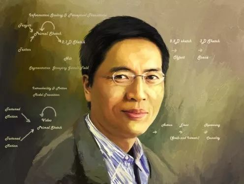

**目录**

 

引言

 

第一节  现状：正视现实

第二节  未来：一只乌鸦给我们的启示

第三节  历史：从“春秋五霸”到“战国六雄”

第四节  统一：“小数据、大任务”范式与认知构架

第五节  学科一：计算视觉 --- 从“深”到“暗”

第六节  学科二：认知推理 --- 走进内心世界

第七节  学科三：语言通讯 --- 沟通的认知基础

第八节  学科四：博弈伦理 --- 获取、共享人类的价值观

第九节  学科五：机器人学 --- 构建大任务平台

第十节  学科六：机器学习 --- 学习的终极极限与“停机问题”

第十一节 总结： 智能科学 --- 牛顿与达尔文的统一

 

 

附录  中科院自动化所报告会上的问答与互动摘录

鸣谢

 

**引言**

 

“人工智能”这个名词在沉寂了近30年之后，最近两年“咸鱼翻身”，成为了科技公司公关的战场、网络媒体吸睛的风口，随后受到政府的重视和投资界的追捧。于是，新闻发布会、高峰论坛接踵而来，政府战略规划出台，各种新闻应接不暇，宣告一个“智能为王”时代的到来。

 

到底什么是人工智能？现在的研究处于什么阶段？今后如何发展？这是大家普遍关注的问题。由于人工智能涵盖的学科和技术面非常广，要在短时间内全面认识、理解人工智能，别说非专业人士，就算对本行业研究人员，也是十分困难的任务。

 

所以，现在很多宣传与决策冲到认识之前了，由此不可避免地造成一些思想和舆论的混乱。

 

自从去年用了微信以来，我就常常收到亲朋好友转来的惊世骇俗的新闻标题。我发现很多议论缺乏科学依据，变成了“娱乐AI”。一个在1970年代研究黑洞的物理学博士，从来没有研究过人工智能，却时不时被抬出来预测人类末日的到来。某些公司的公关部门和媒体发挥想象力，动辄把一些无辜的研究人员封为“大师”、“泰斗”。最近，名词不够用了。九月初，就有报道把请来的一位美国教授称作“人工智能祖师爷”。这位教授的确是机器学习领域的一个领军人物，但人工智能是1956年开始的，这位教授也才刚刚出生。况且机器学习只是人工智能的一个领域而已，大部分其它重要领域，如视觉、语言、机器人，他都没有涉足，所以这样的封号很荒唐（申明一点：我对这位学者本人没有意见，估计他自己不一定知道这个封号）。当时我想，后面是不是有人会搬出“达摩老祖、佛祖如来、孔雀王、太上老君、玉皇大帝”这样的封号。十月初，赫然就听说达摩院成立了，宣称要碾压美国，舆情轰动！别说一般老百姓担心丢饭碗，就连一些业内的研究人员都被说得心慌了，来问我有什么看法。

 

我的看法很简单：大多数写报道和搞炒作宣传的人，基本不懂人工智能。这就像年轻人玩的传话游戏，扭曲的信息在多次传导过程中，逐级放大，最后传回来，自己吓到自己了。下面这个例子就说明公众的误解到了什么程度。今年9月我在车上听到一家电台讨论人工智能。两位主持人谈到硅谷脸书公司，有个程序员突然发现，两台电脑在通讯过程中发明了一种全新的语言，快速交流，人看不懂。眼看一种“超级智能”在几秒之内迅速迭代升级（我加一句：这似乎就像宇宙大爆炸的前几秒钟），程序员惊恐万状。人类现在只剩最后一招才能拯救自己了：“别愣着，赶紧拔电源啊！…”终于把人类从鬼门关又拉回来了。

 

回到本文的正题。全面认识人工智能之所以困难，是有客观原因的。

 

**其一、人工智能是一个非常广泛的领域**。当前人工智能涵盖很多大的学科，我把它们归纳为六个：

 （1）计算机视觉（暂且把模式识别，图像处理等问题归入其中）、

 （2）自然语言理解与交流（暂且把语音识别、合成归入其中，包括对话）、

 （3）认知与推理（包含各种物理和社会常识）、

 （4）机器人学（机械、控制、设计、运动规划、任务规划等）、

 （5）博弈与伦理（多代理人agents的交互、对抗与合作，机器人与社会融合等议题）。

 （6）机器学习（各种统计的建模、分析工具和计算的方法），

 

这些领域目前还比较散，目前它们正在交叉发展，走向统一的过程中。我把它们通俗称作“战国六雄”，中国历史本来是“战国七雄”，我这里为了省事，把两个小一点的领域：博弈与伦理合并了，伦理本身就是博弈的种种平衡态。最终目标是希望形成一个完整的科学体系，从目前闹哄哄的工程实践变成一门真正的科学Science of Intelligence。

 

由于学科比较分散，从事相关研究的大多数博士、教授等专业人员，往往也只是涉及以上某个学科，甚至长期专注于某个学科中的具体问题。比如，人脸识别是计算机视觉这个学科里面的一个很小的问题；深度学习属于机器学习这个学科的一个当红的流派。很多人现在把深度学习就等同于人工智能，就相当于把一个地级市说成全国，肯定不合适。读到这里，搞深度学习的同学一定不服气，或者很生气。你先别急，等读完后面的内容，你就会发现，不管CNN网络有多少层，还是很浅，涉及的任务还是很小。

 

各个领域的研究人员看人工智能，如果按照印度人的谚语可以叫做“盲人摸象”，但这显然是言语冒犯了，还是中国的文豪苏轼游庐山时说得有水准：

“横看成岭侧成峰，*远近高低各不同*。

  不识庐山真面目，只缘身在此山中。”

 

**其二，人工智能****发展的断代现象**。由于历史发展的原因，人工智能自1980年代以来，被分化出以上几大学科，相互独立发展，而且这些学科基本抛弃了之前30年以逻辑推理与启发式搜索为主的研究方法，取而代之的是概率统计（建模、学习）的方法。留在传统人工智能领域（逻辑推理、搜索博弈、专家系统等）而没有分流到以上分支学科的老一辈中，的确是有很多全局视野的，但多数已经过世或退休了。他们之中只有极少数人在80-90年代，以敏锐的眼光，过渡或者引领了概率统计与学习的方法，成为了学术领军人物。而新生代（80年代以后）留在传统人工智能学科的研究人员很少，他们又不是很了解那些被分化出去的学科中的具体问题。

 

这种领域的**分化**与历史的**断代**， 客观上造成了目前的学界和产业界思路和观点相当“混乱”的局面，媒体上的混乱就更放大了。但是，以积极的态度来看，这个局面确实为现在的年轻一代研究人员、研究生提供了一个很好的建功立业的机会和广阔的舞台。

 

鉴于这些现象，《视觉求索》编辑部同仁和同行多次催促我写一篇人工智能的评论和介绍材料。我就免为其难，仅以自己30年来读书和跨学科研究的经历、观察和思辨，浅谈什么是人工智能；它的研究现状、任务与构架；以及如何走向统一。

 

我写这篇文章的动机在于三点：

 （1）为在读的研究生们、为有志进入人工智能研究领域的年轻学者开阔视野。

 （2）为那些对人工智能感兴趣、喜欢思考的人们，做一个前沿的、综述性的介绍。

 （3）为公众与媒体从业人员，做一个人工智能科普，澄清一些事实。

 

**本文来历**： 本文技术内容选自我2014年来在多所大学和研究所做的讲座报告。2017年7月，微软的沈向洋博士要求我在一个朋友聚会上做一个人工智能的简介，我增加了一些通俗的内容。2017年9月，在谭铁牛和王蕴红老师的要求下，我参加了中科院自动化所举办的人工智能人机交互讲习班，他们派速记员和一名博士生整理出本文初稿。如果没有他们的热情帮助，这篇文章是不可能写成的。原讲座两个半小时，本文做了删减和文字修饰。仍然有四万字，加上大量插图和示例。很抱歉，无法再压缩了。

 

**本文摘要**：文章前四节浅显探讨什么是人工智能和当前所处的历史时期，后面六节分别探讨六个学科的重点研究问题和难点，有什么样的前沿的课题等待年轻人去探索，最后一节讨论人工智能是否以及如何成为一门成熟的科学体系。

 

诚如屈子所言：“路漫漫其修远兮，吾将上下而求索”。

 

**第一节 现状评估：正视现实**

 

人工智能的研究，简单来说，就是要通过智能的机器，延伸和增强（augment）人类在改造自然、治理社会的各项任务中的能力和效率，最终实现一个人与机器和谐共生共存的社会。这里说的智能机器，可以是一个虚拟的或者物理的机器人。与人类几千年来创造出来的各种工具和机器不同的是，智能机器有自主的感知、认知、决策、学习、执行和社会协作能力，符合人类情感、伦理与道德观念。 

 

抛开科幻的空想，谈几个近期具体的应用。无人驾驶大家听了很多，先说说军用。军队里的一个班或者行动组，现在比如要七个人，将来可以减到五个人，另外两个用机器来替换。其次，机器人可以用在救灾和一些危险的场景，如核泄露现场，人不能进去，必须靠机器人。医用的例子很多：智能的假肢或外骨架（exoskeleton）与人脑和身体信号对接，增强人的行动控制能力，帮助残疾人更好生活。此外，还有就是家庭养老等服务机器人等。

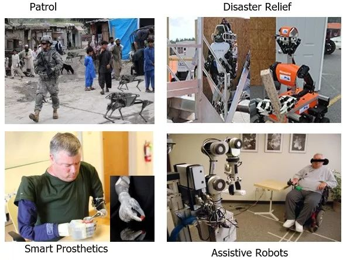但是，这方面的进展很不尽人意。以前日本常常炫耀他们机器人能跳舞，中国有一次春节晚会也拿来表演了。那都是事先编写的程序，结果一个福岛核辐射事故一下子把所有问题都暴露了，发现他们的机器人一点招都没有。美国也派了机器人过去，同样出了很多问题。比如一个简单的技术问题，机器人进到灾难现场，背后拖一根长长的电缆，要供电和传数据，结果电缆就被缠住了，动弹不得。有一次，一位同事在餐桌上半开玩笑说，以现在的技术，要让一个机器人长时间像人一样处理问题，可能要自带两个微型的核电站，一个发电驱动机械和计算设备，另一个发电驱动冷却系统。顺便说一个，人脑的功耗大约是10-25瓦。

 

看到这里，有人要问了，教授说得不对，我们明明在网上看到美国机器人让人叹为观止的表现。比如，这一家波士顿动力学公司（Boston Dynamics）的演示，它们的机器人，怎么踢都踢不倒呢，或者踢倒了可以自己爬起来，而且在野外丛林箭步如飞呢，还有几个负重的电驴、大狗也很酷。这家公司本来是由美国国防部支持开发出机器人来的，被谷歌收购之后、就不再承接国防项目。可是，谷歌发现除了烧钱，目前还找不到商业出路，最近一直待售之中。您会问，那谷歌不是很牛吗？DeepMind下围棋不是也一次次刺激中国人的神经吗？有一个逆天的机器人身体、一个逆天的机器人大脑，它们都在同一个公司内部，那为什么没有做出一个人工智能的产品呢？他们何尝不在夜以继日的奋战之中啊。

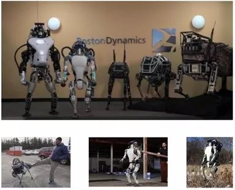 

人工智能炒作了这么长时间，您看看周围环境，您看到机器人走到大街上了？没有。您看到人工智能进入家庭了吗？其实还没有。您可能唯一直接领教过的是基于大数据和深度学习训练出来的聊天机器人，你可能跟Ta聊过。用我老家湖北人的话，这就叫做“扯白”--- 东扯西拉、说白话。如果你没有被Ta气得背过气的话，要么您真的是闲得慌，要么是您真的有耐性。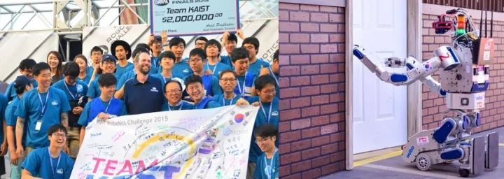

为了测试技术现状，美国国防部高级研究署2015年在洛杉矶郊区Pomona做了一个DARPA Robot Challenge（DRC），悬赏了两百万美金奖给竞赛的第一名。有很多队伍参加了这个竞赛，上图是韩国科技大学队赢了第一名，右边是他们的机器人在现场开门进去“救灾”。整个比赛场景设置的跟好莱坞片场一样，复制了三个赛场，全是冒烟的救灾场面。机器人自己开着一个车子过来，自己下车，开门，去拿工具，关阀门，在墙上开洞，最后过一个砖头做的障碍区，上楼梯等一系列动作。我当时带着学生在现场看，因为我们刚好有一个大的DARPA项目，项目主管是里面的裁判员。当时，我第一感觉还是很震撼的，感觉不错。后来发现内情，原来机器人所有的动作基本上是人在遥控的。每一步、每一个场景分别有一个界面，每个学生控制一个模块。感知、认知、动作都是人在指挥。就是说这个机器人其实并没有自己的感知、认知、思维推理、规划的能力。造成的结果是，你就可以看到一些不可思议的事情。比如说这个机器人去抓门把手的时候，因为它靠后台人的感知，误差一厘米，就没抓着；或者脚踩楼梯的时候差了一点点，它重心就失去了平衡，可是在后面控制的学生没有重力感知信号，一看失去平衡，他来不及反应了。你想想看，我们人踩滑了一下子能保持平衡，因为你整个人都在一起反应，可是那个学生只是远远地看着，他反应不过来，所以机器人就东倒西歪。

 

这还是一个简单的场景。其一、整个场景都是事先设定的，各个团队也都反复操练过的。如果是没有遇见的场景，需要灵机决断呢？其二、整个场景还没有人出现，如果有其他人出现，需要社会活动（如语言交流、分工协作）的话，那复杂度就又要上两个数量级了。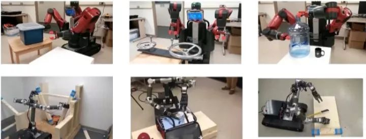

其实，要是完全由人手动控制，现在的机器人都可以做手术了，而且手术机器人已经在普及之中。上图是我实验室与一家公司合作的项目，机器人可以开拉链、检查包裹、用钳子撤除炸弹等，都是可以实现的。现在的机器人，机械控制这一块已经很不错了，但这也不是完全管用。比如上面提到的波士顿动力学公司的机器人电驴走山路很稳定，但是它马达噪音大，轰隆隆的噪音，到战场上去把目标都给暴露了。特别是晚上执勤、侦察，你搞那么大动静，怎么行呢？

 

2015年的这次DRC竞赛，暂时就断送了美国机器人研究的重大项目的立项。外行（包含国会议员）从表面看，以为这个问题已经解决了，应该留给公司去开发；内行看到里面的困难，觉得一时半会没有大量经费解决不了。这个认识上的落差在某种程度上就是“科研的冬天”到来的前题条件。

 

小结一下，现在的人工智能和机器人，关键问题是缺乏**物理的常识**和**社会的常识**“Common sense”。 这是人工智能研究最大的障碍。那么什么是常识？常识就是我们在这个世界和社会生存的最基本的知识：（1）它使用频率最高；（2）它可以举一反三，推导出并且帮助获取其它知识。这是解决人工智能研究的一个核心课题。我自2010年来，一直在带领一个跨学科团队，攻关视觉常识的获取与推理问题。我在自动化所做了另外一个关于视觉常识报告，也被转录成中文了，不久会发表出来。

 

那么是不是说，我们离真正的人工智能还很遥远呢？其实也不然。关键是研究的思路要找对问题和方向。自然界已经为我们提供了很好的案例。

 

下面，我就来看一下，自然界给我们展示的解答。

 

**第二节  未来目标： 一只****乌鸦给我们的启示**

 

同属自然界的鸟类，我们对比一下体型大小都差不多的乌鸦和鹦鹉。鹦鹉有很强的语言模仿能力，你说一个短句，多说几遍，它能重复，这就类似于当前的由数据驱动的聊天机器人。二者都可以说话，但鹦鹉和聊天机器人都不明白说话的语境和语义，也就是它们不能把说的话对应到物理世界和社会的物体、场景、人物，不符合因果与逻辑。

 

可是，乌鸦就远比鹦鹉聪明，它们能够制造工具，懂得各种物理的常识和人的活动的社会常识。

 

下面，我就介绍一只乌鸦，它生活在复杂的城市环境中，与人类交互和共存。YouTube网上有不少这方面的视频，大家可以找来看看。我个人认为，人工智能研究该搞一个“乌鸦图腾”， 因为我们必须认真向它们学习。

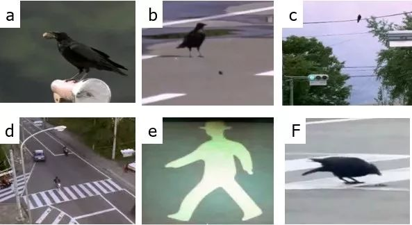

上图a是一只乌鸦，被研究人员在日本发现和跟踪拍摄的。乌鸦是野生的，也就是说，没人管，没人教。它必须靠自己的观察、感知、认知、学习、推理、执行，完全自主生活。假如把它看成机器人的话，它就在我们现实生活中活下来。如果这是一个自主的流浪汉进城了，他要在城里活下去，包括与城管周旋。

 

首先，乌鸦面临一个任务，就是寻找食物。它找到了坚果（至于如何发现坚果里面有果肉，那是另外一个例子了），需要砸碎，可是这个任务超出它的物理动作的能力。其它动物，如大猩猩会使用工具，找几块石头，一块大的垫在底下，一块中等的拿在手上来砸。乌鸦怎么试都不行，它把坚果从天上往下抛，发现解决不了这个任务。在这个过程中，它就发现一个诀窍，把果子放到路上让车轧过去（图b），这就是“鸟机交互”了。后来进一步发现，虽然坚果被轧碎了，但它到路中间去吃是一件很危险的事。因为在一个车水马龙的路面上，随时它就牺牲了。我这里要强调一点，这个过程是没有大数据训练的，也没有所谓监督学习，乌鸦的生命没有第二次机会。这是与当前很多机器学习，特别是深度学习完全不同的机制。

 

然后，它又开始观察了，见图c。它发现在靠近红绿路灯的路口，车子和人有时候停下了。这时，它必须进一步领悟出红绿灯、斑马线、行人指示灯、车子停、人流停这之间复杂的因果链。甚至，哪个灯在哪个方向管用、对什么对象管用。搞清楚之后，乌鸦就选择了一根正好在斑马线上方的一根电线，蹲下来了（图d）。这里我要强调另一点，也许它观察和学习的是别的地点，那个点没有这些蹲点的条件。它必须相信，同样的因果关系，可以搬到当前的地点来用。这一点，当前很多机器学习方法是做不到的。比如，一些增强学习方法，让机器人抓取一些固定物体，如积木玩具，换一换位置都不行；打游戏的人工智能算法，换一换画面，又得重新开始学习。

 

它把坚果抛到斑马线上，等车子轧过去，然后等到行人灯亮了（图e）。这个时候，车子都停在斑马线外面，它终于可以从容不迫地走过去，吃到了地上的果肉。你说这个乌鸦有多聪明，这是我期望的真正的智能。

 

这个乌鸦给我们的启示，至少有三点：

 

其一、它是一个完全自主的智能。感知、认知、推理、学习、和执行， 它都有。我们前面说的， 世界上一批顶级的科学家都解决不了的问题，乌鸦向我们证明了，这个解存在。

 

其二、你说它有大数据学习吗？这个乌鸦有几百万人工标注好的训练数据给它学习吗？没有，它自己把这个事通过少量数据想清楚了，没人教它。 

 

其三、乌鸦头有多大？不到人脑的1%大小。 人脑功耗大约是10-25瓦，它就只有0.1-0.2瓦，就实现功能了，根本不需要前面谈到的核动力发电。 这给硬件芯片设计者也提出了挑战和思路。十几年前我到中科院计算所讲座， 就说要做视觉芯片VPU，应该比后来的GPU更超前。我最近参与了一个计算机体系结构的大项目，也有这个目标。

 

在座的年轻人想想看，你们有很大的机会在这里面，这个解存在，但是我们不知道怎么用一个科学的手段去实现这个解。

 

讲通俗一点，我们要寻找“乌鸦”模式的智能，而不要“鹦鹉”模式的智能。当然，我们必须也要看到，“鹦鹉”模式的智能在商业上，针对某些垂直应用或许有效。

 

我这里不是说要把所有智能问题都解决了，才能做商业应用。单项技术如果成熟落地，也可以有巨大商业价值。我这里谈的是科学研究的目标。

 

**第三节  历史时期：从“春秋五霸”到“战国六雄”**

 

要搞清楚人工智能的发展趋势，首先得回顾历史。读不懂历史，无法预测未来。这一节，我就结合自己的经历谈一下我的观点，不见得准确和全面。为了让非专业人士便于理解，我把人工智能的60年历史与中国历史的一个时期做一个类比，但绝对不要做更多的推广和延伸。如下图所示，这个的时期是以美国时间为准的，中国一般会滞后一两年。

 **首先，从表面一层来看。**反映在一些产业新闻和社会新闻层面上，人工智能经过了几起几落，英文叫做Boom and Bust，意思是一哄而上、一哄而散，很形象。每次兴盛期都有不同的技术在里面起作用。

 

最早一次的兴起是1956-1974，以命题逻辑、谓词逻辑等知识表达、启发式搜索算法为代表。当时就已经开始研究下棋了。然后进入第一次冬天。这个时候，中国结束文革，开始学习西方科技。我上小学的时候，就听到报纸报道计算机与人下国际象棋，十分好奇。

 

1980年代初又兴起了第二次热潮，一批吹牛的教授、研究人员登场了。做专家系统、知识工程、医疗诊断等，中国当时也有人想做中医等系统。虽然这次其中也有学者拿了图灵奖，但这些研究没有很好的理论根基。1986年我上了中国科大计算机系，我对计算机专业本身不是最感兴趣，觉得那就是一个工具和技能，而人工智能方向水很深，值得长期探索，所以我很早就去选修了人工智能的研究生课程，是由自动化系一个到美国进修的老师回来开的课。上完课，我很失望，感觉扑空了。它基本还是以符号为主的推理，离现实世界很远。当时人工智能里面的人员也很悲观，没士气。所以，我就去阅读关于人的智能的相关领域：神经生理学、心理学、认知科学等，这就让我摸到了计算机视觉这个新兴的学科。在80年代末有个短暂的神经网络的研究热潮，我们当时本科五年制，我的大学毕业论文就是做神经网络的。随后，人工智能就跌入了近30年的寒冬。

 

第三次热潮就是最近两年兴起的深度学习推动的。有了以前的教训，一开始学者们都很谨慎，出来警告说我们做的是特定任务，不是通用人工智能，大家不要炒作。但是，拦不住了。公司要做宣传，然后，大家开始加码宣传。这就像踩踏事件，处在前面的人是清醒的，他们叫停，可是后面大量闻信赶来的人不知情，拼命往里面挤。人工智能的确是太重要了，谁都不想误了这趟车。也有人认为这次是真的，不会再有冬天了。冬天不冬天，那就要看我们现在怎么做了。

 

所以说，从我读大学开始，人工智能这个名词从公众视线就消失了近30年。我现在回头看，其实它当时并没有消失，而是分化了。研究人员分别聚集到五个大的领域或者叫做学科：计算机视觉、自然语言理解、认知科学、机器学习、机器人学。这些领域形成了自己的学术圈子、国际会议、国际期刊，各搞各的，独立发展。人工智能里面还有一些做博弈下棋、常识推理，还留在里面继续搞，但人数不多。我把这30年叫做一个“分治时期”，相当于中国历史的“春秋时期”。春秋五霸就相当于这分出去的五个学科，大家各自发展壮大。

 

**其次、从深一层的理论基础看**。我把人工智能发展的60年分为两个阶段。

 

第一阶段：前30年以数理逻辑的表达与推理为主。这里面有一些杰出的代表人物，如John McCarthy、Marvin Minsky、Herbert Simmon。他们懂很多认知科学的东西，有很强的全局观念。这些都是我读大学的时候仰慕的人物，他们拿过图灵奖和其它一堆大奖。但是，他们的工具基本都是基于数理逻辑和推理。这一套逻辑的东西发展得很干净、漂亮，很值得我们学习。大家有兴趣，可以参考一本最新工具书：The Handbook of Knowledge Representation，2007年编写的，1000多页。但是，这些符号的知识表达不落地，全书谈的没有实际的图片和系统；所以，一本1000多页的书，PDF文件只有10M，下载非常快。而我现在给的这个讲座，PPT差不多1G， 因为有大量的图片、视频，是真实的例子。

 

这个逻辑表达的“体制”，就相当于中国的周朝，周文王建立了一个相对松散的诸侯部落体制，后来指挥不灵，就瓦解了，进入一个春秋五霸时期。而人工智能正好也分出了五大领域。

 

第二阶段：后30年以概率统计的建模、学习和计算为主。在10余年的发展之后，“春秋五霸”在1990年中期都开始找到了概率统计这个新“体制”：统计建模、机器学习、随机计算算法等。

 

在这个体制的转型过程中，起到核心作用的有这么几个人。讲得通俗一点，他们属于先知先觉者，提前看到了人工智能的发展趋势，押对了方向（就相当于80年代买了微软、英特尔股票；90年代末，押对了中国房地产的那一批人）。他们没有进入中国媒体的宣传视野。我简要介绍一下，从中我们也可以学习到一些治学之道。

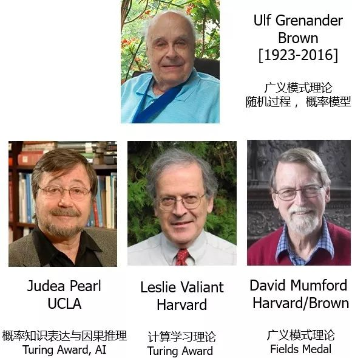

第一个人叫Ulf Grenander。他从60年代就开始做随机过程和概率模型，是最早的先驱。60年代属于百家争鸣的时期，当别的领军人物都在谈逻辑、神经网络的时候，他开始做概率模型和计算，建立了广义模式理论，试图给自然界各种模式建立一套统一的数理模型。我在以前谈计算机视觉历史的博文里写过他，他刚刚去世。美国数学学会AMS刚刚以他名字设立了一个奖项（Grenander Prize）奖给对统计模型和计算领域有贡献的学者。他绝对是学术思想的先驱人物。

 

第二个人是Judea Pearl。他是我在UCLA的同事，原来是做启发式搜索算法的。80年代提出贝叶斯网络把概率知识表达于认知推理，并估计推理的不确定性。到90年代末，他进一步研究因果推理，这又一次领先于时代。2011年因为这些贡献他拿了图灵奖。他是一个知识渊博、思维活跃的人，不断有原创思想。80多岁了，还在高产发表论文。顺便吹牛一句，他是第一个在UCLA计算机系和统计系兼职的教授，我是多年之后第二个这样兼职的。其实搞这种跨学科研究当时思想超前，找工作或者评议的时候，两边的同行都不待见，不认可。

 

第三个人是Leslei Valiant。他因离散数学、计算机算法、分布式体系结构方面的大量贡献，2010年拿了图灵奖。1984年，他发表了一篇文章，开创了computational learning theory。他问了两个很简单、但是深刻的问题。第一个问题：你到底要多少例子、数据才能近似地、以某种置信度学到某个概念，就是PAClearning；第二个问题：如果两个弱分类器综合在一起，能否提高性能？如果能，那么不断加弱分类器，就可以收敛到强分类器。这个就是Boosting和Adaboost的来源，后来被他的一个博士后设计了算法。顺便讲一句，这个机器学习的原理，其实中国人早就在生活中观察到了，就是俗话说的“三个臭裨将、顶个诸葛亮”。这里的裨将就是副官，打仗的时候凑在一起商量对策，被民间以讹传讹，说成“皮匠”。Valiant为人非常低调。我1992年去哈佛读书的时候，第一学期就上他的课，当时听不懂他说话，他上课基本是自言自语。他把自己科研的问题直接布置作业让我们去做，到哪里都找不到参考答案，也没有任何人可以问。苦啊，100分的课我考了40多分。上课的人从四十多人，到了期中只有十来个人，我开始担心是不是要挂科了。最后，还是坚持到期末。他把成绩贴在他办公室门上，当我怀着忐忑不安心情去看分的时候，发现他给每个人都是A。

 

第四个人是David Mumford。我把他放在这里，有点私心，因为他是我博士导师。他说他60年代初本来对人工智能感兴趣。因为他数学能力特别强，上代数几何课程的时候就发现能够证明大定理了，结果一路不可收拾，拿了菲尔茨奖。但是，到了80年代中期，他不忘初心，还是决定转回到人工智能方向来，从计算机视觉和计算神经科学入手。我听说他把原来代数几何的书全部拿下书架放在走廊，让人拿走，再也不看了。数学家来访问，他也不接待了。计算机视觉80年代至90年代初，一个最大的流派就是做几何和不变量，他是这方面的行家，但他根本不过问这个方向。他就从头开始学概率，那个时候他搞不懂的问题就带我去敲楼上统计系教授的门，比如去问哈佛一个有名的概率学家Persy Diaconis。他完全是一个学者，放下架子去学习新东西，直奔关键的体系，而不是拿着手上用惯了的锤子到处找钉子 --- 这是我最佩服的地方。然后，他皈依了广义模式理论。他的贡献，我就避嫌不说了。

 

这个时期，还有一个重要的人物是做神经网络和深度学习的多伦多大学教授Hinton。我上大学的时候，80年代后期那一次神经网络热潮，他就出名了。他很有思想，也很坚持，是个学者型的人物。所不同的是，他下面的团队有点像摇滚歌手，能凭着一首通俗歌曲（代码），迅速红遍大江南北。这里顺便说一下，我跟Hinton只见过一面。他腰椎疾病使得他不能到处作报告，前几年来UCLA做讲座（那时候深度学习刚刚开始起来），我们安排了一个面谈。一见面，他就说“我们总算见面了”，因为他读过我早期做的统计纹理模型和随机算法的一些论文，他们学派的一些模型和算法与我们做的工作在数理层面有很多本质的联系。我打印了一篇综述文章给他带在坐火车回去的路上看。这是一篇关于隐式（马尔科夫场）与显式（稀疏）模型的统一与过渡的信息尺度的论文，他回Toronto后就发来邮件，说很高兴读到这篇论文。很有意思的是，这篇论文的初稿，我和学生匿名投到CVPR会议，三个评分是“（5）强烈拒绝；（5）强烈拒绝；（4）拒绝”。评论都很短：“这篇文章不知所云，很怪异weird”。我们觉得文章死定了，就懒得反驳 （rebuttal），结果出乎意外地被录取了。当然，发表了也没人读懂。所以，我就写成一篇长的综述，算是暂时搁置了。我把这篇论文给他看，Hinton毕竟是行家，他一定也想过类似的问题。最近，我们又回去做这个问题，我在今年的ICIP大会特邀报告上还提到这个问题，后面也会作为一个《视觉求索》文章发布出来。这是一个十分关键的问题，就是两大类概率统计模型如何统一起来（就像物理学，希望统一某两个力和场），这是绕不过去的。

 

扯远了，回到人工智能的历史时期，我作了一个比较通俗的说法，让大家好记住，相当于咱们中国早期的历史。早期数理逻辑的体制相当于周朝，到80年代这个体制瓦解了，人工智能大概有二三十年不存在了，说起人工智能大家都觉得不着调，污名化了。其实，它进入一个春秋五霸时期，计算机视觉、自然语言理解、认知科学、机器学习、机器人学五大学科独立发展。在发展壮大的过程中，这些学科都发现了一个新的平台或者模式，就是概率建模和随机计算。春秋时期虽然有一些征战，但还是相对平静的时期。

 

那么现在开始进入一个什么状态呢？这“春秋五霸”不断扩充地盘和人马，在一个共同平台上开始交互了。比如说视觉跟机器学习很早就开始融合了。现在视觉与自然语言、视觉跟认知、视觉跟机器人开始融合了。近年来，我和合作者就多次组织这样的联席研讨会。现在，学科之间则开始兼并了，就像是中国历史上的“战国七雄”时期。除了五霸，还有原来留在人工智能里面的两个大方向：博弈决策和伦理道德。这两者其实很接近，我后面把它们归并到一起来讲，一共六大领域，我把它归纳为“战国六雄”。

 

所以，我跟那些计算机视觉的研究生和年轻人说，你们不要单纯在视觉这里做，你赶紧出去“抢地盘”，单独做视觉，已经没有多少新东西可做的了，性能调不过公司的人是一方面；更麻烦的是，别的领域的人打进来，把你的地盘给占了。这是必然发生的事情，现在正在发生的事情。

 

我的判断是，我们刚刚进入一个“战国时期”，以后就要把这些领域统一起来。首先我们必须深入理解计算机视觉、自然语言、机器人等领域，这里面有很丰富的内容和语意。如果您不懂这些问题domain的内涵，仅仅是做机器学习就称作人工智能专家，恐怕说不过去。

 

我们正在进入这么一个大集成的、大变革的时代，有很多机会让我们去探索前沿，不要辜负了这个时代。这是我演讲的第一个部分：人工智能的历史、现状，发展的大趋势。

 

下面，进入我今天演讲的第二个主题：**用一个什么样的构架把这些领域和问题统一起来。**我不敢说我有答案，只是给大家提出一些问题、例子和思路，供大家思考。不要指望我给你提供代码，下载回去，调调参数就能发文章。

 

**第四节 人工智能研究的认知构架：小数据、大任务范式**

 

智能是一种现象，表现在个体和社会群体的行为过程中。回到前面乌鸦的例子，我认为智能系统的根源可以追溯到两个基本前提条件：

 

一、**物理环境客观的现实与因果链条。**这是外部物理环境给乌鸦提供的、生活的边界条件。在不同的环境条件下，智能的形式会是不一样的。任何智能的机器必须理解物理世界及其因果链条，适应这个世界。

 

二、**智能物种与生俱来的任务与价值链条。**这个任务是一个生物进化的“刚需”。如个体的生存，要解决吃饭和安全问题，而物种的传承需要交配和社会活动。这些基本任务会衍生出大量的其它的“任务”。动物的行为都是被各种任务驱动的。任务代表了价值观和决策函数，这些价值函数很多在进化过程中就已经形成了，包括人脑中发现的各种化学成分的奖惩调制，如多巴胺（快乐）、血清素（痛苦）、乙酰胆碱（焦虑、不确定性）、去甲肾上腺素（新奇、兴奋）等。

 

有了物理环境的因果链和智能物种的任务与价值链，那么一切都是可以推导出来的。要构造一个智能系统，如机器人或者游戏环境中的虚拟的人物，我们先给他们定义好身体的基本行动的功能，再定一个模型的空间（包括价值函数）。其实，生物的基因也就给了每个智能的个体这两点。然后，它就降临在某个环境和社会群体之中，就应该自主地生存，就像乌鸦那样找到一条活路:认识世界、利用世界、改造世界。

 

这里说的模型的空间是一个数学的概念，我们人脑时刻都在改变之中，也就是一个抽象的点，在这个空间中移动。模型的空间通过价值函数、决策函数、感知、认知、任务计划等来表达。通俗来说，一个脑模型就是世界观、人生观、价值观的一个数学的表达。这个空间的复杂度决定了个体的智商和成就。我后面会讲到，这个模型的表达方式和包含哪些基本要素。

 

有了这个先天的基本条件（设计）后，下一个重要问题：是什么驱动了模型在空间中的运动，也就是学习的过程？还是两点：

 

一、 外来的**数据**。外部世界通过各种感知信号，传递到人脑，塑造我们的模型。数据来源于观察（observation）和实践（experimentation）。观察的数据一般用于学习各种统计模型，这种模型就是某种时间和空间的联合分布，也就是统计的关联与相关性。实践的数据用于学习各种因果模型，将行为与结果联系在一起。因果与统计相关是不同的概念。 

 

二、内在的**任务**。这就是由内在的价值函数驱动的行为、以期达到某种目的。我们的价值函数是在生物进化过程中形成的。因为任务的不同，我们往往对环境中有些变量非常敏感，而对其它一些变量不关心。由此，形成不同的模型。

 

机器人的脑、人脑都可以看成一个模型。任何一个模型由**数据**与**任务**来共同塑造。

 

现在，我们就来到一个很关键的地方。同样是在概率统计的框架下，当前的很多深度学习方法，属于一个被我称作“**大数据、小任务范式**（big data for small task）”。针对某个特定的任务，如人脸识别和物体识别，设计一个简单的价值函数Loss function，用大量数据训练特定的模型。这种方法在某些问题上也很有效。但是，造成的结果是，这个模型不能泛化和解释。所谓泛化就是把模型用到其它任务，解释其实也是一种复杂的任务。这是必然的结果：你种的是瓜， 怎么希望得豆呢？

 

我多年来一直在提倡的一个相反的思路：人工智能的发展，需要进入一个“**小数据、大任务范式**（small data for big tasks）”，要用大量任务、而不是大量数据来塑造智能系统和模型。在哲学思想上，必须有一个思路上的大的转变和颠覆。自然辨证法里面，恩格斯讲过，“劳动创造了人”，这个有点争议。我认为一个更合适的说法是“**任务塑造了智能**”。人的各种感知和行为，时时刻刻都是被任务驱动的。这是我过去很多年来一直坚持的观点，也是为什么我总体上不认可深度学习这个学派的做法，虽然我自己是最早提倡统计建模与学习的一批人，但是后来我看到了更大的问题和局势。当然，我们的假设前提是智能系统已经有了前面讲的基本的设置，这个系统设置是亿万年的进化得来的，是不是通过大量数据了打磨（淘汰）出来的呢。有道理！如果我们把整个发展的过程都考虑进来，智能系统的影响可以分成三个时间段：（1）亿万年的进化，被达尔文理论的一个客观的适者生存的pheontype landscape驱动；（2）千年的文化形成与传承；（3）几十年个体的学习与适应。 我们人工智能研究通常考虑的是第三个阶段。

 

那么，如何定义大量的任务？人所感兴趣的任务有多少，是个什么空间结构？这个问题，心理和认知科学一直说不清楚，写不下来。这是人工智能发展的一个巨大挑战。

 

理清了这些前提条件，带着这样的问题，下面我用六节分别介绍六大领域的问题和例子，看能不能找到共性的、统一的框架和表达模型。过去几年来，我的研究中心一直把这六个领域的问题综合在一起研究，目的就是寻找一个统一的构架，找到“乌鸦”这个解。

***\*第五节 计算机视觉：从“深”到“暗” Dark, Beyond Deep\****

 

视觉是人脑最主要的信息来源，也是进入人工智能这个殿堂的大门。我自己的研究也正是从这里入手的。这一节以一个具体例子来介绍视觉里面的问题。当然，很多问题远远没有被解决。

这是我家厨房的一个视角。多年前的一个下午，我女儿放学回家，我正在写一个大的项目申请书，就拍了这一张作为例子。图像就是一个像素的二维矩阵，可是我们感知到非常丰富的三维场景、行为的信息；你看的时间越长，理解的也越多。下面我列举几个被主流（指大多数研究人员）忽视的、但是很关键的研究问题。

 

**一、几何常识推理与三维场景构建。**以前计算机视觉的研究，需要通过多张图像（多视角）之间特征点的对应关系，去计算这些点在三维世界坐标系的位置（SfM、SLAM）。其实人只需要一张图像就可以把三维几何估算出来。最早我在2002与一个学生韩峰发表了一篇文章，受到当时几何学派的嘲笑：一张图像怎么能计算三维呢，数学上说不通呀。其实，在我们的人造环境中，有很多几何常识和规律：比如，你坐的椅子高度就是你小腿的长度约16英寸，桌子约30英寸，案台约35英寸，门高约80英寸--- 都是按照人的身体尺寸和动作来设计的。另外，人造环境中有很多重复的东西，比如几个窗户一样大小一致，建筑设计和城市规划都有规则。这些就是geometric common sense，你根据这些几何的约束就可以定位很多点的三维位置，同时估计相机位置和光轴。

 

见下图所示，在这个三维场景中，我们的理解就可以表达成为一个层次分解（compositional）的时空因果的解译图（Spatial，Temporal and Causal Parse Graph）,简称 STC-PG。STC-PG是一个极其重要的概念，我下面会逐步介绍。

 

几何重建的一个很重要的背景是，我们往往不需要追求十分精确的深度位置。比如，人对三维的感知其实都是非常不准的，它的精确度取决于你当前要执行的任务。在执行的过程中，你不断地根据需要来提高精度。比如，你要去拿几米以外的一个杯子，一开始你对杯子的方位只是一个大致的估计，在你走近、伸手的过程中逐步调整精度。

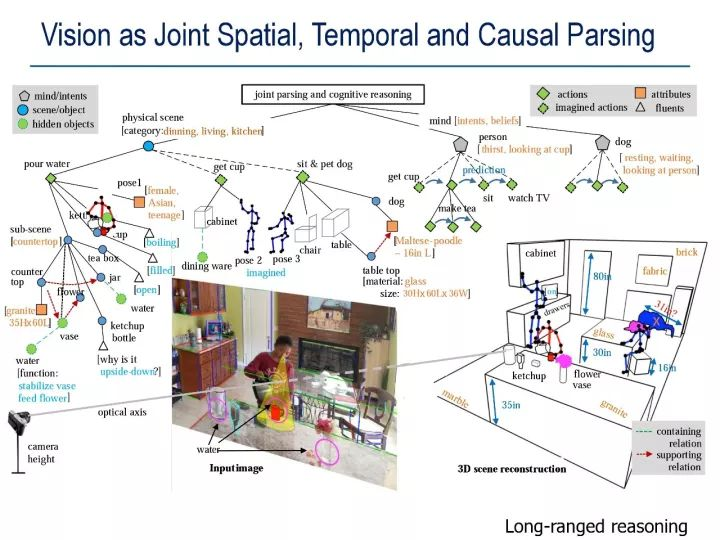

 这就回到上一节谈的问题，不同任务对几何与识别的精度要求不一样。这是人脑计算非常高效的一个重要原因。最近，我以前一个博士后刘晓白（现在是助理教授）和我其他学生在这方面取得了很好进展，具体可以查看他们相关文章。

 

**二、场景识别的本质是功能推理。**现在很多学者做场景的分类和分割都是用一些图像特征，用大量的图片例子和手工标注的结果去训练神经网络模型 --- 这是典型的“鹦鹉”模式。而一个场景的定义本质上就是功能。当你看到一个三维空间之后，人脑很快就可以想象我可以干什么：这个地方倒水，这里可以拿杯子，这里可以坐着看电视等。现代的设计往往是复合的空间，就是一个房间可以多种功能，所以简单去分类已经不合适了。比如，美式厨房可以做饭、洗菜、用餐、聊天、吃饭。卧室可以睡觉、梳妆、放衣服、看书。场景的定义是按照你在里面能够干什么，这个场景就是个什么，按照功能划分，这些动作都是你想象出来的，实际图像中并没有。人脑感知的识别区与运动规划区是直接互通的，相互影响。我的博士学生赵一彪就是做这个的，他毕业去了MIT做认知科学博后，现在创立了一家自动驾驶的AI公司。

 

为了想象这些功能，人脑有十分丰富的动作模型，这些动作根据尺度分为两类（见下图）。第一类（左图）是与整个身体相关的动作，如坐、站、睡觉、工作等等；第二类（右图）是与手的动作相关的，如砸、剁、锯、撬等等。这些四维基本模型（三维空间加一维时间）可以通过日常活动记录下来，表达了人的动作和家具之间，以及手和工具之间的关系。正因为这一点，心理学研究发现我们将物体分成两大类，分别存放在脑皮层不同区域：一类是跟手的大小有关，跟手的动作相关的，如你桌上的东西；另一类是跟身体有关，例如家具之类。

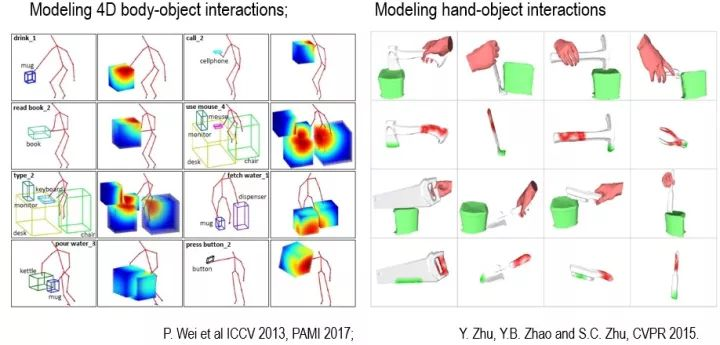

有了这个理解，我们就知道：下面两张图，虽然图像特征完全不同，但是他们是同一类场景,功能上是等价的。人的活动和行为，不管你是哪个国家、哪个历史时期，基本是不变的。这是智能泛化的基础，也就是把你放到一个新的地区，你不需要大数据训练，马上就能理解、适应。这是我们能够举一反三的一个基础。

回到前面的那个STC-PG解译图，每个场景底下其实就分解成为一些动作和功能 （见STC-PG图中的绿色方片节点）。由计算机想象、推理的各种功能决定对场景的分类。 想象功能就是把人的各种姿态放到三维场景中去拟合（见厨房解译图中人体线画）。这是完全不同于当前的深度学习方法用的分类方法。

 

**三、物理稳定性与关系的推理。**我们的生活空间除了满足人类的各种需求（功能、任务）之外， 另一个基本约束就是物理。我们对图像的解释和理解被表达成为一个解译图，这个解译图必须满足物理规律，否则就是错误的。比如稳定性是人可以快速感知的，如果你发现周围东西不稳，要倒了，你反应非常快，赶紧闪开。最近我们项目组的耶鲁大学教授Brian Scholl的认知实验发现，人对物理稳定性的反应是毫秒级，第一反应时间大约 100ms。

 

我们对图像的理解包含了物体之间的物理关系，每个物体的支撑点在那里。比如，下面这个图，吊灯和墙上挂的东西，如果没有支撑点，就会掉下来（右图）。这个研究方向，MIT认知科学系的Josh Tenenbuam教授与我都做了多年。

我提出了一个新的场景理解的minimax标准：minimize instability and maximize functionality最小化不稳定性且最大化功能性。这比以前我们做图像理解的用的MDL（最小描述长度）标准要更靠谱。这是解决计算机视觉的基本原理，功能和物理是设计场景的基本原则。几何尺寸是附属于功能推出来的，比如椅子的高度就是因为你要坐得舒服，所以就是你小腿的长度。

 

回到我家厨房的例子，你就会问，那里面的水是如何被检测到的呢？水是看不见的，花瓶和水壶里的水由各种方式推出来的。另外，你可能注意到，桌上的番茄酱瓶子是倒立着，为什么呢？ 你可能很清楚，你家的洗头膏快用完的时候，瓶子是不是也是的倒着放的呢？这就是对粘稠液体的物理和功能理解之后的结果。由此，你可以看到我们对一个场景的理解是何等“深刻”，远远超过了用深度学习来做的物体分类和检测。

 

**四、意向、注意和预测。**厨房那张图有一个人和一只狗，我们可以进一步识别其动作、眼睛注视的地方，由此推导其动机和意向。这样我们可以计算她在干什么、想干什么，比如说她现在是渴了，还是累了。通过时间累积之后，进而知道她知道哪些，也就是她看到了或者没有看到什么。在时间上做预测，她下面想干什么。只有把这些都计算出来了，机器才能更好地与人进行交互。

 

所以，虽然我们只看到一张图片，那张STC-PG中，我们增加了时间维度，对人和动物的之前和之后的动作，做一个层次的分析和预测。当机器人能够预判别人的意图和下面的动作，那么它才能和人进行互动和合作。后面，我们讲的语言对话可以帮助人机互动和合作；但是，我们日常很多交互协助，靠的是默契，不需要言语也能做不少事。

 

下面的这一张图，是多摄像机的一个综合场景的解译实例。这是我的实验室做出来的一个视觉系统。这个视频的理解就输出为一个大的综合的STC-PG。在此基础上，就可以输出文字的描述（I2T）和回答提问 QA。我们把它叫做视觉图灵测试，网址：visualturingtest.com。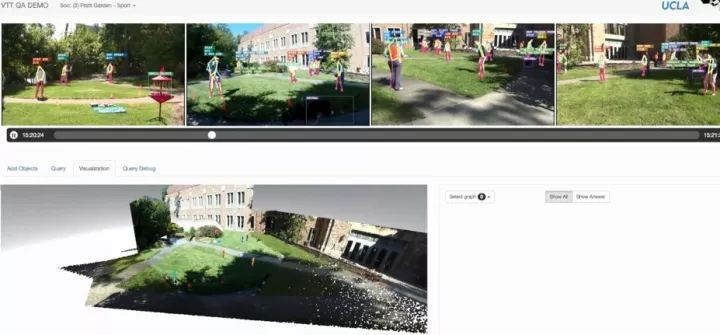

 与第一节讲的机器人竞赛类似，这也是一个DARPA项目。测试就是用大量视频，我们算出场景和人的三维的模型、动作、属性、关系等等，然后就来回答各种各样的1000多个问题。现在一帮计算机视觉的人研究VQA（视觉问答），就是拿大量的图像和文本一起训练，这是典型的“鹦鹉”系统，基本都是“扯白”。回答的文字没有真正理解图像的内容，常常逻辑不通。我们这个工作是在VQA之前，认真做了多年。我们系统在项目DARPA测试中领先，当时其它团队根本无法完成这项任务。可是，现在科研的一个现实是走向“娱乐化”：肤浅的歌曲流行，大家都能唱，复杂高深的东西大家躲着走。

 

既然说到这里，我就顺便说说一些竞赛的事情。大约从2008年开始，CVPR会议的风气就被人“带到沟里”了，组织各种数据集竞赛，不谈理解了，就是数字挂帅。中国很多学生和团队就开始参与，俗称“刷榜”。我那个时候跟那些组织数据集的人说（其实我自己2005年是最早在湖北莲花山做大型数据标注的，但我一早就看到这个问题，不鼓励刷榜），你们这些比赛前几名肯定是中国学生或者公司。现在果然应验了，大部分榜上前几名都是中国人名字或单位了。咱们刷榜比打乒乓球还厉害，刷榜变成咱们AI研究的“国球”。所谓刷榜，一般是下载了人家的代码，改进、调整、搭建更大模块，这样速度快。我曾经访问一家技术很牛的中国公司（不是搞视觉的），那个公司的研发主管非常骄傲，说他们刷榜总是赢，美国一流大学都不在话下。我听得不耐烦了，我说人家就是两个学生在那里弄，你们这么大个团队在这里刷，你代码里面基本没有算法是你自己的。如果人家之前不公布代码，你们根本没法玩。很多公司就拿这种刷榜的结果宣传自己超过了世界一流水平。

 

**五、任务驱动的因果推理与学习。**前面我谈了场景的理解的例子，下面我谈一下物体的识别和理解，以及为什么我们不需要大数据的学习模式，而是靠举一反三的能力。

 

我们人是非常功利的社会动物，就是说做什么事情都是被任务所驱动的。这一点，2000年前的司马迁就已经远在西方功利哲学之前看到了（ 《史记》 “货殖列传” ）：

“天下熙熙，皆为利来；天下攘攘，皆为利往。”

那么，人也就带着功利的目的来看待这个世界，这叫做“teleological stance”。这个物体是用来干什么的？它对我有什么用？怎么用？

 

当然，有没有用是相对于我们手头的任务来决定的。很多东西，当你用不上的时候，往往视而不见；一旦要急用，你就会当个宝。俗话叫做“势利眼”，没办法，这是人性！你今天干什么、明天干什么，每时每刻都有任务。俗话又叫做“屁股决定脑袋”，一个官员坐在不同位置，他就有不同的任务与思路，位置一调，马上就“物是人非”了。

 

我们的知识是根据我们的任务来组织的。那么什么叫做任务呢？如何表达成数学描述呢？

 

每个任务其实是在改变场景中的某些物体的状态。牛顿发明了一个词，在这里被借用了：叫做fluent。这个词还没被翻译到中文，就是一种可以改变的状态，我暂且翻译为“流态”吧。比如，把水烧开，水温就是一个流态；番茄酱与瓶子的空间位置关系是一个流态，可以被挤出来；还有一些流态是人的生物状态，比如饿、累、喜悦、悲痛；或者社会关系：从一般人，到朋友、再到密友等。人类和动物忙忙碌碌，都是在改变各种流态，以提高我们的价值函数（利益）。

 

懂得这一点，我们再来谈理解图像中的三维场景和人的动作。其实，这就是因果关系的推理。所谓因果就是：人的动作导致了某种流态的改变。理解图像其实与侦探(福尔摩斯)破案一样，他需要的数据往往就是很小的蛛丝马迹，但是，他能看到这些蛛丝马迹，而普通没有受侦探训练的人就看不见。那么，如何才能看到这些蛛丝马迹呢？其一、你需要大量的知识，这个知识来源于图像之外，是你想象的过程中用到的，比如一个头发怎么掉在这里的？还有就是行为的动机目的，犯案人员到底想改变什么“流态”？

 

我把这些图像之外的东西统称为“暗物质”--- Dark Matter。物理学家认为我们可观察的物质和能量只是占宇宙总体的5%，剩下的95%是观察不到的暗物质和暗能量。视觉与此十分相似：感知的图像往往只占5%，提供一些蛛丝马迹；而后面的95%，包括功能、物理、因果、动机等等是要靠人的想象和推理过程来完成的。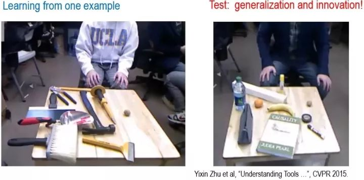有了这个认识，我们来看一个例子（见下图左）。这个例子来自我们CVPR2015年发的paper，主要作者是朱毅鑫，这也是我很喜欢的一个工作。一个人要完成的任务是砸核桃，改变桌子上那个核桃的流态。把这个任务交给UCLA一个学生，他从桌面上的工具里面选择了一个锤子，整个过程没有任何过人之处，因为你也会这么做。

 

不过你细想一下，这个问题还相当复杂。这个动作就包含了很多信息：他为什么选这个锤子而不选别的东西，他为什么拿着锤这个柄靠后的位置？他挥动的力度用多少，这都是经过计算的。这还有几千几万的可能其他各种选择、解法，他没有选择，说明他这个选法比其它的选择肯定会好，好在哪呢？看似简单的问题，往往很关键，一般人往往忽略了。

 

你通过这一琢磨、一对比就领悟到这个任务是什么，有什么窍门。以前学徒就是跟着师傅学，师傅经常在做任务，徒弟就看着，师傅也不教，徒弟就靠自己领悟。有时候师傅还要留一手，不然你早早出师了，抢他的饭碗。有时候师傅挡着不让你看；莫言的小说就有这样的情节。人就是在观察的时候，把这个任务学会了。

 

现在到一个新的场景（图右），原来学习的那些工具都不存在了，完全是新的场景和物体，任务保持不变。你再来砸这个核桃试试看，怎么办？人当然没有问题，选这个木头做的桌子腿，然后砸的动作也不一样。这才是举一反三，这才是智能，这没有什么其他数据，没有大量数据训练，这不是深度学习方法。

 

那这个算法怎么做的呢？我们把对这个物理空间、动作、因果的理解还是表达成为一个Spatial，Temporal and Causal Parse Graph（STC-PG）。这个STC-PG包含了你对空间的理解（物体、三维形状、材质等）、时间上动作的规划、因果的推理。最好是这样子砸，它物理因果能够实现，可能会被砸开，再连在一块来求解，求时间、空间和因果的这么一个解析图，就是一个解。也就是，最后你达到目的，改变了某种物理的流态。

 

我再强调几点：

一、这个STC-PG的表达是你想象出来的。这个理解的过程是在你动手之前就想好了的，它里面的节点和边大多数在图像中是没有的，也就是我称作的“暗物质”。

 

二、这个计算的过程中，大量的运算属于“top-down”自顶向下的计算过程。也就是用你脑皮层里面学习到的大量的知识来解释你看到的“蛛丝马迹”，形成一个合理的解。而这种Top-down的计算过程在目前的深度多层神经网络中是没有的。神经网络只有feedforward 向上逐层传播信息。你可能要说了，那不是有Back-propagation吗？那不是top-down。一年前，LeCun来UCLA做讲座，他看到我在座，就说DNN目前缺乏朱教授一直提倡的Top-Down计算进程。

 

三、学习这个任务只需要极少的几个例子。如果一个人要太多的例子，说明Ta脑袋“不开窍”，智商不够。顺便说一句，我在UCLA讲课，期末学生会给老师评估教学质量。一个常见的学生意见就是朱教授给的例子太少了。对不起，我没时间给你上课讲那么多例子，靠做题、题海训练，那不是真本事，也不是学习的本质。子曰：“学而不思则罔，思而不学则殆”。这里的“思”应该是推理，对于自然界或者社会的现象、行为和任务，形成一个符合规律的自洽的解释，在我看来就是一个STC-PG。

 

那么STC-PG是如何推导出来的呢？它的母板是一个STC-AOG，AOG就是And-Or Graph与或图。这个与或图是一个复杂的概率语法图模型，它可以导出巨量的合乎规则的概率事件，每一个事件就是STC-PG。这个表达与语言、认知、机器人等领域是一致的。在我看来，这个STC-AOG是一个统一表达，它与逻辑以及DNN可以打通关节。这里就不多讲了。

 

接着砸核桃的例子讲，还是朱毅鑫那篇文章的实验，这个实验很难做。比如现在的一个任务是“铲土”，我给你一个例子什么叫铲土，然后开始测试这个智能算法（机器人）的泛化能力。见下图。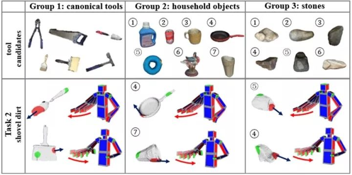

第一组实验（图左）。我给你一些工具，让你铲土，机器人第一选择挑了这个铲子，这个不是模式识别，它同时输出用这个铲子的动作、速度；输出铲子柄的绿色地方表示它要手握的地方，这个红的表示它用来铲土的位置。第二选择是一把刷子。

 

第二组实验（图中）。假如我要把这些工具拿走，你现在用一些家里常见的物体，任务还是铲土。它的第一选择是锅，第二选择是杯子。二者的确都是最佳选择。这是计算机视觉做出来的，自动的。

 

第三组实验（图右）。假如我们回到石器时代，一堆石头能干什么事情？所以我经常说，咱们石器时代的祖先，比现在的小孩聪明。因为他们能够理解这个世界的本质，现在，工具和物体越来越特定了，一个工具做一个任务，人都变成越来越傻了。视觉认知就退化成模式识别的问题了：从原来工具的理解变成一个模式识别。也就是由乌鸦变鹦鹉了。

 

**计算机视觉小结**：我简短总结一下视觉的历史。见下图。

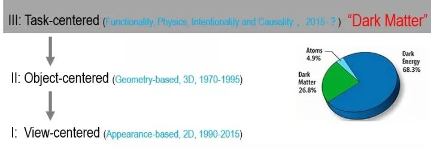

视觉研究前面25年的主流是做几何，以形状和物体为中心的研究:Geometry-Based and Object-Centered。最近25年是从图像视角通过提取丰富的图像特征描述物体的外观来做识别、分类: Appearance-Based and View-Centered。几何当然决定表观。那么几何后面深处原因是什么呢？几何形状的设计是因为有任务，最顶层是有任务，然后考虑到功能、物理、因果，设计了这些物体再来产生图像，这是核心问题所在。我把在当前图像是看不见的“东西”叫dark matter。物理里面dark matter energy占95%，确确实实在我们智能里面dark matter也占了大部分。而你看到的东西就是现在深度学习能够解决的，比如说人脸识别、语音识别，就是很小的一部分看得见的东西；看不见的在后面，才是我们真正的智能，像那个乌鸦能做到的。

 

所以，我的一个理念是：计算机视觉要继续发展，必须发掘这些“dark matter”。把图像中想象的95%的暗物质与图像中可见的5%的蛛丝马迹，结合起来思考，才能到达真正的理解。现在大家都喜欢在自己工作前面加一个Deep，以为这样就算深刻了、深沉了，但其实还是非常肤浅的。不管你多深，不管你卷积神经网络多少层，它只是处理可见的图像表观特征、语音特征，没有跳出那5%，对吧？那些认为深度学习解决了计算机视觉的同学，我说服你了么？如果没有，后面还有更多的内容。

 

视觉研究的未来，我用一句话来说：**Go Dark， Beyond Deep** --- 发掘暗，超越深。

 

这样一来，视觉就跟认知和语言接轨了。

 

**第六节 认知推理：走进内心世界**

 

上一节讲到的智能的暗物质，已经属于感知与认知的结合了。再往里面走一步，就进入人与动物的内心世界Mind, 内心世界反映外部世界，同时受到动机任务的影响和扭曲。研究内涵包括：

 

- Ta看到什么了？知道什么了？什么时候知道的？这其实是对视觉的历史时间求积分。
- Ta现在在关注什么？这是当前的正在执行的任务。
- Ta的意图是什么？后面想干什么？预判未来的目的和动机。
- Ta喜欢什么？有什么价值函数？这在第九节会谈到具体例子。

 

自从人工智能一开始，研究者就提出这些问题，代表人物是Minsky：society of minds，心理学研究叫做Theory of minds。到2006年的时候，MIT认知科学系的Saxe与Kanwisher（她是我一个项目合作者）发现人的大脑皮层有一个专门的区，用于感受、推理到别人的想法：我知道你在想什么、干什么。这是人工智能的重要部分。

 

说个通俗的例子，你可能听到过这样的社会新闻：某男能够同时与几个女朋友维持关系，而且不被对方发现，就是他那几个女朋友互相不知情。这其实很难做到，因为你一不小心就要暴露了。他需要记住跟谁说过什么谎话、做过或者答应过什么事。这种人的这个脑皮层区一定是特别发达，而他的那些女朋友的这个区可能不那么发达。电影中的间谍需要特别训练这方面的“反侦察”能力，就是你尽量不让对方发现你的内心。这是极端状况。现实生活中，一般非隐私性的活动中，我们是不设防的，也就是“君子坦荡荡”。

不光是人有这个侦察与反侦察的能力，动物也有（见上图）。比如说这个鸟（图左），它藏果子的时候，会查看周围是否有其它鸟或者动物在那里看到它；如果有，它就不藏，它非要找到没人看它的时候和地方藏。这就是它在观察你，知道你知道什么。图中是一个狐狸和水獭对峙的视频。水獭抓到鱼了以后，发现这个狐狸在岸上盯着它呢，它知道这个狐狸想抢它嘴里叼着的鱼。水獭就想办法把鱼藏起来，它把这个鱼藏到水底下，然后这个狐狸去找。这说明了动物之间互相知道对方在想什么。

 

小孩从一岁多的时候开始就有了这个意识。一个关键反应证据是：他会指东西给你看，你看到了、还是没看到的，他会知道。Felix Warneken现在在哈佛大学当心理学系的助理教授。他当博士生的时候做过一系列心理实验。一般一岁多的小孩能知道给你开门，小孩很乐意、主动去帮忙。小孩很早就知道跟人进行配合，这就是人机交互。你把这个小孩看成一个机器人的话，你要设计一个机器人，就是希望它知道看你想干什么，这是人工智能的一个核心表现。

 

尽管人工智能和认知科学，以及最近机器人领域的人都对这个问题感兴趣，但是，大家以前还都是嘴上、纸上谈兵，用的是一些toy examples作为例子来分析。要做真实世界的研究，就需要从计算机视觉入手。计算机视觉里面的人呢，又大部分都在忙着刷榜，一时半会还没意思到这是个问题。我的实验室就捷足先登，做了一些初步的探索，目前还在积极推进之中。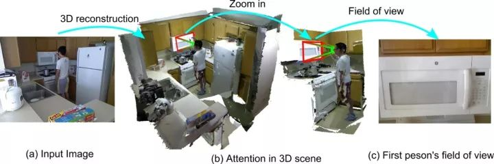

我们首先做一个简单的试验，如上图。这个人在厨房里，当前正在用微波炉。有一个摄像头在看着他，就跟监控一样，也可以是机器人的眼睛(图左)。首先能够看到他目前在看什么（图中），然后，转换视角，推算他目前看到了什么（图右）。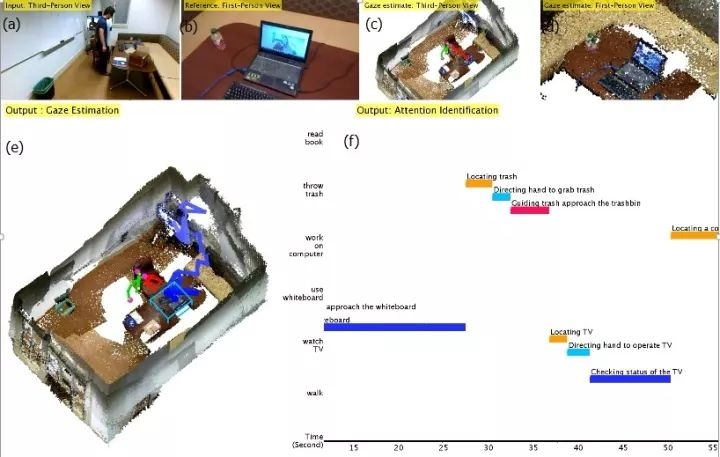

上面这个图是实验的视频的截图。假设机器人事先已经熟悉某个三维房间（图e），它在观察一个人在房间里面做事（图a）。为了方便理解，咱们就想象这是一个养老院或者医院病房，机器人需要知道这个人现在在干什么，看什么（图c）。它的输入仅仅是一个二维的视频（图a）。它开始跟踪这个人的运动轨迹和眼睛注视的地方，显示在图e的那些轨迹和图f的行为分类。然后，图d（右上角）是它估算出来的，这个人应该在看什么的图片。也就是，它把它附体到这个人身上，来感知。这个结果与图b对比，非常吻合。图b是这个人带一个眼镜，眼镜有一个小摄像头记录下来的，他确实在看的东西。这个实验结果是魏平博士提供的，他是西交大前校长郑南宁老师那里的一个青年教师，博士期间在我实验室访问，后来又回来进修。

 

这里面需要推测动作与物体的时空交互，动作随时间的转换，手眼协调。然后，进一步猜他下面干什么，意图等等。这个细节我不多讲了。

 

对这个人内心的状态，也可以用一个STC-AOG 和STC-PG 来表达的，见下图，大致包含四部分。

一、时空因果的概率“与或图”，STC-AOG。它是这个人的一个总的知识，包含了所有的可能性，我待会儿会进一步阐述这个问题。 剩下的是他对当前时空的一个表达，是一个STC-PG解译图。此解译图包含三部分，图中表达为三个三角形，每个三角形也是一个STC-PG 解译图。

 

二、当前的情景situation，由上图的蓝色三角形表示。当前的情况是什么，这也是一个解，表示视觉在0-t时间段之间对这个场景的理解的一个解译图。

 

三、意向与动作规划图，由上图的绿色三角形表示。这也是一个层次化的解译图，预判他下面还会做什么事情， 

 

四、当前的注意力，由上图的红色三角形表示。描述他正在关注什么。

 

把这整个解译图放在一块，基本上代表着我们脑袋的过去、现在、未来的短暂时间内的状态。用一个统一的STC-PG 和 STC-AOG来解释。 这是一个层次的分解。 因为是Composition， 它需要的样本就很少。 

 

有人要说了，我的深度神经网络也有层次，还一百多层呢。我要说的是，你那一百多层其实就只有一层，对不对？因为你从特征做这个识别，中间的东西是什么你不知道，他不能去解释中间那些过程，只有最后一层输出物体类别。

 

上面说的这个表达，是机器人对某个人内心状态的一个估计，这个估计有一个后验概率，这个估计不是唯一的，存在不确定性。而且，它肯定不是真相。不同的人观察某个人，可能估计都不一样。那么在一个机器与人共生共存的环境中，假设这个场景里有N个机器人或者人，这里面有很多N个“自我”minds。然后，每个人有对别人有一个估计，这就有N x（N-1）个minds表达。我知道你在想什么，你知道我在想什么，这至少是平方级的。你有一百个朋友的话，哪个朋友他脑袋里想什么你心里都有数。关系越近，理解也就越深，越准确。

 

当然，我们这里只是做一阶推理，在复杂、对抗的环境中，人们不得不用多阶的表达。当年司马懿和诸葛亮在祁山对峙时，诸葛亮比司马懿总是要多算一阶。所谓兵不厌诈，就是有时候我故意把一个错误信息传给你，《三国演义》中很多此类的精彩故事，比如周瑜打黄盖、蒋干盗书。

 

我用下面这个图来大致总结一下。两个人A与B或者一个人一个机器人，他们脑袋里面的表达模式。图中是一个嵌套的递归结构,每一个椭圆代表一个大脑的内心mind。 

每个mind除了上面谈到的知识STC-AOG 和状态STC-PG，还包含了价值函数，就是价值观，和决策函数。价值观驱动动作，然后根据感知、行动去改变世界，这样因果就出来了。我后面再细谈这个问题。

 

最底下中间的那个椭圆代表真实世界（“上帝”的mind，真相只有TA知道，我们都不知道），上面中间的那个椭圆是共识。多个人的话就是社会共识。在感知基础上，大家形成一个统一的东西，共同理解，我们达成共识。比如，大家一起吃饭，菜上来了，大家都看到这个菜是什么菜，如果没有共识那没法弄。比如，“指鹿为马”或者“皇帝的新装”，就是在这些minds之间出现了不一致的东西。这是所谓“认识论”里面的问题。以前，在大学学习认识论，老师讲得比较空泛，很难理解；现在你把表达写出来，一切都清楚了。这也是人工智能必须解决的问题。

 

我们要达成共识，共同的知识，然后在一个小的团体、大致社会达成共同的价值观。当有了共同价值观的时候，就有社会道德和伦理规范，这都可以推导出来了。俗话说，入乡随俗。当你加入一个新的团体或者社交群体，你可能先观察看看大家都是怎么做事说话的。机器人要与人共生共存 必须理解人的团体的社会道德和伦理规范。所以说，这个认识论是机器人发展的必经之道。乌鸦知道人类在干什么，它才能够利用这个在社会里生存。

 

那么如何达成共识呢？语言就是必要的形成共识的工具了。 

 

**第七节 语言通讯：沟通的认知基础**

 

我要介绍的人工智能的第三个领域是语言、对话。最近我两次在视觉与语言结合的研讨会上做了报告，从我自己观察的角度来谈，视觉与语言是密不可分的。

 

人类的语言中枢是独特的，有趣的是它在运动规划区的附近。我们为什么要对话呢？语言的起源就是要把一个人脑袋（mind）的一个信息表达传给你一个人，这就包括上一节讲的知识、注意、意向计划，归纳为图中那三个三角形的表达。希望通过对话形成共识，形成共同的任务规划，就是我们一致行动。所以，语言产生的基础是人要寻求合作。

 

动物之间就已经有丰富的交流的方式，很多借助于肢体语言。人的对话不一定用语言，手语、哑剧（pantomine）同样可以传递很多信息。所以，在语言产生之前，人类就已经有了十分丰富的认知基础，也就是上一节谈的那些表达。没有这样的认知基础，语言是空洞的符号，对话也不可能发生。

 

发育心理学实验表明，12个月的小孩就可以知道去指东西，更小年龄就不会，但是很多动物永远达不到这个水平。举个例子，有人做了个实验。一群大猩猩坐在动物园里，一个猩猩妈妈带一个小猩猩，玩着玩着小猩猩跑不见了，然后这个妈妈去找。周围一大堆闲着的猩猩坐在那里晒太阳，它们明明知道那个小猩猩去哪了。如果是人的话，我们就会热心地指那个小孩的方向，人天生是合作的，去帮助别人的，助人为乐，所以这是为什么我们人进化出来了。猩猩不会，猩猩不指，它们没有这个动机，它们脑袋与人相比一定是缺了一块。人和动物相比，我们之所以能够比他们更高级，因为脑袋里有很多通信的认知构架（就像多层网络通讯协议）在大脑皮层里面，没有这些认知构架就没法通信。研究语言的人不去研究底下的认知构架，那是不会有很大出息的。下面这个图来源于人类学的研究的一个领军人物 Michael Tomasello。

除了需要这个认知基础，语言的研究不能脱离了视觉对外部世界的感知、机器人运动的因果推理，否则语言就是无源之水、无本之木。这也就是为什么当前一些聊天机器人都在“扯白”。

 

我们先来看一个最基本的的过程：信息的一次发送。当某甲（sender）要发送一条消息给某乙（receiver），这是一个简单的通讯communication。这个通讯的数学模型是当年贝尔实验室香农Shannon1948年提出来的信息论。首先把它编码，因为这样送起来比较短，比较快；针对噪声通道，加些冗余码防错；然后解码，某乙就拿到了这个信息。见下图。在这个通讯过程之中他有两个基本的假设。第一、这两边共享一个码本，否则你没法解码，这是一个基本假设。第二、就是我们有个共享的外部世界的知识在里面，我们都知道世界上正在发生什么什么事件，比如哪个股票明天要涨了，哪个地方要发生什么战争了等等。我给你传过去的这个信息其实是一个解译图的片段（PG：parse graph）。这个解译图的片段对于我们物理世界的一个状态或者可能发生的状态的描述。这个状态也有可能就是我脑袋Mind里面的一个想法、感觉、流态（fluents）。比如，很多女人拿起电话，叫做“煲粥”，就在交流内心的一些经历和感受。

 

如果没有这个共同的外部世界，那我根本就不知道你在说什么。比如外国人聚在一起讲一个笑话，我们可能听不懂。我们中国人说“林黛玉”，那是非常丰富的一个文化符号，我们都明白谁是林黛玉，她的身世、情感、性格和价值观，就轮到外国人听不懂了。

 

Shannon的通讯理论只关心码本的建立（比如视频编解码）和通讯带宽（3G,4G，5G）。1948年提出信息论后，尽管有很多聪明人、数学根底很强的人进到这个领域，这个领域一直没有什么大的突破。为什么？因为他们忽视了几个更重大的认识论的问题，避而不谈：

 

- 甲应该要想一下：乙脑袋里面是否与甲有一个共同的世界模型？否则，解码之后，乙也不能领会里面的内容？或者会误解。那么我发这个信息的时候，措辞要尽量减少这样的误解。   
- 甲还应该要想一下：为什么要发这个信息？乙是不是已经知道了，乙关不关注这个信息呢？乙爱不爱听呢？听后有什么反应？这一句话说出去有什么后果呢？
- 乙要想一下：我为什么要收这个信息呢？你发给我是什么意图？

 

这是在认知层面的，递归循环的认知，在编码之外。所以，通讯理论就只管发送，就像以前电报大楼的发报员，收钱发报，他们不管你发报的动机、内容和后果。

 

纵观人类语言，中国的象形文字实在了不起。所谓象形文字就完全是“明码通讯”。每个字就是外部世界的一个图片、你一看就明白了，不需要编解码。我觉得研究自然语言的人和研究视觉统计建模的人，都要好好看看中国的甲骨文，然后，所有的事情都清楚了。每个甲骨文字就是一张图，图是什么？代表的就是一个解译图的片段（fragment of parse graph）。 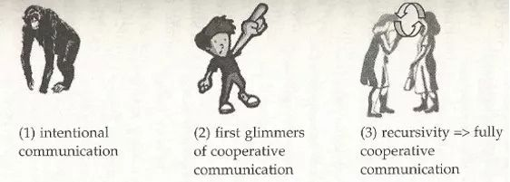

上面这个图是一个汉字的演变和关系图，从一本书叫做《汉字树》得来的。几年前，我到台湾访问，发现这本丛书，很有意思。这个图是从眼睛开始的一系列文字。

 

首先从具象的东西开始，这中间是一个眼睛，“目”字，把手搭在眼睛上面，孙悟空经常有这个动作，就是“看”（look）。

 

然后是会意，比如“省”，就是细看，明察秋毫，画一个很小的叶子在眼睛上面，指示说你看叶子里面的东西，表示你要细看。

 

然后开始表达抽象的概念，属性attribute、时空怎么表达，就是我们甲骨文里面，表示出发、终止，表示人的关系，人的脑袋状态，甚至表现伦理道德。就这样，一直推演开。

 

所以，搞视觉认知的，要理解物体功能就要追溯到石器时代去，搞语言的要追溯到语言起源。

 

下图是另一个例子：日、月、山、水、木；鸟、鸡、鱼、象、羊。下面彩色的图是我们实验室现在用计算机视觉技术从图像中得到的一些物体的表达图模型，其实就重新发明一些更具像的甲骨文。这项技术是由YiHong，司长长等博士做的无监督学习。他们的算法发现了代表鸟的有头、身子和脚、水波和水草等“类甲骨文”名词符号。这种视觉的表达模型是可解释explainable、直观的。

 

所以，从生成式模型的角度来看，语言就是视觉，视觉就是语言。 

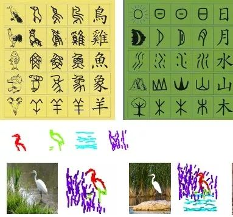

再来看看动词。考考你们，这是啥意思？第一个字，两只手，一根绳子，在拖地上一个东西，拿根绳子拽。第二个很简单，洗手。第三是关门。第四是援助的援字，一只手把另外一个人的手往上拉。第五也是两个手，一个手朝下一个手朝上，啥意思？我给你东西，你接受。第六是争夺的争，两个手往相反的方向抢。第七两个人在聊天。基本上，字已经表示了人和人之间的动作细节。

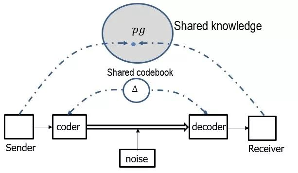

现在我的实验室里，计算机也能自动学出“类甲骨文”的动词的表达，见下图。我们学出来的这些两个人交互的动作包括：坐、玩手机、握手、人拉人等等。我们把这些动作模型分别叫做4DHOI (4D Human-Object Interaction)、4Dhoi（4D hand-object interaction）、4DHHI (4D Human-Human Interaction)。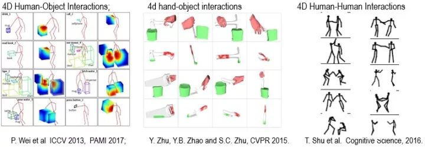

我刚才说了名词和动词，还有很多其他的东西，我建议你们去研究一下，要建模型的话我们古代的甲骨文其实就是一个模型，他能够把我们世界上所有需要表达的东西都给你表达了，是一个完备了的语言模型。

 

我再举个复杂和抽象的例子，咱们古代人怎么定义伦理道德，非常的漂亮！

 

引言中谈到，大家担心机器人进入社会以后，是不是会危害人类生存，所以引发了很多讨论。有一次我参加一个DARPA内部会议，会议邀请了各界教授们讨论这个问题，他们来自社会伦理学、认知科学、人工智能等学科。大家莫衷一是。轮到我做报告，我就说，其实这个问题，中国古代人的智慧就已经想清楚了。

 

伦理道德的“德”字怎么定义的？什么叫道德？

 

道德规范是什么，它是个相对的定义，随着时间和人群而变化。我刚来美国的时候，美国社会不许堕胎、不许同性恋，现在都可以了。中国以前妇女都不许改嫁。甚至到几十年前，我在家乡都听说这样的规矩：如果一个妇女在路上，她的影子投到一个长老身上，那是大不敬，所以走路必须绕开，这就是一种社会规范。

中文这个“德”字你看左边是双人旁，双人旁其实不是两个人，双人旁在甲骨文画的是十字路口（见最右边那个图），十字路口就是说你是要做个选择，是个决策。你怎么选择？比如说一个老人倒在地上，你是扶他还是不扶他？这就是一个选择。贪不贪污、受不受贿这都是内心的一个选择。这个选择是你心里面做出的，所以下面有个心字。

 

那怎么判断你内心的选择符不符合道德呢？社会不可能把大量规则逐条列出来，一个汉字也没法表达那么多的内容吧。“德”字上面是一个十字，十字下面一个四，其实不是四，而是眼睛，十个眼睛看着你。就是由群众来评判的。这就相当于西方的陪审团，陪审团都是普通民众中挑选出来的（那是更进一层的法律规范了）。他们如果觉得你做的事情能够接受就是道德，如果不接受那就是不道德。所以，你在做选择的时候，必须考虑周围人的看法，人家脑袋里会怎么想，才决定这个东西做不做。

 

所以，如果没有上一节讲的认知基础，也就是你如果不能推断别人的思想，那就无法知道道德伦理。研究机器人的一个很重要的一个问题是：机器要去做的事情它不知道该不该做。那么它首先想一下（就相当于棋盘推演simulation）：我如何做这个事情，人会有什么反应，如果反应好就做，如果反应不好就不做，就这么一个规则。以不变应万变。

 

那它怎么知道你怎么想的呢？它必须先了解你，你喜欢什么、厌恶什么。每个人都不一样，你在不同的群体里面，哪些话该说，哪些话不该说，大家心里都知道，这才是交互，你没有这方面知识你怎么交互呢？

 

所以我还是觉得我们古代的人很有智慧，比我们现在的人想的深刻的多，一个字就把一个问题说得很精辟。咱们现在大部分人不想问题，因为你不需要想问题了，大量媒体、广告到处都是，时时刻刻吸引你的眼球，你光看都看不过来，还想个什么呢！只要娱乐就好了。

 

现在，我们回到语言通讯、人与机器人对话的问题。下图就是我提出的一个认知模型。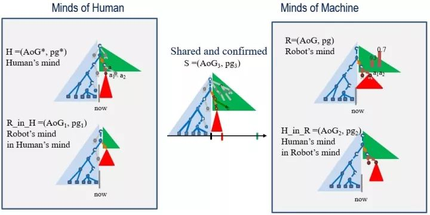

两个人之间至少要表达五个脑袋minds：我知道的东西、你知道的东西、我知道你知道的东西、你知道我知道的东西、我们共同知道的东西。还有，对话的时候你的意图是什么等等诸多问题。具体我不讲那么多了。最后，我想谈一点，语言与视觉更深层的联系、与数学中代数拓扑的联系。拓扑学是什么意思？就是说图象空间，语言空间，就是一个大集合，全集。我们的每个概念往往是它的一个子集，比如说，所有的图象是一个集合，一百万个象素就是一百万维空间，每张图像就是这百万维空间的一个点。人脸是个概念，所有的人脸就是在这一百万维空间的一个子集，但是这个子集和其它个子集要发生关系，这个关系叫拓扑关系。计算机的人把它叫做语法，对应于代数拓扑。比如，头和脖子在肩膀上是合规的，概率很高。这个图像空间的结构其实就是语法，这个语法就是STC-AOG，时空因果的与或图。语法可导出“语言”，语言就是一个符合语法的句子的总的集合。STC-AOG就是知识的总体表达，而我们看到的眼前每一个例子是由STC-AOG导出来的时空因果解译图STC-PG。计算机视觉用它，语言肯定用它，认知是它，机器人任务规划也是它。这就是一个统一的表达。

 

**第八节 博弈伦理：获取、共享人类的价值观**

 

机器人要与人交流，它必须懂得人类价值观。哲学和经济学里面有一个基本假设，认为一个理性的人（rational agent），他的行为和决策都由利益和价值驱动，总在追求自己的利益最大化。与此对应的是非理性的人。对于理性的人，你通过观察他的行为和选择，就可以反向推理、学习、估算他的价值观。我们暂时排除他有可能故意假装、迷惑我们的情况。

 

这个价值观我们把它表达为一个利益函数Utility function，用一个符号U表示。它通常包含两部分：（1）Loss损失函数，或者Reward奖励函数；（2）Cost消费函数。就是说，你做一件事得到多少利益，花费多少成本。我们可以把这个利益函数定义在流态的（fluents）空间里面。我们每次行动，改变某些流态，从而在U定义的空间中向上走，也就是“升值”。由函数U对流态向量F求微分的话，就得到一个“场”。

 

复习一下高等数学，我们假设一个人在某个时期，他的价值取向不是矛盾的。比如，如果他认为A比B好，B比C好，然后C比A好，那就循环了，价值观就不自恰。这在场论中就是一个“漩涡”。一个处处“无旋”的场，就叫做一个保守场。其对于的价值观U就是一个势能函数。

所谓“人往高处走、水往低处流”说的是社会和物理的两个不同现象，本质完全一致。就是人和水都在按照各自的势能函数在运动！那么驱动人的势能函数是什么呢？

 

人与人的价值不同，就算同一个人，价值观也在改变。本文不讨论这些社会层面的价值观，我们指的是一些最基本的、常识性的、人类共同的价值观。比如说把房间收拾干净了，这是我们的共识。

上图是我做的一个简单的实验。我把几种不同的椅子、凳子放在我办公室（左图）和实验室（右图）。然后，我统计一下学生进来以后，他喜欢坐哪个椅子，实在不行可以坐地上。这样我就可以得到这些椅子的排序。A、B、C、D、E、F、G排个序，见上面的统计图。我观察了这些人的选择，就问：为什么这个椅子比那个椅子好？是什么好？这其实就反映了人的脑袋里面一个基本的价值函数。又说一遍：很普通的日常现象，蕴含深刻的道路。苹果落地不是这样吗?大家司空见惯了，就不去问这个问题了。

 

为了解答问题，我的两个博士生朱毅鑫和搞物理和图形学的蒋凡夫（他刚刚去Upenn宾州大学当助理教授），用图形学的物理人体模型模拟人的各种的姿势，然后计算出这些坐姿在这些椅子上的时候，身体几大部件的受力分布图。见下图，比如背部、臀部、头部受多少力。 

下图中蓝色的直方图显示了六个身体部位的受力分别图。由此我们就可以推算出每个维度的价值函数。下面图中六条红色的曲线是负的价值函数，当人的坐姿使得各部位受力处于红线较低的值，就有较高的“价值”，也就是坐得“舒服”。当然每个人可能不一样，有的人腰疼必须坐硬板凳子有的人喜欢坐软沙发。这也是为什么，如果你观察到有些异样，可以推导这个人某地方可能受伤了。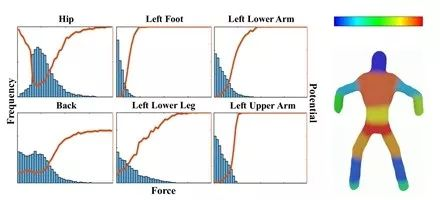

读到这里，你不禁要问：这不是与物理的势能函数，如重力场，一样吗？对，就是一个道理。这也是在最后一节我将要说的：达尔文与牛顿的理论体系要统一。

 

这对我们是常识，但是机器人必须计算出很多这样的常识，TA需要设身处地为人着想，这个就不容易了。

 

叠衣服也是我们做的另外一个例子。如果我们把这个保守的势能函数可视化为一个地形图，那么你叠一个衣服的过程，就像走一条登山的路径。这个衣服我们原来搞乱了，它对应的状态在谷底，最后叠好了就等于上到山顶了。每一步动作就有一个奖励reward。我根据你叠衣服的过程，把这山形状基本画出来，机器就知道叠衣服这个任务的本质是什么。你给它新的衣服，它也会叠了。机器人可以判断你的价值观。

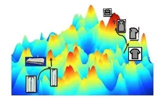

最近大家谈论较多的是机器人下棋，特别是下围棋，的确刺激了国人的神经。下棋程序里面一个关键就是学习价值函数，就是每一个可能的棋局，它要有一个正确的价值判断。最近，各种游戏、和增强学习也比较火热。但这些研究都是在简单的符号空间里面玩。我实验室做的这两个例子是在真实世界，学习人的价值函数。

 

有了价值函数，在一个多人环境中，就有了竞争与合作，形成我们上一节谈到的社会规范、伦理道德。这些伦理、社会规范就是人群在竞争合作之中，受到外部物理环境与因果限制下，达成的暂时的准平衡态。每种平衡态不见得是一个固定的规则，要求大家做同样的规定动作，而是一种概率的“行为的语法”。规则其实就是语法。说到底，这还是一种概率的时空因果与或图STC-AOG的表达。

在社会进化过程中，由于某些边界条件的改变（如新的技术发明，像互联网、人工智能）或者是政策改变（如改革开放），打破了旧的平衡，社会急剧变化；然后，达成新的准平衡态。那么社会规范对应的是另一个时空因果与或图STC-AOG。你拿着一个准平衡态的STC-AOG模型去到另一个准平衡态生活，就出现所谓的“水土不服”现象。

 

谈到这里，我想顺便对比两大类学习方法。

 

一、归纳学习 Inductive learning。我们通过观察大量数据样本，这些样本就是对某个时期、某个地域、某个人群达成的准平衡态的观察。也是我前面谈过的千年文化的形成与传承。归纳学习的结果就是一个时空因果的概率模型，我把它表达为STC-AOG。每个时空的动作是一个STC-PG，解译图。

 

二、演绎学习 Deductive learning。这个东西文献中很少，也就是从价值函数（还有物理因果）出发，直接推导出这些准平衡态，在我看来，这也是一个STC-AOG。这就要求对研究的对象有深刻的、生成式的模型和理解。比如，诸葛亮到了祁山，先查看地形，知道自己的队伍、粮草情况，摸清楚对手司马懿的情况（包括性格）。然后，他脑袋里面推演，就知道怎么布局了。

 

人的学习往往是两者的结合。年轻的时候，归纳学习用得多一些，演绎学习往往是一种不成熟冲动，交点学费，但也可能发现了新天地。到了“五十而不惑”的时候，价值观成型了，价值观覆盖的空间也基本齐全了，那么基本上就用演绎学习。

 

AlphaGo先是通过归纳学习，学习人类大量棋局；然后，最近它就完全是演绎学习了。AlphaGo的棋局空间与人类生存的空间复杂度还是没法比的。而且，它不用考虑因果关系，一步棋下下去，那是确定的。人的每个动作的结果都有很多不确定因素，所以要困难得多。

 

**第九节 机器人学：构建大任务平台**

 

我在第四节谈到人工智能研究的认知构架，应该是小数据、大任务范式。机器人就是这么一个大任务的科研平台。它不仅要调度视觉识别、语言交流、认知推理等任务，还要执行大量的行动去改变环境。我就不介绍机械控制这些问题了，就用市面上提供的通用机器人平台。

 

前面介绍过，人和机器人要执行任务，把任务分解成一连串的动作，而每个动作都是要改变环境中的流态。

 

我把流态分作两大类：

（1）物理流态 （Physical Fluents）：如下图左边，刷漆、烧开水、拖地板、切菜。

（2）社会流态 (Social Fluents): 如下图右边，吃、喝、 追逐、搀扶，是改变自己内部生物状态、或者是与别人的关系。

当机器人重建了三维场景后（在谈视觉的时候提到了，这其实是一个与任务、功能推理的迭代生成的过程），它就带着功利和任务的眼光来看这个场景。如下图所示，哪个地方可以站，哪个地方可以坐，哪个地方可以倒水等等。下面图中亮的地方表示可以执行某个动作。这些图在机器人规划中又叫做Affordance Map。意思是：这个场景可以给你提供什么？

有了这些单个基本任务的地图，机器人就可以做任务的规划。这个规划本身就是一个层次化的表达。文献中有多种方法，我还是把它统一称作一种STC-PG。这个过程，其实相当复杂，因为它一边做，一边还要不断看和更新场景的模型。因为我前面介绍过，对环境三维形状的计算精度是根据任务需要来决定的，也就是Task-Centered视觉表达。

 

这个动作计划的过程还要考虑因果、考虑到场景中别人的反应。考虑的东西越多，它就越成熟，做事就得体、不莽莽撞撞。

 

我一开始讲到的那个机器人竞赛，这些感知和规划的任务其实都交给了一群在后台遥控的人。

 

下面，我就简单介绍几个我实验室得到的初步演示结果，后台没有遥控的人。我实验室用的是一个通用的Baxter机器人，配上一个万向移动的底座和两个抓手（grippers），还有一些传感器、摄像头等。两个抓手是不同的，左手力道大，右手灵活。很有意思的是，如果你观察过龙虾等动物，它的两个钳子也是不同的，一个用来夹碎、一个是锯齿状的。

 

下图是一个博士生舒天民教会了机器人几种社交动作，比如握手。握手看似平常，其实非常微妙。但你走过去跟一个人握手的过程中，你其实需要多次判断对方的意图；否则，会出现尴尬局面。舒的论文在美国这边媒体都报道过。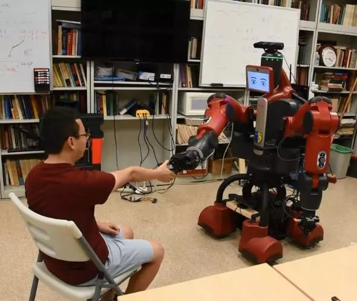

下面这个组图是机器人完成一个综合的任务。首先它听到有人去敲门，推断有人要进来，它就去开门。其次，它看到这个人手上拿个蛋糕盒子，双手被占了，所以需要帮助。通过对话，它知道对方要把蛋糕放到冰箱里面，所以它就去帮人开冰箱的门（上右图）。这个人坐下来后，他有一个动作是抓可乐罐，摇了摇，放下来。它必须推断这个人要喝水，而可乐罐是空的（不可见的流态）。假设它知道有可乐在冰箱，它后面就开冰箱门拿可乐，然后递给人。

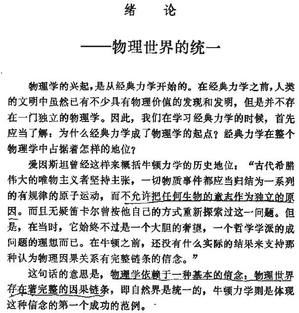

当然，这个是受限环境，要能够把样的功能做成任意一个场景的话，那就基本能接近我们前面提到的可敬的乌鸦了。我们还在努力中！

 

**第十节 机器学习：学习的极限和“停机问题”**

 

前面谈的五个领域，属于各个层面上的“问题领域”，叫Domains。我们努力把这些问题放在一个框架中来思考，寻求一个统一的表达与算法。而最后要介绍的机器学习，是研究解决“方法领域”（Methods），研究如何去拟合、获取上面的那些知识。打个比方，那五个领域就像是五种钉子，机器学习是研究锤子，希望去把那些钉子锤进去。深度学习就像一把比较好用的锤子。当然，五大领域里面的人也发明了很多锤子。只不过最近这几年深度学习这把锤子比较流行。

 

网上关于机器学习的讨论很多，我这里就提出一个基本问题，与大家探讨：学习的极限与“停机问题”。

 

大家都知道，计算机科学里面有一个著名的图灵停机Halting问题，就是判断图灵机在计算过程中是否会停下了。我提出一个学习的停机问题：学习应该是一个连续交流与通讯的过程，这个交流过程是基于我们的认知构架的。那么，在什么条件下，学习过程会终止呢？当学习过程终止了，系统也就达到了极限。比如，有的人早早就决定不学习了。

 

**首先，到底什么是学习？**

 

当前大家做的机器学习，其实是一个很狭义的定义，不代表整个的学习过程。见下图。 它就包含三步：

（1）你定义一个损失函数loss function 记作u，代表一个小任务，比如人脸识别，对了就奖励1，错了就是-1。

（2）你选择一个模型，比如一个10-层的神经网络，它带有几亿个参数theta，需要通过数据来拟合。

（3）你拿到大量数据，这里假设有人给你准备了标注的数据，然后就开始拟合参数了。

这个过程没有因果，没有机器人行动，是纯粹的、被动的统计学习。目前那些做视觉识别和语音识别都是这一类。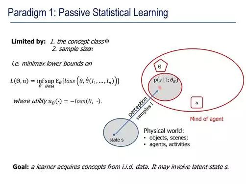

其实真正的学习是一个交互的过程。 就像孔子与学生的对话，我们教学生也是这样一个过程。 学生可以问老师，老师问学生，共同思考，是一种平等交流，而不是通过大量题海、填鸭式的训练。坦白说，我虽然是教授，现在就常常从我的博士生那里学到新知识。

这个学习过程是建立在认知构架之上的（第六节讲过的构架）。我把这种广义的学习称作通讯学习Communicative Learning，见下图。

这个图里面是两个人A与B的交流，一个是老师，一个是学生，完全是对等的结构，体现了教与学是一个平等的互动过程。每个椭圆代表一个脑袋mind，它包含了三大块：知识theta、决策函数pi、价值函数mu。最底下的那个椭圆代表物理世界，也就是“上帝”脑袋里面知道的东西。上面中间的那个椭圆代表双方达成的共识。

 

这个通讯学习的构架里面，就包含了大量的学习模式，包括以下七种学习模式（每种学习模式其实对应与图中的某个或者几个箭头），这里面还有很多模式可以开发出来。

（1）被动统计学习passive statistical learning：上面刚刚谈到的、当前最流行的学习模式，用大数据拟合模型。

（2）主动学习active learning：学生可以问老师主动要数据，这个在机器学习里面也流行过。

（3）算法教学algorithmic teaching：老师主动跟踪学生的进展和能力，然后，设计例子来帮你学。这是成本比较高的、理想的优秀教师的教学方式。

 (4) 演示学习learning from demonstration：这是机器人学科里面常用的，就是手把手叫机器人做动作。一个变种是模仿学习immitation learning。

（5）感知因果学习perceptual causality：这是我发明的一种，就是通过观察别人行为的因果，而不需要去做实验验证，学习出来的因果模型，这在人类认知中十分普遍。

（6）因果学习causal learning：通过动手实验， 控制其它变量， 而得到更可靠的因果模型， 科学实验往往属于这一类。

（7）增强学习reinforcement learning：就是去学习决策函数与价值函数的一种方法。

 

我在第一节谈到过，深度学习只是这个广义学习构架里面很小的一部分，而学习又是人工智能里面一个领域。所以，把深度学习等同于人工智能，真的是坐井观天、以管窥豹。

 

**其次，学习的极限是什么？停机条件是什么？**

 

对于被动的统计学习，文献中有很多关于样本数量或者错误率的上限。这里我所说的学习的极限就远远超越了那些定义。我是指这个广义的学习过程能否收敛？收敛到哪？学习的停机问题，就是这个学习过程怎么终止的问题。就这些问题，我和吴英年正在写一个综述文章。

 

我们学习、谈话的过程，其实就是某种信息在这些椭圆之间流动的过程。那么影响这个流动的因素就很多,我列举几条如下。

 

（1）教与学的动机：老师要去交学生一个知识、决策、价值，首先他必须确认自己知道、而学生不知道这个事。同理，学生去问老师，他也必须意识到自己不知道，而这个老师知道。那么，一个关键是，双方对自己和对方有一个准确的估计。

 

（2）教与学的方法：如果老师准确知道学生的进度，就可以准确地提供新知识，而非重复。这在algorithmic learning 和 perceptual causality里面很明显。

 

（3）智商问题：如何去测量一个机器的智商？很多动物，有些概念你怎么教都教不会。

 

（4）价值函数：如果你对某些知识不感兴趣，那肯定不想学。价值观相左的人，那根本都无法交流，更别谈相互倾听、学习了。比如微信群里面有的人就待不了，退群了，因为他跟你不一样，收敛不到一起去，最后同一个群的人收敛到一起去了，互相增强。这在某种程度上造成了社会的分裂。

 

这个学习条件的设定条件不同，人们学习肯定不会收敛到同一个地方。中国14亿人，有14亿个不同的脑模型，这14亿人中间，局部又有一些共识，也就是共享的模型。

 

我说的停机问题，就是这个动态过程中所达成的各种平衡态。

***\*
\****

***\*第十一节 总结：智能科学 --- 牛顿与达尔文理论体系的统一\****

 

到此，我摘要介绍了人工智能这六大领域的一些前沿问题，希望帮助大家看到一个大致的轮廓与脉络，在我眼中，它们在一个共同的认知构架下正在走向统一。其中有很多激动人心的前沿课题，等待年轻人去探索。

 

那么人工智能这六大领域、或者叫“战国六雄”，如何从当前闹哄哄的工程实践，成为一门成熟的科学体系呢？从人工智能Artificial Intelligence变成 智能科学Science of Intelligence，或者叫 Intelligence Science，这个统一的科学体系应该是什么？

 

什么叫科学？物理学是迄今为止发展最为完善的一门科学，我们可以借鉴物理学发展的历史。我自己特别喜欢物理学，1986年报考中科大的时候，我填写的志愿就是近代物理（4系）。填完志愿以后，我就回乡下去了。我哥哥当时是市里的干部，他去高中查看我的志愿，一看报的是物理，只怕将来不好找工作，他就给我改报计算机。当时我们都没见过计算机，他也没跟我商量，所以我是误打误撞进了这个新兴的专业，但心里总是念念不忘物理学之美。

 

等到开学，上《力学概论》的课，教材是当时常务副校长夫妇写的，我这里就不提名字了，大家都知道，这是科大那一代人心中永恒的记忆。翻开书的第一页，我就被绪论的文字震撼了。下面是一个截图，划了重点两句话，讨论如下。

（1）物理学的发展就是一部追求物理世界的统一的历史。第一次大的统一就是牛顿的经典力学， 通过万有引力把天界星体运动与世俗的看似复杂的物体运动做了一个统一的解释。形成一个科学的体系，从此也坚定了大家的信念：

“物理世界存在着完整的因果链条”。

物理学的责任就是寻找支配自然各种现象的统一的力。

 

这完全是一个信念，你相信了，就为此努力！自牛顿以来，300多年了，物理学家还在奋斗，逐步发现了一个美妙的宇宙模型。

 

相比于物理学，可叹的是，人工智能的研究，到目前为止，极少关注这个科学的问题。顶级的工程学院也不教这个事情，大家忙着教一些技能。解决一些小问题，日子就能过得红红火火。80年代有些知名教授公开讲智能现象那么复杂，根本不可能有统一的解释，更可能是“a bag of tricks”一麻袋的诡计。有一些“兵来将挡、水来土掩”的工程法则就行了。这当然是肤浅和短视的。

 

我的博士导师Mumford1980年代从纯数学转来学习、研究人工智能，他的理想是为智能构建一个数学体系（mathematics of intelligence）。以他的身份做这种转变是极其不容易的（他有很多吓人的头衔，包括菲尔兹奖、麦克阿瑟天才奖、国际数学家协会主席、美国国家科学勋章）， 而我到目前还没有见过第二个这么转型的大家。 1991年我读完大学，申请研究生院的个人陈述（Statement of Purpose）中就懵懵懂懂地提出要探索这样一种统一框架。当时也没有互联网，我也没有听说过Mumford。记得当时科大计算机系刚刚有了第一台激光打印机，替代针式打印。我买了两包“佛子岭”香烟给管机房的师兄，让他一定要帮我把这三页纸的个人陈述好好排版、打印出来！结果，大部分学校都拒绝了我的申请，而我导师把我录取到哈佛读博士。同一年， 科大计算机系一个师弟吴英年被录取到哈佛统计学读博，我们就成了室友。他对物理和统计的理解十分深刻，过去25年我们一直在一起合作。现在回头看，人生何其幸哉！

 

（2）物理学把生物的意志排除在研究之外，而这正好是智能科学要研究的对象。智能科学要研究的是一个物理与生物混合的复杂系统。智能作为一种现象，就表现在个体与自然、社会群体的相互作用和行为过程中。我个人相信这些行为和现象必然有统一的力、相互作用、基本元素来描述。其实这些概念对我们搞计算机视觉的人来说一点也不陌生。我们的模型与物理模型是完全相通的，当你有一个概率分布，你就有了“势能函数”，就有了各种“相互作用”， 然后就有了各种“场”与“力”。 

 

这些问题放在以前是没有数据来做研究的，就像爱因斯坦讲的“…不过是一个大胆的奢望，一个哲学学派成问题的理想而已”。而现在可以了，我前面已经给出了一些例子： 砸核桃、坐椅子、叠衣服。我们可以从数据中推算各种相互作用的力，用于解释人的各种行为。最近，我有两个学生谢丹和舒天民就用“社会的力和场”来解释人的相互作用， 舒还拿了2017年国际认知学会的一个“计算建模奖”。 我们以后会写文章介绍这方面的工作。

 

智能科学的复杂之处在于：

 

 （1）物理学面对的是一个客观的世界，当这个客观世界映射到每个人脑中， 形成一个主观与客观融合的世界，也就是每个人脑中的模型（这是统计中贝叶斯学派观点）。这个模型又被映射到别人脑袋之中。每个脑Mind里面包含了上百个他人的模型的估计。 由这些模型来驱动人的运动、行为。

 

 （2）物理学可以把各种现象隔离出来研究，而我们一张图像就包含大量的模式， 人的一个简单动作后面包含了很复杂的心理活动，很难隔离开。况且，当前以大数据集为依据的“深度学习”学派、“刷榜派”非常流行，你要把一个小问题单独拿出来研究，那在他们复杂数据集里面是讨不到什么便宜的。文章送到他们手上，他们就“强烈拒绝”，要求你到他们数据集上跑结果。这批人缺乏科学的思维和素养。呜呼哀哉！

回到前面乌鸦的例子，我在第四节讨论到，我们研究的物理与生物系统有两个基本前提：

 

**一、智能物种与生俱来的任务与价值链条。**这是生物进化的“刚需”，动物的行为都是被各种任务驱动的，任务由价值函数决定，而后者是进化论中的phenotype landscape，通俗地说就是进化的适者生存。达尔文进化论中提出来进化这个概念，但没有给出数学描述。后来大家发现，基因突变其实就是物种在这个进化的、大时间尺度上的价值函数中的行动action。我前面那个叠衣服的价值函数地形图，就是从生物学借来的。

 

二、**物理环境客观的现实与因果链条。**这就是自然尺度下的物理世界与因果链条，也就是牛顿力学的东西。 

 

说到底，人工智能要变成智能科学，它本质上必将是达尔文与牛顿这两个理论体系的统一。

2016年我到牛津大学开项目合作会，顺便参观了伦敦的Westminster Abbey 大教堂。 让我惊讶的是：牛顿（1642-1727）与达尔文（1809-1882）两人的墓穴相距也就2-3米远。站在那个地点，我当时十分感慨。 这两个人可以说是彻底改变人类世界观的、最伟大的科学巨人，但是他们伟大的理论体系和思想的统一，还要等多久呢？

 

这篇长文的成稿正好是深秋，让我想起唐代诗人刘禹锡的《秋词》，很能说明科研的一种境界，与大家共赏：

“自古逢秋悲寂寥，我言秋日胜春朝。

  晴空一鹤排云上，便引诗情到碧霄。”

**附录**

 

中科院自动化研究所举办的《人工智能前沿讲习班—人机交互》报告的互动记录（修改整理版）。

时间：2017年9月24日上午

 

**主持人： 王蕴红**教授介绍辞（多谢溢美之词，在此省略）。

 

**朱 开场白**：

感谢谭铁牛老师多次关照和王蕴红老师的盛情邀请。今天是星期天，非常不好意思，耽误大家休息时间。我知道大家平时都很忙，你们坚持听到最后一讲，非常不容易。所以，我给你们带来一点干货，作为“精神补偿”。

 

今天的讲座是个命题作文，王老师要我谈人机交互。到底什么是人机交互，它要解决哪些问题？我就花了一周时间整理了一个比较长的讲座，给大家介绍人工智能的发展，和人机交互的体系结构。这个问题非常大，而且研究工作刚刚起步，大家需要把很多问题放在一起看、才能看出大致的轮廓。我给大家提一个思路，启发大家思考，我并不想直接给出一个解答方法。那样的话就剥夺了你们思考的空间和权利。

 

2017年初我在《视觉求索》发表过一篇谈“学术人生”的文章，讲到做学问的一个理想境界就是“清风明月”，也就是夜深人静的时候，你去科学前沿探索真理。今天的讲座，希望把大家带到这么一个空旷的地方，去领略一番。

 

**报告后的提问互动**：

  

**提问一：**朱老师，机器怎么通过学习让它产生自我意识。刚才您演示的那个机器人，门口有个人他要进来，Ta怎么知道自己后退把路给让出来？

 

**朱**：自我意识这个问题非常重要。我先简要介绍一下背景，再回答你的问题。

 

自我意识（self-awareness，consciousness）在心理学领域争议很大，以至于认知学会一度不鼓励大家去谈这个问题，这个方向的人多年拿不到研究经费。人工智能里面有少数人在谈，但是，还不落地。自我意识包括几点：

 

（1）**感知体验**。我们花钱去看电影、坐过山车、旅游，其实买的就是一种体验。这种体验是一种比较低层次的自我意识，形成一种表达（可以是我上面讲到的解译图）。 事后你也可以回味。

 

（2）**运动体验**。我们虽然有镜子，可是除了舞蹈人员，大家并没有看到自己的行为动作。但是， 我们对自己的体态和动作是有认知的。我们时刻知道我们的体态和三维动作。比如，心理学实验，把你和一群人（熟悉和不熟悉的都有）的动作步态用几个关节点做运动捕捉，记录下来，然后，就把这些点放给你看，你只看到点的运动，看不到其它信息。你认出哪个人是你自己的比率高于认出别人，而且对视角不那么敏感。所以，我们通过感知和运动在共同建立一个自我的三维模型。这两者是互通的，往往得益于镜像神经元（mirror neurons）。这是内部表达的一个关键转换机制。 

 

机器人在这方面就比较容易实现，它有自己的三维模型，关节有传感器，又有Visualodometry， 可随时更新自己在场景中的三维位置和形态。这一点不难。 

 

（3）**自知之明**。中国有个俗语叫做“人贵有自知之明”。换句话说，一般人很难有自知之明。对自己能力的认识，不要手高眼低、或者眼高手低。而且这种认识是要随时更新的。比如，喝酒后不能开车，灯光暗的时候我的物体识别能力就不那么强，就是你对自己能力变化有一个判断。我们每天能力可能都不一样其实，这个相当复杂了。

 

比如，机器人进到日本福岛救灾场景，核辐射随时就在损害机器人的各种能力。突然，哪一条线路不通了，一个关节运动受限了，一块内存被破坏了。它必须自己知道，而后重新调整自己的任务规划。目前人工智能要做到这一点，非常难。

 

刚才说的人进来、机器人知道往后退，那就是一个协调动作的规划。你规划动作、首先要知道对方是什么动作。比如，人与人握手就其实是非常复杂的互动过程。为了达成这个目标，你要在脑内做模拟simulate。

 

**提问二**：谢谢朱教授，感觉今天听到的都是我以前从来没有听过的东西。我有一个问题就是像机器人这种自我认识都很难，像您说的交互他还要去理解对方那个人的想法，这种信息他怎么来获取呢？也是通过学习还是？ 

 

**朱**：靠观察与实践。你看别人做事你就观察到，你就能够学到每个人都不一样的价值函数，你就了解到你周围的同事，比如你们共享一个办公室，或者观察你家庭里面的人，你跟他生活的时间越长，你就越来越多的知道他怎么想问题、怎么做事，然后你跟他在交互的过程中越来越默契了。除了观察，还有实践，就是去试探、考验对方。夫妻之间，刚结婚会吵架，之后越吵越少了、和谐了，价值观融合大致收敛了、或者能够互相容忍了。实在无法收敛，那就分道扬镳，到民政局办手续。这两种情况都是我说的“**学习的停机问题**”。大家之间不要再相互交流、学习了，要么心领神会、心照不宣；要么充耳不闻、形同陌路。

 

**提问三**：他也是通过他自己观察到，它里面建立一个图吗？一个解译图（parse graph）吗？

 

**朱**：在我看来是这样的。就是我必须把你脑袋里面的很多结构尽量重构出来，表达层面就是解译图，至于人脑如何在神经元层面存储这个解译图，我们不清楚。人脑肯定有类似的表达，我脑袋里面有你的表达后，我就可以装或者演你的对各种情况的反应。

 

文学作家创作的时候，他脑袋里面同时要装下几十、上百号人的模型和知识表达，那些人知道什么、什么时候知道的。读文科的人一般观察比较敏锐。表演艺术家在这方面能力肯定也特别强。

 

**提问四**：像我们刚接触机器学习，你有没有什么推荐的，因为现在大家都在追踪训练深度网络，有没有一个推荐的，就是概率模型还是什么东西，一个数学理论或者一个数学工具。  

 

**朱**：我的想法是这样的，首先让大家端正思想，就是你想学，探索真理和未知。就是说在夜深人静的时候你探索真理，等你心境沉静下来，你自然就看到一些别人忽略的东西。不要让我推荐某个工具、代码、秘籍，拿来就用。我今天讲的东西都不是来源于某一个理论、工具，是融会贯通后的结果。

 

我反复告诫学生们，做科学研究不是过去那种到北京天桥看把戏，哪里热闹就往哪里钻。我以前也谈到过一个“路灯的隐喻”，科学研究就像在一个漆黑的夜晚找钥匙，大家喜欢聚在路灯底下找，但是很可能钥匙不在那个灯底下。

  

**提问五**：朱老师好，非常庆幸来听这个报告，我最后一个问题很简单。您说那几个时期，我想问一下秦朝到底什么时候能到？到秦朝的时候，数学的哪一块你认为，可能会被用做秦朝的武器或者最厉害的那个武器是什么。

  

**朱**：问得很好。什么时候会达到统一？这个事情中国有两个说法，都有道理。

 

一种说法叫做“望山跑死马”。你远远望见前面那个山快到了，你策马前行，可是马跑死都到不了，中间可能还有几条河拦住去路。那是我们对这个事情估计不足。

 

第二个说法是“远在天边，近在眼前”。 能不能到达，决定于你这边的人的智慧和行动。什么时候统一、谁来统一，这决定于我们自己努力了。春秋和战国时期，思想家是最多的，诸子百家全部都出来了，那是一个思想激烈碰撞的时代。我今天讲的这些东西其实都在我脑袋里面激烈的碰撞，我还有些问题想不通。

 

我们现在谈这个事情和框架，你觉得世界上有多少人在做？我的观察是：极少，也许一只手就可以数得过来。

 

你的第二个问题，如果要统一，那最厉害的数学工具是什么？我们要建立统一的知识表达：概率和逻辑要融合，和深度学习也要融合。我们看看物理学是如何统一的，他们里面各种模型（四大类的力与相互作用）必须融洽，然后解释各种现象。简单说我们需要搞清楚两点：

 

一、什么地方用什么模型？ 对比经典力学、电磁学、光学、统计物理、粒子物理等都有自己的现象、规律和使用范围。我们这边也类似，各种模型有它们的范围和基础，比如我们常常听说的，吉布斯模型往往就在高熵区，稀疏模型在低熵区，与或图语法用在中熵区。这一块除了我的实验室，世界上没有其他人研究。

 

二、这些模型之间如何转化？ 前面我讲了一个例子，我写了一篇关于隐式（马尔科夫场）与显式（稀疏）模型的统一与过渡的信息尺度的论文，投到CVPR会议，结果，三个评分是“（5）强烈拒绝；（5）强烈拒绝；（4）拒绝”。大家根本就没想这个问题，眼睛都巴巴地看着数据集、性能提升了多少。刷榜成了CVPR科研的重要范式。在某些人眼中，刷榜成了唯一方式。我以前是批判这个风气，后来一想，其实应该多鼓励。我对那些把大众带到沟里去的学术领军人物，以前是批评，现在我特别感激Ta们。这样我自己的学生才有更多时间去实现我们的思路。你们都一起涌过来踩踏、乱开乱挖，我都躲不开。我做研究喜欢清静，不去赶热闹，不去追求文章引用率这些指标。

 

**王蕴红**教授总结（整理）：今天朱教授的报告，大家可以感觉到两点。

 

一、纵横捭阖、举重若轻。纵论、横论整个人工智能六大领域很多深刻的题目，在很多层面上纵横交叉的线，他理得非常清楚、举重若轻，收发自如。非常幸运能听到这样的报告。

 

二、授人以渔而不是鱼。他讲的是如何去思考问题，如何去看世界，如何研究一些真正本质的东西。近几年深度学习被过多强调之后，有很多博士生还有一些研究者过于依赖工具，思考的能力被损坏了。其实研究的世界那么大，你一定要抬起头来看看，仰望星空。

 

**鸣谢**

 

感谢微软研究院郭百宁、华刚、代季峰等博士2016年9月在北京组织的研讨会。2017年6月汤晓鸥、王晓刚、林倞等教授邀请我在香港中文大学所作的报告。沈向洋博士在2017年7月西雅图组织的碧慧论坛。2017年9月在谭铁牛教授关照下、王蕴红教授在中科院自动化所举办的人工智能人机交互讲习班、并指派速记员和北航博士生刘松涛同学整理出报告的中文初稿。假若没有他们的耐心、催促、鼓励和协助，这篇中文报告是不可能产生的。报告中的部分图片由VCLA@UCLA实验室朱毅鑫、魏平、舒天民等人协助整理。

 

感谢中科大阮耀钟教授、杨志宏同学帮我找到那本珍藏的《力学概论》电子扫描版。其绪论被摘录在文中。我的思想受到这本书的启蒙。

感谢《视觉求索》公众号编辑部周少华、华刚、吴郢、罗杰波等同仁的协助。

**
**

感谢美国多家机构对文中提及研究的长期支持。

声明：本文限于纯属学术观点的争鸣，不针对任何组织和个人，切勿对号入座。本文仅代表个人观点、不代表机构立场。

**全文完**

**
**

***\***

*版权声明：**本原创文章版权属于《视觉求索》公众号。任何单位或个人未经本公众号的授权，不得擅自转载。联系授权转载请通过订阅公众号后发消息或电邮**visionseekereditors@gmail.com。*