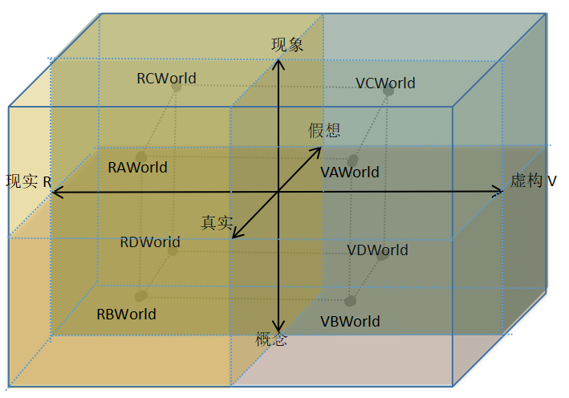
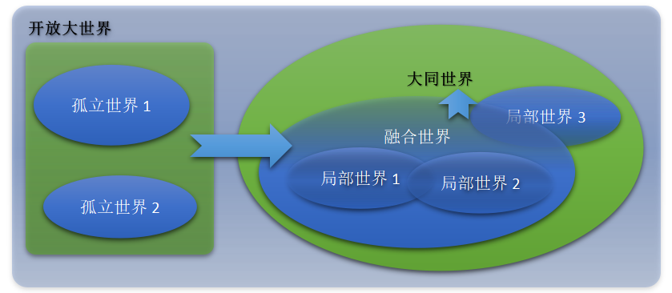
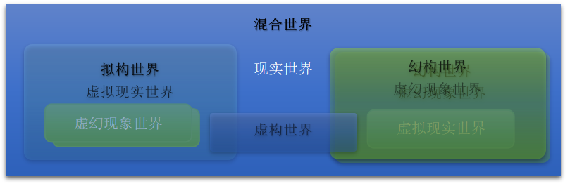
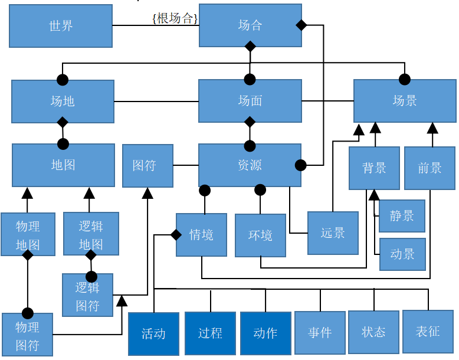

#【来源】：转载 
#【用途】：灵感 

从软件系统建模到业务建模再到城市建模一路走来，再往落地方向回归，自然关注到了3D游戏建模。发现研究来研究去，核心的问题居然在游戏界也是很热门的技术问题，就是开放世界建模的问题：如何为游戏玩家提供一个“无限大”的自由活动空间，以在其中发展“无限”故事？这是我对开放大世界建模初衷的粗浅理解。以下是结合以往研究心得尝试做一个大致的概念梳理，期待能从游戏技术中找到落地的方案。

# **虚构开放大世界建模**

# **三维视角**

\1. 现象(具体表象)<-->概念(认知理解，抽象归纳)-|-数字化建模-|-现象世界<-->概念世界

\2. 真实(真切实际)<-->假想(猜测虚际，行空幻想)-|-数字化建模-|-虚拟世界<-->虚幻世界

\3. 自然（现实的）<-->自动（数字化虚构的）。

# **三维视角正交结果**

\1. 现实的R

A. 真实现象世界(存在于自然中的真实事物)-RAWorld

B. 真实概念世界(存在于人脑中的确切认知)-RBWorld

C. 假想现象世界(存在于人脑中的假设实事)-RCWorld

D. 假想概念世界(存在于人脑中的猜想认知)-RDWorld

\2. 虚构的V

A. 虚拟现实世界(存在于电脑中对真实现象世界的建模-现场仿真模拟)-VAWorld

B. 虚拟概念世界(存在于电脑中对真实概念世界的建模-再现现场法则)-VBWorld

C. 虚幻现象世界(存在于电脑中对假想现象世界的建模-假设仿真模拟)-VCWorld

D. 虚幻概念世界(存在于电脑中对假想概念世界的建模-想象主控法则)-VDWorld

# **虚构开放大世界**

无时空边界【约束】的虚构世界，及其与现实世界的、有时空边界【选择】的叠加。

约束：对设计时空边界的限制。

选择：对叠加的部分世界边界的选择定义。

## **开放大世界图景**

\1. 孤立世界：多个相互独立的世界各自为孤立世界。

\2. 融合世界：彼此孤立的世界相互连接，统一空间和资源，统一活动，形成的新世界。

\3. 大同世界：全融合的唯一世界为大同世界。

\1. 虚构世界：将多层的虚幻世界与单层的虚拟世界叠加，即为虚构世界。

(1) 在虚拟现实世界中局部叠加虚幻现象世界，构成拟构世界。

(2) 在虚幻现象世界中局部叠加虚拟现实世界，构成幻构世界。

\2. 混合世界：在现实世界中，局部叠加虚构世界，构成混合世界。

## **世界构成事实描述**

\1. 虚拟【开放大世界】由【分布式资源模型】聚合来表达实现。

\2. 开放大世界中的虚拟【主动者Actor】和【从动者Object】统称【资源Resource】。

\3. 资源分布于虚拟开放大世界中不同的【空间位置】和网络世界中的不同【结点位置】。

\4. 在某个【时间区段】范围内，每个主动者【活动】在一定的【空间范围】内，称【场地】。

\5. 主动者的活动【场地...】会随着主动者的移动或跳转而发生【...改变】或【...切换】。

\6. 在场地内的资源形成【场面】。

\7. 在活动中，主动者只可能见到和接触到场面并对场面做出【动作】，试图改变场面。

\8. 【场面...】会随着场地的变动或切换而【...变化]和【...切换】。

\9. 不同主动者的【场地...】之间可能存在【...重叠】，【场面...】可能存在【...交叉】。

\10. 主动者可视或可触及的资源显现出来的视图，称【场景】。

\11. 场景中不参与活动的资源组成【环境】，环境的显现构成【背景】。

\12. 环境是场面的一部分，背景是场景的一部分（除此之外还有活动前景）。

\13. 环境中保持不变的资源为【静态资源】，提供静态背景，简称【静景】。

\14. 环境中自行变化的资源为【动态资源】，提供动态背景，简称【动景】。

\15. 由于存在【场地的重叠】与【资源的相关】的关系，一个主动者在其场面内做出的改变，可能影响到关联主动者场面内的场景同时出现变化，成为关联主动者的动景的一部分。

\16. 参与活动的资源为【活动资源】，提供活动前景，简称【前景】。

## **概念关系**

【世界world】是【场合】(【时间】【空间】【资源】)的递归聚集。

【场合occasion】是时空内的资源变化，即：【场地】里的【场面】发生变化出现【场景】。

【场地place】是具有空间位置的范围，包括：单层物理和多层逻辑的【地图Map】。

【场面scene】是参与活动的资源，包括：【环境】【资源】和【情境】，逻辑原理图形式。

【环境enviroment】：不参与活动，产生背景的资源。

【资源resource】：参与活动，具有远景，产生前景的资源。

【情境situation】：是资源的逻辑特征，由【活动\过程\事件\状态\表征\动作】来刻画。

【场景view】是资源产生的景象，包括【背景】【前景】和【远景】，物理实物图模式。

【远景vision】：是资源的高层视图，通过价值视图和目标视图来展现。

【前景foreground】：是资源活动的表现。包括【交互】【动画】和【变数】。

【背景background】：与资源活动无关的叠加图层。包括【静景】和【动景】。

## **虚构世界（虚拟/虚幻融合）（时间相关）**

场合

空间-层：在什么空间范围内。

时间-层：在什么时间范围内。

资源-层：有哪些东西。

有什么-层（描述场合中有什么资源，都叫什么？，A角职责）

场景资源(构成活动的背景环境，不接受操作，不进行被动变化)

静态资源（在场景中保持不变的资源）

动态资源（在场景中保持按某种规律自动变化的资源）

场面资源(构成活动的前景活动，做出/接受操作，进行主/被动变化)

主动资源（在场景中做出操作，对活动资源做出改变的资源）

从动资源（在场景中接受操作，按预定方式做出改变的资源）

是什么-层（描述场合中的每个资源，都是什么样子的？，B角职责）

资源外子层（描述资源从外界观测的样子）：

描述层：对资源的自然语言描述。

定义层：对资源的形式化、数据化的定义。

表征-层：资源具有哪些可用数据描述的特征量（主、从动者）。

动作-层：资源具备哪些改变表征量的操作能力（主动者）。

状态层：哪些表征在什么数据范围时稳定（不对外界产生影响）？

事件-层(什么状态何时产生什么变化了，影响到谁？)

过程-层(已经、正在、将要进行哪些一系列的事件？)

目的-层(什么时间，取得哪些具体功用？)

价值-层(何时谁用什么与谁需要或已经交换到什么？)

资源内子层（递归到内部场合，展现资源内部结构的样子）：

内部场合：每一个资源的内部，都是一个新的场合。

属什么-层（归纳指定资源所属的类型，定义/套用类型）

所属类型(本资源是什么类型的资源)。

实例Id(本资源是该类型的第几个实例)。

## **概念世界（真实/虚拟，具有时间无关性、资源无关性）**

属性层（有哪些属性定义？）

方法层（有哪些方法定义？）

类型层（有哪些类型定义？）

能力层（哪些类型在什么场合下能协同产生什么效用？）

功用层（能解除或达到什么状态，能得到或去除什么类型资源？）

成就层（能用多么少的成本取得多么大的效益？）

一个大致的轮廓框架基本出现了。随着落地开发，概念世界再逐步细化吧，成就感满满的了。

> 转载本文请联系原作者获取授权，同时请注明本文来自邱嘉文科学网博客。
> 链接地址：
>
> [http://blog.sciencenet.cn/blog-33982-1207233.html ](http://blog.sciencenet.cn/blog-33982-1207233.html)