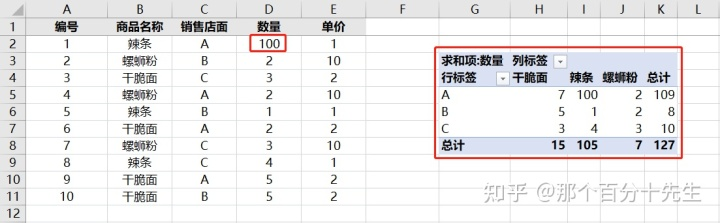

# openpyxl教程


---
title: openpyxl教程
authors: Ethan Lin
year:
tags:
  - 来源/转载 
  - 内容/编程语言/Python 
  - 内容/自动办公 
  - 内容/Excel软件 
---


> 作者：那个百分十先生
> 链接：[知乎专栏：Python操作Excel 办公自动化，让你的Excel飞起来](https://www.zhihu.com/column/c_1316498113192546304)
> 来源：知乎
> 著作权归作者所有。商业转载请联系作者获得授权，非商业转载请注明出处。

# 

# 基础入门


作者：那个百分十先生
链接：https://zhuanlan.zhihu.com/p/342422919
来源：知乎
著作权归作者所有。商业转载请联系作者获得授权，非商业转载请注明出处。


在以前的推文中，我们介绍了操作Excel的模块Xlwings的知识，相关推文可以从本公众号的底部相关菜单获取。有小伙伴反映自己在一些文章中看到openpyxl也能对Excel进行相关的操作，于是留言想在本公众号里也能看到相关的教程。于是我开始了本专题的写作。另外，在推文《操作Excel的Xlwings教程(一)》中，我对比了几种操作Excel的模块，大家可以去了解一下。

## **1.openpyxl简介**

openpyxl是用于读取/写入Excel 2010 xlsx/xlsm文件的Python库，也就是说openpyxl这个Python库不支持xls文件的读取和操作，如果在工作中遇到xls文件我们就不能使用这个库。官方说它的诞生是因为缺少可从Python本地读取/写入Office Open XML格式的库，为了方便大家就开发了这个库，这是非常棒的。

## **2.文件转换**

上述提到openpyxl只能操作xlsx文件，当我们遇到xls文件的时候就需要进行转化，转换方式这里提供几种方案供大家参考：

**方法一：手动打开xlsx文件，然后另存为xlsx类型的文件。**

**方法二：使用pywin32模块进行转换，示例代码如下：**

```python
import os
import win32com.client as win32
filename = r'C:\Users\XH\Desktop\1.xls'
Excelapp = win32.gencache.EnsureDispatch('Excel.Application')
workbook = Excelapp.Workbooks.Open(filename)
# 转xlsx时: FileFormat=51,
# 转xls时:  FileFormat=56,
workbook.SaveAs(filename.replace('xls', 'xlsx'), FileFormat=51)
workbook.Close()
Excelapp.Application.Quit()
# 删除源文件
# os.remove(filename)

# 如果想将xlsx的文件转换为xls的话，则可以使用以下的代码：
# workbook.SaveAs(filename.replace('xlsx', 'xls'), FileFormat=56)
```


**方法三：使用pandas模块进行转换，代码如下：**

```python
import pandas as pd
filename = r'C:\Users\XH\Desktop\1.xls'
filename2 = r'C:\Users\XH\Desktop\1.xlsx'
read_res = pd.read_excel(filename)
read_res.to_excel(filename2, index=False)
```

方法三在很多情况下出现一定的错误，比如在很多时候因为源表格的问题会造成数据丢失类的错误。**个人推荐使用第二种方法。**

## **3.基本操作-创建工作簿**

安装openpyxl这个模块非常简单，cmd窗口中输入: pip install openpyxl。无需在文件系统上创建文件即可开始使用openpyxl。接下来我们来进行一个简单操作：

**1、创建一个新的名为Mytest.xlsx文件。**

**2、在工作簿上第一个位置新建一个名为“mytest”的sheet页。**

我们可以这样来实现，代码中每一个操作上都有相应的注释：

```python
from openpyxl import Workbook
# 创建一个工作簿对象
wb = Workbook()
# 在索引为0的位置创建一个名为mytest的sheet页
ws = wb.create_sheet('mytest',0)
# 对sheet页设置一个颜色（16位的RGB颜色）
ws.sheet_properties.tabColor = 'ff72BA'
# 将创建的工作簿保存为Mytest.xlsx
wb.save('Mytest.xlsx')
# 最后关闭文件
wb.close()
```

最后生成的文件样式如下：


作者：那个百分十先生
链接：https://zhuanlan.zhihu.com/p/342422919
来源：知乎
著作权归作者所有。商业转载请联系作者获得授权，非商业转载请注明出处。


那么打开已有的文件Mytest.xlsx，读取一些信息怎么操作呢?我们可以这样：

```python
from openpyxl import load_workbook
# 加载工作簿
wb2 = load_workbook('Mytest.xlsx')
# 获取sheet页
ws2 = wb2['mytest']
ws3 = wb2.get_sheet_by_name('mytest')
# 打印sheet页的颜色属性值
print('color:',ws2.sheet_properties.tabColor)
wb2.close()
```

**上述代码的输出如下，可以看到一些属性值或参数：**

```python
color: <openpyxl.styles.colors.Color object>
Parameters:
rgb='00ff72BA', indexed=None, auto=None, theme=None, tint=0.0, type='rgb'
```

另外，有些小伙伴可能看到上述代码中，ws2和ws3都是获取sheet页签的。的确这两种方法的效果是一样的，大家在平时的工作中都可以使用。

如果想获取这个工作簿的所有sheet页，可以这样：

```python
print(wb2.sheetnames)
```

注意sheetnames属性值是一个列表，输出的结果为一个列表：['mytest', 'Sheet']使用for循环也是可以的：

```python
for each_sheet in wb2.sheetnames:
    print('each_sheet:',each_sheet)
```

## **4.基本操作-访问单元格**

**使openpyxl访问单元格很简单，分单个单元格访问和多个单元格的访问。**我们接着来学习：访问单元格的方式一般也有两种做法：假设现在我们要访问单个单元格A1，我们可以这样：

```python
cell_1 = ws2['A1']cell_2 = ws2.cell(row=1, column=1)
```

如果要取得这个单元格的内容，只需要在结尾加上value属性就可以了：

```python
value_1 = ws2['A1'].value
value_2 = ws2.cell(row=1, column=1).value
```

如果需要给单元格进行设置值，则可以这样实现，比如给单元格A1设置内容：

```python
ws2['A1'].value = 'python知识学堂'
ws2.cell(row=1, column=1).value ='python知识学堂'
```


对于多个单元格的设置就要借助for循环了。注意，设置后要保存工作簿，否则没有效果。 

**多个单元格的获取一般需要用到列表切片的知识或者使用for循环来进行:**

```python
# 访问A1至C3范围单元格
cell_range = ws2['A1':'C3']
# 访问A列所有存在数据的单元格
colA = ws2['A']
# 访问A列到C列所有存在数据的单元格
col_range = ws2['A:C']
# 访问第1行所有存在数据的单元格
row1 = ws2[1]
# 访问第1行至第5行所有存在数据的单元格
row_range = ws2[1:5]
```


注意，上述cell_range等对象都是<class 'tuple'>类型的。如果先获取这些单元格中的值，我们可以这样：

```python
for each_cell in cell_range:
    for each in each_cell:
     print(each.value)

for each_cell in colA:
    print(each_cell.value)
```

至于为什么获取cell_range和colA的for循序的次数不一样，这个问题就留给大家自己了。


**for循环的方式访问多个单元格可以这样：**

```python
for row in ws2.iter_rows(min_row=1, max_col=2, max_row=2):
    for cell in row:
        print(cell)
#输出：
<Cell 'mytest'.A1>
<Cell 'mytest'.B1>
<Cell 'mytest'.A2>
<Cell 'mytest'.B2>

for col in ws2.iter_cols(min_row=1, max_col=2, max_row=2):
         for cell in col:
             print(cell)
#输出：
<Cell 'mytest'.A1>
<Cell 'mytest'.A2>
<Cell 'mytest'.B1>
<Cell 'mytest'.B2>
```


**这两个方法是按行优先和列优先的顺序进行访问单元格的。**

大家可以新建一个工作簿，然后在工作簿中写入一些数据，之后运行以下代码看看打印一些什么：

```python
print(tuple(ws2.rows))
print(tuple(ws2.columns))
```

注意：ws2.rows和ws2.columns是generator对象，因此需要使用tuple进行“解析”下。

## **5.最后的注意**

使用openpyxl进行工作的时候，当一个工作结束的时候我们需要进行Excel文件的保存操作：**wb.save('Mytest.xlsx')**。**这个保存唯一需要注意的是：文件是默认替换的。也就是说我们在保存文件的时候，openpyxl将进行替换而不发出告警。**如果大家想保存不同阶段的文件，则可以在保存文件的时候加一个时间戳。

## **6.总结**

以上就是本次的推文，推文介绍的内容比较简单，大家跟着学习的时候最好也跟着实践一下。后期我们将继续介绍其他方面的知识。比如在Excel中使用公式，合并单元格等操作。大家在学习的时候有什么疑问，也欢迎在评论区留言。


# 单元格（cell）操作


在以前的推文中，我们介绍了操作Excel的模块openpyxl的入门知识，相关推文可以从本公众号的底部相关菜单获取。接下来的推文我们来学习一下openpyxl这个python模块中的其他知识，本次推文我们来学习一下单元格（cell）操作的相关知识。

**1.读取和设置单元格内容**

上篇关于openpyxl的推文中我们介绍了一些基础的操作，也包含了读取和设置单元格内容的操作。我们先复习一下，假设现在有一个“cell_operation.xlsx”文件，文件中的数据如下：


我们来进行读取和设置单元格内容的操作：

```python
from openpyxl import *
wb = load_workbook('cell_operation.xlsx')
ws = wb['Sheet1']
cell_value_1 = ws.cell(column=1, row=1).value
set_value_1 = ws.cell(column=1, row=9).value = 8
set_value_2 = ws.cell(column=1, row=10).value = '9'
print('cell_value_1:',cell_value_1)
wb.save('cell_operation.xlsx')
wb.close()
```


第四行到第六行代码是读取和设置单元格的操作，其中第四行代码为读取该单元格的内容，第五到第六行代码是用来设置单元格内容的，运行后Excel文件的结果如下：


我们可以看到单元格A10中的数据是文本格式的，这第五行代码设置值的时候是一致的。现在，我们还有一种方式的进行设置：

```python
ws.cell(column=2, row=9, value="{0}".format(get_column_letter(1)))
```


这个方式设置的结果是B9单元格被设置了文本“A”。也就是说函数

get_column_letter将对应的数字转为字母letter，也就是单元格列字母，当然还有一种方式也可以进行设置，使用ASCII值进行获取：

```python
letter = chr(i + 65)  # 由ASCII值获得对应的列字母
```


设置超链接：超链接设置也十分常用，比如在C3单元格进行设置一个超链接：

```python
ws.cell(3,3).hyperlink = 'www.baidu.com'
```


接下来我们查看一个单元格常见的属性值看看：

```python
print(ws.cell(column=2, row=9).column_letter)
print(ws.cell(column=2, row=9).coordinate)
print(ws.cell(column=2, row=9).col_idx)
print(ws.cell(column=2, row=9).encoding)
print(ws.cell(column=2, row=9).offset)
print(ws.cell(column=2, row=9).is_date)
print(ws.cell(column=2, row=9).data_type)
```


```python
输出结果为：
B
B9
2
utf-8
<bound method Cell.offset of >
False
s
```

上述代码的输出我这里就不再进行解释了。输出的结果是一些Cell的属性，除了这些属性还有一些其他的属性如：

cell.has_style、cell.style、cell.style_id、cell.font、cell.alignment

cell.border、cell.fill、cell.number_format、cell.hyperlink

具体的这些属性的实现和意义大家可以在openpyxl中的Cell类中找到相应的解释。


上述就是一些常见的属性值，大家在工程中没有找到自己想要的就去源码类中人去寻找，后面的例子中也会使用到这些属性值，到时候我们可以在稍介绍一些。


**注：在cell的方法中，有一个read_only类。如：**

```python
from openpyxl.cell import read_only
s_value = read_only.ReadOnlyCell( 'Sheet1', row=2, column=2, value=3, data_type='n')
print(s_value.value)
print(s_value.internal_value)
```

很显然这是只读模式下使用的，那么上述代码输出什么大家自己研究。

**2.设置单元格宽度和高度**

在实际的工作中，有时候我们需要对单元格的大小（即高度和宽度进行设置）。那么这个该怎么实现呢？假设现在我们需要对单元格的宽度和高度进行调整，调整的方式如下：我们以A1单元格为例：

```python
# 调整列宽
ws.column_dimensions['A'].width = 20.0
# 调整行高
ws.row_dimensions[1].height = 40
```

这种设置还是非常简单的也是非常常见的。如果我们需要对不同的单元格进行设置我们使用for循环就可以了。

那么自适应的单元格该怎么设置呢？

关于这个自适应的单元格size的设置，本人没有找到可以直接使用的API，但是想到一个大概的方法：遍历列，找到最长的字符串，然后据此设置列的宽。这里我也正好给大家分享一个[http://stackoverflow.com](https://link.zhihu.com/?target=http%3A//stackoverflow.com)上一位开发者提供的代码：

```python
def adjust_column_dimension(ws, min_row, min_col, max_col):
    column_widths = []
    for i, col in  enumerate(ws.iter_cols(min_col=min_col, max_col=max_col, min_row=min_row)):
        for cell in col:
            value = cell.value
            if value is not None:
                if isinstance(value, str) is False:
                    value = str(value)
                try:
                    column_widths[i] = max(column_widths[i], len(value))
                except IndexError:
                    column_widths.append(len(value))
    for i, width in enumerate(column_widths):
        col_name = get_column_letter(min_col + i)
        value = column_widths[i] + 2
        ws.column_dimensions[col_name].width = value

# 使用 
adjust_column_dimension(ws, 1,1, ws.max_column)
```

稍微解释一下代码里面为什么使用了一个try-except呢？这个问题也比较简单，那么也留给大家思考咯！


**3.合并单元格**

合并单元格在日常中也是非常常见的，合并单元格有两种方式：

```python
ws.merge_cells("A1:B1")
ws.merge_cells(start_column=3,end_column=5,start_row=3,end_row=5)
print(ws.merged_cells)
# A1:B1 C3:E5
print(ws.merged_cell_ranges)
# [<MergedCellRange A1:B1>, <MergedCellRange C3:E5>]
```

第一行代码直接使用单元格样式指出需要合并的单元格，第二行代码则是使用行列的方式来指明需要合并的单元格，第三行代码输出我们已经合并的单元格:A1:B1 C3:E5。第四行代码输出我们已经合并的单元格所组成的列表。

**4.单元格样式设置**

单元格常见的样式设置主要为：Font 字体、Side 边线、Border 边框、PatternFill 填充、Aignment 对齐的设置。

假设我们的数据样例为：


**（一）接下来我们来进行Font的设置，代码如下**

```python
from openpyxl import*
from openpyxl.styles import PatternFill, Font, Alignment, Border, Side

wbook = load_workbook("cell_property_sets.xlsx")
wsheet = wbook['Sheet1']
font = Font(name='微软雅黑',
            size=11,
            color='FF000000',
            bold=True,
            italic=True,
            vertAlign='baseline',
            underline='double',
            strike=False)
wsheet['A2'].font = font
wbook.save("cell_property_sets.xlsx")
wbook.close()
```

设置后的结果如下，显然单元格A2被设置为我们想要设置的值，上述代码的设置的一些含义或属性为：字体名称、字体大小、字体颜色、加粗、斜体、垂直对齐方式、下划线、删除线。


**（二）接下来我们来进行Border和Side的设置，代码如下：**

```python
from openpyxl import*
from openpyxl.styles import PatternFill, Font, Alignment, Border, Side
wbook = load_workbook("cell_property_sets.xlsx")
wsheet = wbook['Sheet1']
side_type = Side(border_style='mediumDashDot',color='FF000000')
border = Border(left=side_type,
                right=side_type,
                top=side_type,
                bottom=side_type,
                diagonal=side_type,
                diagonal_direction=30,
                outline=side_type,
                vertical=side_type,
                horizontal=side_type
                )

wsheet['A3'].border = border
wbook.save("cell_property_sets.xlsx")
wbook.close()
```

A3单元格设置后的样式如下：


其中属性值border_style的值在源代码中给出了以下几种，大家可以试验一下，看看设置不同的值会有什么样的效果。


**（三）接下来我们来进行PatternFill填充的设置，代码如下：**

```python
from openpyxl import*
from openpyxl.styles import PatternFill, Font, Alignment, Border, Side
wbook = load_workbook("cell_property_sets.xlsx")
wsheet = wbook['Sheet1']
fill = PatternFill(fill_type = 'darkDown',start_color='A6DA70D6',end_color='000000')
wsheet['A4'].fill = fill
wbook.save("cell_property_sets.xlsx")
wbook.close()
```


设置结果如下：


这里有一些说明：

首先是参数fill_type，这个参数是填充的类型，openpyxl提供了以下几种属性。


值的注意的是如果fill_type为None，则后续的参数都是不生效的。另外start_color代表前景色，这些颜色都是十六进制的aRGB颜色，a代表透明度。如果想要纯色填充的话可以就可以使用用fill_type = solid，然后使用前景色就可以了。


为方便大家使用颜色填充，这里对颜色的选择做出一个小的说明：

首先十六进制颜色码大家可以直接搜索相关的网站（或百度）就可以获取到，比如以下这个网页链接：[https://www.sioe.cn/yingyong/yanse-rgb-16/](https://link.zhihu.com/?target=https%3A//www.sioe.cn/yingyong/yanse-rgb-16/)


然后透明度怎么设置呢？这给出一个表：（透明度和对应的值，其中100%为完全不透明）


假设现在我们有一个DA70D6十六进制颜色码，在其头部拼上一个透明度如B3，则这个aRGB颜色的值为：B3DA70D6。还是很简单的。


**（四）接下来我们来进行Aignment 填充的设置，代码如下：**

```python
from openpyxl import*
from openpyxl.styles import PatternFill, Font, Alignment, Border, Side
wbook = load_workbook("cell_property_sets.xlsx")
wsheet = wbook['Sheet1']
align = Alignment(horizontal='center',vertical='center',text_rotation=0,wrap_text=True,shrink_to_fit=True,indent=0)

wsheet['A6'].alignment = align
wbook.save("cell_property_sets.xlsx")
wbook.close()
```

**参数说明：**

*# Horizontal:水平方向，左对齐left，居中center对齐和右对齐right可选。*

*# Vertical:垂直方向，有居中center，靠上top，靠下bottom，两端对齐justify等可选。*

*# text_rotation:文本旋转度。*

*# wrap_text:自动换行*

*# Indent:缩进。*


**注：单元格的属性是可以复制的，如：**

```python
from openpyxl.styles import Font
fsheet1 = Font(name='Arial', size=10)
# 复制时指定字体为“微软雅黑”，其他属性来自fsheet1
fsheet2 = fsheet1.copy(name="微软雅黑")
```


**（五）接下来我们来进行单元格数字格式设置，代码如下：**

单元格的数字格式也是常见的，大家可以在openpyxl中的numbers.py文件中找到数字的格式，这里贴一些：


```python
from openpyxl import*
from openpyxl.styles import PatternFill, Font, Alignment, Border, Side
wbook = load_workbook("cell_property_sets.xlsx")
wsheet = wbook['Sheet1']
wsheet['A9'].number_format = 'd-mmm-yy'
wbook.save("cell_property_sets.xlsx")
wbook.close()
```


设置后的结果如下：


**5.总结**

以上就是本次的推文，推文介绍的内容比较简单，大家跟着学习的时候最好也跟着实践一下。后期我们将继续介绍其他方面的知识。比如在Excel中使用公式，进行表格的数据的过滤等操作。大家在学习的时候有什么疑问，也欢迎在评论区留言。


# 使用公式


在之前的推文中，我们介绍了操作Excel的模块openpyxl的cell单元格操作，相关推文可以从本公众号的底部相关菜单获取。接下来的推文我们来学习一下openpyxl这个python模块中的其他知识，想了想还是先来学习一下怎么借助openpyxl来进行Excel的公式设置。

**一.公式数量和种类**

我们先看一下在openpyxl中能使用的公式有哪些，我们来看代码：

```python
from openpyxl.utils import FORMULAE
print(len(FORMULAE))
print(FORMULAE)
```

**输出的内容如下：**


可以看出支持的公式有ROW，ABS，MAX等等。支持的公式的数量可能因为版本不同而不一样，目前我使用的openpyxl的版本是3.0.5，支持公式的数量为352。

那么我们怎么判断自己要使用的公式是否支持，则可以简单的进行判断：

```python
print('MID' in FORMULAE)
print('minddd' in FORMULAE)
```

上述代码输出**True**和**False**，也就是说公式“MID”支持，公式‘minddd’是不支持的。

**二.在单元格中使用公式**

假设我们现在有一个数据表“formulae_1.xlsx”，数据显示如下：


我们将使用公式来计算一个总值，代码如下：

```python
wbook = load_workbook(filename='formula_1.xlsx')
wsheet = wbook['Sheet1']
wsheet["C2"] = "=SUM(A2,B2)"
print(wsheet['C2'].value)
wbook.save("formula_1.xlsx")
```

代码中的输出为：**=SUM(A2,B2)**，操作后的表格显示如下，正好是两者之和。当然了上述第四行代码我们也可以这样写：wsheet["C2"] = "=SUM(10,20)"，也能得到我们下图的结果：


利用for循环，我们可以将上述表格中的所有行的值：

```python
from openpyxl import load_workbook
wbook = load_workbook(filename='formula_1.xlsx')
wsheet = wbook['Sheet1']
for j in range(2,4):
    cell_a = 'A' + str(j)
    cell_b = 'B' + str(j)
    cell_c = 'C' + str(j)
    wsheet[cell_c] = "=SUM({},{})".format(cell_a,cell_b)
wbook.save("formula_1.xlsx")
```

我们来看一下表格中的数据，选中单元格C2，可以看出这个单元格显示的是一个公式：


那我们重新加载这个表格并读取 这个单元格会出现什么呢？

```python
from openpyxl import load_workbook
wbook = load_workbook(filename='formula_1.xlsx')
wsheet = wbook['Sheet1']
cell_C2 = wsheet.cell(2,3).value
print(cell_C2)
wbook.save("formula_1.xlsx")
```

代码中的打印输出为：**=SUM(A2,B2)。**那么这里就存在一个问题，我们怎么得到这个单元格中计算的值呢？也就是如何打印出30。这里就要提及到openpyxl中的一个打开文件时的参数了，我们将第二行代码更改为：

```python
wbook = load_workbook(filename='formula_1.xlsx',data_only=True)
```

load_workbook方法中涉及到较多的属性，包括read_only，keep_vba，guess_types，data_only等。**data_only用于读取cell中的值，当单元格中的值是一个公式的时候，会返回计算到的结果。data_only** **控制具有公式的单元格是否具有公式（默认值）或上次Excel读取工作表时存储的值。**

我们运行替换后的代码的后，打印cell_C2值的时候是为却为**None**，这是为什么呢？查询相关的资料的解释可以参考：

[https://blog.51cto.com/antidarkness/1974684](https://link.zhihu.com/?target=https%3A//blog.51cto.com/antidarkness/1974684)

那么这个问题该怎么解决呢？我们可以使用win32库进行打开关闭的操作之后，在使用openpyxl打开文件传入**data_only=True**即可，使用win32打开保存的代码如下：（注意filaname需要传一个全路径）

```python
from win32com.client import Dispatch
filename = r'C:\Users\LEGION\Desktop\tweets_code\formula_1.xlsx'
xlApp = Dispatch('Excel.Application')
xlApp.Visible = False
xlBook = xlApp.Workbooks.Open()
xlBook.Save()
xlBook.Close()
```

当然了在计算多行值的时候如A1到A5的和的时候，可使用："=SUM(A1:A5)"。

**三.转化公式位置**

将公式从一个位置转换到另一个位置在日常的工作中也是非常常见的，那么该怎么实现呢？我们先看一个代码：

```python
from openpyxl import load_workbook
from openpyxl.formula.translate import Translator
wbook = load_workbook(filename='formula_1.xlsx')
wsheet = wbook['Sheet1']
wsheet['C3'] = Translator("=SUM(A2,B2)", origin="C2").translate_formula("C3")
print(wsheet['C3'].value)
wbook.save("formula_1.xlsx")
```

上述代码将"=SUM(A2,B2)"显示的公式，通过转变复制到C3单元格中了，print打印的结果为：=SUM(A3,B3)。C3单元格中的值也就变成了A3+B3的值了，是不是很有意思。官方文档对这个Translator(object)类的作用以及参数的解释为：

> **Modifies** a formula so that it can be translated from one cell to another.
> **formula:** The str string to translate. Must include the leading '=' character.
> **origin:** The cell address (in A1 notation) where this formula was defined (excluding the worksheet name).

这里补充上次单元格中的一个知识点：

当我们在设置格式的时候没有自己想要的格式，那该怎么办呢？很简单，我们可以先使用Excel设置相应单元格的样式，然后使用下述代码打印格式：

```python
cell_style = wsheet.cell(i,j).number_format
print(cell_style)
```

**四.总结**

以上就是本次的推文，推文介绍的单元格中使用公式的相关操作，大家跟着学习的时候最好也跟着实践一下。后期我们将继续介绍其他方面的知识。**如进行表格的数据的筛选过滤等操作。**大家在学习的时候有什么疑问，也欢迎在公众号后台留言。


# 使用Python来进行排序


在上期的推文中，我们介绍了使用openpyxl来进行公式的设置等操作，相关推文可以从本公众号的底部相关菜单获取。接下来的推文我们来学习一下openpyxl这个python模块中的其他知识，我们这次的推文来看一下怎么使用Python来进行排序。

**一、Openpyxl中的排序**

在openpyxl中排序并没有实际效果，也就是说使用这个排序的操作会在相应的列头上设置相关的指令。假设现在我们有一个文件，如下所示：


我们来运行以下代码，看看有什么情况：

```python
from openpyxl import *
workbook = load_workbook('sort_file.xlsx')
worksheet = workbook['Sheet1']
worksheet.auto_filter.ref = "A1:B12"
worksheet.auto_filter.add_filter_column(0, ["Kiwi", "Apple", "Mango"])
worksheet.auto_filter.add_sort_condition("B2:B12")
workbook.save("sort_file.xlsx")
```

代码说明：第四行代码表示需要过滤排序的范围；第五行代码增加了过滤的列，0表示第1列，后面的列表表示需要选择的关键字；第六行代码的作用是为指定的单元格范围添加排序条件。

运行代码以后的数据截图样式显示如下：可以发现，这个表格我们已经增加了相应的筛选按钮，且点击筛选按钮，可以看出Fruit列已经勾选了“Apple,Kiwi,Mango”等关键词。另外也可以通过打开Excel文件如果下拉筛选的按钮，就可以看出其已经勾选的项目了。


到目前，我没有发现可以直接实现过滤的方法。大家如果找到什么好的方法可以在微信公众号后台给我留言哈。

既然openpyxl不能够实现我们的功能，那么我们该怎么实现这个个过滤和排序呢？请继续看一下的方法。

**二、Pandas中的排序**

Pandas是一个强大的第三方数据处理Python模块，能够实现很多的功能。(后期本公众号也会详细的出一点Pandas的教程)，注意在pandas读取文件的时候要依赖包xlrd模块需要进行相应的安装。

那么对于上述文件，我们看该怎么进行数据的过滤和排序呢？

```python
import pandas as pd
data_test = pd.read_excel('sort_file.xlsx')
df = pd.DataFrame(data_test)
# 以列“Fruit”的标签列来进行升序排列
df_1 = df.sort_values('Fruit',ascending=True)
print(df_1)
```

输出结果：


可以看出上述的数据已经被排序了。

我们来解一下Pandas的这个sort_values()函数。第一个参数为by，为排序的列名称（字段）为列表，后面的ascending可选True和False为排序的方式。True为升序False为降序。

这里补充一个知识点，在进行排序的时候，如果还存在一个字段Price，那么如果我们使用以下的代码来进行排序，有什么作用呢？

```python
df_2 = df.sort_values(['Fruit','Price'],ascending=False)
```

这行代码告诉我们，这个by参数不仅仅可以传入一个字符串，还能传入一个列表的。

那么这行代码的意思就是：以Fruit进行降序排列，当Fruit中有相同的值则按Price进行降序排序。

再看一行代码：

```python
df_3 = df.sort_values(['Fruit','Price'],ascending=[False,True])
```

上述代码也是比较常用的类型之一，很显然对Fruit列进行排序对Price进行升序排列。

Tips: sort_values()函数有一个参数inplace，这个inplace 控制排序后的数据集替换原来的数据，默认为False，即不替换原来的数据。在进行排序结束之后，我们的最后操作就是将数据写入到Excel中：

```python
import pandas as pd
data_test = pd.read_excel('sort_file.xlsx')
df = pd.DataFrame(data_test)
# 以列“Fruit”的标签列来进行升序排列
df_1 = df.sort_values('Fruit',ascending=True)
writer =  pd.ExcelWriter('sort_file.xlsx')
df_1.to_excel(writer,sheet_name = 'Sheet1',index=False)
writer.save()
```

上述代码的作用就是将排序后的数据写入到原来的Excel文件中。

**三、总结**

以上就是本次的推文，推文介绍的是在Excel中进行排序的相关操作，大家跟着学习的时候最好也跟着实践一下。后期我们将继续介绍其他方面的知识。大家在学习的时候有什么疑问或者发现有什么好的方法可以在公众号的后台告诉我们哦。


# 结合Numpy和Pandas


在上次的推文中，我们介绍了使用Openpyxl来进行数据的过滤和排序的操作，

相关推文可以从本公众号的底部相关菜单获取。在那篇推文中我们使用到了Pandas。因此本次推文我们就来看一看Openpyxl和Numpy、Pandas结合使用是一个什么样的效果。

**一.Numpy和Pandas简介**

在科学计算和数据分析领域大家对Numpy和Pandas都不会太陌生。这里简单的介绍一下。Numpy是高性能科学计算的扩展包，它能高效处理高维数组,复杂函数。而Pandas是基于NumPy 的一种常用于数据处理和分析的工具，该工具是为了解决数据分析任务而创建的，Pandas模块提供了大量快速便捷地完成数据分析和处理工作的函数和方法。

**二.结合pandas**

假设现在我们有一个"np_pd_test.xlsx"文件，我们制造一个Pandas的DataFrame并写入到Excel中，我们来看一下：

**2.1 DataFrame写入到Excel**

```python
import pandas as pd
import numpy as np
from openpyxl import load_workbook
from openpyxl.utils.dataframe import dataframe_to_rows

wbook = load_workbook(filename='np_pd_test.xlsx')
wsheet = wbook['Sheet1']
data = {'alpha': ['A', 'B', 'C', 'D', 'E', 'F'],
        'num_1': [25, 32, 18, np.nan, 14, 15],
        'num_2': [12, 15, 17, 18, 22, 23],
        }
labels = ['a', 'b', 'c', 'd', 'e', 'f']
df = pd.DataFrame(data, index=labels)
for each in dataframe_to_rows(df, index=False, header=True):
    wsheet.append(each)
wbook.save("np_pd_test.xlsx")
```

其中df的样式如下所示：


上述代码先构建了一个DataFrame,然后使用openpyxl.utils.dataframe中的dataframe_to_rows写入到Excel中，并保存。保存后的结果如下：


这仅仅是简单的将DataFrame中的数据写到Excel中，其实某一些时候我们也可以直接使用Pandas中to_excel函数进行相应的操作。

官网中说：使用这个方法会提供了代码更多的灵活性。我猜也是这样。

**2.2 设置格式**

另外在官网中，提供了一种cell的style的形式，只需要在最后一行加上如下代码，其他的代码不变：

```python
for cell in wsheet['A'] + wsheet[1]:
    cell.style = 'Pandas'
```

那么最后的结果就会显示如下，也就是说将header和lables设置成为“Pandas形式”的数据格式。标题和索引更加的凸显。


当然在...\site-packages\openpyxl\styles\builtins.py中有一个style字典记录了可以使用的style形式，部分截图如下：


大家可以尝试使用不同的格式看看有什么不同的效果。

另外在官方文档中介绍到了一个只写模式，这里我不就不介绍了，感兴趣的小伙伴可以去研究一下官方文档，具体的这个函数的实现如下：

```python
def WriteOnlyCell(ws=None, value=None):
    return Cell(worksheet=ws, column=1, row=1, value=value)
```

**2.3 数据表转DataFrame**

上面的操作是将数据写入到Excel的，那么怎么读取一块数据，然后将数据转换成Pandas的DataFrame呢？我们接着往下看。

学习过Pandas的小伙伴都知道将一个数据(比如说字典)转换为DataFrame的操作很简单（其中C表示字典）：

```python
Cover_data=DataFrame(C)
```

假设我们的源数据来自于表“np_pd_test.xlsx”的Sheet1，内容如下：


我们来执行以下代码：

```python
import pandas as pd
from itertools import islice
from openpyxl import load_workbook
wbook = load_workbook('np_pd_test.xlsx')
wsheet = wbook['Sheet1']
data = wsheet.values
print('data:',data)

cols = next(data)[1:]
data = list(data)
idx = [r[0] for r in data]
data = (islice(r, 1, None) for r in data)
df = pd.DataFrame(data, index=idx, columns=cols)
print(cols)
print(df)
```

我们先看上述print函数的输出是什么，如下：
data:
('num_1', 'num_2')
num_1 num_2
A 25.0 12
B 32.0 15
C 18.0 17
D NaN 18
E 14.0 22
F 15.0 23

第一行的输出为wsheet.values，也就是说这个值一个生成器对象（有关生成器的相关知识请查阅本公众号实用教程）。

第二行的输出一个元组，其值为DataFrame中的header，这种获取header的方式是一个小技巧，大家可以好好学习一下。

第三行的输出为一个DataFrame，其值就是我们得到的DataFrame。

大家对中间过程的输出不是很明白的话，可以把各个变量都打印出来，看看是什么样的。

**三．结合numpy**

上述介绍了很多openpyxl和Pandas想结合的一些操作，由于numpy与Pandas之间可以相互的转换，这里就不在赘言了，等后期遇到相应的需求，我们再继续拿一个很好的案例来阐述。如果有伙伴发现有很好的案例可以在微信公众号后台联系我哟。

**四.总结**

以上就是本次的推文，推文介绍的是在Excel中进行排序的相关操作，大家跟着学习的时候最好也跟着实践一下。后期我们将继续介绍其他方面的知识。大家在学习的时候有什么疑问或者发现有什么好的方法可以在文章评论告诉我们哦。


# 设置图表


在上次的推文中，我们介绍了opnepyxl和numpy、pandas的结合使用的一些简单案例，相关推文可以从本公众号的底部相关菜单获取。接下来的推文我们来看一下在openpyxl中是怎么设置图表，或者说来看看图表中的相关知识。


**一、图表种类**

openpyxl中支持的图表种类比较丰富，有面积图、条形图、柱形图、散点图和饼状图等等，具体的图表种类显示如下：


这里列举了一些相关的图表种类，实际的工作中，我们可根据自己的需要进行图表的设置，一些相应的用法我们可以从在这个链接里找到答案，图表种类链接如下：

[https://openpyxl.readthedocs.io/en/stable/charts/introduction.html#chart-types](https://link.zhihu.com/?target=https%3A//openpyxl.readthedocs.io/en/stable/charts/introduction.html%23chart-types)


**二、创建图表**

我们先学习一下怎么简单的在Excel中创建一个树状图，我们先看代码：

```python
from openpyxl import Workbook
from openpyxl.chart import BarChart, Reference, Series
workbook = Workbook()
worksheet = workbook.active
for i in range(10):
     worksheet.append([i])
values = Reference(worksheet, min_col=1, min_row=1, max_col=1, max_row=10)
chart = BarChart()
chart.add_data(values)
worksheet.add_chart(chart, "C1")
workbook.save("TestChart.xlsx")
```


我们先看一下生成的"TestChart.xlsx"结果：


**代码解释：**
第3-6行代码用于创建一个新的工作簿并写入0-10的数据。
第7行代码设置表格的数据范围，最大行为10。
第8行和第9行代码分别为新建一个chart对象，写入相应的数据。
第10行代码将表格添加到Excel中，“C1”表示图表在Excel中的左上角位置。


**官方文档中介绍到：**

默认情况下，图表的左上角固定在单元格E15上，大小为15 x 7.5厘米（大约5列14行）。可以通过设置图表的anchor，width和height属性来更改。实际大小将取决于操作系统和设备。可参考openpyxl.drawing.spreadsheet_drawing资料。

上述的默认参数我们可以在“_char.py”的类CharBase()中找到相应的默认设置值，截

图如下：


也就是说我们可以自己设置图表的一些属性，比如我们更改上述一些代码如下：

```python
values = Reference(worksheet, min_col=1, min_row=1, max_col=1, max_row=10)
chart = BarChart()
chart.anchor = 'C1'
chart.height = 5
chart.width = 10
chart.add_data(values)
worksheet.add_chart(chart)
workbook.save("TestChart.xlsx")
```

上述代码将图表的锚点设置在C1处，height为5，width为10。

**三、横纵轴设置**

openpyxl支持对图表的轴进行一些设置，比如我们可以手动设置轴的最大值和最小值。这样就可以以自定义的方式使得目标图表在图表上显示特定区域。这里我们直接以官方文档的例子来进行说明就好，先看一下代码：

**设置轴**

```python
from openpyxl import Workbook
from openpyxl.chart import ScatterChart,Reference,Series
workbook = Workbook()
worksheet = workbook.active
worksheet.append(['X', '1/X'])
for x in range(-10, 11):
    if x:
        worksheet.append([x, 1.0 / x])
chart1 = ScatterChart()
chart1.title = "Full Axes"
chart1.x_axis.title = 'x'
chart1.y_axis.title = '1/x'
chart1.legend = None
chart2 = ScatterChart()
chart2.title = "Clipped Axes"
chart2.x_axis.title = 'x'
chart2.y_axis.title = '1/x'
chart2.legend = None
chart2.x_axis.scaling.min = 0
chart2.y_axis.scaling.min = 0
chart2.x_axis.scaling.max = 11
chart2.y_axis.scaling.max = 1.5
x = Reference(worksheet, min_col=1, min_row=2, max_row=22)
y = Reference(worksheet, min_col=2, min_row=2, max_row=22)
s = Series(y, xvalues=x)
chart1.append(s)
chart2.append(s)
worksheet.add_chart(chart1, "C1")
worksheet.add_chart(chart2, "C15")
workbook.save("minmax.xlsx")
```

**代码解释：**

首先使用append方法在Excel中增加了两列数据，然后添加了两个表，他们的表title分别为Full Axes和Clipped Axes。代码中使用的是x_axis.title和y_axis.title来进行坐标轴名称的设置的。在此之后使用了scaling.min和scaling.max进行一些坐标轴范围的设置，最后创建图表数据并添加到Excel中并设置图表的起始位置。下图为最后生成的表：


官网提到我们还可以使用对数对图表的X轴和Y轴进行相应的缩放，即使用：

```python
chart.x_axis.scaling.logBase = 10
chart.y_axis.scaling.logBase = 10
chart.x_axis.scaling.logBase = math.e
chart.y_axis.scaling.logBase = math.e
```

具体的例子我们可以参考：
[https://openpyxl.readthedocs.io/en/stable/charts/limits_and_scaling.html](https://link.zhihu.com/?target=https%3A//openpyxl.readthedocs.io/en/stable/charts/limits_and_scaling.html)

当然了轴的方向也是可以设置的，这个方向是使用orientation属性进行控制的，这个参数的值可选minMax和maxMin。在实际的使用过程中我们可以类似这样来进行设置：

```python
chart.x_axis.scaling.orientation = "minMax"
chart.y_axis.scaling.orientation = "maxMin"
```

**添加第二个轴**

在实际的工程项目中，我们需要使用一个X坐标，却需要两个Y坐标，这时候添加第二个轴就很有用了，显然新创建的Y轴实际上涉及创建与第一个图表共享x轴但具有单独的y轴的第二个图表，我们来看一下代码实现：

```python
from openpyxl import Workbook
from openpyxl.chart import LineChart,BarChart,Reference,Series
wb = Workbook()
ws = wb.active
rows = [
    ['sale_orange', 5, 6, 3, 9, 11, 7],
    ['sale_apple', 5, 7, 6, 10, 13, 5],
]
for row in rows:
    ws.append(row)
# 创建第一个chart
c1 = BarChart()
v1 = Reference(ws, min_col=1, min_row=1, max_col=7)
c1.add_data(v1, titles_from_data=True, from_rows=True)
c1.x_axis.title = 'Days'
c1.y_axis.title = 'Orange'
c1.y_axis.majorGridlines = None
c1.title = 'Sale Result'
# 创建第二个chart
c2 = LineChart()
v2 = Reference(ws, min_col=1, min_row=2, max_col=7)
c2.add_data(v2, titles_from_data=True, from_rows=True)
c2.y_axis.axId = 0
c2.y_axis.title = "Apple"
# 将第二张图表的y轴设置为与x轴最大交叉
c1.y_axis.crosses = "max"
c1 += c2
ws.add_chart(c1, "A3")
wb.save("sale_result.xlsx")
```


结果如下，可以看出这个图画的还是相当不错的，实际中可以直接拿来使用！


**四、图表布局设置**

我们可以对图表的布局进行设置，使用x，y调整位置，w和h调整大小。
x是从左到右的水平距离，y是从顶部开始的垂距，h是高度，w是宽度。

图标中的图例也是可以设置的，图例的位置可以通过设置它的位置进行控制 r，l，t，b，和tr分别右，右，左，顶部，底部和顶部。openpyxl默认值为r。我们来看官网中的一个例子：

```python
from copy import deepcopy
from openpyxl import Workbook, load_workbook
from openpyxl.chart import ScatterChart, Series, Reference
from openpyxl.chart.layout import Layout, ManualLayout
wb = Workbook()
ws = wb.active
rows = [
    ['Size', 'Batch_1', 'Batch_2'],
    [2, 40, 30],
    [3, 40, 25],
    [4, 50, 30],
    [5, 30, 25],
    [6, 25, 35],
    [7, 20, 40],
]
for row in rows:
    ws.append(row)
ch1 = ScatterChart()
xvalues = Reference(ws, min_col=1, min_row=2, max_row=7)
for i in range(2, 4):
    values = Reference(ws, min_col=i, min_row=1, max_row=7)
    series = Series(values, xvalues, title_from_data=True)
    ch1.series.append(series)
# 默认格式
ch1.title = "Default layout"
ch1.style = 13
ch1.x_axis.title = 'Size'
ch1.y_axis.title = 'Percentage'
ch1.legend.position = 'r'
ws.add_chart(ch1, "A8")
# 一半大小，居于右下角
ch2 = deepcopy(ch1)
ch2.title = "Manual chart layout"
ch2.legend.position = "tr"
ch2.layout=Layout(
    manualLayout=ManualLayout(
        x=0.25, y=0.25,
        h=0.5, w=0.5,
    )
)
ws.add_chart(ch2, "J8")

# 一半大小，居中
ch3 = deepcopy(ch1)
ch3.layout = Layout(
    ManualLayout(
    x=0.25, y=0.25,
    h=0.5, w=0.5,
    xMode="edge",
    yMode="edge",
    )
)
ch3.title = "Manual chart layout, edge mode"
ws.add_chart(ch3, "A25")

# 手动将图例置于左下角
ch4 = deepcopy(ch1)
ch4.title = "Manual legend layout"
ch4.legend.layout = Layout(
    manualLayout=ManualLayout(
        yMode='edge',
        xMode='edge',
        x=0, y=0.9,
        h=0.1, w=0.5
    )
)
ws.add_chart(ch4, "J25")
wb.save("chart_layout.xlsx")
```

Excel中生成的图表如下所示：在以后的需求中我们可以进行相应的设置。


在layout.py中的类ManualLayout中可以找到XMode和YMode的相关设置。另外在openpyxl中整个数据系列和单个数据点可以设置一些属性。主要是使用openpyxl.drawing.fill中的一些方法：PatternFillProperties, ColorChoice。这里直接给出例子：

```python
from openpyxl import Workbook
from openpyxl.chart import BarChart, Reference
from openpyxl.chart.marker import DataPoint
from openpyxl.drawing.fill import PatternFillProperties, ColorChoice
wb = Workbook()
ws = wb.active
rows = [
    ("Sample",),
    (1,),
    (2,),
    (3,),
    (2,),
    (3,),
    (3,),
    (1,),
    (2,),
]

for r in rows:
    ws.append(r)
c = BarChart()
data = Reference(ws, min_col=1, min_row=1, max_row=9)
c.add_data(data, titles_from_data=True)
c.title = "Chart with patterns"
# 设置模式
series = c.series[0]
fill =  PatternFillProperties(prst="pct5")
fill.foreground = ColorChoice(prstClr="red")
fill.background = ColorChoice(prstClr="blue")
# 使模式生效
series.graphicalProperties.pattFill = fill
# 对数据点进行设置，index默认从0开始
pt = DataPoint(idx=5)
pt.graphicalProperties.pattFill = PatternFillProperties(prst="ltVert")
series.dPt.append(pt)

ws.add_chart(c, "C1")
wb.save("pattern.xlsx")
```

**代码解释和说明：**
prst="ltVert"是一种设置，还有其他值可以，如['pct5', 'pct10', 'pct20', 'pct25', 'pct30', 'pct40']等等，具体可以参考fill.py中的类PatternFillProperties()。
另外在官方文档中提及到一种Gauge Charts的图表，这里我就不在介绍了，大家可
以参考链接：[https://openpyxl.readthedocs.io/en/stable/charts/gauge.html](https://link.zhihu.com/?target=https%3A//openpyxl.readthedocs.io/en/stable/charts/gauge.html)。

**五、总结**

以上就是本次的推文，推文介绍的是在Excel中进行排序的相关操作，大家跟着学习的时候最好也跟着实践一下。


# 工作簿sheet页属性设置


在上次的文章中，我们介绍了opnepyxl中图表设置的一些简单案例，相关推文可以从本公众号的底部相关菜单获取。接下来的推文我们来看一下在openpyxl中怎么对工作簿的Sheet进行一些设置。


**一、工作表的可用属性**

最常用的属性是“fitTopage”页面设置属性和tabColor，它们定义工作表选项卡的背景色。目前的openpyxl支持的可用一些属性设置如下：


我们以filterMode和tabColor举例，我们先看一下代码：

```python
from openpyxl.workbook import Workbook
wb = Workbook()
ws = wb.active
wsprops = ws.sheet_properties
wsprops.tabColor = "1072BA"
wsprops.filterMode = True
wb.save('sheet_properties.xlsx')
```

打开保存的“sheet_properties.xlsx”文件，可以看出页签“Sheet”被设置了颜色（这个颜色是一个16进制的RGB颜色，大家可以搜索相关的教程）；另外我们可以看到该sheet页下有一个“筛选”模式，这是因为我们设置wsprops.filterMode = True。其他的属性大家可以试一下有什么样的效果。


上述的一些属性我们可以在微软的文档中找到解释，链接如下：

[https://docs.microsoft.com/en-us/previous-versions/office/developer/office-2010/cc863690(v=office.14)](https://link.zhihu.com/?target=https%3A//docs.microsoft.com/en-us/previous-versions/office/developer/office-2010/cc863690(v%3Doffice.14))?redirectedfrom=MSDN

**二、页面属性设置**

在openpyxl官方文档中介绍到的页面设置属性的可用字段有两个。autoPageBreaks和fitToPage两个参数，在微软官网中介绍了较多的可用参数，我们可以从以下链接中找到：

[https://docs.microsoft.com/en-us/previous-versions/office/developer/office-2010/cc822149(v=office.14)](https://link.zhihu.com/?target=https%3A//docs.microsoft.com/en-us/previous-versions/office/developer/office-2010/cc822149(v%3Doffice.14))

在微软的教程中有很多的属性值：如AutoPageBreaks，ChildElements，ExtendedAttributes等等。一般来说，我们可以这样来进行页面的属性设置即可：

```python
wsprops.pageSetUpPr =PageSetupProperties(fitToPage=True, autoPageBreaks=False)
```


**三、大纲可用字段**

在openpyxl官方文档中介绍了几个大纲属性，这些大纲属性在文档中并没有详细的介绍他们的含义，我这里给出解释的链接，大家可以看看他们的含义：


[https://docs.microsoft.com/en-us/previous-versions/office/developer/office-2010/cc798248(v=office.14)](https://link.zhihu.com/?target=https%3A//docs.microsoft.com/en-us/previous-versions/office/developer/office-2010/cc798248(v%3Doffice.14))

这里我贴一下showOutlineSymbols (Show Outline Symbols)的微软解释：


可以看出这个属性值是一个Boolean datetype数据类型的，也就是说这个属性的值我们可以设置为True和False。

对于上述我们介绍到的几种工作表的属性的设置，我们来看一个稍微综合的例子：

```python
from openpyxl.workbook import Workbook
from openpyxl.worksheet.properties import, PageSetupProperties
wb = Workbook()
ws = wb.active
wsprops = ws.sheet_properties
wsprops.tabColor = "DA70D6"
wsprops.filterMode = True
wsprops.pageSetUpPr = PageSetupProperties(fitToPage=True, autoPageBreaks=False)
wsprops.outlinePr.summaryBelow = False
wsprops.outlinePr.applyStyles = True
wsprops.pageSetUpPr.autoPageBreaks = True
wb.save('sheet_propertie_2.xlsx')
```

**四、补充知识，向单元格添加评论说明**

openpxl也支持给单元格添加一些评论，但是注意的是在添加评论的同时是需要写上添加评论的作者的。我们先来看一下效果：


可以看出，A1单元格写上了数据，鼠标点到A1单元格就显示了一个comment。左下角显示了批注者：Python知识学堂。注意，上述A1单元格已经被我拖动拉长了。

那实现的代码是怎样的呢？我们来看一下：

```python
from openpyxl import Workbook
from openpyxl.comments import Comment
wbook=Workbook()
wsheet=wbook.active
wsheet["A1"].value = '人生苦短，我用Python'
comment = Comment("这是一个comment", "Python知识学堂")
comment.width = 300
comment.height = 50
wsheet["A1"].comment = comment
wbook.save('commented_test.xlsx')
```

这里简单解释一点，第六行代码。

第六行代码是用来建立一个Comment对象，然后传入两个字符串，一个是评论内容，一个是添加评论的作者。


# 透视表的刷新


**微信公众号：Python知识学堂**最近在公众号后台，有一些小伙伴询问怎么在VBA中怎么调用Python脚本的方法，大家可以参考我知乎的文章：[那个百分十先生：Python操作Excel的Xlwings教程（八）——Excel使用VBA调用Python12 赞同 · 5 评论文章](https://zhuanlan.zhihu.com/p/282110033)由于微信公众号的历史文章不能修改，大家就直接看知乎中的文章吧。本次文章我们来看一下怎么使用Python来进行透视表的刷新，透视表的刷新也是最近一个读者提出来的需求，在我们进行操作之前，大家提前看看一下这两篇文章：（1）[操作Excel的Xlwings教程（七）mp.weixin.qq.com/s?__biz=MzU1MzEzOTc4Nw==&mid=2247489213&idx=1&sn=36c6d52a2c063102a316fc50164e2d16&chksm=fbf63d99cc81b48f623d9d3f875a5e9272df8ed878f5b829c5d8fa1569a14e6e7658bfa2adba&scene=21&token=1826290108&lang=zh_CN#wechat_redirect](https://link.zhihu.com/?target=https%3A//mp.weixin.qq.com/s%3F__biz%3DMzU1MzEzOTc4Nw%3D%3D%26mid%3D2247489213%26idx%3D1%26sn%3D36c6d52a2c063102a316fc50164e2d16%26chksm%3Dfbf63d99cc81b48f623d9d3f875a5e9272df8ed878f5b829c5d8fa1569a14e6e7658bfa2adba%26scene%3D21%26token%3D1826290108%26lang%3Dzh_CN%23wechat_redirect)（2）[操作Excel的Xlwings答疑一mp.weixin.qq.com/s?__biz=MzU1MzEzOTc4Nw==&mid=2247492864&idx=1&sn=343160b7e3e796319aa52e83be617625&chksm=fbf5ce24cc824732934c189978dbbb081ddaa4296856fce8f4a05ad1d70695efc26219376553&scene=21&token=1826290108&lang=zh_CN#wechat_redirect](https://link.zhihu.com/?target=https%3A//mp.weixin.qq.com/s%3F__biz%3DMzU1MzEzOTc4Nw%3D%3D%26mid%3D2247492864%26idx%3D1%26sn%3D343160b7e3e796319aa52e83be617625%26chksm%3Dfbf5ce24cc824732934c189978dbbb081ddaa4296856fce8f4a05ad1d70695efc26219376553%26scene%3D21%26token%3D1826290108%26lang%3Dzh_CN%23wechat_redirect)**一、创建透视表**我们先准备一些简单的数据，并创建一个透视表，数据如下：其中文件名称为：数据透视表.xlsx，数据所在的sheet名称为：数据透视表接着我们基于此表的数据创建一个透视表，创建步骤如下：【选择数据】->点击【插入】->【数据透视表】->【表格和区域】然后我们在“数据透视表”对话框中，填写相应的信息，如数据透视表的位置等等。然后点击【确定】，我们得到下图界面：接着我们选择透视表的字段，这里选择的结果如下：选择之后，我们得到的透视表的结果如下：**二、透视表刷新-手动刷新**在源数据发生改变的时候，我们透视表是要进行“刷新”的以保持两边的数据保持一致。假设我们修改第1行的数据的数量为100，然后选中透视表进行刷新：刷新后的数据如下所示：以上的刷新透视表的操作是基于手动刷新的，接下来我们借用Python来进行刷新。**三、透视表刷新-xlwings**我们先录制一个刷新透视表的宏，步骤如下：**Step_1**: 点击Excel的“开发工具”，点击“录制宏”，点击“确定”。**Step_2**: 在鼠标置于透视表上，点击刷新。**Step_3**: 停止录制，查看宏我们得到一下的VBA代码：将代码复制下来：`Sub refresh() ' ' refresh 宏 ' '    Range("G3").Select    ActiveSheet.PivotTables("数据透视表1").PivotCache.refresh End Sub`主要的代码就是其中的两句，表示进行透视表的选择和刷新，详细的说明我们在后文进行说明。接下来我们借助xlwings使用Python来进行刷新，代码如下：`import os import psutil import xlwings as xw def kill_excel_by_pid():    # 先清理一下可能存在的Excel进程    pids = psutil.pids()    for pid in pids:        try:            p = psutil.Process(pid)            # print('pid=%s,pname=%s' % (pid, p.name()))            # 关闭excel进程            if p.name() == 'EXCEL.EXE':                cmd = 'taskkill /F /IM EXCEL.EXE'                os.system(cmd)        except Exception as e:            print(e) def refresh_ptable():    App = xw.App(visible=False, add_book=False)    wb = App.books.open('数据透视表.xlsx')    sheet = wb.sheets('数据透视表')    print('sheet:',sheet)    # 进行透视表的刷新    res = sheet.api.PivotTables("数据透视表1").PivotCache().Refresh() # res = sheet.api.PivotTables(1).PivotCache().Refresh()    print(res)    #保存刷新的结果    wb.save()    wb.close()    App.quit() # 调用 kill_excel_by_pid() refresh_ptable() kill_excel_by_pid()`上述refresh_ptable()函数是刷新透视表的代码，kill_excel_by_pid()为EXCEl进程结束的代码。在VBA中刷新透视表的代码为：`ActiveSheet.PivotTables("数据透视表1").PivotCache.refresh`即，在激活的sheet页签中选择名称为"数据透视表1"的透视表，基于透视表缓存PivotCache进行刷新即可。对应到xlwings中的代码为：`res = sheet.api.PivotTables("数据透视表1").PivotCache().Refresh()`还是很清晰的，当然我们将代码更改为下述代码也是可以的。`res = sheet.api.PivotTables(1).PivotCache().Refresh()`**四、多个透视表的刷新**如果我们先乣刷新一个表格中的多个透视表，那么我们该怎么进行刷新的操作呢？我们可以这样来更改一下我们的代码即可：`def refresh_multi_pivottable():    App = xw.App(visible=False, add_book=False)    wb = App.books.open('数据透视表_多个透视表.xlsx')    sheet = wb.sheets('数据透视表') print('sheet:', sheet) # 获取透视表的个数 num = sheet.api.PivotTables().Count # 循环进行透视表的刷新 for i in range(1, num+1):        sheet.api.PivotTables(i).PivotCache().Refresh() # 保存刷新的结果 wb.save()    wb.close()    App.quit()`更改的代码很简单，大家只需要理解这三行代码就可以，这就不过多的进行赘述了。` num = sheet.api.PivotTables().Count for i in range(1, num+1):     sheet.api.PivotTables(i).PivotCache().Refresh()`五、**透视表的创建**基于xlwings进行透视表的创建也是可行的，不过依据个人建议不这样做，比较麻烦。大家可以使用win32com或者pandas进行透视表的创建。等后期有空的时候，我再教大家怎么使用Python来创建透视表。这里先给大家丢几个学习链接：**（1）PivotTable 对象 (Excel)**[PivotTable 对象 (Excel) docs.microsoft.com/zh-cn/office/vba/api/excel.pivottable](https://link.zhihu.com/?target=https%3A//docs.microsoft.com/zh-cn/office/vba/api/excel.pivottable)该对象可以使用很多种方法，点击方法中的PivotCache可以查看其介绍：**（2）PivotTable.PivotCache 方法 (Excel)**[PivotTable.PivotCache 方法 (Excel) docs.microsoft.com/zh-cn/office/vba/api/excel.pivottable.pivotcache](https://link.zhihu.com/?target=https%3A//docs.microsoft.com/zh-cn/office/vba/api/excel.pivottable.pivotcache)点击“PivotCache”可以查看PivotCache对象中的方法和属性介绍。比如我们就可以看到“Refresh”方法了：**六、总结**本次推文，我们实现了怎么使用使用xlwings来进行透视表的刷新的操作，其实我们也可以使用**win32com直接运行[VBA](https://link.zhihu.com/?target=https%3A//so.csdn.net/so/search%3Fq%3DVBA%26spm%3D1001.2101.3001.7020)方式**来完成我们的操作。大家可以自己研究一下。我们下次推文再见。


