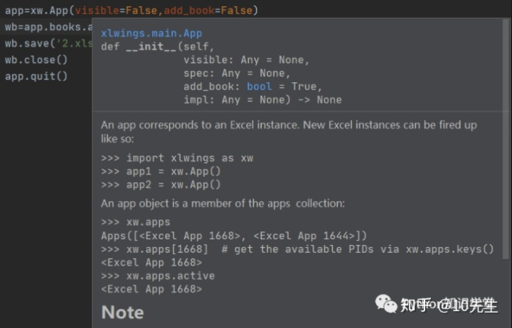
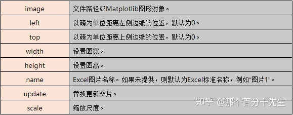
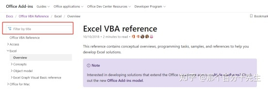
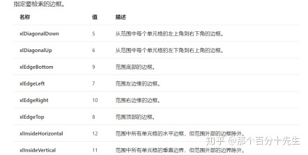
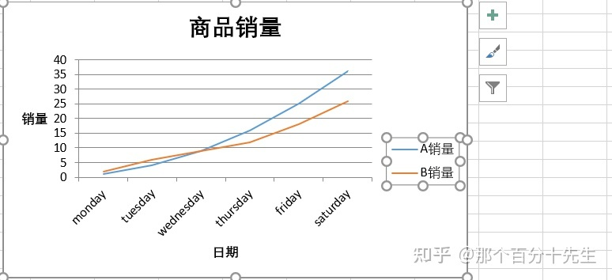
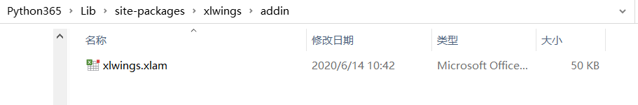
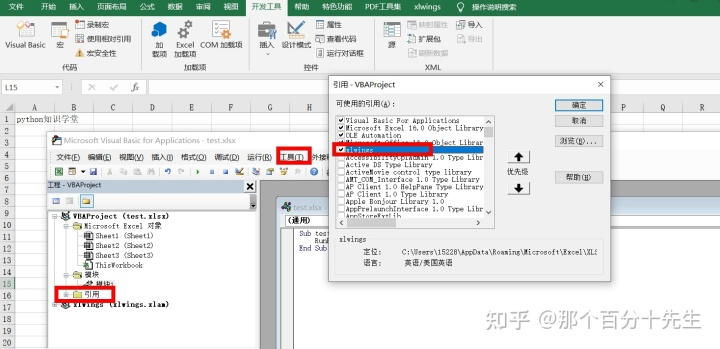

# xlwings教程


> 作者：那个百分十先生
> 链接：[知乎专栏：Python操作Excel 办公自动化，让你的Excel飞起来](https://www.zhihu.com/column/c_1316498113192546304)
> 来源：知乎
> 著作权归作者所有。商业转载请联系作者获得授权，非商业转载请注明出处。

# **Xlwings**基本操作

在日常的工作中，我们或多或少的都要和Excel打交道。甚至在一些领域，某一些业务人员的主要工作就是处理Excel表格，处理大量的Excel数据并生成一系列的报表。对于程序员朋友们来说，更喜欢以代码的形式来处理Excel，从而实现一些Excel中的一些函数功能。那么在Python中处理Excel的模块(或者说叫第三方库)有哪些呢，主要如下：

- **Xlrd：**xlrd支持.xls、.xlsx Excel文件的读，并不支持.xls、.xlsx 文件的写。
- **Xlwt：**xlwt仅支持.xls文件的写。
- **Xlsxwriter：**xlswriter支持.xlsx文件的写，另外此模块还支持VBA操作。
- **Win32com：**win32com支持Excel的.xlsx和.xls，安装pypiwin32即可使用该库，该模块现在只支持Windows系统。
- **Openpyxl：**openpyxl支持Excel2010多种文件的操作，read_only和write_only两个参数值得注意，该模块对VBA的支持不好，不支持 .xls文件的操作。
- **Xlwings：**xlwings实现了Excel中调用Python，python中调用Excel的骚操作，支持.xls文件的读，支持.xlsx文件的读写，支持VBA的操作，另外还支持和Numpy、Pandas结合进行操作，在很大程度上扩展了应用。
- **Pandas :**pandas不用多说了，数据分析领域最为重要的库，支持.xls和.xlsx读写。


接下来就将对Xlwings的相关知识进行介绍了：


**一. 安装(教程使用: windows下python3.6.5)**

```python3
pip install xlwings
```


**二. 导入**

```python3
import xlwings as xw
```

注: xlwings的更新和卸载和python其他的库的操作一致，不在赘述


**三. 实践操作**

**3.1. 创建新的Excel文件**

```python3
# 方法1：
# 创建一个新的App，并在新App中新建一个Book
wb = xw.Book()
wb.save('1.xlsx')
wb.close()

# 方法2：
# 当前App下新建一个Book
# visible参数控制创建文件时可见的属性
app=xw.App(visible=False,add_book=False)
wb=app.books.add()
wb.save('1.xlsx')
wb.close()
#结束进程
app.quit()
```

下图展示了xlwings.mian.app的 __init__方法



作者：那个百分十先生
链接：https://zhuanlan.zhihu.com/p/149878144
来源：知乎
著作权归作者所有。商业转载请联系作者获得授权，非商业转载请注明出处。


**3.2. 打开已有的Excel文件**

```python3
import xlwings as xw
app=xw.App(visible=True,add_book=False)
#不显示Excel消息框
app.display_alerts=False 
#关闭屏幕更新,可加快宏的执行速度
app.screen_updating=False  
wb=app.books.open('1.xlsx')
# 输出打开的excle的绝对路径
# print(wb.fullname)
wb.save()
wb.close()
# 退出excel程序，
app.quit()
# 通过杀掉进程强制Excel app退出
# app.kill() 
# 以第一种方式创建Book时，打开文件的操作可如下
wb = xw.Book('1.xlsx')
```

xw.Book()打开文件传入的参数可选，具体如下：


官网中有一句提醒:

> If you have the same file open in two instances of Excel, you need to fully qualify it and include the app instance. You will find your app instance key (the PID) via xw.apps.keys():xw.apps[10559].books['FileName.xlsx']

也是就是说：

（1）每个App对应一个PID值，这个PID值可以认为是一个标签，用来识别不同的App。

（2）创建工作簿之前要先创建App: app=xw.App(visible=Ture,add_book=False)

（3）通过xlwings可以创建多个App，每个App又可以创建多个工作簿，每一个工作簿中又可 以创建多个Sheet。

（4）需要注意的是这些App之间是相互独立的，也就是操作不同的工作簿的时候就要找到对 应的App。

**建议使用：xw.Book('filename.xlsx') 来打开工作薄或引用工作簿，不容易出错**

xw.Book 和 xw.books使用差异

**3.3. 读入和写入值**

```python3
# 在A1单元格写入值
# 实例化一个工作表对象
sheet1 = wb.sheets["sheet1"]
# 或者
# sheet1 =xw.books['1.xlsx'].sheets['sheet1']
输出工作簿名称
# print(sheet1.name)
# 写入值
sheet1.range('A1').value = 'python知识学堂'
# 读值并打印
print('value of A1:',sheet1.range('A1').value)
# 清空单元格内容,如果A1中是图片，此方法没有效果
sheet1.range('A1').clear()
# 传入列表写入多行值
sheet1.range('A1').value = [['a','b','c],[1,2,3]]

# 当然也可以将pandas的DataFrame数据写入
import pandas as pd
df = pd.DataFrame([[1,2], [3,4]], columns=['A', 'B'])
sheet1.range('A1').value = df
# 读取数据，输出类型为DataFrame
sheet1.range('A1').options(pd.DataFrame, expand='table').value


# 支持添加图片的操作
import numpy as np
import matplotlib.pyplot as plt
fig = plt.figure()
x = np.arange(20)
plt.plot(x, np.log(x))
sheet1.pictures.add(fig, name='MyPlot', update=True)
```


```python3
n =65
n = chr(n)   # ASCII字符
pos = '%s%d' % (n, 1)
print(pos)  #A1
```

Tips: 对于**A-Z**的单元格可以这样进行访问，在进行循环读写的时候比较好用


**3.4. 活动对象**

```python3
#  但存在活动工作表的时候（比如打开一个1.xlsx文件以后），可以直接操作
#  不存在的时候，就需要通过Book经sheet获取range
import xlwings as xw
xw.Range('A1').value = 'Python知识学堂'
```

**Tips: xlwings中的对象层次结构为：**

**apps->books->sheets->range**


**3.4. 范围和切片取值，范围写值**

假设现有的1.xlsx文件的数据如下：


```python3
# 传递字符串或索引/切片使得取值更加方便
app = xw.App(visible=False,add_book=False)
wb = app.books.open('1.xlsx')
range_1 = wb.sheets[0].range('A1:D3')
print(range_1)

# <Range [1.xlsx]Sheet1!$A$1:$D$3>
print(range_1.value)
# [[None, 'a', 'b', None], [0.0, 1.0, 2.0, None], [1.0, 3.0, 4.0, None]]
# 切片方式
range_2 = wb.sheets[0][:3, :3]
# <Range [1.xlsx]Sheet1!$A$1:$C$3>

# 写值的情况
# 使用列表将1,2,3,4写入A1,A2,A3,A4
# transpose=True进行转置写入
wb.sheets[0].range('A1').options(transpose=True).value=[1,2,3,4]
# 将二维数组，储存在A1:B3中
wb.sheets[0].range('A1').options(expand='table').value=[[1,2],[3,4],[5,6]]
```


**3.5. 一些属性或方法**

在Excel的读写中，经常需要获取当前打开的文件的数据行和列数，在Xlwings中的获取方式：

假设数据文件如下：


```python3
ws = wb.sheets['Sheet1']
shape = ws.used_range.shape
print(shape) #(2, 3)

nrow1 = ws.api.UsedRange.Rows.count
ncol1 = ws.api.UsedRange.Columns.count
print(nrow1) # 2
print(ncol1) # 3

rng = ws.range('A1').expand()
nrow2 = rng.last_cell.row
ncol2 = rng.last_cell.column
print(nrow2)  # 3
print(ncol2)  # 1
```

（I） 如果整张表为空，上述代码输出是怎样的呢？

（II）数据文件如下，那么上述代码的输出是怎样的呢？即返回结果是有数据矩阵的行数？


当然我们可以使用遍历的方式去寻找Excel文件中非空行的数量

```python3
# 可以多选几列进行一起判断
rownum = initial_value
while (ws.range('A'+str(row)).value !=None
    rownum += 1
```

> UsedRange属性返回工作表中所有已使用范围的单元格区域是指：单元格中有数值、公式、单元格格式化设置（例如：单元格字体设置、边框设置等等）

**可以对比Openpyxl和其他的库，看看计算Excel文件数据行数和列数的差异，欢迎留言！**

单元格还有其他一些属性和方法：

```python3
# 获取"AB2"单元格的行标和列标
print(ws.range('AB2').row)
print(ws.range('AB2').column)

# 高度和宽度
print(ws.range('AB2').row_height)
print(ws.range('AB2').column_width)

# 设置颜色,可根据RGB颜色表寻找自己想要的颜色
ws.range('AB2').color = (255,0,0)

# 获取颜色
print(ws.range('AB2').color)

# 清除颜色格式
ws.range('AB2').color = None

# 使用公式
ws.range('AB2').formula='=SUM(A1,A2)'

# 另外还可以获取某一个单元格的公式
print(ws.range('AB2').formula_array)

# 清除工作表的所有内容但是保留原有格式
ws.clear_contents()
# 当然了还有很多其他的属性
#range.address        range.current_region    range.end
#range.api            range.autofit          range.expand
```

# Xlwings的一些API知识

介绍Xlwings的一些API知识，并展示一些小例子，让大家可以跟着教程进行实际的操作。

## 一、Apps

先来看一点点代码

```js
import xlwings as xw
app1 = xw.App()
app2 = xw.App()
print(xw.apps)
```

第二、三行代码建立了两个创建工作簿实例，运行后发现：默认的打开了两个工作簿，这两个工作簿会显示的存在于你的桌面。


如果不想显示，我们在创建实例的时候可以使用参数：**wx.App(visible=False)**

第四行输出为：**Apps([<Excel App 9244>, <Excel App 19476>])**，其中[9244]和[19476]即为这两个实例的PID。

**其他方法：**

```js
xw.apps.active          # 返回活动的应用程序
# print(xw.apps.active) # 输出<Excel App 9244>，活动应用程序的key
xw.apps.count           # 计算app的总数
xw.apps.add()           # 新增一个app
xw.apps.keys()          # 返回所有Excel实例的PID
```

**Active：**很多小伙伴可能对激活不是很清楚，举个例子：我们再使用Excel软件的时候，可以打开好几个工作簿，但是我们不能对打开的工作簿同时进行操作，只能操作其中一个。这个Active的作用就是激活其中的一个你想使用的工作簿，将它变为**活动工作簿**。

## 二、APP

如何找出当前打开的所有Book对象呢？

我们先建立几个workbook,看看都有什么效果：

```js
for i in range(1,4):
    wookbook = xw.Book() #创建新的App并在创建的App新建Book
    print(wookbook)
print(xw.books)          #当前打开的所有Book对象的集合
```

**输出如下：**

<Book [工作簿1]>

<Book [工作簿2]>

<Book [工作簿3]>

Books([<Book[工作簿1]>,<Book [工作簿2]>, <Book [工作簿3]>])


可知：xw.Book()会新建工作簿，这里默认会新建一个App，即打开Excel程序，并新建一个工作簿。而且Book这种方式则会打开多个窗口，之前所说的App.books.open方式则不会。

**顺便提一下引用工作簿的方法：（使用工作簿前要引用工作簿）**

```js
xw.Book('工作簿1')   # 通过Book
xw.books['工作簿1']  # 通过books
```


```js
（1）wb.app.calculate()               # Calculates all open books.
（2）wb.app.calculation = ‘manual’    # 设置计算模式
（3）wb.app.display_alerts = True     # 默认值为True。False的情况下执行操作的时候会忽略Excel的提示和警报消息(即弹窗信息)    
（4）wb.app.screen_updating = False   # 禁止屏幕更新(刷新)
（5）wb.app.range(cell1, cell2=None)  # 获取单元格
（6）wb.app.selection                 # 将所选单元格作为Range返回
（7）xw.App().version                 # 返回Excel程序版本号
```


## 三、Books

首先要知道所有的Book构成Books,**即Books是所有Book对象的集合**，在第二节中已有描述。

**那么Books中有哪些常用的方法或属性呢？**

我们在示例中进行简单的说明:

```js
import xlwings as xw
app1 = xw.App()
app2 = xw.App()
print(xw.books)
book_keys = xw.apps.keys()
first_book = book_keys[0]             # 取列表的第一个值
print(xw.apps[first_book].books)      # 应用
print(app1.books.active)              # 激活一个Book
print('count1:',app1.books.count)     # 先打印一下app1下Book的总数
app1.books.add()                      # 增加一个新的Book,此新建的Book将自动变成被激活的Book
print('count1:',app1.books.count)     # 再次打印app1下Book的总数
app1.books.open('1.xlsx')             # 打开操作，如果工作簿未打开则打开，若它已经打开，则返回工作簿对象。
# 或指定绝对路径打开文件  app1.books.open('D:\datafile\1.xlsx') 
print(app1.books.open('1.xlsx'))      # 再一次打印app1下Book的总数
print('count1:',app1.books.count)
```

以上print的输出依次为：


此时win10系统中，资源管理器的Excel进程显示如下:


可以看出，app1下打开了3个工作簿，app2下打开了1个工作簿。若想关闭某一个app下的全部工作簿的时候，可以使用kill()，如app1.kill()。

## 四、Book

官网中介绍到:A book object is a member of the books collection，**即Book对象是Books集合的成员**。下表显示了xw.Book()和xw.books三种情况下的操作：（上篇推文也有介绍）


**Tips:** 差别在于xw.Book()创建新的工作薄实例，xw.books是在活动工作薄中寻找一个实例

xw.Book()打开文件的时候，可选参数较多，具体的参数可以查看其构造函数，或者查看上篇文章

[10先生：Python操作Excel的Xlwings教程（一）65 赞同 · 44 评论文章](https://zhuanlan.zhihu.com/p/149878144)

**方法和属性**

```js
xw.Book.activate(steal_focus=True)   # True则激活最前面的窗口，并将焦点从python移交给excel
xw.Book.app                          # 获取创建工作簿的app对象
xw.Book.caller()                     # 当通过RunPython从Excel调用Python函数时引用调用的工作簿
xw.Book.set_mock_caller()            # 设置当前工作薄为Python代码的调用者即set_mock_caller让Python知道谁是调用者
xw.Book.close()                      # 关闭工作簿而不进行保存
xw.Book.selection                    # 返回选定的单元格作为Range
xw.Book.macro()                      # 在Excel VBA中运行Sub或Function
xw.Book.name                         # 返回工作簿的名称
xw.Book.names                        # 返回一个名称集合
xw.Book.save(path=None)              # 保存工作簿，可传入保存路径，同名会直接覆盖
xw.Book.sheets                       # 返回表示工作簿中所有工作表的工作表集
```

对于**xw.Book.set_mock_caller()**的解释此处引用网上的一段话：

> “有时代码是从Python环境直接调试或调用的,没有使用Excel里面的RunPython, 这时候没有地方设定代码的调用者是谁,就运行这个函数来假装一下某个workbook就是这些代码的调用者,让Python环境与调用者能够关联起来。”

```js
# 此代码在Excel中通过RunPython和Python直接运行
import os
import xlwings as xw
def my_macro():
    sheet = xw.Book.caller().sheets[0]
    sheet.range('A1').value = '我爱python知识学堂'
if __name__ == '__main__':
    xw.Book('1.xlsm').set_mock_caller()     # 设置调用者
my_macro()
```

关于这个例子在后期会在解释，主要是告诉大家可以使用Python实现对Excel的操作实现。具体实现的时候我们还要搭建在Excel中运行Python的环境。

关于一些操作不理解的小伙伴建议打开编译器进行实践一下哦。

**五、小结**

这次的推文主要介绍了**Apps**、**App**、**Books**和**Book**相关的知识，对于这些概念觉可以这样理解和记忆：

- **App相当于Excel程序(前文的进程截图)；**
- **Book相当于Excel的工作簿；**
- **Range相当于单元格，也可以是单元格区域；**
- **多个Excel程序则由Apps表示，单个为App；**
- **多个工作簿用Books表示，单个为Book；**
- **多个工作表用Sheets表示，单个为Sheet。**


# **Xlwings**中**Sheet**和**Range**等API相关的知识

本次推文将继续上次的知识点，将继续介绍**Xlwings**中**Sheet**和**Range**等API相关的知识，并展示一些小例子，让大家可以跟着教程进行学习。

*顺便说一下，本人使用的Xlwings的版本号为：0.19.1*

Xlwings中的Sheet对应的是Excel文件中的Sheet页，Range对应的是Excel文件的单元格，在Xlwings中Range在有些时候也表示一个选定的区域。当然在选定Range之前，我们是需要进行Sheet页的引用的。

## **一、Sheets**

跟Apps和App的关系一样，所有的Sheet构成Sheets集合。

假设现在我们有一个Excel文件1.xlsx，它有两个Sheet页Shee1和Shee2,我们尝试进行以下的操作:

```js
import xlwings as xw
wb = xw.Book('1.xlsx')    #以xw.Book()方式打开工作簿
print(wb.sheets)          #查看当前工作簿的所有Sheet详情
print(wb.sheets.active)   #激活一个Sheet发现是Sheet2
# 在Sheet1前新增一个Sheet并命名
print(wb.sheets.add(name='Python知识学堂', before='Sheet1'))
# print(wb.sheets.add(name='Python知识学堂', 1)) 
print(wb.sheets.active)   #激活Sheet页，这个Sheet是新增的 
```

**以上代码中的输出如下：**

Sheets([<Sheet [1.xlsx]Sheet1>, <Sheet[1.xlsx]Sheet2>])

<Sheet [1.xlsx]Sheet2>

<Sheet [1.xlsx]Python知识学堂>

<Sheet [1.xlsx]Python知识学堂>

且打开的1.xlsx文件的Sheet页的详情如下截图：


所以我们总结出其中的两个操作:

```js
# 返回激活(活动)工作表
wb.sheets.active
# 新增Sheet页，参数默认均为None，其中name为名称，before指在那个页签前插入，after为哪个页签之后插入。
wb.sheets.add(name= None,before = None,after = None)
```

##  二、**Sheet**

之前提及到所有的Sheet构成Sheets集合，这一小节我们将介绍属于Sheet(或)Sheets的一些常用方法或属性（操作）。

假设现在我们有一个Excel文件2.xlsx，它有两个Sheet页Shee1和Shee2,我们尝试进行以下的操作:

```js
import xlwings as xw
wb = xw.Book('2.xlsx')
wb.sheets[0])          # 使用索引值引用"2.xlsx"文件的Sheet1
wb.sheets['Sheet1']    # 直接使用名称引用"2.xlsx"文件的Sheet1
wb.sheets.add()        # 新建一个Sheet。默认为Sheet3
wb.sheets.count        # 获得工作簿中工作表sheet的数量   
```

**方法或属性：**

```js
sheet = wb.sheets['Sheet1']    # 引用工作表Sheet1
sheet.active                   #获取当前活跃的工作簿
sheet.autofit()                #在整个工作表上自动调整宽度,可传参数
sheet.autofit(axis='c')        # 在整个工作表上自动调整列的宽度
sheet.autofit(axis='r')        # 在整个工作表上自动调整行的宽度
sheet.book                     # 返回指定Sheet的book,输出 <Book [2.xlsx]>
sheet.cells                    # 返回一个Range对象，该对象表示Sheet上的所有单元格（而不仅仅是当前正在使用的单元格）输出<Range [2.xlsx]Sheet1!$1:$1048576>
sheet.name                     # 获取工作表的名称
sheet.name = '我爱python知识学堂'# 工作表重命名
sheet.clear()                  # 清空工作表中的内容和格式
sheet.index                    # 返回对应sheet的索引值，从0计数
sheet.delete()                 # 删除工作表
sheet.clear_contents()         # 清除工作表的内容，但保留格式
# 工作表sheet中有数据区域最大的行数，法1
sheet['a1048576'].end('up').row           
# 工作表sheet中有数据区域最大的行数，法2
sheet.used_range.last_cell.row
# 工作表sheet中有数据区域最大的列数，法1
sheet['xfd1'].end('left').column
# 工作表sheet中有数据区域最大的列数，法2                           
sheet.used_range.last_cell.column        
# 返回工作表中已经使用的单元格区域 
sheet.api.UsedRange 或sheet.used_range  
sheet.api.row('2:4').insert    # 插入行，在第2-4行插入空白行
sheet.api.row('2:4').delete    # 删除行
# 取值
sheet.cells(行号,列号).value
```


## **三、Range**

在Excel中我们做的最多的就是对Excel单元格的操作，在Xlwings中涉及到的**Range**的方法也是比较多的。这一章我们将使用小例子的方式探究Xlwings中涉及到的有关**Range**的方法或属性。

假设我们有一个名为“3.xlsx”的文件，其数据如下：


先导入模块，并打开工作簿，引用sheet1工作表：

```js
import xlwings as xw
app = xw.App(visible=True,add_book=False)
wb = app.books.open('3.xlsx')
sheet = wb.sheets['Sheet1']    # 或wb.sheets[0]
wb.close()
app.quit()
app.kill()
```

正如之前讲述的，上述代码是创建应用打开Excel的，这种方式打开之后需要进行关闭。

以下我们使用Xlwings中的Book

```js
import xlwings as xw
wb = xw.Book('3.xlsx')
# sheet = wb.sheets[0]
# 这里我们直接引用“当前活动工作表的单元格”
Range = xw.Range('A1')
```

**方法或属性：**

```js
xw.Range('A1')                # 引用A1单元格
xw.Range('A1').value          # 取A1单元格的值,输出1.0
xw.Range('A1').value = 12     # 设置值
xw.Range('A1').raw_value      # 直接获取并设置所使用（pywin32）引擎发送/接受的值，而无需进行任何xlwings数据清理/转换。
xw.Range ('A1:B2').value      # 引用区域并取值，输出[[1.0, 9.0],[2.0, 10.0]]，以二元list形式
# 与上述等效
xw.Range ((1,1), (2,2)).value   
# 与上述等效
xw.Range (('A1'), ('B2')).value 
# 添加超链接
xw.Range ('A9').add_hyperlink(address='www.baidu.com') 
xw.Range ('A10').address      # 返回表示范围参考的字符串值，输出 $A$10
xw.Range ('A1').api           # 返回所使用引擎的本机对象
xw.Range ('A1').autofit()     # 自动调整范围内所有单元格的宽度和高度。
# 如果仅自动调整列的宽度，使用sheet.range('A1:B2').columns.autofit()
# 如果仅自动调整行的高度，使用 sheet.range('A1:B2').rows.autofit()
xw.Range ('A1').clear()       # 清除所选择单元格的内容和格式，可选择范围
# 清除范围的内容，但保留格式。
xw.Range ('A1').clear_contents()   
xw.Range ('A1').color         #获取A1单元格的背景色。
#设置A1单元格的背景色，RGB颜色
xw.Range ('A1').color = (255,255,255)  
xw.Range ('A1').color = None  #删除背景色
xw.Range ('B1:C4').column     # 返回所选范围第一列的列标，此处输出2
xw.Range ('B2:C4').row        # 返回所选范围第一行的行标，此处输出2
xw.Range ('A1:B2').count      # 返回所选范围单元格数量，此处输出4
# 此属性返回一个Range对象，该对象表示由（但不包括）空白行和空白列或工作表的边缘的任意组合限制的范围，好比是一片连接的区域
xw.Range ('A1').current_region  
xw.Range ('A1').delete()      # 删除单元格A1,有参数left和up，如delete('up')。如果省略，Excel将根据范围的形状进行决定。
xw.Range ('A1').end('down')   # 返回一个Range对象，该对象表示包含源范围的区域末尾的单元格。此处输出<Range [3.xlsx]Sheet1!$A$8>，参数可传down,up,left,right，其实也是返回ctrl + 方向
# 设置A9单元格公式计算的值
xw.Range ('A9').formula='=SUM(B1:B5)'
# 输出公式值，输出'=SUM(B1:B5)'
print(xw.Range ('A9').formula)       
# 以指定的格式返回范围的地址
xw.Range ('A1:B2').get_address()  
#参数：
#row_absolute(bool ,默认为True)–设置为True可以将引用的行部分作为绝对引用返回。#column_absolute(bool,默认为True)–设置为True可以将引用的列部分作为绝对引用返回。
#include_sheetname(bool ,默认为False)–设置为True可以在地址中包含工作表名称。
#external(bool ,默认为False)–设置为True以返回带有工作簿和工作表名称的外部引用。
#具体的情况大家可以传入几个参数试试
xw.Range ('A1:B2').height     # 返回单元格(范围)的高度
xw.Range ('A1:B2').width      # 返回范围的宽度
# 获取范围的高度（以磅为单位）
xw.Range ('B2:C4').row_height      
# 设置范围的高度（以磅为单位）
xw.Range ('B2:C4').row_height = 15 
```

那么Xlwings是如何获取一个Range的行列数呢，以及其他的一些操作呢，我们来看以下的代码：

```js
# 获取范围行和范围列
xw.Range ('B2:C4').rows        # 返回一个RangeRows对象，该对象表示指定范围内的行。
xw.Range ('B2:C4').columns     # 返回一个RangeRows对象，该对象表示指定范围内的列。
xw.Range('B2:C4').rows.count   # 获取范围行
# 获取范围列
xw.Range('B2:C4').columns.count 
xw.Range ('B2').left           # 返回从A列的左边缘到范围左边缘的距离
xw.Range ('B2').top            # 返回从第1行的顶部边缘到范围的顶部边缘的距离
xw.Range ('A1').hyperlink      # 返回单元格中的超链接（对多个单元格没效）
# 插入单元格
xw.Range ('A3').insert(shift='right')  
#返回指定范围的右下角单元格
range = xw.Range ('A1:C4').last_cell    
range.last_cell.row            # 4
range.last_cell.column         # 3
xw.Range("A4:C4").api.merge()  # 合并单元格通过pywin32的api调用merge
xw.Range("A4:C4").api.unmerge()# 拆分单元格
xw.Range('A1').number_format   # 获取设置Range的number_format
# 设置Range的number_format
xw.Range('A1:C3').number_format = '0.00%' 
xw.Range('A1:A3').paste()      # 将剪贴板中的范围粘贴到指定范围
# 调整指定范围的大小
xw.Range('A1:A3').resize(row_size = None,column_size = None )  
# 选定单元格进行移动
xw.Range('B2:C4').offset(row_offset=0,column_offset=0) 
#row_offset行偏移，column_offset列偏移
xw.Range('B2:C4').shape        # 以数组的形式返回所选范围的值
xw.Range('B2:C4').sheet        # 返回Range所属的Sheet对象
xw.Range('B2:C4').size         # 返回所选范围单元格个数(元素个数)
```

这里想到一个参数：在读值的时候如果想将行或列方向信息需要保留下来，需要设置options的参数值。

**请分析这两行代码的输出：**

```js
xw.Range('B2:C4').options(ndim=2).value
xw.Range('A1:C1').options(ndim=2).value
```

## 四、**小结**

大家可以看出，这些API的知识还是很丰富的，这也是Xlwings强大的地方，当然了这些小操作结合起来就会有意想不到的效果。介绍了这么多的API知识，相必你也跃跃欲试了，赶快操作起来吧！


# 继续介绍Xlwings中API相关的知识

继续介绍Xlwings中API相关的知识，并展示一些小例子，让大家可以跟着教程进行学习：

我们先来看看Xlwings中的**Shape对象**，Office开发文档对Shape进行了介绍，传送门如下：

[https://docs.microsoft.com/zh-cn/office/vba/api/excel.shapedocs.microsoft.com/zh-cn/office/vba/api/excel.shape](https://link.zhihu.com/?target=https%3A//docs.microsoft.com/zh-cn/office/vba/api/excel.shape)

**即Shape对象代表绘图层中的对象，例如自选图形、任意多边形、OLE 对象或图片。**

## 一、Shapes

假设我们有一个文件1.xlsx，在sheet1内有一个shape矩形，如下图所示：


我们进行运行以下的代码：

```js
import xlwings as xw
wb = xw.Book('1.xlsx')
wb.sheets[0].shapes         # 输出Shapes([<Shape 'Rectangle 1' in <Sheet [1.xlsx]Sheet1>>])
wb.sheets[0].shapes.count   # 返回集合中的对象数，输出1
```

可以看出上述代码输出了这个Excel文件中的Shape对象，且计数了这个所选sheet页中形状的个数，所以在日常的操作中，我们可以使用count来对其中的Shape总数进行统计。

## 二、Shape

跟Sheet对象一样，**Shape对象是Shapes集合的成员**：我们来看一下Shape中有哪些方法或属性，我们使用的Excel文件还是1.xlsx。先导入模块，打开文件，引用sheet1工作表：

```js
import xlwings as xw
wb = xw.Book('1.xlsx')
sheet = wb.sheets[0]
```

**方法或属性**

```js
xw.Shape(1).activate       # 激活里面的一个shape
# 或者 sheet.shapes[0].activate, 使用print打印可查看输出结果
xw.Shape(1).delete         # 删除里面的一个shape
xw.Shape(1).height         # height 返回或设置表示形状高度的点数。
xw.Shape(1).left           # left 返回或设置表示形状水平位置的点数。
sheet.shapes[0].top        # top 返回或设置表示形状垂直位置的点数
sheet.shapes[0].width      # width 返回或设置表示形状宽度的点数。
sheet.shapes[0].type       # type 返回形状的类型。输出 auto_shape
xw.Shape(1).name           # name 返回或设置形状的名称,此处输出 Rectangle 1
xw.Shape(1).parent         # parent 返回形状的父级,输出<Sheet [1.xlsx]Sheet1>
```

**Shape**的相关操作就介绍到这里了，个人觉得不是很常用的功能，大家有兴趣的可以研究Xlwings的main函数，来查看**Shape**对象的使用方法。

## 三、Charts

图表类的对象是Excel中经常碰到的，Xlwings中页存在很多操图表的方法，接下来我们介绍Xlwings中的图表对象（**Charts**和**Chart**）。

假设现在我们有数据表2.xlsx,其sheet页的有一个表格数据生成的两张图表，接下来我们使用xlwings来进行相关的操作：


```js
import xlwings as xw
wb = xw.Book('2.xlsx')
sheet = wb.sheets[0]
s = sheet.charts
print(s)
```

最后一行输出：

Charts([<Chart **'Chart 1'** in <Sheet [2.xlsx]Sheet1>>,<Chart **'Chart 2'** in <Sheet [2.xlsx]Sheet1>>]) 

即工作表上所有Chart对象的集合

如果想新增一个图表，可使用**add()**方法，其有四个参数可选**left，top，width，height**

```js
sheet.charts.add(100,100)  # 会在所选sheet上(100,100)位置新建一个图表(空白表)
# left (float, default 0):left position in points
# top (float, default 0):top position in points
# width (float, default 355):width in points
# height (float, default 211):height in points
sheet.charts.count   # count属性可统计图表的个数，输出2
```

## 四、Chart

跟之前介绍的Sheet等对象一样，chart对象是charts集合的成员。那么chart中有哪些API是值的我们关注的呢？我们来逐个进行介绍：

**引用chart有两种方法**

```js
sheet.charts[0]                     # 法一，输出<Chart 'Chart 1' in <Sheet [2.xlsx]Sheet1>>
sheet.charts['图表 2']              # 法二，输出<Chart 'Chart 2' in <Sheet [2.xlsx]Sheet1>>
sheet.charts[0].api                 #返回所使用引擎的本机对象
sheet.charts[0].chart_type)         # 返回并设置图表的图表类型，输出line
sheet.charts[1].chart_type          # 返回并设置图表的图表类型，输出bar_clustered
sheet.charts[0].delete()            # 使用索引删除图表1。
sheet.charts[0].height              # 返回或设置代表图表高度
sheet.charts[0].left                # 返回或设置代表图表水平位置
sheet.charts[0].top                 # 返回或设置代表图表垂直位置
sheet.charts[0].width               # 返回或设置代表图表宽度
sheet.charts[0].name)               # 返回或设置图表名称，输出Chart 1
sheet.charts[0].parent )            # 返回图表的父级对象，输出<Sheet [2.xlsx]Sheet1>
sheet.charts[0].set_source_data()   # 设置图表的源数据范围。
```

对于设置图表的源数据范围的方法**set_source_data()**，我们来看一个综合的例子,

我们打开一个已经存在的Excel文件3.xlsx，其sheet工作表有两列数据变量1和变量2，我们使用Xlwings操作这个数据生成我们的图表，代码如下：

```js
import xlwings as xw
sheet = xw.Book('4.xlsx').sheets[0]
#新增chart
chart = sheet.charts.add()                        
#数据源：sheet.range('A1:B7')，或者sheet.range('A1').expand()
chart.set_source_data(sheet.range('A1').expand())  
chart.chart_type = 'line' 
#设置图标的类型，此处为线型，具体的类型查看office官网VBA操作的手册
#标题名称
title='python知识学堂粉丝数'                    
chart.api[1].SetElement(2)
#设置标题名称
chart.api[1].ChartTitle.Text =title          
chart.api[1].SetElement(302)                  #横线
#横轴标题名称
chart.api[1].Axes(1).AxisTitle.Text = "日期"  
chart.api[1].SetElement(311)
chart.api[1].Axes(2).AxisTitle.Text = "粉丝数" #纵轴标题名称
```

经上述一系列的操作，生成的图表如下，（为了展示图表是经过手动移动位置的，可通过height等属性进行设置）


## 五、小结

以上就是Xlwings中**Shape**和**Chart**对象的相关知识，纵观全文，干货还是满满的，是不是觉得使用Xlwings来操作Excel中的这些对象还是很方便呢？


# 继续介绍Xlwings中其他API相关的知识

在文章中重点介绍了**Xlwings**中的**Shape**和**Chart**等API知识点。本次推文将继续上次的知识点，将继续介绍Xlwings中其他API相关的知识，并展示一些小例子，让大家可以跟着教程进行学习：

##  **一、Pictures**

图片类的操作在Excel中是非常常见的，那么在Xlwings中对图片的操作有哪些常用的方法和属性呢？接下来我将介绍其中的一些常用的操作，假设我们现在有一个文件1.xlsx，其sheet页的有两张图片：


我们来看一些代码：

```js
import xlwings as xw
wb = xw.Book('1.xlsx')
wb.sheets[0].pictures         # 查看引用的sheet页中图片的对象
wb.sheets[0].pictures.count   # 统计引用的sheet页中图片对象的数量，次数输出2
```

那么我们如何增加新的图片呢,我们可以这样进行操作：

```js
wb.sheets[0].pictures.add(r'C:\Users\LEGION\Desktop\1.jpg')  
```

当然了增加的图片会有默认的位置，具体的位置大家一试便知，值的说明的是这个**add()**方法它有几个参数，总结如下：




值的一提的是，Xlwings支持对**Matpoltlib对象**的操作，那么在Xlwings中怎么插入Matplotlib的图像呢？

```js
import matplotlib.pyplot as plt
import numpy as np
x = [-4,-3,-2,-1,0,1,2,3,4]
figure = plt.figure()
plt.plot(np.cos(x)/2,np.sin(x)/3)
wb.sheets[0].pictures.add(figure, name='sin#cos', update=True) 
```

当然，可同样使用上述介绍的参数对图片的位置和大小进行调整。


## **二、Picture**


***老话：picture对象是pictures集合的成员\***

**方法和属性：**

```js
wb.sheets[0].pictures[0]            #引用图片，或者wb.sheets[0].charts['PictureName']
wb.sheets[0].pictures[0].delete()   # 删除图片
wb.sheets[0].pictures[0].height     # 返回或设置代表图片高度
wb.sheets[0].pictures[0].left       # 返回或设置图片水平位置
wb.sheets[0].pictures[0].width      # 返回或设置图片宽度。
wb.sheets[0].pictures[0].top        # 返回或设置图片垂直位置。
wb.sheets[0].pictures[0].name       #返回或设置图片的名称。
wb.sheets[0].pictures[0].parent     # 返回图片的父级,输出<Sheet[1.xlsx]Sheet1>
wb.sheets[0].pictures[0].update('图片路径')    #用新图片替换现有图片
```

以上就是**picture对象**的相关方法，注意在使用这些方法的时候一定要引用正确的sheet页的picture，不要引用错对象。

前几篇文章和今天介绍的picture就是Xlwings中常见的一些对象知识了。


## **三、题外分析**

有人有可能有这样的一个疑问，Excel的**VBA**和**Xlwings**在处理数据方面速度是怎样的呢？这里不在进行写代码的方式来说明，我们来分析一下看看，以便分析一下**VBA**的在这方面的优势和不足，假设我们现在要计算上十万行Excel文件，操作其中两列数据的和：

**方法1：**使用Xlwings读Range的数据进行操作，显然这种方式要使用for循环反复的引用range对象，使得在计算的过程中这是非常耗时的。

**方法2：**使用Xlwings将数据一次性读入python的List中，在List中进行计算返回结果，这样的操作方式避免了大量引用range对象，减少了耗时，当然了数量量很大的时候也就对设备的内存提出了新的要求。

**方法3：**使用VBA进行操作。VBA是Visual Basic的一种宏语言，是在其桌面应用程序中执行通用的自动化(OLE)任务的编程语言。跟使用使用第三方库不一样的是，VBA操作的时候是基于更加底层的接口来实现的，所以从这个角度来看，这种方式是肯定比方法1快的。

**方法4：**当然了，我们知道xlwings是支持pandas的对象的，因此我们也可以使用pandas来进行处理，毕竟pandas是处理数据的神器，而且pandas处理大量的数据也有其独有的优势，这是值得我们注意的。

不管哪种方式，都是解决问题的方式，都值得我们在平时的学习中进行总结和归纳，感兴趣的小伙伴可以生成数据实时这几种方式到底哪种更优哦。

**Python操作Excel的Xlwings教程就到这边，欢迎大家留言一起讨论，下次的文章也都是跟python，机器学习，办公自动化等相关的内容啦！因为有一些小伙伴不懂python嘛，所以本人可能更新python的基础教程，当然在每次的基础教程后面，会出题提供大家练习，也会根据所写的内容进行拓展！**


# 对Excel表格进行设置字体大小和颜色


最近在使用Xlwings的时候，发现有对Excel表格进行设置字体大小和颜色等操作。想必小伙伴们在日常的工作中也遇到了这样的问题，为此我这里总结一些操作供大家参考：**一、创建表格**`import xlwings as xw App = xw.App(visible=False, add_book=False) wb = App.books.add() sheet = wb.sheets.add('test_sets') # Expands the range according to the mode provided. Ignores empty top-left cells (unlike ``Range.end()``). # 将第一行置为1,2,3,4 # 将第2行开始的第一列置为11,12,13,14 sheet.range(1, 1).expand('right').value = [1, 2, 3, 4] sheet.range(2, 1).expand('down').options(transpose=True).value = [10, 20, 30, 40] wb.save('test_sets.xlsx') wb.close() App.quit() `
创建的结果：新建了一个名test_sets.xlsx的文件，在该文件的test_sets页签上写入了一些数据，数据显示如下：
接下来我们将基于这个表格，做一些字体的大小颜色等设置的操作。**二、字体属性设置**在官网的Xlwings的教程中没有介绍直接设置Excel单元格字体的方式，但是提供了一个API供我们使用：
这句话是什么意思呢？其实就是说使用api将返回windows Excel库中的api调用，api可以参考官方文档链接：[https://docs.microsoft.com/en-us/office/vba/api/overview/excel](https://link.zhihu.com/?target=https%3A//docs.microsoft.com/en-us/office/vba/api/overview/excel)另外，我们在微软官网的VBA教程中，发现了一个关于Font对象的相关操作：VBA设置字体的方式就是：`Worksheets("Sheet1").Range("A1:C5").Font.Bold = True`Bold就是给选中的单元格进行加粗。这个Font对象其他的一些属性还有以下几种：我们来介绍一下其中主要的一些属性的意义（摘自官网）：那么在Xlwings中该怎么设置字体的大小呢？我们可以这样来进行设置，在设置之前我们先看看设置之前单元格的或字体的默认值：`import xlwings as xw App = xw.App(visible=False, add_book=False) wb = App.books.open('test_sets.xlsx') sheet = wb.sheets('test_sets') sheetFont_name = sheet.range('B1').api.Font.Name sheetFont_size = sheet.range('B1').api.Font.Size sheetFont_bold = sheet.range('B1').api.Font.Bold sheetFont_color = sheet.range('B1').api.Font.Color sheetFont_FontStyle = sheet.range('B1').api.Font.FontStyle print('字体名称:', sheetFont_name) print('字体大小:', sheetFont_size) print('字体是否加粗:', sheetFont_bold) print('字体颜色:', sheetFont_color) print('字体类型:',sheetFont_FontStyle) wb.save() wb.close() App.quit()`**输出结果如下：****字体名称**: 等线**字体大小**: 11.0**字体是否加粗**: False**字体颜色**: 0.0**字体类型**: 常规
接下来，我们来对单元格B1进行一些设置：`sheet.range('B1').api.Font.Name = '微软雅黑' sheet.range('B1').api.Font.Size = 20 sheet.range('B1').api.Font.Bold = True sheet.range('B1').api.Font.Color = 0x0000ff sheet.range('B1').api.Font.FontStyle = "Bold Italic"`
上述代码的设置结果为，具体的显示如下所示：**字体名称**: 微软雅黑**字体大小**: 20.0**字体是否加粗**: True**字体颜色**: 255.0**字体类型**: 加粗倾斜其中字体颜色为255.0，即为红色。当然了设置的时候我们传入的十六进制的颜色值，这个十六进制的颜色值大家可以百度一下这个颜色值。根据最后的输出结果，我们在进行设置的时候也可以直接进行这样的设置：`sheet.range('B1').api.Font.Color = 255.0`
大家可以参考VBA中的设置：`Charts("Chart1").Axes(xlValue).TickLabels.Font.Color = _ RGB(0, 255, 0) `**三、单元格属性设置**单元格的一些设置前期也有部分涉及到，这次我们来总结一下并增加一些其他的属性设置。我们先看代码：`sheet.range('B1').api.HorizontalAlignment = -4108    # -4108 水平居中 sheet.range('B1').api.VerticalAlignment = -4130      # -4108 垂直居中 sheet.range('B1').api.NumberFormat = "0.00"          # 设置单元格的数字格式 `文件结果显示如下：上述数值是怎么确定的呢？是查看Excel的文档的，拿HorizontalAlignment 举例：**Step1**: 进入到网址：[https://docs.microsoft.com/en-us/office/vba/api/overview/excel](https://link.zhihu.com/?target=https%3A//docs.microsoft.com/en-us/office/vba/api/overview/excel)**Step2**: 在Filter by title地方输入HorizontalAlignment。**Step3**:找到属于Range下的这个链接，点进入。 **Step4**: 我们就可以看到：
Range.HorizontalAlignment Property的值。**Step5**:点2处的XlHAlign，就可以看到一些属性值的介绍了：
所以说，大家要多阅读官网的文档，多查一下它们的用法。接着我们来看一下边框的设置，在设置边框值之前，这里给出常用边框的索引：[https://docs.microsoft.com/en-us/office/vba/api/excel.xlbordersindex](https://link.zhihu.com/?target=https%3A//docs.microsoft.com/en-us/office/vba/api/excel.xlbordersindex)**给定一个常用链接，包含Excel对象模型中的枚举对象的一些信息：****[https://docs.microsoft.com/en-us/office/vba/api/excel(enumerations)](https://link.zhihu.com/?target=https%3A//docs.microsoft.com/en-us/office/vba/api/excel(enumerations))****我们上述查询的xlbordersindex就可以在这个界面查询得到。**
假设现在我们的Excel的Sheet的数据形式如下：我们运行一下代码： `# 从范围中每个单元格的左上角到右下角的边框 sheet.range('C1').api.Borders(5).LineStyle = 1 sheet.range('C1').api.Borders(5).Weight = 2 # 从范围中每个单元格的左下角到右上角的边框 sheet.range('D1').api.Borders(6).LineStyle = 1 sheet.range('D1').api.Borders(6).Weight = 2 # 左边框，虚线 sheet.range('C3').api.Borders(7).LineStyle = 2 sheet.range('C3').api.Borders(7).Weight = 2 # 顶边框，双点划线 sheet.range('C3').api.Borders(8).LineStyle = 5 sheet.range('C3').api.Borders(8).Weight = 2 # 底部边框，直线，设置边框粗细为2 sheet.range('C3').api.Borders(9).LineStyle = 1 sheet.range('C3').api.Borders(9).Weight = 2 # 右边框，点划线 sheet.range('C3').api.Borders(10).LineStyle = 4 sheet.range('C3').api.Borders(10).Weight = 2 `结果显示如下：是不是很简单，就是对Borders()中传入不同的index值就可以达到不同的效果。
**备份表格区域：**


# [调用VBA设置图表](https://zhuanlan.zhihu.com/p/269631666)

在上篇推文重点介绍了字体和单元格一些设置的知识点。大家在使用**Xlwings**对**Excel**进行操作的时候，可以参考其中的一些案例。

这期推文我们来简单看一下**Chart**的一些设置，在**Xlwings**中的**Chart**是一个对象。

微软官方开发文档

[Chart 对象 (Excel)docs.microsoft.com/zh-cn/office/vba/api/excel.chart(object)](https://link.zhihu.com/?target=https%3A//docs.microsoft.com/zh-cn/office/vba/api/excel.chart(object))

有相应的说明。

## **一、数据准备**

假设我们在1.xlsx的Sheet1页中有以下的数据:


有三列数据，依次是日期，A销量和B销量。

## **二、制作表格**

我们使用上表的数据来制作表格，代码如下：

```python
sheet = xw.Book('1.xlsx').sheets[0]
chart = sheet.charts.add()
#数据源：sheet.range('A1:C7')，或者sheet.range('A1').expand()
chart.set_source_data(sheet.range('A1').expand())
chart.chart_type = 'line'                    #线形
title='商品销量'                             #标题名称
chart.api[1].SetElement(2)                   #显示标题
chart.api[1].ChartTitle.Text =title          #设置标题名称
chart.api[1].SetElement(302)                 #在轴下方显示主要类别轴标题。
chart.api[1].Axes(1).AxisTitle.Text = "日期" #横轴标题名称
chart.api[1].SetElement(311)                 #在轴旁边显示主要类别的轴标题。
chart.api[1].Axes(2).AxisTitle.Text = "销量" #纵轴标题名称
```

运行以后我们得到以下的图表：


**三、图标设置**

有小伙伴私信想将上述的右边的图表说明转到图表的下面，也就是这样：


这个怎么操作呢？在**Xlwings**官网中我们没有做找到相应的说明，那么我们就要借助api的方法和**VBA**来进行相应的操作了，但是我们不知道在**VBA**中对应的方法和属性是什么？


**不过没有关系，我们可以使用录制宏来观察。具体如下：**

**Step_1**: 点击Excel的“开发工具”，点击“录制宏”，点击“确定”。

**Step_2**: 选中图例说明：



**Step_3**:右键，点击“图例格式”


**Step_4**:右边我们看到了设置图例格式，我们选中“靠下”：


之后，我们看到表格已经发生变化：


**Step_5**：查看VBA代码:


通过上述**VBA**代码我们就可以看到相应的函数，我们来解释一下代码：

第一行代码的意思是选中这个表格的Legend；

第二行代码时将这个选中的Legend的Position设置为xlBottom。


那么在**Xlwings**中我们的**xlBottom**的值为多少呢？

请看这个VBA官网的说明，链接如下：

[XlLegendPosition 枚举 (Excel) docs.microsoft.com/zh-cn/office/vba/api/excel.xllegendposition](https://link.zhihu.com/?target=https%3A//docs.microsoft.com/zh-cn/office/vba/api/excel.xllegendposition)


至此，我们就可以使用代码进行设置了：

```python
chart.api[1].Legend.Position = -4107
```


即只需要在上述的代码的最后加上这一行代码就可以完成设置，当然了，使用其他的Value值就可以完成不同的设置。

## **四、总结**

以上就是**Xlwings**中设置**Chart**属性的一些方法，是不是很简单？纵观全文，干货还是满满的。
最后有一句重要的话，**大家要学会看查看一些文档啊，一定要学会呀！**


# [Excel使用VBA调用Python](https://zhuanlan.zhihu.com/p/282110033)

操作Excel的**Xlwings**教程已经陆陆续续出了七篇了，现在是第八篇。历史关于**Xlwings**的一些教程大家可以在看我的主页。在这些教程学习的过程中，有一些小伙伴反映自己有些时候找不到相应的文档，想要实现的功能不知道怎么找资料进行学习。这里我推荐官网的**VBA**教程，在上个关于Xlwings的教程中有相应的体现。说到这也就开始了我们这次推文的主题，在Xlwings中使用VBA的宏来进行Excel的操作。**一、知识准备**在**Xlwings**的官方文档中，我寻找到了一个关于Python API的东西。传送门如下：[https://docs.xlwings.org/en/stable/api.html#](https://link.zhihu.com/?target=https%3A//docs.xlwings.org/en/stable/api.html%23)
**其中有一段关于（Macro）宏指令的描述：****这什么意思呢？**
意思就是：我们可以使用X**lwings**在**Excel VBA**中运行一个子过程或函数，另外这个子过程或函数不是特定工作簿的一部分，而是外接程序的一部分。这个Macro的一个name参数是一个具有或不具有模块名称的子过程或函数。我们在**xlwings**的安装目录下能找到一个Excel加载宏文件- **xlwings.xlam**，在我个人电脑上显示如下：**这个宏文件的作用，可以先简单的理解为在Excel中显示xlwings选项卡，显示之后才可以在Excel中通过VBA执行python的脚本和用户自定义函数（UDF）。**还是简单说明一下吧，假设现在我们新建一个test.xlsx文件，打开文件后我们在菜单栏中是没有**xlwings**这个选项卡的：当我们打开这个**xlwings.xlam**文件并启用宏后，我们Excel菜单栏出现了xlwings的选项卡。**Tips:** xlwings中的**xlwings.bas**文件中可以看到xlwings.xlam中的代码。**二、环境准备**既然我们需要在Excel中通过VBA调用Python，那么就需要进行一些环境的设置。我们进行以下步骤的设置：**Step_1:** **显示“开发工具”。**文件 - 更多 - 选项 - 自定义功能区 - 开发工具 - 确定。**Step_2:** **启用宏。**文件 - 更多 - 选项 - 信任中心 - 信任中心设置 - 宏设置 - 启用所有宏。**Step_3:** **显示xlwings选项卡。**第一部分我们是通过打开python目录下xlwings.xlam文件显示xlwings显示选项卡的额，这个方式是比较直接，但是每一次运行的之前都要先打开这个文件就显得非常麻烦了。Xlwings官方文档中给我们一个好的解决方案：也就是我们可以在cmd黑窗口使用xlwings addin install来进行安装，安装后的成功显示如下： **Step_4:** **配置python编译器的路径，以及执行的python脚本路径。**接下来我们就要进行解释器的配置了，打开测试文件test.xlsx，点击xlwings选项卡我们先勾选右边的RunPython:Use UDF Server。左边的interpreter中我们填入本地Python.exe的路径：D:\Python365\python.exePYTHONPATH中填入的是一个py文件的路径。这里我们先填入一个脚本文件:E:\code，UDF Modules中填入该路径下一个脚本文件的名称，这里我填入的是test.py如下所示：(当然了在UDF Modules中不填入信息，在PYTHONPATH中直接填入文件的全路径也是可以的E:\code\test.py)。**Step_5:** **配置宏加载项。**由于在VBA中调用Python代码，需要xlwings.xlam加载宏的支持。我们来配置一下加载项。点击Excel的“开发工具”，点击“Visual Basic”，点击“工具”，点击“引用”。勾选中xlwings,点击“确定”。**以上步骤就是我们的环境设置了，当然了在这之前我要安装好xlwings。****三、运行测试脚本**我们在test.py文件中输入以下代码：`import xlwings as xw def test_vba():    wb = xw.Book.caller()    sht = wb.sheets[0]    sht.range('A1').value = 'python知识学堂'`接着我们打开test.xlsx文件，点击“开发工具”，点击“Visual Basic”，在VBE代码编辑框中输入以下截图所示的代码：（截图包含VBE和Excel结果图）VBA脚本如下所示：`Sub test_vba()    RunPython ("from test import test_vba;test_vba()") End Sub`然后我们点击运行这个宏，我们可以在Excel中看到A1单元格已经写上了“python知识学堂”。当然了，我们可以为这个宏添加一个按钮（这属于VBA的知识，这里就不过多介绍了），具体的操作大家可以自己看文档实现一下。 四、注意事项你如果在运行的时候报错**“子过程或函数没有定义”**，则检查我们的xlwings的引用是否勾选成功：如下所示：另外，我使用的是.xlsx文件中进行试验的，当我们需要保存其中的VBA代码的时候，我们直接将结果另存为一个.xlsm的文件即可。**五、总结**以上就是本次推文的所有内容了，当然了选例比较简单，只是为了说明在怎么在VBA中调用**xlwings**编写的代码。这种**VBA**调用Python的操作，虽然比较麻烦，但是可以实现更多的功能，有更多的可能性。


