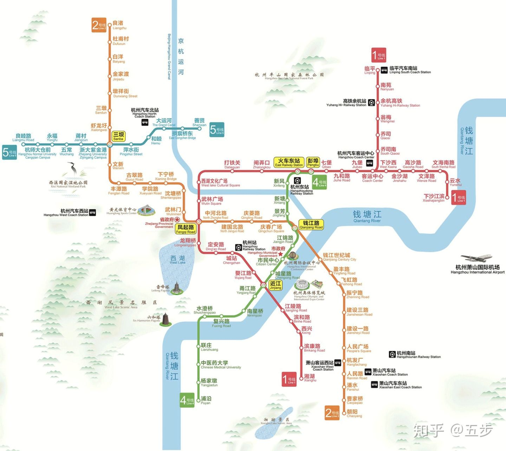

tags: #学科/心理学 
tags: #内容/格式塔心理学 
#知识 
tags: #来源/转载 

# 简述

格式塔心理学（gestalt psychology），又叫完形心理学，是西方现代心理学的主要学派之一，诞生于德国，后来在美国得到进一步发展。该学派既反对美国构造主义心理学的元素主义，也反对行为主义心理学的刺激—反应公式，主张研究直接经验（即意识）和行为，强调经验和行为的整体性，认为整体不等于并且大于部分之和，主张以整体的动力结构观来研究心理现象。该学派的创始人是[韦特海默](https://baike.baidu.com/item/%E9%9F%A6%E7%89%B9%E6%B5%B7%E9%BB%98/4025307)，代表人物还有[苛勒](https://baike.baidu.com/item/%E8%8B%9B%E5%8B%92/4025357)和[考夫卡](https://baike.baidu.com/item/%E8%80%83%E5%A4%AB%E5%8D%A1)。

## 学科背景

编辑 语音

### 社会背景

20世纪初，由于种种原因，心理学的中心开始由欧洲向美国转移，但是格式塔心理学却出现于德国，这在很大程度上应归因于当时德国的社会历史背景。在资本主义发展史上，德国的资产阶级革命进行得相对比较晚，但是自1871年德国统一后，德国的经济迅速发展，到20世纪初，德国已经赶上并超过英、法等老牌的资本主义国家，一跃成为欧洲乃至世界强国；德国整个社会的[意识形态](https://baike.baidu.com/item/%E6%84%8F%E8%AF%86%E5%BD%A2%E6%80%81)也都是强调统一，强调[主观能动性](https://baike.baidu.com/item/%E4%B8%BB%E8%A7%82%E8%83%BD%E5%8A%A8%E6%80%A7)。当时的政治、经济、文化、科学等领域也都受到这种意识形态的影响，倾向于整体研究，心理学自然也不能例外。

### 哲学背景

格式塔心理学的产生除了受特定的社会历史条件影响外，还有其哲学背景。首先就是[康德](https://baike.baidu.com/item/%E5%BA%B7%E5%BE%B7/5618)的哲学思想。康德认为客观世界可以分为“现象”和“[物自体](https://baike.baidu.com/item/%E7%89%A9%E8%87%AA%E4%BD%93)”两个世界，人类只能认识现象而不能认识物自体，而对现象的认识则必须借助于人的[先验](https://baike.baidu.com/item/%E5%85%88%E9%AA%8C)范畴。格式塔心理学接受了这种[先验论](https://baike.baidu.com/item/%E5%85%88%E9%AA%8C%E8%AE%BA)思想的观点，只不过它把先验范畴改造成了“经验的原始组织”，这种经验的原始组织决定着我们怎样知觉外部世界。康德认为，人的经验是一种整体现象，不能分析为简单的元素，心理对材料的知觉是赋予材料一定形式的基础并以组织的方式来进行的。康德的这一思想成为格式塔心理学的核心思想源泉以及理论构建和发展的主要依据。

格式塔心理学的另一个哲学思想基础是[胡塞尔](https://baike.baidu.com/item/%E8%83%A1%E5%A1%9E%E5%B0%94)的[现象学](https://baike.baidu.com/item/%E7%8E%B0%E8%B1%A1%E5%AD%A6/19799)。胡塞尔认为，现象学的方法就是观察者必须摆脱一切预先的假设，对观察到的内容作如实的描述，从而使观察对象的本质得以展现。现象学的这一认识过程必须借助于人的直觉，所以现象学坚持只有人的直觉才能掌握对象的本质，并提出了具体的操作步骤。这对格式塔心理学的研究方法提供了具体指导。

### 科学背景

19世纪末20世纪初，科学界产生了许多新发现，其中物理学的“[场论](https://baike.baidu.com/item/%E5%9C%BA%E8%AE%BA)”思想就是其中之一。科学家们把“场”定义为一种全新的结构，而不是把它看作分子间引力和斥力的简单相加。格式塔心理学家们接受了这一思想，并希望用它来对心理现象和机制做出全新的解释。因此他们在自己的理论中提出了一系列新名词，如考夫卡提出了“行为场”“环境场”“物理场”“[心理场](https://baike.baidu.com/item/%E5%BF%83%E7%90%86%E5%9C%BA)”“[心理物理场](https://baike.baidu.com/item/%E5%BF%83%E7%90%86%E7%89%A9%E7%90%86%E5%9C%BA)”等多个概念。

### 心理学背景

格式塔心理学的产生还有其特定的心理学理论基础，其中主要有[马赫](https://baike.baidu.com/item/%E9%A9%AC%E8%B5%AB/50290)的理论和形质学派理论。马赫认为感觉是一切客观存在的基础，也是所有科学研究的基础，而这些感觉与其元素无关；物体的形式是可以独立于物体的属性的，可以单独被个体所经验。马赫的这些理论，尤其是反元素主义的观点，直接被格式塔心理学家们所吸收和利用。[克里斯蒂安·冯·厄棱费尔](https://baike.baidu.com/item/%E5%85%8B%E9%87%8C%E6%96%AF%E8%92%82%E5%AE%89%C2%B7%E5%86%AF%C2%B7%E5%8E%84%E6%A3%B1%E8%B4%B9%E5%B0%94)进一步深化和扩展了马赫的理论，倡导研究事物的形、形质。形质学派的[整体观](https://baike.baidu.com/item/%E6%95%B4%E4%BD%93%E8%A7%82)是一种朴素的整体观。这种理论也对格式塔心理学产生了重要影响。 [1]  

## 发展历程

编辑 语音

### 学派诞生

1912年，德国心理学家韦特海默在[法兰克福大学](https://baike.baidu.com/item/%E6%B3%95%E5%85%B0%E5%85%8B%E7%A6%8F%E5%A4%A7%E5%AD%A6)做了[似动现象](https://baike.baidu.com/item/%E4%BC%BC%E5%8A%A8%E7%8E%B0%E8%B1%A1)（phi phenomenon）的实验研究，并发表了文章《移动知觉的实验研究》来描述这种现象。这一般被认为是格式塔心理学学派创立的标志。 [2]   由于这个学派初期的主要研究是在柏林大学实验室内完成的，所以有时又被称为柏林学派。学派的代表人物除了韦特海默，还有苛勒和考夫卡。

### 学派发展

学派成立后，韦特海默、苛勒和考夫卡继续发展格式塔理论。1913-1920年，苛勒在大西洋加那利群岛的腾乃那夫岛任普鲁士科学院人类学研究所主任，并在那里做了著名的猩猩实验。1911-1927年，考夫卡一直任职于吉森大学，并进行了题为“对格式塔心理学的贡献”的系列实验研究。1922年考夫卡发表于《心理学期刊》的《知觉——完形说引论》引起了强烈反响。 [3]   1921年，韦特海默、苛勒和考夫卡联合精神病理学家库特·戈尔茨坦和汉斯·格鲁尔一起创办了刊物《心理研究》（Psychologische Forschung），不久就成为格式塔学派的喉舌。它一共发行了二十二卷，于1938年暂行停刊。 [4]   格式塔学派成立后，影响越来越大。到二战前，已经成为德国占统治地位的心理学派。 [5]  

### 移师美国

1924年考夫卡来到美国，先后到[康奈尔大学](https://baike.baidu.com/item/%E5%BA%B7%E5%A5%88%E5%B0%94%E5%A4%A7%E5%AD%A6)、[芝加哥大学](https://baike.baidu.com/item/%E8%8A%9D%E5%8A%A0%E5%93%A5%E5%A4%A7%E5%AD%A6)和[威斯康星大学](https://baike.baidu.com/item/%E5%A8%81%E6%96%AF%E5%BA%B7%E6%98%9F%E5%A4%A7%E5%AD%A6)任教；自1927年起在[史密斯学院](https://baike.baidu.com/item/%E5%8F%B2%E5%AF%86%E6%96%AF%E5%AD%A6%E9%99%A2)任教，直至1941年去世。1933年韦特海默接受邀请到美国纽约的社会研究新学院任教，直至1943年去世。1934年苛勒来到[哈佛大学](https://baike.baidu.com/item/%E5%93%88%E4%BD%9B%E5%A4%A7%E5%AD%A6)任[威廉·詹姆斯](https://baike.baidu.com/item/%E5%A8%81%E5%BB%89%C2%B7%E8%A9%B9%E5%A7%86%E6%96%AF)讲座教授，1935年到美国[斯沃斯莫尔学院](https://baike.baidu.com/item/%E6%96%AF%E6%B2%83%E6%96%AF%E8%8E%AB%E5%B0%94%E5%AD%A6%E9%99%A2)担任心理学教授。

格式塔心理学在美国的发展大体上可分为三个时期。第一个是初步接纳时期（1921—1930），格式塔心理学家及其理论观点初步为美国心理学界所接受。第二个是迁移时期（1927—1945），在这个时期，格式塔学派的三位创立者和他们的一些学生相继移居到美国，都在美国的一些大学担任教职并从事科研工作。第三个是艰难的综合期（1945年以来）。尽管美国心理学家对格式塔心理学的接纳很缓慢，但它还是吸收了众多的美国追随者，他们发展这一理论并把它运用到了一些新的领域。 [6]  

### 持续影响

20世纪50年代以来，在格式塔心理学诞生地的德国，由于有了适宜的政治和文化气氛，这一学派又有了复兴的趋势，有一些心理学家发展了格式塔理论与研究的一些主要的概念和方法，开拓了诸多理论研究和实际应用课题。格式塔心理学对日本心理学界的影响也很大，且这种影响在20世纪30年代最显著，并一直持续到60年代。此外，格式塔心理学在前苏联、意大利和中国也产生了重大的影响。 [7]  

## 代表人物

编辑 语音

代表人物

主要研究和贡献

韦特海默

通过似动研究确立了格式塔心理学理论基础；将格式塔心理学的原理应用于人类的创造性思维，并主张在教育中培养学生的创造性思维；研究了伦理学问题

苛勒

把格式塔原理应用到发展心理学；研究了顿悟学习；把格式塔心理学理论系统化

考夫卡

明确认定心理学的任务是研究行为与心理物理场的因果关系；在发展心理学中贯彻完形理论

本表格资料来源： [8]  

## 理论体系

编辑 语音

### 研究对象

格式塔心理学认为心理学研究的对象有两个，一个是直接经验，一个是行为。

**直接经验**

格式塔心理学家认为心理学应该研究意识，但为了和[构造主义心理学](https://baike.baidu.com/item/%E6%9E%84%E9%80%A0%E4%B8%BB%E4%B9%89%E5%BF%83%E7%90%86%E5%AD%A6)有所区别，于是就用“直接经验”来表述。所谓直接经验，就是主体当时感受到或体验到的一切，即主体在对现象的认识过程中所把握到的经验。这种经验是一个有意义的整体，它和外界的直接客观刺激并不完全一致。格式塔心理学认为，直接经验是一切科学研究的基本材料。

**行为**

格式塔心理学的另一个研究对象是行为。格式塔心理学把行为分为显明行为和细微行为，前者指个体在自身行为环境中的活动，后者指有机体内部的活动。格式塔心理学研究的是显明行为。

### 研究方法

**整体观察法**

格式塔心理学把直接经验作为自己的研究对象，这种直接经验是一种自然现象，只能通过观察来发现，因此格式塔心理学强调运用[自然观察法](https://baike.baidu.com/item/%E8%87%AA%E7%84%B6%E8%A7%82%E5%AF%9F%E6%B3%95)。但由于直接经验中也包括一种类似于意识的东西，而对这一部分的研究必须依赖于主体的[内省](https://baike.baidu.com/item/%E5%86%85%E7%9C%81)，但是内省不能用作分析，只能用来观察。不管是观察还是内省，格式塔心理学要求都必须从整体上去把握。

**实验现象学方法**

格式塔心理学以直接经验（有时也称现象经验）和显明行为作为研究对象，因此该流派在具体研究中除了使用整体观察法，还运用[实验法](https://baike.baidu.com/item/%E5%AE%9E%E9%AA%8C%E6%B3%95)。格式塔心理学所运用的实验法主要是实验现象学方法。

### 主要理论观点

**同型论**

[同型论](https://baike.baidu.com/item/%E5%90%8C%E5%9E%8B%E8%AE%BA)（或同机论）（isomorphism）指一切经验现象中共同存在的“完形”特性，在物理、生理与心理现象之间具有对应的关系，所以三者彼此是同型的。这是格式塔心理学家提出的一种关于心物和心身关系的理论。格式塔心理学家认为，心理现象是完整的格式塔，是完形，不能被人为地区分为元素；自然而然地经验到的现象都自成一个完形，完形是一个通体相关的有组织的结构，并且本身含有意义，可以不受以前经验的影响。格式塔心理学家认为，物理现象和生理现象也有完形的性质。正因为心理现象、物理现象和生理现象都具有同样的完形性质，因而它们是同型的。格式塔心理学家认为，不论是人的空间知觉还是时间知觉，都是和大脑皮层内的同样过程相对等的。这种解决心物关系和心身关系的理论就是同型论。

**完形组织法则**

完形组织法则（gestalt laws of organization）是格式塔学派提出的一系列有实验佐证的知觉组织法则，它阐明知觉主体是按什么样的形式把经验材料组织成有意义的整体。在格式塔心理学家看来，真实的自然知觉经验，正是组织的动力整体，感觉元素的拼合体则是人为的堆砌。因为整体不是部分的简单总和或相加，整体不是由部分决定的，而整体的各个部分则是由这个整体的内部结构和性质所决定的，所以完形组织法则意味着人们在知觉时总会按照一定的形式把经验材料组织成有意义的整体。

格式塔心理学家认为，主要有五种完形法则：图形-背景法则、接近法则、相似法则、闭合法则和连续法则。这些法则既适用于空间也适用于时间，既适用于知觉也适用于其他心理现象。其中许多法则不仅适用于人类，也适用于动物。在格式塔心理学家看来，完形趋向就是趋向于良好、完善，或完形是组织完形的一条总的法则，其他法则则是这一总的法则的不同表现形式。

**学习理论**

以组织完形法则为基础的学习论，是格式塔心理学的重要组成部分之一。它由顿悟学习、学习迁移和创造性思维构成。

（1）[顿悟学习](https://baike.baidu.com/item/%E9%A1%BF%E6%82%9F%E5%AD%A6%E4%B9%A0)（insightful learning）是格式塔心理学家所描述的一种学习模式。所谓顿悟学习，就是通过重新组织知觉环境并突然领悟其中的关系而发生的学习。也就是说，学习和解决问题主要不是经验和尝试错误的作用，而在于顿悟。

（2）[学习迁移](https://baike.baidu.com/item/%E5%AD%A6%E4%B9%A0%E8%BF%81%E7%A7%BB)（learning transfer）是指一种学习对另一种学习的影响。也就是将学得的经验有变化地运用于另一情境。对于产生学习迁移的原因，[桑代克](https://baike.baidu.com/item/%E6%A1%91%E4%BB%A3%E5%85%8B)认为是两种学习材料中的共同成分作用于共同的[神经通路](https://baike.baidu.com/item/%E7%A5%9E%E7%BB%8F%E9%80%9A%E8%B7%AF)的结果，而格式塔心理学家则认为是由于相似的功能所致，也就是由于对整个情境中各部分的关系或目的与手段之间的关系的领悟。例如，在笼中没有竹竿时，猩猩也能用铁丝和稻草代替竹竿取香蕉，这就是相似功能的迁移。

（3）[创造性思维](https://baike.baidu.com/item/%E5%88%9B%E9%80%A0%E6%80%A7%E6%80%9D%E7%BB%B4)（productive thinking）是格式塔心理学颇有贡献的一个领域。韦特海默认为创造性思维就是打破旧的完形而形成新的完形。在他看来，对情境、目的和解决问题的途径等各方面相互关系的新的理解是创造性地解决问题的根本要素，而过去的经验也只有在一个有组织的知识整体中才能获得意义并得到有效的使用。因此，创造性思维都是遵循着旧的完形被打破，新的完形被构建的基本过程进行的。

**心理发展**

格式塔心理学家把完形理论应用到发展心理学研究中。[行为主义](https://baike.baidu.com/item/%E8%A1%8C%E4%B8%BA%E4%B8%BB%E4%B9%89/1750752)用[联结](https://baike.baidu.com/item/%E8%81%94%E7%BB%93/7734898)的观点解释学习，而格式塔心理学则用知觉场的改变来解释学习。他们认为，意义的改变就是心理的改变或发展，这是用刺激—反应的联结公式无法解释的。他们认为，行为是由相互作用的力组成的动力模式支配的。个人操作的场是内部和外部的力积极活动的心理物理场。这种操作的场既可以在物理场的基础上从局部或分子的观点进行研究，也可以在涵盖经验和行为各方面的整体或大分子水平上进行研究。格式塔心理学家认为，分子行为应由物理学家和生理学家来研究，而整体行为则适合心理学家来研究。

**人格理论**

格式塔心理学派把人格看作是一个动态的整体，行为场有两极，即自我（人格）和环境。当一个人的目标（即动机和需要）一经达成，紧张就会消失。场内的力处于不平衡状态时就会产生紧张。这种紧张可以在自我和环境之间形成，从而加强极性（polarity），破坏两极的平衡，造成个人自我与环境之间的差异，使自我处于更加清醒的知觉状态；它也可以在自我内部或在环境中形成，然后再导致不平衡。 [9]  

## 主要贡献

编辑 语音

中国心理学家[叶浩生](https://baike.baidu.com/item/%E5%8F%B6%E6%B5%A9%E7%94%9F)认为格式塔心理学有以下几点贡献：

**批判元素主义**

格式塔心理学最突出的贡献之一就是对以构造主义心理学为代表的[元素主义心理学](https://baike.baidu.com/item/%E5%85%83%E7%B4%A0%E4%B8%BB%E4%B9%89%E5%BF%83%E7%90%86%E5%AD%A6)的批判。格式塔心理学家称构造主义心理学为砖泥心理学，也即心理是砖，由联想（泥）粘合在一起。他们认为构造心理学用内省把人的心理还原为元素是人为的，并不能揭示心理的实质。

**促进人本主义兴起**

格式塔心理学强调[整体论](https://baike.baidu.com/item/%E6%95%B4%E4%BD%93%E8%AE%BA)，这一观念对[人本主义心理学](https://baike.baidu.com/item/%E4%BA%BA%E6%9C%AC%E4%B8%BB%E4%B9%89%E5%BF%83%E7%90%86%E5%AD%A6)的发展有很大的影响。比如人本主义心理学的创始人[马斯洛](https://baike.baidu.com/item/%E9%A9%AC%E6%96%AF%E6%B4%9B)就曾在韦特海默的指导下学习整体分析的方法，并最终形成了人本主义心理学的整体研究的方法论原则。同样，人本主义的几个著名代表人物也都强调对象的整体体验和描述。这些都表明了格式塔心理学对人本主义心理学的影响。

**对认知心理学的贡献**

格式塔心理学对[认知心理学](https://baike.baidu.com/item/%E8%AE%A4%E7%9F%A5%E5%BF%83%E7%90%86%E5%AD%A6/4291)的贡献分为两部分。首先是对狭义的认知心理学即信息加工认知心理学的贡献。信息加工认知心理学重视研究心理的内部机制，强调从整体上对信息的输入、加工和输出进行模拟研究，这一点可以说是深受格式塔心理学的影响。其次是对广义的认知心理学的贡献，如[知觉心理学](https://baike.baidu.com/item/%E7%9F%A5%E8%A7%89%E5%BF%83%E7%90%86%E5%AD%A6)、[学习心理学](https://baike.baidu.com/item/%E5%AD%A6%E4%B9%A0%E5%BF%83%E7%90%86%E5%AD%A6)等。可以毫不夸张地说，正是格式塔心理学卓有成效的知觉研究才推动知觉心理学脱离感觉心理学而成为一个独立的分支。同样，格式塔心理学的学习理论也很有成就，顿悟说也成为人类历史上较有影响的一个学习理论。

**对社会心理学的贡献**

场的思想最早是由格式塔心理学家们引入心理学的，这一思想后来在[社会心理学](https://baike.baidu.com/item/%E7%A4%BE%E4%BC%9A%E5%BF%83%E7%90%86%E5%AD%A6/80310)中得到广泛的应用，许多社会心理学理论的建立都以此为出发点。同时，格式塔心理学卓有成效的实验现象学方法为后来的社会心理学的发展提供了方法论基础，实验现象学方法及其变种已成为现代社会心理学研究普遍采用的有效方法。 [10]  

## 主要缺陷

编辑 语音

中国心理学史家[车文博](https://baike.baidu.com/item/%E8%BD%A6%E6%96%87%E5%8D%9A)认为格式塔心理学主要存在以下几点问题：

**陷入唯心主义境地**

本来格式塔理论重视自然观察，从接近实际生活而言，是可取的。但是他们认为知觉自身具有完形性质，不受过去经验的影响，于是极力缩小甚至否认过去经验在认识过程中的作用，使“完形”变成超验的东西。完形心理学夸大了心理的能动性，用先验的模式和主体内在的规律解释心理形成的完整性，其结果是导致先验论和主观唯心主义。

**未摆脱形而上学的束缚**

格式塔心理学把整体与部分对立起来，认为先有整体，后有部分；整体决定部分，而部分对整体毫无作用。因此该理论是片面的。该理论只重视质的分析而忽视量的分析。他们认为当时的心理学尚处于幼稚时期，对经验只适合做质的分析，尚不宜做量的分析。其实[定性分析](https://baike.baidu.com/item/%E5%AE%9A%E6%80%A7%E5%88%86%E6%9E%90)和[定量分析](https://baike.baidu.com/item/%E5%AE%9A%E9%87%8F%E5%88%86%E6%9E%90)是相互依存、不可分割的，因此，只强调质的观察而忽视量的研究也是片面的。格式塔心理学认为心理与行为是场的现象，所以主张当前的事件只受当前情境的影响，而不受现在、未来心理事实的影响。该理论忽视发展的观点和历史因果的分析，也是片面的。

**理论不太严谨**

格式塔心理学忽视生理基础的研究；有的概念比较含糊，没有十分严格地规定出它们的科学含义；有的实验缺乏足够的证据。同时该流派在自己的理论中使用了大量的数理概念而不加特别说明，许多概念有被滥用的倾向，这使得格式塔心理学的理论过于晦涩深奥，使人难以理解。这一切都影响了格式塔心理学完善学科建设，使其没有建立起完善的理论体系。 [11]

# 应用之于格式塔心理学

作者：五步
链接：https://www.zhihu.com/question/19882606/answer/1458672667
来源：知乎
著作权归作者所有。商业转载请联系作者获得授权，非商业转载请注明出处。

看到有人回答【知觉是最重要的】，那就来说说在设计里面的格式塔原则应用。

在现实生活中，我们往往会按照一系列原则将对象组织成单元，而这就是应用了格式塔组织原则。

**1.接近原则**

相近的元素倾向于被组织成单元。

&lt;img src="https://pic1.zhimg.com/50/v2-a3e2573c04df26fb1eb2d14975aca43d_720w.jpg?source=1940ef5c" data-caption="" data-size="normal" data-rawwidth="1404" data-rawheight="896" data-default-watermark-src="https://pic1.zhimg.com/50/v2-b0d7b60f52fe85f60fe29ab2445cd6fe_720w.jpg?source=1940ef5c" class="origin_image zh-lightbox-thumb" width="1404" data-original="https://pica.zhimg.com/v2-a3e2573c04df26fb1eb2d14975aca43d_r.jpg?source=1940ef5c"/&gt;

我们在图中看到的，其实就是一条条竖线，但是由于两两相近，我们往往认为是7组双竖线，他们会一起出现或者消失。因为互相接近的东西更容易让我们认为是同一组的元素。

**2.相似原则**

相像的物体往往被组合在一起。

&lt;img src="https://pic3.zhimg.com/50/v2-99475069e09eb17d3788c8e1d618af61_720w.jpg?source=1940ef5c" data-caption="" data-size="normal" data-rawwidth="1392" data-rawheight="888" data-default-watermark-src="https://pic1.zhimg.com/50/v2-e57635e08fbb40718f5d6f8b0efe0bbc_720w.jpg?source=1940ef5c" class="origin_image zh-lightbox-thumb" width="1392" data-original="https://pic3.zhimg.com/v2-99475069e09eb17d3788c8e1d618af61_r.jpg?source=1940ef5c"/&gt;

你在图中看到了什么？一排O，一排X，由上往下横向排列；而不会认为是OXOXOX的顺序一列一列竖着排列，因为相像的东西我们认为他们是一组的。

以上两个原则我们常常可以在一些APP的界面设计中运用，很好的区分模块

**3.良好连续原则**

更具有连续性的物体被我们认为是一起的。

&lt;img src="https://pica.zhimg.com/50/v2-805f354a970be89bf99f28a870e6159d_720w.jpg?source=1940ef5c" data-caption="" data-size="normal" data-rawwidth="1404" data-rawheight="890" data-default-watermark-src="https://pic1.zhimg.com/50/v2-770be9125c17d8c58270199276a63781_720w.jpg?source=1940ef5c" class="origin_image zh-lightbox-thumb" width="1404" data-original="https://pica.zhimg.com/v2-805f354a970be89bf99f28a870e6159d_r.jpg?source=1940ef5c"/&gt;

如图所示，我们更倾向于有2条线，一条是AB，一条是CD，而不会认为是AD、CB两条线。因为前者更加有连续性。

这样的连续性不仅体现在形状的连续，也可以用在颜色，粗细的连续上，例如地铁路线图

&lt;img src="https://pic1.zhimg.com/50/v2-f4419107fac0c0b73a77070d458901ec_720w.jpg?source=1940ef5c" data-caption="" data-size="normal" data-rawwidth="1442" data-rawheight="1286" data-default-watermark-src="https://pic3.zhimg.com/50/v2-7ff63f6e9f5a298b5b38c7c280c3d832_720w.jpg?source=1940ef5c" class="origin_image zh-lightbox-thumb" width="1442" data-original="https://pic2.zhimg.com/v2-f4419107fac0c0b73a77070d458901ec_r.jpg?source=1940ef5c"/&gt;

同一种颜色能说明，他们是连续的，能让第一次看到地铁路线图的人也能分辨出来，当然，这种利用颜色的线首先得区分得开。

**4.闭合原则**

闭合的物体会被我们认为是一体的。

&lt;img src="https://pic1.zhimg.com/50/v2-b3e2a90aac538d4dabf6704e23dd9d41_720w.jpg?source=1940ef5c" data-caption="" data-size="normal" data-rawwidth="1406" data-rawheight="884" data-default-watermark-src="https://pic2.zhimg.com/50/v2-68e5660901ed0cee24892fa6589fda49_720w.jpg?source=1940ef5c" class="origin_image zh-lightbox-thumb" width="1406" data-original="https://pic3.zhimg.com/v2-b3e2a90aac538d4dabf6704e23dd9d41_r.jpg?source=1940ef5c"/&gt;

图案被倾向于是由一个完整的圆跟两根不完整的曲线合成的，让人自动脑部出是三个圆形叠加而成。但是，它同样有可能是由一个月亮+一个大饼+一个被咬了两口的大饼（这个表达应该能理解吧）组成的。之所以我们会认为这是三个圆形，因为首先我们看到了第一个圆，然后脑补出另外两个未闭合的圆（由于相似原则）。这个原则在一些海报设计或者LOGO设计中运用较多。

好了。