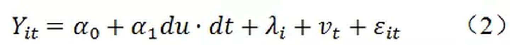

# 双重差分法DID

## 相关介绍-1

> 原文链接：[双重差分法（DID）介绍 - 知乎](https://zhuanlan.zhihu.com/p/48952513)

[双重差分法](https://www.zhihu.com/search?q=双重差分法&search_source=Entity&hybrid_search_source=Entity&hybrid_search_extra={"sourceType"%3A"article"%2C"sourceId"%3A48952513})，英文名Differences-in-Differences，别名“倍差法”，小名“差中差”。作为[政策效应](https://www.zhihu.com/search?q=政策效应&search_source=Entity&hybrid_search_source=Entity&hybrid_search_extra={"sourceType"%3A"article"%2C"sourceId"%3A48952513})评估方法中的一大利器，双重差分法受到越来越多人的青睐，概括起来有如下几个方面的原因：（1）可以很大程度上避免内生性问题的困扰：政策相对于微观经济主体而言一般是外生的，因而不存在[逆向因果](https://www.zhihu.com/search?q=逆向因果&search_source=Entity&hybrid_search_source=Entity&hybrid_search_extra={"sourceType"%3A"article"%2C"sourceId"%3A48952513})问题。此外，使用固定效应估计一定程度上也缓解了遗漏变量偏误问题。（2）传统方法下评估政策效应，主要是通过设置一个政策发生与否的虚拟变量然后进行回归，相较而言，双重差分法的模型设置更加科学，能更加准确地估计出政策效应。（3）双重差分法的原理和模型设置很简单，容易理解和运用，并不像[空间计量](https://www.zhihu.com/search?q=空间计量&search_source=Entity&hybrid_search_source=Entity&hybrid_search_extra={"sourceType"%3A"article"%2C"sourceId"%3A48952513})等方法一样让人望而生畏。（4）尽管双重差分法估计的本质就是面板数据固定效应估计，但是DID听上去或多或少也要比OLS、FE之流更加“时尚高端”，因而DID的使用一定程度上可以满足“虚荣心”。

在细致介绍DID之前首先强调一点，一般而言，DID仅适用于面板数据，因此在只有[截面数据](https://www.zhihu.com/search?q=截面数据&search_source=Entity&hybrid_search_source=Entity&hybrid_search_extra={"sourceType"%3A"article"%2C"sourceId"%3A48952513})时，还是不要浪费心思在DID上了。不过，事无绝对，在某些特殊的情景下，截面数据通过巧妙的构造也是可以运用DID的，大神Duflo曾经就使用截面数据和DID研究了南非的养老金计划项目对学前儿童健康的影响，感兴趣的可以去搜搜大神的文章。

具体来说，基准的DID模型设置如下：

其中，du为[分组虚拟变量](https://www.zhihu.com/search?q=分组虚拟变量&search_source=Entity&hybrid_search_source=Entity&hybrid_search_extra={"sourceType"%3A"article"%2C"sourceId"%3A48952513})，若个体i受政策实施的影响，则个体i属于处理组，对应的du取值为1，若个体i不受政策实施的影响，则个体i属于[对照组](https://www.zhihu.com/search?q=对照组&search_source=Entity&hybrid_search_source=Entity&hybrid_search_extra={"sourceType"%3A"article"%2C"sourceId"%3A48952513})，对应的du取值为0。dt为政策实施虚拟变量，政策实施之前dt取值为0，政策实施之后dt取值为1。du·dt为分组虚拟变量与政策实施虚拟变量的交互项，其系数

就反映了政策实施的净效应。

从DID的模型设置来看，要想使用DID必须满足以下两个关键条件：一是必须存在一个具有试点性质的政策冲击，这样才能找到处理组和对照组，那种一次性全铺开的政策并不适用于DID分析；二是必须具有一个相应的至少两年（政策实施前后各一年）的面板数据集。

为什么交互项du·dt的系数

就能够体现出政策的净效应呢？这一点可以通过下表来体现（下表也反映了双重差分法五个字的真正含义）：

双重差分法的基本思想就是通过对政策实施前后对照组和处理组之间差异的比较构造出反映政策效果的双重差分统计量，将该思想与上表的内容转化为简单的模型（1），这个时候只需要关注模型（1）中交互项的系数，就得到了想要的DID下的政策净效应。

更进一步地，DID的思想与上表的内容可以通过下图来体现：

图中红色虚线表示的是假设政策并未实施时处理组的发展趋势。事实上，该图也反映出了DID最为重要和关键的前提条件：共同趋势（Common Trends），也就是说，处理组和对照组在政策实施之前必须具有相同的发展趋势。DID的使用不需要什么政策随机以及分组随机，只要求CT假设，因此用DID做论文时必须对该假设进行验证，至于具体怎么验证，后面再说。

很多时候，大家在看使用DID的文献时，会发现别人的[基准模型](https://www.zhihu.com/search?q=基准模型&search_source=Entity&hybrid_search_source=Entity&hybrid_search_extra={"sourceType"%3A"article"%2C"sourceId"%3A48952513})和模型（1）并不完全一致，别人的模型如下：

别人的模型里只有交互项[du·dt](https://www.zhihu.com/search?q=du·dt&search_source=Entity&hybrid_search_source=Entity&hybrid_search_extra={"sourceType"%3A"article"%2C"sourceId"%3A48952513})，而缺失了du和dt，是哪里出问题了么？并没有，模型（1）和（2）本质还是一样的，且模型（2）在多年面板数据集里更为常见。模型（2）中，

为[个体固定效应](https://www.zhihu.com/search?q=个体固定效应&search_source=Entity&hybrid_search_source=Entity&hybrid_search_extra={"sourceType"%3A"article"%2C"sourceId"%3A48952513})，更为精确地反映了个体特征，替代了原来粗糙的分组变量du；

为[时间固定效应](https://www.zhihu.com/search?q=时间固定效应&search_source=Entity&hybrid_search_source=Entity&hybrid_search_extra={"sourceType"%3A"article"%2C"sourceId"%3A48952513})，更为精确地反映了时间特征，替代了原来粗糙的政策实施变量dt。因而，du和dt并未真正从模型中消失，只是换了个马甲。模型（2）事实上就是一个[双向固定效应](https://www.zhihu.com/search?q=双向固定效应&search_source=Entity&hybrid_search_source=Entity&hybrid_search_extra={"sourceType"%3A"article"%2C"sourceId"%3A48952513})模型，这也是为什么DID方法一定程度上可以减轻遗漏变量偏误的原因（主要是消除那些不可观测的非时变因素，为了使估计结果尽可能准确，模型中还是要加入控制变量）。

在介绍完DID的基本思想和模型设定后，现在要开始强调同等重要的内容，那就是[稳健性检验](https://www.zhihu.com/search?q=稳健性检验&search_source=Entity&hybrid_search_source=Entity&hybrid_search_extra={"sourceType"%3A"article"%2C"sourceId"%3A48952513})——必须证实所有效应确实是由政策实施所导致的。很多人对这一点并不重视，认为DID很简单，随便跑几个回归就可以写出一篇大作了。关于DID的稳健性检验，主要表现在两个方面：

（1）共同趋势的检验。这个假设是比较难验证的，看文献时会发现别人经常没有做该检验，比如，很多人做DID时只有政策实施前后各一年的数据，这样的的话根本无法验证政策实施前的趋势问题。不过，如果是多年的面板数据，可以通过画图来检验CT假设，之前推荐的那篇AER文章就画了大量的图形对此进行了说明。

（2）即便处理组和对照组在政策实施之前的趋势相同，仍要担心是否同时发生了其他可能影响趋势变化的政策，也就是说，政策干预时点之后处理组和对照组趋势的变化，可能并不真正是由该政策导致的，而是同时期其他的政策导致的。这一问题可以概括为处理变量对产出变量作用机制的排他性，对此，可以进行如下的检验：

A. [安慰剂检验](https://www.zhihu.com/search?q=安慰剂检验&search_source=Entity&hybrid_search_source=Entity&hybrid_search_extra={"sourceType"%3A"article"%2C"sourceId"%3A48952513})，即通过虚构处理组进行回归，具体可以：a）选取政策实施之前的年份进行处理，比如原来的政策发生在2008年，研究区间为2007-2009年，这时可以将研究区间前移至2005-2007年，并假定政策实施年份为2006年，然后进行回归；b）选取已知的并不受政策实施影响的群组作为处理组进行回归。如果不同虚构方式下的DID估计量的回归结果依然显著，说明原来的估计结果很有可能出现了偏误。

B. 可以利用不同的对照组进行回归，看研究结论是否依然一致。

C. 可以选取一个完全不受政策干预影响的因素作为被解释变量进行回归，如果DID估计量的回归结果依然显著，说明原来的估计结果很有可能出现了偏误。等等。

尽管DID的基本原理很简单，但其实际运用十分灵活，并不是上面一点内容可以介绍完的，大家应当多去看相关的文献，然后多做总结。关于DID的一些扩展内容，比如DDD、PSM-DID等，以后再跟大家细说。
