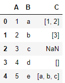
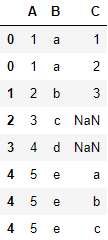

# 展开数据表


tags: #日期/2022-07-21 #类型/笔记 

# 问题


如何展开数据表？其中数据表中有其中几列之数据元素为列表。假设该列之各行之元素之列表各有元素个数 。要求展开之后，每一个行只能是一个元素，暨按列堆叠。


# 实例

对于如下数据表：



展开成：



# Python篇

方法一：直接用现成的函数。

```python
import pandas
构建list为pd_list
pd_list.explode(【你需要展开之列表所在的列之列名】)
```


方法二：自己做

```python
def explode2(df, col):
    df[col] = df[col].apply(lambda x: [x] if not isinstance(x, list) else x)
    return df.drop(col, axis=1).join(
        pd.DataFrame(list(df[col])).stack().reset_index(level=1, drop=True).rename(col)
    ) 
```


> 来源参考：
> [Pandas某一列是列表，怎么展开呢？ - 知乎](https://zhuanlan.zhihu.com/p/222214848)
> 


# Julia篇


代码如下：

```julia
using DataFrames
vcat(DataFrame.(list)...) 
```

