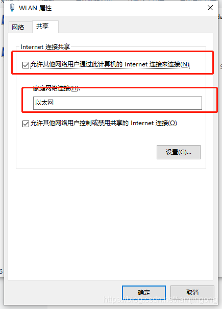

---
title:
  - 用Windows通过网线共享网络给其他电脑（Windows、Ubuntu、Macos）
authors: Ethan Lin
year: 2024-03-11
tags:
  - 类型/笔记
  - 日期/2024-03-11
  - 来源/转载
  - 类型/教程
  - 类型/解决
  - 内容/共享网络
  - 内容/电脑
---
# 用Windows通过网线共享网络给其他电脑（Windows、Ubuntu、Macos）

>  来源
>
> [CSDN - 用Windows通过网线共享网络给其他电脑（Windows、Ubuntu）](https://blog.csdn.net/iamjingong/article/details/119379129)

如果手里目前有一台能够连接网络（有线、WLAN）的电脑（台式机、笔记本），另有一台没有接入网络的电脑，现在想让没有接入网络的电脑也连上网，可以通过本教程来完成。

需要以下：

电脑A（已经通过有线或者无线连接上互联网）、电脑B（无网络，没有连接互联网），网线一根

步骤：

1、先进入电脑A的“更改适配器”，选择“WLAN”，右键选择“属性”，选项卡选择“共享”，勾选上“允许其他网络用户通过此计算机的Internet连接来连接（N）”，再在“家庭网络连接（H）”中选择“以太网”

2、继续在“更改适配器”选项中查看“以太网”

 在“以太网”上右键选择“属性”，接着查看它的IPV4网络属性

双击“Internet协议版本4（TCP、IPV4）”，查看网络信息，例如我的如下：

IP 地址、子网掩码，接下来会用到。DNS 服务器可以不需要设置。

3、将电脑A和电脑B通过有线进行连接，如我这里用 Macos 系统，在配置 IPv4 时，选择「使用 DHCP」 连接。

------------------------------------------------

                            版权声明：本文为博主原创文章，遵循 CC 4.0 BY-SA 版权协议，转载请附上原文出处链接和本声明。

原文链接：https://blog.csdn.net/iamjingong/article/details/119379129

