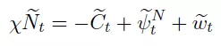

#类型/教程

#知识 

#资料 

#来源/转载

[[宏观经济]]

[[DSGE]]

[[DSGE宏观经济理论]]

许文立，安徽大学，xuweny87@163.com

严格来讲，商业周期核算（business cycle accounting）框架并不属于DSGE模型范畴。之所以也把它作为DSGE建模与编程系列推送，是因为其基于RBC模型。

大部分的动态宏观模型都是基于实际商业周期模型。例如，前面的解释的RBC各种扩展，加入粘性、摩擦等等就演变成了NK。

商业周期核算框架是由Chari，Kehoe and McGratan（2007，Econometrica）提出的，因此该框架也被成为“CKM”模型。原始CKM模型是一个一部门模型，但是最近Golosov et al.（2017,RES;2016,NBER）扩展了一个两部门模型来分别研究俄罗斯经济和中国经济。

CKM模型最大优势就是可以测算经济的楔子（wedges）。

Brinca et al.（2016）指出，该方法的目的是帮助研究者选择哪些摩擦进入定量模型中，使得模型产生的周期波动与数据类似。

目前，使用CKM模型的文献有：Cavalcanti（2007）、Chakraborty and Otsu（2013）、Chakraborty（2006）、Cho and Doblas-Madrid（2013）、

Kersting（2008）、Kobayashi and Inaba（2006）、Otsu（2010）、Sustek（2011）、Brinca（2013,2014）加上前面提到的几篇文章。

***模型\***

因为是基于RBC，因此，与前面的标准RBC结构类似。

家庭的效用函数为

预算约束为

tua_It是投资支出征税，tua_Nt是劳动所得税，那么，1+tua_It就可以当作投资楔子，同理1-tua_Nt是劳动楔子。PAI_t是企业利润，家庭当作既定的，T_t是一次性总付税。

资本积累方程为

那么，家庭问题的拉格朗日算式就是

家庭的FOC为

化简等到

企业问题跟RBC一样。企业雇佣劳动和资本生产，得到企业的FOC

CKM（2007）把At成为效率楔子，即为RBC中的全要素生产率。

政府采取平衡预算，即公共支出Gt等于税收

经济的总资源约束为

CKM（2007）把Gt成为政府消费楔子。

下面，对数线性化模型的均衡系统，对数线性化技术参考[DSGE建模与编程入门（6）：线性化技术](http://mp.weixin.qq.com/s?__biz=MzAwODY5MDA3NA==&mid=2455725642&idx=1&sn=1898ddc0ed501f99f0e9230cedf3a6d8&chksm=8cc0c6bfbbb74fa9a42c8f2fa8c58ce3b4791f1746de09a5efc0844bb37b0856a4399e18e677&scene=21#wechat_redirect)。

因为CKM模型是测算楔子的，因此，我们设投资楔子和劳动楔子分别为

那么，劳动供给方程就可以对数线性化为

劳动需求方程对数线性化为

结合劳动供给方程和需求方程，得到

进一步简化

由此可知，只要我们知道劳动投入、消费、产出（GDP），还有费希尔弹性，我们就能把劳动楔子作为上式的余项来计算出来。

对数线性化生产函数，得到

因此，效率楔子也能测算出来。

对数线性化经济资源约束

政府消费楔子作为产出扣除私人消费和投资后的余项来测算。

接下来，我们来测算投资楔子。因此首先对资本欧拉方程取对数

全微分

因此，

此外，

这就意味着

移项，得到

假设遵循AR(1)过程，即，那么，

上式就变成

由企业的FOC可以得到

定义，那么，

从上式可以看出，通过常数比例变换的投资楔子psi2可以作为余项测算出来。

综上所述，只要我们有GDP，消费、资本、投资、劳动投入，以及模型参数，我们就可以测算出投资楔子、劳动楔子、效率楔子以及政府消费楔子。

