#类型/教程

#知识 

#资料 

#来源/转载


[[宏观经济]]

[[DSGE]]

[[DSGE宏观经济理论]]


两年来，我们已经推送了将近50篇DSGE Notes。从这些Notes中可以看出，***Woodford（2003）等学者的早期DSGE模型中宏观经济变量会对shocks作出立即、迅速的响应，但是宏观经济数据显示出响应是逐步发生，并具有迟滞性\***。因此，CEE（2005）为了产生“驼峰型”响应，在DSGE中引入了诸如消费习惯（[DSGE建模与编程入门(16)：习惯形成](http://mp.weixin.qq.com/s?__biz=MzAwODY5MDA3NA==&mid=2455726967&idx=1&sn=69b1da1cd83ea6b3bb52ffbf1faed70b&chksm=8cc0cb82bbb742942cbbed7e9c7f24c162c5564b17daa9a71b891c82c2643cc3a8acda018603&scene=21#wechat_redirect)）、投资调整成本（[DSGE建模与编程入门(19)：投资调整成本CEE，2005](http://mp.weixin.qq.com/s?__biz=MzAwODY5MDA3NA==&mid=2455727081&idx=1&sn=cb4c5a716d3110ec6c51504437426a76&chksm=8cc0cb1cbbb7420abc44e77b3515dd3956df485e2c5d62d6466671c358030d664cb5f3c955d4&scene=21#wechat_redirect)）、指数化价格和工资粘性等粘性——可参见[重读经典(10):名义粘性与货币政策冲击的动态效应(CEE,2005)](http://mp.weixin.qq.com/s?__biz=MzAwODY5MDA3NA==&mid=2455726777&idx=1&sn=36dc032d487e17e638a7259d3e345ed0&chksm=8cc0ca4cbbb7435a2d15c2b585dc390132d41ecc962350320d253e230ee51fc55722a09a74b9&scene=21#wechat_redirect)、[重读经典(11):美国商业周期中的冲击与摩擦-一种贝叶斯DSGE方法(SW,2007)](http://mp.weixin.qq.com/s?__biz=MzAwODY5MDA3NA==&mid=2455726812&idx=1&sn=2bfcd632a4f2c29650fc692aa46eba1f&chksm=8cc0ca29bbb7433f797be817b406255368c015f29a560f11cd983f7d329da69c539ac0f32f19&scene=21#wechat_redirect)。


Mankiw and Reis（2002）指出，信息随机获取和信息缓慢扩散。基于此，他们提出了***“粘性信息（sticky information）”***模型。他们认为粘性信息模型能更好的解释通胀惯性、反通胀的紧缩性、通胀加速性等现象。因此，Keen（2007，2009，2010）、Trabandt（2007）等将粘性信息结构引入标准DSGE模型中，来作为Calvo企业定价决策的一种备择建模方式。Reis（2006a，2006b）指出，粘性的唯一来源是agents的注意力不集中（inattention，最近几年这个方面的研究非常热门），他们仅仅只更新那些可以节省信息的获取、吸收和处理成本的信息。


Reis（2009）在Woodford（2003）的传统DSGE框架中将粘性价格替换成粘性信息。模型其他结构相似。它将粘性信息一般均衡模型称为***SIGE，***还可以参见Mankiw and Reis（2006，2007）。


1、家庭决策

家庭的跨期贴现效用函数为

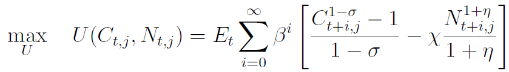

其中，变量含义同往期“***DSGE建模与编程入门系列***”。

消费品篮子的结构为：


一般价格水平指数为


家庭的预算约束为

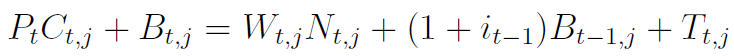

其中，B是家庭持有的名义债券，T是一次性转移支付。上述预算预算用实际财富余额表示为

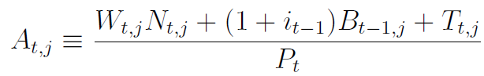

化简为

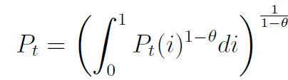

这种形式可以参见***Wickens（2012）：“Macroeconomic Theory：A Dynamic General Equilibrium Approach”***。


在粘性信息情形下，家庭最优决策的Bellman方程为

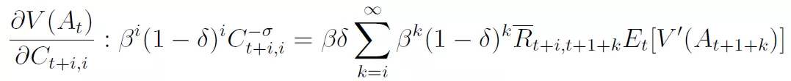

约束为

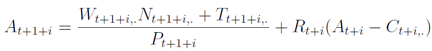

其中，δ表示家庭更新信息的概率。不存在信息粘性时，δ=1，上述Bellman方程就变成标准的形式。Bellman方程右边括号里第一项表示重来不更新信息的家庭（比例为(1-δ)^i）的期望贴现效应。第二项表示未来会更新信息的家庭（比例为δ(1-δ)^i）的连续值函数。


将约束带入Bellman方程得到家庭对于消费C的FOC：


利用包络定理（参见[经济数学汇总](http://mp.weixin.qq.com/s?__biz=MzAwODY5MDA3NA==&mid=2455728397&idx=4&sn=d5cb40694225a5796d811dc485c4cc9d&chksm=8cc0d1f8bbb758eeed7387c144cd5c4d2fa49e60d0c36bdd9db0193b4d36a952df67a8859cf5&scene=21#wechat_redirect)），推导财富A的值函数

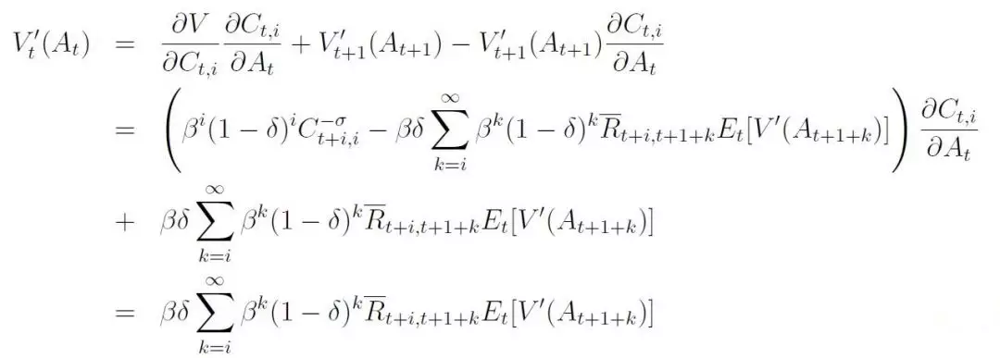

因为括号中第一项等于0。然后，i=0时，

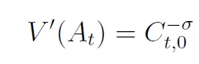

这个结果可以推导出两个一阶条件。第一，设立消费FOC中i=0，然后利用上式，它给出了信息更新的家庭的欧拉方程，即δ=1，得到标准欧拉方程

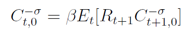

第二，我们可以结合消费FOC和A的值函数得到注意力不集中的家庭（the inattentive consumer，即不能更新信息家庭）的欧拉方程。因此，我们可以在i=j时将消费FOC写成

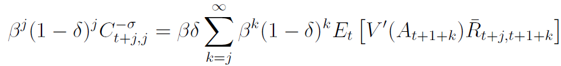

在t=t+j时，A的值函数


由此，可以得到下式

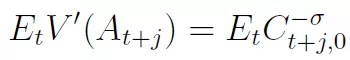

最终得到第二个欧拉方程

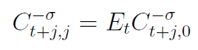

即注意力不集中家庭的欧拉方程，这类家庭会将消费的边际效用设立在等于他对信息更新家庭消费边际效用的预期。

对数线性化上述两个欧拉方程，可以得到粘性信息下的IS方程

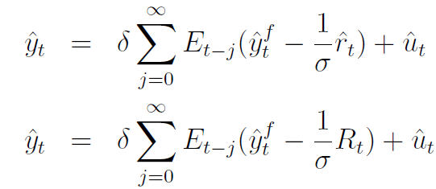

***由上式可知，粘性信息下，产出由自然产出和长期利率的过去预期所影响，还会受到需求冲击u的扰动***。


2、企业

在每一期，只有λ比例的企业更新信息。那么，企业的价格设定决策为

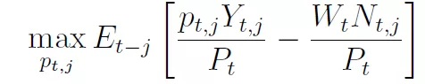

约束为

（1）CD型生产函数

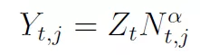

（2）单个中间产品的需求

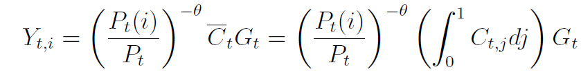

使用市场出清条件，我们可以得到每个企业生产的产品数量

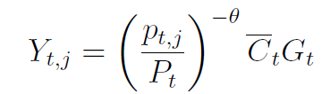

那么，企业的最优问题为

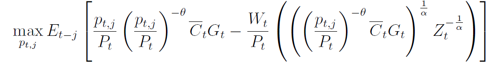

解出上述最优化问题，可以得到最优价格决策

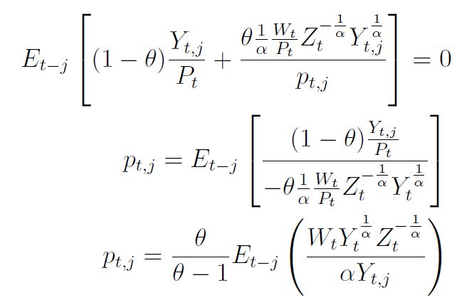

对数线性化企业的最优定价决策，可以得到粘性信息PC

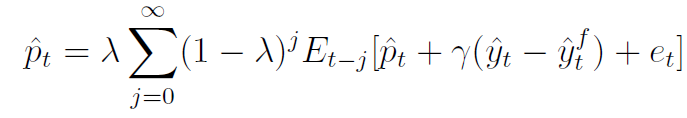

其中，

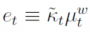

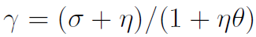

***由上式可知，当前价格是当前价格、当前产出缺口和供给冲击滞后预期的函数***。


泰勒规则

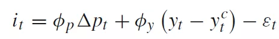

由此，得到了完整的粘性信息三方程NK模型。


注：详细的推导过程，可以发邮件或者留言索要。


粘性信息DSGE模型的Dynare code（相关算法我们会在“***经典重读——核心算法***”系列中推送）：


// Dynare code to replicate

/// Ricardo Reis（2009）：A Sticky-Information General-Equilibrium Model for Policy Analysis.

// 原始程序Written by: Fabio Verona (fabio.verona@bof.fi) and Maik H. Wolters (maik.wolters.ifw-kiel.de)

// 下列程序使用1990年1月-2018年7月的中国环比通胀数据进行估计 @许文立（xuweny87@163.com）


```octave

@#define lags = [1:16]

var y a l p w yinfn i R pi outputgap yclas deltaa g nuu gam eps z zwage zoutput;

varexo e_deltaa e_g e_nuu e_gam e_eps;

parameters beta nu lambda theta delta omega gamma psi phi_pi phi_y rho_deltaa rho_eps rho_g rho_nuu rho_gam T;

// POSTERIOR MEAN, see Table 2 in paper
theta = 1.00000000000000;
psi = 5.15202697986071;
nu = 10.0866927574090;
gamma = 9.09210945073590;
beta = 0.666666666666667;
rho_deltaa = 0.0285825345078334;
rho_eps = 0.294610252638720;
rho_g = 0.996989047437769;
rho_nuu = 0.280541889680312;
rho_gam = 0.855785136269719;
phi_pi = 1.17350494813421;
phi_y = 0.0625290108287302;
delta = 0.0822178065824585;
omega = 0.744214139325477;
lambda = 0.516437987152365;
T=32;

model(linear);
//production function
y = a + beta*l;

// Phillips Curve
z = p + (beta*(w-p)+(1-beta)*y-a)/(beta+nu*(1-beta))-(beta*nuu)/((nu-1)*(beta+nu*(1-beta)));

p = lambda*( + z +
@#for lag in lags
+EXPECTATION(-@{lag})(z)*((1-lambda)^(@{lag}))
@#endfor
);

// Recursive long real interest rate
R = i - (p(+1)-p) + R(+1);

// IS Curve
yinfn = y(100);
zoutput = yinfn - theta*R;

y = g + delta*( + zoutput +
@#for lag in lags
+EXPECTATION(-@{lag})(zoutput)*((1-delta)^(@{lag}))
@#endfor
);

// Wage Curve
zwage = p + gamma*(w-p)/(gamma+psi) + l/(gamma+psi) + psi*(yinfn - theta*R)/(theta*(gamma+psi)) - psi*gam/((gamma+psi)*(gamma-1));

w = omega*( + zwage +
@#for lag in lags
+EXPECTATION(-@{lag})(zwage)*((1-omega)^(@{lag}))
@#endfor
);

// definition of inflation
pi = p - p(-1);

// Taylor rule
i = phi_y*(y-yclas) + phi_pi*pi - eps;

// Classical equilibrium
yclas = a + beta*psi/(1+psi)*(g+gam/(gamma-1)+nuu/(nu-1));

// other variables
deltaa = a-a(-1);
outputgap = y-yclas;

// shock processes
eps = rho_eps*eps(-1) + e_eps;
deltaa = rho_deltaa *deltaa(-1) + e_deltaa;
g = rho_g *g(-1) + e_g;
nuu = rho_nuu *nuu(-1) + e_nuu;
gam = rho_gam *gam(-1) + e_gam;

end;

//check;
//steady;

initval;
y=0;a=0;l=0; p=0; w=0; yinfn=0; i=0; R=0; pi=0; outputgap=0; yclas=0; deltaa=0; g=0; nuu=0; gam=0; eps=0; z=0; zwage=0; zoutput=0;
e_deltaa=0; e_g=0; e_nuu=0; e_gam=0; e_eps=0;
end;

shocks;
var e_deltaa; stderr 0.660134106707378;
var e_g; stderr 0.833976978078512;
var e_nuu; stderr 10.5679076888563;
var e_gam; stderr 12.3169555240614;
var e_eps; stderr 0.437308817102200;
end;

estimated_params;
theta , 1.000,1,1.5;
psi , 5.15202697986071,5,5.5;
nu , 10.0866927574090,10,10.1;
gamma , 9.09210945073590,9,9.5;
beta , 0.666666666666667,.6,.7;
rho_deltaa , 0.0285825345078334,.02,.03;
rho_eps , 0.294610252638720,.29,.3;
rho_g , 0.996989047437769,.9,1;
rho_nuu , 0.280541889680312,.28,.3;
rho_gam , 0.855785136269719,.8,.9;
phi_pi , 1.17350494813421,1,1.5;
phi_y , 0.0625290108287302,.06,.07;
delta , 0.0822178065824585,.08,.09;
omega , 0.744214139325477,.7,.8;
lambda , 0.516437987152365,.5,.6;

end;
varobs pi ;

estimation(mh_jscale=0.33,
    datafile=SI_data2,
    diffuse_filter,
    mh_replic=2000,
    mh_drop=0.25,
    plot_priors=1);
```

