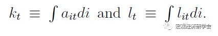

#类型/教程

#知识 

#资料 

#来源/转载


[[宏观经济]]

[[DSGE]]

[[DSGE方法]]


“DSGE建模与编程”系列可以在公众号对话窗口回复关键词“DSGE”查看。以往的异质性代理人模型介绍：

1. [异质性代理人宏观经济学简史](http://mp.weixin.qq.com/s?__biz=MzAwODY5MDA3NA==&mid=2455729702&idx=1&sn=adddd70d1d9f55b06b1dda132e8610df&chksm=8cc0d6d3bbb75fc53685db00765130bbfb0376b9d35193cd26fdab7eb153c9a19b7ab6c62647&scene=21#wechat_redirect)
1. [DSGE建模与编程入门（39）：异质性代理人（TANK）](http://mp.weixin.qq.com/s?__biz=MzAwODY5MDA3NA==&mid=2455728127&idx=1&sn=12d2dcca33fe90c8bf435213f6763e5a&chksm=8cc0cf0abbb7461ca98b5ccbedefe4874197a9e376a68f9571eb1e71c8fc0a4b39fe2e0f3321&scene=21#wechat_redirect)
1. [新书推荐——宏观经济学中的异质性](http://mp.weixin.qq.com/s?__biz=MzAwODY5MDA3NA==&mid=2455728030&idx=1&sn=836d43d90313a51c9552703c462ea0c1&chksm=8cc0cf6bbbb7467d5a5777674f66de5ac5543693794593a0aeef69940c22c3bd89f20cbe5dfc&scene=21#wechat_redirect)


本文节选自《***Dynare 4.5---User Guide for Advanced Topics\***》第五章“*Solving and Estimating Heterogenous Agent Model*”部分内容。


无限期生存的异质性代理人模型从20世纪70年代末就开始出现，参见“[异质性代理人宏观经济学简史](http://mp.weixin.qq.com/s?__biz=MzAwODY5MDA3NA==&mid=2455729702&idx=1&sn=adddd70d1d9f55b06b1dda132e8610df&chksm=8cc0d6d3bbb75fc53685db00765130bbfb0376b9d35193cd26fdab7eb153c9a19b7ab6c62647&scene=21#wechat_redirect)”。其最大的困难在于状态变量是一个无限维度的分布，因此，对于个体政策函数的加总带来巨大的困难。虽然，目前已经由许多文献对此作出了巨大贡献。但是至少，还没有出现一个成熟的软件包来执行异质性代理人DSGE模型的解、模拟和估计。


从理论上来说，Dynare也可以处理多代理人模型，例如，李嘉图家庭和非李嘉图家庭等，甚至可以到100个代理人，例如带有OLG结构的DSGE模型（每个年龄段一种类型，Gertler et al.（1999）等）。但是对于处理更大规模的代理人类型的模型，Dynare就会出现一些问题。


不过，不用担心！现在已经有一些可以利用Dynare的功能来解、模拟和估计异质性代理人模型的算法。今天，我就为大家介绍一种简单、灵活的方法。


一、模型


单个（异质性）代理人i的最优化问题为


其中，c表示消费，a表示财富持有，r表示资本利率，w表示工资率，e表示就业状态，l表示劳动，δ表示折旧率，b是财富约束。


就业机会的AR过程


代表性企业的生产函数为


总的生产率


企业的一阶条件


说明：r和w都写成了k，l，z的函数。这是因为，k，l，z分别是异质性财富持有ai，就业机会ei和总生产率z的分布函数，因此，r和w也是一个分布函数。


Krusell and Smith（1998）提出了用离散、有限阶矩来近似上述分布函数的算法。即


其中，M(i)表示ai的横截面分布平均值。


均衡


（I）最优化：给定（4）（5）（6），家庭决策解（1）中的最优化问题；

（II）要素价格：要素价格分别由FOC（4）和（5）决定；

（III）加总：总的要素投入为



那么，资本横截面分布的运动法则为


（1）如果我们使用一阶近似，那么，上述问题就为


（2）如果我们使用二阶近似，那么，上述问题就转化为


例如，在一阶近似时，异质性个体资产持有的决策为


那么，我们只需要将（14）带入总的资本公式中，得到：


使用财富分布的一阶矩定义


得到下列总的运动法则：


那么，代码形式为：

In this section, we show how to use Dynare to solve models with (i ) a

continuum of heterogeneous agents and (ii ) aggregate risk. To do this, two things are needed.

-  First, a mother program is needed to solve for the laws of motion that describe the aggregate variables taking the solution of the individual policy rules as given.
-  Second, a Dynare program is needed to solve for the individual policy rules taking the aggregate law of motion as given. This Dynare program, the *.mod file, needs to be able to read the coefficients of the aggregate law of motion.


代码示例：

```octave
% mother program

% Fix seed
randn('state',2);

% Algorithm Parameters
iN      = 100;   % number of individuals
iT   = 210;       % number of time periods
iIter   = 10;
iBurn   = 10;
iTol    = 1e-05; % no convergence if 1e-05 
iCoeffTraject = 0; % 1 to show the trajectory of the coefficient
% To illustrate the distribution of wealth
iChoice = 0;
% 0 = no illustration
% 1 = moving histogram
% 2 = 3D histogram
% 3 = saves a movie

dLambda = 0.1; % dampening factor
   
mZETA = zeros(iIter,3);

pRhoe   = 0.950;
pSigmae = 0.005;
pRhoz   = 0.900;
pSigmaz = 0.010;
vParams = [pRhoz pSigmaz pRhoe pSigmae];

% Random aggregate shocks
epsz = pSigmaz*randn(iT,1);
epse = pSigmae*randn(iT,iN); % This line could be optimized!

% Starting values for coefficients
%vZetaOld = [5.14667    1e-05    1e-05]; % convergence after 62 iterations
vZetaOld = [-0.3175    0.85683    1.03878];

pZeta0 = vZetaOld(1);
pZeta1 = vZetaOld(2);
pZeta2 = vZetaOld(3);
save InitParams.mat pZeta0 pZeta1 pZeta2;
 


% Solving model and loading policy functions
dynare HA_DSGE_XPA noclearall; 


% Staring Main LOOP %
%wait_time = waitbar(0,'Iteration ...');
for idxIter = 1:iIter

 %mZETA(idxIter,:) = vZetaOld;
 
 % Solve the model with the new coefficient
 dynare HA_DSGE_XPA noclearall; 
 
 % Aggregation via XPA
 vZetaNew(1) = vTheta(1)+vTheta(3);
 vZetaNew(2) = vTheta(2)+vTheta(5);
 vZetaNew(3) =  vTheta(4);

 % Check convergence of coefficients
 dConv = fnConvergence(vZetaNew,vZetaOld,iTol);
 if dConv == 1
     break;
 end
    
 vZetaOld = dLambda * vZetaNew + (1-dLambda) * vZetaOld;
   
 pZeta0 = vZetaOld(1);
 pZeta1 = vZetaOld(2);
 pZeta2 = vZetaOld(3);
 delete InitParams.mat;
 save InitParams.mat pZeta0 pZeta1 pZeta2;
 
 
 
 
 % Dynare code

var w a e z k c r ;
varexo epse epsz;

parameters   pAlpha pBeta pDelta pGamma 
            pRhoe pSigmae pRhoz pSigmaz
            pEta0 pEta1 pEta2
            pB
            pZeta0 pZeta1 pZeta2
            ass
            ;

pAlpha  = 0.330;
pBeta   = 0.990;
pGamma  = 1.000;
pDelta  = 0.100;
pRhoe   = 0.950;
pSigmae = 0.005;
pRhoz   = 0.900;
pSigmaz = 0.010;
pB      = 0;

pEta0 = 0.1000;
pEta1 = 0.1000;
pEta2 = 0.05975;//0.0598;


load InitParams;
set_param_value('pZeta0',pZeta0);
set_param_value('pZeta1',pZeta1);
set_param_value('pZeta2',pZeta2);

/*
pZeta0 = -0.5468;
pZeta1 =  0.8860;
pZeta2 =  1.1337;
*/
ass = 5.14667;

model;
 c^(-pGamma)=pBeta*( c(+1)^(-pGamma)*(r(+1)+1-pDelta) 
                    + pEta1*exp( -pEta0*(a-pB) ) 
                    - pEta2 );
 c+a=r*a(-1)+w*e+(1-pDelta)*a(-1);
 z = (1-pRhoz)+pRhoz*z(-1)+epsz;
 e = (1-pRhoe)+pRhoe*e(-1)+epse;
 r =    pAlpha *z*k(-1)^(pAlpha-1);
 w = (1-pAlpha)*z*k(-1)^(pAlpha);
 k = pZeta0 + pZeta1*k(-1) + pZeta2*z;
end;

initval;
 c = 1.20246;
 a = 5.14667;
 e = 1;
 k = 5.14;
 r = 0.110101;
 w = 1.15048;
 z = 1;
end;

//steady;
set_dynare_seed(2)

shocks;
 var epse; stderr pSigmae;
 var epsz; stderr pSigmaz;
end;

stoch_simul(order=1,nocorr,nomoments,nofunctions,noprint,irf=0,periods=300);

/*
disp('  ');
disp('  ');
disp('a(t+1) = theta0 + theta1 a(t-1) + theta2 e(t-1) + theta3 z(t-1)')

Y = a(2:end);
X = [ones(length(Y),1) a(1:end-1) e(2:end) z(2:end) k(1:end-1)];
vTheta = inv(X'*X)*X'*Y;
*/

// Collecting parameters

mPolicy = [oo_.dr.ys';oo_.dr.ghx';oo_.dr.ghu']; //read coefficients of policy function

mPolA = mPolicy(:,2);

//Rearrange parameters

dTheta0=mPolA(1)-mPolA(2)*mPolA(1)-mPolA(6)-mPolA(7)-mPolA(5)*mPolicy(1,5);
dTheta1=mPolA(2);
dTheta2=mPolA(6);
dTheta3=mPolA(7);
dTheta4=mPolA(5);

vTheta=[dTheta0 dTheta1 dTheta2 dTheta3 dTheta4];

%clear w a e k c r;
```


代码也可以登录“量化经济分析平台”（www.econmod.cn）免费下载。

