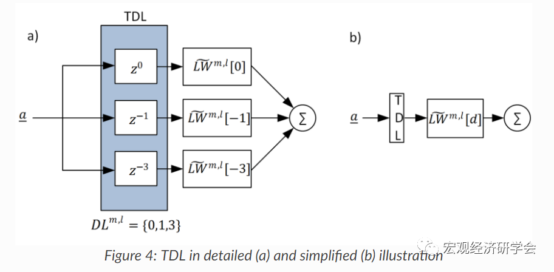

#类型/教程

#知识 

#资料 

#来源/转载


[[宏观经济]]

[[DSGE]]

[[DSGE方法]]


本文节选自[【Notes发布】Neural Networks for DSGE](http://mp.weixin.qq.com/s?__biz=MzAwODY5MDA3NA==&mid=2455730073&idx=1&sn=fd4d49426eed11172adfab7754a8138d&chksm=8cc0d76cbbb75e7a529b4923981270b6d6ce9dddfefb973d31ed5e2b00f080ddc3189fc210fa&scene=21#wechat_redirect)第三章部分内容。


神经网络（Neural Network，NN）可以划分成静态NN和动态NN。***静态NN（例如，Feedforward NN）***没有反馈要素（feedback elements），也不包含迟滞（delay）。结果通过正反馈联系（feedforward connections）直接由输入计算得到。而在***动态NN（例如，Recurrent NN）***中，结果不仅依赖于当前的输入，还依赖于当前、过往的输入、结果或者网络的状态。


一、**Feedforward NN**


最常用的一种FNN称为多层感知神经网络（ multilayer perceptron (MLP) neural networks）。一个MLP可以定义如下：


- ***R\***个投入/输入的输入层；
- ***M-1\***个隐含层，每一层m都可以包含任意神经元数量Sm；
- SM个神经元的输出/结果层，其对应于神经网络的输入/结果数量。


在一个MLP中，每一层都与下一层完全相连，这也就意味着m层的每个神经元输出/结果都是m+1层中神经元的输入。


图1显示了一个简单的MLP，其包含两个输入、两个隐含层，每个隐含层带有两个神经元、一个神经元的输出层：


图1中的MLP由5个神经元组成。每个神经元的结构如图2所示：


神经元是NN中的基础单元。神经元有许多输入*p*，每个输入*p*与其相应的连接权重相乘（*wi\*pi*），然后求和，并与一个偏差权重*b*相加得到总和*n*：


而神经元的输出/结果*a*则是用转换/激活函数（ transfer/activation function）*f(n)*计算得到：


注意：常用的激活函数有：

1. hyberbolic tangent (tanh) function
1. sigmoid function
1. the “rectified linear unit” (ReLU) function（Creel（2017）在估计DSGE模型参数时使用的就是ReLU函数）


二、Recurrent NN


CNN是一种动态神经网络，其具有循环反馈性质，即单元之间的连接形成的一个方向性循环反馈。这可能会形成一个不可行系统，因此，我们需要将一个***real-valued time-delay\***应用到循环连接中。这个过程称为***Tapped Delay Lines (TDL)\***。如图4所示。



有三种类型的TDLs，它将时滞连接及其权重矩阵添加到MLP中。这种设置对神经网络结构的影响如图5所示。


其中，蓝色线表示输入迟滞；红色线表示中间迟滞；绿色线表示输出迟滞。


本文只给出了NN的图形表达式，矩阵表达式可以参见Notes正文。


三、静态NN和动态NN的差别


为了理解静态NN和动态NN之间的差异，我们使用Matlab 2019a的Deep Learning Toolbox来创建一些神经网络，然后来看看它们对一个输入冲击的响应。


```matlab
% 下面的命令创建一个脉冲输入序列，并画图

p={0 0 1 1 1 1 0 0 0 0 0 0};
stem(cell2mat(p))
```


得到的图如下


1、现在，我们创建一个静态NN，并找出该神经网络对上述脉冲的响应。

```matlab
% 下面的代码创建一个一层、一神经元、无偏差、权重为2的线性网络

net = linearlayer;
net.inputs{1}.size = 1;
net.layers{1}.dimensions = 1;
net.biasConnect = 0;
net.IW{1,1} = 2;

% 查看这个网络
view(net)

```


现在，我们可以利用该网络来模拟对上述脉冲序列的响应


```matlab
a= net(p);
stem(cell2mat(a))
```


结果得到下图


***我们可以从上图看出，静态NN的响应与脉冲序列的持续期一样长。******所有时点的静态NN响应仅仅依赖于该时点的脉冲值。***


2、现在，我们创建一个动态NN，即创建一个简单的RNN，结构如下图所示


```matlab
% 创建RNN

net = narxnet(0,1,[],'closed');
net.inputs{1}.size = 1;
net.layers{1}.dimensions = 1;
net.biasConnect = 0;
net.LW{1} = .5;
net.IW{1} = 1;

% 查看该网络
view(net)
```


```matlab
% 下面的命令模拟RNN的响应，并画图
a = net(p);
stem(cell2mat(a))
```

得到的结果如下


***与FNN相比，RNN明显有更长的响应期。\******对于线性网络，RNN的响应被称为无限期脉冲响应（IIR），因为对于一个稳定的网络来说，一个脉冲响应会衰减到0，但是它永远也不会精确达到0的位置。\******对于非线性网络来说，同样适用。\***


