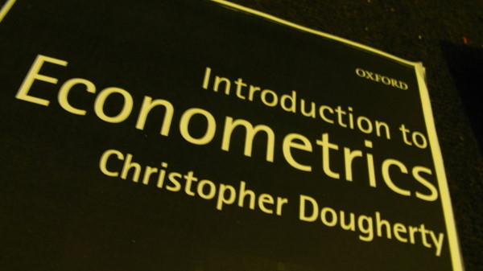

tags: #来源/转载  
#类型/指南

[[DSGE基础学习指南]]

这是个图册和解说文字，有的是从书店买的，有的是从图书馆买的二手，有的从图书馆借的，有的是自己复印的。

这只是一部分，还有一半，还没给它们拍照。过几天把另外的部分传上来。每本书我都给出自己的简评，这些书当中，有一部分我是从头到尾学过的，甚至学了几遍，比如微积分，线性代数，概率论等。有些书我是浏览，有的是节选阅读，有的是课外阅读。这些简评当成是我个人意见就行了，如果不同意，毫无问题。

我会给出自己心中的打分，满分是10分。这反映了我对某本书的个人喜好程度，但我会做到尽量客观，给大家读书一个客观的指示。

**数学书**
 
书名: Early Transcendentals: Calculus
作者: James Stewart
得分：9

这是我最喜欢的微积分数学书，既是教材，又是枕边读物。从来没见过那个作者能把微积分做得跟娱乐节目一样舒心坦然。作者用尽他毕生的功力，讲述一个微积分的世界，从计算物体坠落的瞬时速度，到开普勒第一定律，到水坝承受压力，到心脏供血的流体力学，再到彩虹的光学原理，再到密室内温度变化，再到狼和兔子的共生，把世界最赶紧最纯的一面展现给你。让我真正地懂得了微积分是人类思想史上最高智慧之一。这本教材有一千多页，当年第一遍的时候，我从头到尾一页一页地学。后来又学习了几遍，至今这本书都放在案头作为工具书随时要查阅。

 
书名: Calculus: a Complete Course
作者: Robert Adams
得分: 8
次书为我学习过的第二本微积分教材，在众多微积分教材中，仍然受到我喜欢。深度和广度都非常足够，可以作为Stewart的补充学习教材。这本教材非常标准，跟大部分微积分教材一样，没什么出彩的地方，也没有硬伤，中规中矩。不失为一本标准课堂教材。

 
书名: Linear Algebra and Its Application
作者: David Lay
得分: 9
对于此书作者，我致以最高敬意。同时这是我的第一本线性代数教材（当然我在国内也学过同济大学的教材，我认为那教材水平太差，学了跟没学一样），我对线性代数的基础认识全部开始于这本书。这本书高超的地方在于把子空间(subspace)，向量空间(vector space)，特征值空间(eigenspace)，等等各种空间解释到出神入化的地步。作者的功力由此能看出，对于高维度的空间问题，他总是能用最简单的语言和三维的图形解释清楚。而且所有数学notation都是符合国际标准的，所以在学了这本书之后去看其他教材不会有符号上的不适应。这本书应该从头到尾不落下任何一章地学完，这将对线性代数基本功打下极其牢固的基础，同时因为线性代数的高度抽象性，我也建议至少学习这本教材过5遍以上（我自己前后差不多看了5遍才感觉把所有知识融汇贯通了）。

 
书名: Linear Algebra: a Modern Introduction
作者: David Poole
得分: 6
在学习Lay的 教材的同时，我有两本辅助教材，这是其中一本，另外一本在下面。这本书地解释不够清楚，在关键地方总是说得比较模糊，但优点是内容很新，例子都是紧跟时代发展的。可以让你看到线性代数在现代科学上面的应用。我只建议把这本书当成课外阅读。

 
书名: Linear Algebra with Application
作者: Otto Bretscher
得分: 5
这是上面提到的第二本初级辅助教材，这本教材几乎没有出彩的地方，比中规中矩的还差。难怪几乎没有学校选择这本书来当教材。作者的硬伤在于，他完全没体会到学生的learning process和他在书里面的讲述方法是两回事，比如在学习什么是空间之前，他就跟你谈论子空间。很多概念定义不清，而且插图的水平远不入Lay的教材。此书非常不适合0基础的学生，就算有基础读的过程当中都会给你造成混乱的感觉。这本书还有个问题，就是符号使用不是线性代数教材的国际标准做法。唯一的优点就是：作者的讲述语气非常轻松，friendly。

 
书名: Probability Models
作者: Sheldon Ross
得分: 7
这本教材是我用来学习随机过程(stochastic processes)而是用的，至少在随机过程那章，我感觉比较满意。作者偏向于给出intuitive的解释，而不是从严格数学上面来论证，所以非常适合初学者。Markov chain那一章做得非常好，入门难度也不高，解释详尽到位，至少比我所见过的其他经济学教材都解释得好。前半部分是概率论的基础知识，关于分布，期望，矩生成之类的，可读性也很强，至少不难懂。

 
书名: Mathematical Statistics
作者: John Freund
得分: 8
这是一本经典，成书于1992年。很难在市面上买到了。我学习概率论基础的时候就是用得这本书的前半部分，很快这本书成为我最喜欢的统计学教材。原因就是:好懂! 而且例子非常有趣。后边部分有一个讲Bayesian decision theory的，给我带来很多阅读的乐趣。它的统计学部分一样做得很好，当时我对统计学的好奇和疑问都很大，很多疑惑都是在这本书里面渐渐找到的答案。所以我这里要告诉大家，理论数学书不是越新越好，现代的新版数学书往往都比不上经典作品。要学到学科的本质，我认为最好的选择还是经典老教材，而不是最新的。

 
书名: Mathematical Statistics
作者: Jun Shao
得分: 8
这是本猛书，和上面一本比起来难度级别高出许多。我用他来查阅一些难度比较高的技术，没有大面积得阅读。因为这本书是基于极其严格的测度论(measure theory)来推导的所有理论，虽然不能说读起来很费力，但是我认为如果不是统计学专业的话，没有必要通读整本书。这本教材是统计学博士第一年的标准教材，对理论的深入探讨非常完善。但是对经济学和其他专业的，用不着这些大面积的严格推导内容。我们用的是他们论证的结果，所以不要去抢他们的活儿。作为一本reference book，我认为它已经完美了，而且简明扼要，一个section都控制在几页内。

 
书名: Managerial Statistics
作者: Gerald Keller
得分: 9
我评分不是按照难度，而主要是作者写书的水平和阐述能力。这本书对于我和大多数人来说，基本是儿童读物。但是它做到了这个品种里面的top，图片的生动，案例的详尽，解释的清楚，讨论的到位。它几乎做到了一个初级教材应该做到的所有方面，所以我给它9分。我当时买这本书，是在3年多以前，对自己统计学基础知识进行梳理和复习，大概读了一圈之后，感觉非常好。是出门级别教材中的典范之作。

 
书名: Bayesian Statistics
作者: Peter Lee
得分: 5
入门级的贝耶斯统计教材，但作者弄得这本书太入门了，前面全部在介绍概率基本知识，导致前面几章读了下来还没进入正题。然后终于进入贝耶斯的正题了，但感觉还没到位，就匆匆结束了本书。贝耶斯统计的computation内容这本书都没有讲出来，但是作者确实讲清楚了贝耶斯统计的概率原理。总体来看，这不是本好书，用来消耗时间都不值得。要学贝耶斯统计，还不入直接学习贝耶斯计量来得快。

 
书名: Applied Differential Equations
作者: Murray Spiegel
得分: 9
经典中的经典！我个人最喜欢的微分方程教材，成书于1980年。现代的微积分教材都比不上它。虽然封面和里面排版给你的感觉是这本书绝对枯燥无比，我最开始也是这么认为。但是后来硬着头皮读了（因为当时图书馆的differential equations的教材都被借走了），发现那些人把新教材借走了，留了这本给我，反倒是让我发现了一本最好的经典教材。没有花哨的图片，也没有花哨的推导，一切都归于本质。要看一个科学家描述一个动态的世界，就从这本书开始。

 
书名: Elements of Dynamic Optimization
作者: 蒋中一
得分: 8
蒋中一先生的名作，广泛为大家熟悉。同样也受到我的喜爱。变分法和优化控制论，前后两个部分清清楚楚地展现给了大家。对于数学基础不好的同学来说，这本书所带来的痛苦几乎都是同类书籍中最小的。这本书是基础入门书籍，不是用来严格推导的，所以喜欢看严格数学推导的同学，这不是好的选择，这本书是用来学intuition的。其实如果蒋中一先生不压制着数学的使用，这本书可以变得很薄，正是因为他为了考虑到入门和数学基础不好的同学，他压制了很多高级数学内容，然后绕着弯用其他基础数学方法来解释，就造成了冗长的感觉。但是要入门得话，这绝对是难得一见的好书！

此图册一是提供简要评论，这提供了照片的教材，大部分我都学过，有的是完完整整地看了一遍，甚至几遍，有的是看了重要章节。我尽量做到客观，虽然语言有时候比较戏谑。这里的评价，是我站在一个学过这些教材的学生的观点来评述，不属于学术探讨。

计量经济学（部分）
 
书名: Introduction to Econometrics
作者: Stock and Watson
得分: 6
深受大家喜爱的Stock and Watson 组合，相信大家没少见这一对学术哥们儿的论文。这本书作为入门教材来说，做得不错，至少对于统计学基础几乎为0的学生来说非常好。前面花了大篇幅来解释统计学原理，对于入门级来说这是应该的。同时此书出彩的地方在于，贯穿了一个主线思想，就是计量经济学是用来拨开迷雾，解释因果关系，同时寻找普世真理的一个工具学科。前面部分的基础知识，还有panel，IV，Probit这些话题写的非常好。但后面的时间序列部分，受过严格计量训练的学生就能看出来，他们开始捉襟见肘了。时间序列部分可以说全书最大败笔，简直不知所云，词不达意。所以我对这本书的建议是，除了时间序列其他部分都需要认真看看，体会一下计量经济学解释世界的哲学思想。
 
书名: Introduction to Econometrics
作者: Chirstopher Dougherty
得分: 9
此书乃神来之笔。这本书有三个版本，我都读过。第二版是我从头到尾认真学过的。第二版最好的，作者用variance和covariance的推导贯穿全书，不管什么内容他都能用variance 和 covariance给推导出来，大幅度减轻了数学推导，同时给与了很多理解上的便利，因为现在的问题无非就是下降到对variance 和 covariance的理解了。第三版作者做出了大幅度修改，所有推导变成了用summation operator，就是那个大sigma连加号，这样做虽然高中生都有可能看懂这本书，但是带来很多推导上的不方便，而且连加号一多，看着也恶心。所以，我推荐学习第二版。

 
书名: Econometric Analysis
作者: William Greene
得分: 6
又是一本广为人知的计量著作，适合研究生和博士使用。但是这本书不应该当成教材，应该作为reference book是最好的选择。你要硬着头皮学这本书的话，我表示非常敬佩。但是确实不值得。作者的表达能力非常有限（教过我的计量老师都说这本书不适合用来学习，只能用来查阅），同时数学推导不清晰。覆盖面太大，主题思想不明确。我个人感觉不喜欢这本书的一个小原因是：排版实在是太恶心了，作者连LaTeX也不用一个，你让我情何以堪。

 
书名: Econometric Theory and Methods
作者: Davidson and MacKinnon
得分: 10
计量经济学教材里面唯一让我满意得无话可说的著作。这本书如果得到广泛宣传，将会成为传世只作。成书于2004年。但是在1999年作者就写好的第一稿，然后他们经过了长达5年的反复修改和让学生阅读，在最终敢于出版成一本书。作者这种严谨负责的精神让我非常佩服，他们根本不像国内的一些老师总是急着出书写书，而是倾心打造和雕琢。用6年写好了书之后，然后又改了5年，这种极其敬业的学术态度，让这本书基本上没有错误，有极其个别的错误，作者在后来都很快找出来了写的在他们的网站上面。我想不出任何一本计量教材可以像这一本给我带来这么多探索和思考的乐趣。此书难度很高，但是只要数学准备得足够充分，读这本书绝对是思想上的享受。内容非常符合标题，是讲理论和方法，而不是应用。所以从头到尾你都看不到作者谈论如何handle data，在软件上应用之类的。这本书是把计量经济学本身当成一个被研究事物，而不是用计量去研究其他事物。这就高度区别一本理论教材和应用教材。一共15章，每章都有出彩的地方，相当难得。再次强调，这本书对数学的要求非常高，如果你数学没准备好，不要来碰它。

 
书名: Using Eviews for Principles of Econometrics
作者: William Griffiths
得分: 8
一本Eviews操作手册而已，简明而要，方便查阅。同类书籍的优秀品种。它不教你计量是什么，只教你怎么用Eviews来弄计量。适合有计量初级水平的同学查阅。

 
书名: Applied Econometric Time Series
作者: Walter Enders
得分: 7
简单的时间序列书，不重在理论，而重在intuition。不想读Hamilton的书，这本就是很好的替代品。内容覆盖也不宽，但是时间序列的主要内容都覆盖的。ARMA，GARCH，VAR之类都能学到。虽然内容简单，我觉得作者用语仍然太罗嗦了，有时候罗嗦得反倒很confusing。所以我学时间序列并没有一开始就用这本书，而是后来反复实践中来查阅和学习这本书才渐渐熟悉这本书。
 
书名: 计量经济学
作者: 李子奈
得分: 3
当然要挑一本中文。这是我大学本科在国内用的教材，我竟然把它带到了国外，我作为一个学生来评价，此书从教学思想，数学推导，文字描述，章节安排，封面排版都做到了同类书籍的最差。所以，给3分。

[*分享* ](https://bbs.pinggu.org/home.php?mod=spacecp&ac=share&type=thread&id=1305053)*[\*收藏39\*](https://bbs.pinggu.org/home.php?mod=spacecp&ac=favorite&type=thread&id=1305053) \*评分\* [\*回帖\*](https://bbs.pinggu.org/forum.php?mod=post&action=reply&fid=48&tid=1305053&reppost=11386791&extra=&page=1)  点赞 10.001*

*关键词：[经济学](https://bbs.pinggu.org/t/75.html) [数学书](https://bbs.pinggu.org/t/3421.html) [econometrics](https://bbs.pinggu.org/t/531.html) [introduction](https://bbs.pinggu.org/t/1012.html) [Econometric](https://bbs.pinggu.org/t/743.html) [经济学](https://bbs.pinggu.org/tags/89.html) [数学](https://bbs.pinggu.org/tags/419.html) [原创](https://bbs.pinggu.org/tags/161838.html)*

 相关帖子• [CDA数据分析师认证考试](https://www.cda.cn/bigdata/3.html?source=bbs_pinggu.org)• [宏观经济学问题](https://bbs.pinggu.org/thread-2174898-1-1.html)• [感受经济学的思想，作一个理性的思考者](https://bbs.pinggu.org/thread-2223887-1-1.html)• [《数学经济学学报》Journal of Mathematical Economics Vol 35-Vol 49](https://bbs.pinggu.org/thread-2314021-1-1.html)• [经济学人不得不看的一本书 Economics for real person -Gene 5个币](https://bbs.pinggu.org/thread-2317481-1-1.html)• [关于clm0600所说“西方宏观经济学的概念错误”](https://bbs.pinggu.org/thread-2375022-1-1.html)• [应用数量经济学课件 张晓峒版](https://bbs.pinggu.org/thread-2376503-1-1.html)• [教材选择问题](https://bbs.pinggu.org/thread-2522338-1-1.html)• [微观经济学](https://bbs.pinggu.org/thread-2556634-1-1.html)• [求MWG微观经济学 中文版电子档。50论坛币](https://bbs.pinggu.org/thread-2615765-1-1.html)

*[manfred.jpg](https://bbs.pinggu.org/forum.php?mod=attachment&aid=MTAyMjE1MXwwNDFmZGMyY3wxNjE2NzI3OTUzfDEwNTk3MDEyfDEzMDUwNTM%3D&nothumb=yes) \*(37.57 KB)\*[wickens.jpg](https://bbs.pinggu.org/forum.php?mod=attachment&aid=MTAyMjE1MHw5MTU3NmYyMHwxNjE2NzI3OTUzfDEwNTk3MDEyfDEzMDUwNTM%3D&nothumb=yes) \*(28.03 KB)\*[labour econ.jpg](https://bbs.pinggu.org/forum.php?mod=attachment&aid=MTAyMjE0OXw4NTBmZWQxMXwxNjE2NzI3OTUzfDEwNTk3MDEyfDEzMDUwNTM%3D&nothumb=yes) \*(31.91 KB)\*[history of econ.jpg](https://bbs.pinggu.org/forum.php?mod=attachment&aid=MTAyMjE0M3wwMTcyMjgzYXwxNjE2NzI3OTUzfDEwNTk3MDEyfDEzMDUwNTM%3D&nothumb=yes) \*(29.97 KB)\**