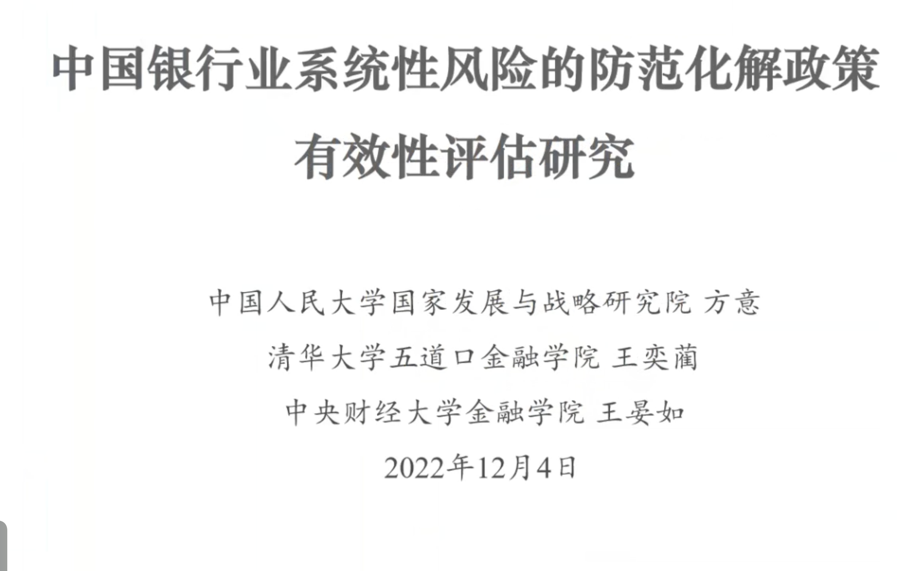
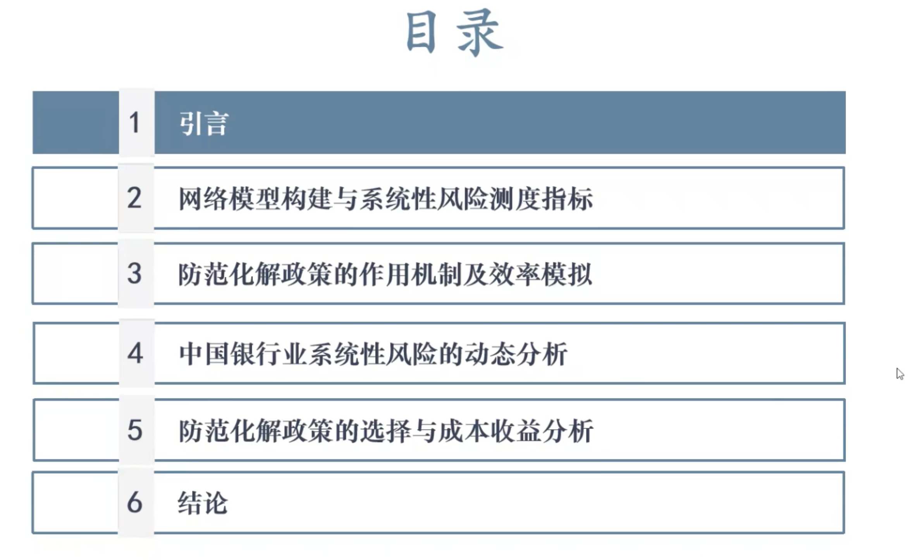
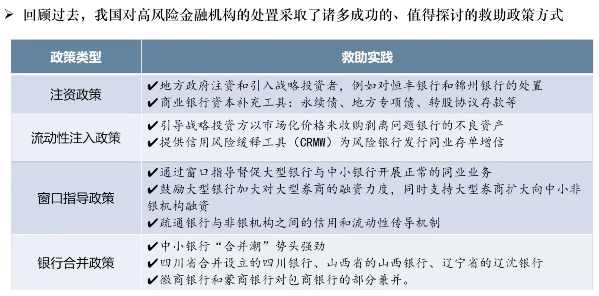

# 王奕蔺_2022_中国银行业系统性风险的防范化解政策有效性评估

---
title: 王奕蔺_2022_中国银行业系统性风险的防范化解政策有效性评估
authors: Ethan Lin
year:
tags:
  - 日期/2022-12-05 
  - 类型/笔记 
  - 内容/银行业系统性风险 
  - 内容/系统性风险防范化解 
---

# 封面

# 目录

# 引言

近年来，我国防范化解重大金融风险攻坚战已经取得重大成果，金融体系的风险趋于收玫，㓞性明显增强。
2022年4月6日，中国人民银行等部门起草《中华人民共和国金融稳定法（草案征求意见稿）》，对金融风险的事前防范、事中化解和事后处置相关问题进行了明确要求，为建立健 全有序、高效处置风险的体制机制提供保障。
《金融稳定法》明确了在金融风险事件的化解处置过程中的各方责任，首先由金融机构来承 担主体责任、主动化解风险、穷尽手段自救；其次，要发挥市场化、法治化处置平台的作用，存款保险基金、行业保障基金依法履行风险处置、行业救助职责；最后，当市场化手段仍难 以化解风险时，则需要各级政府和中央人民银行依法动用公共资源与财政资金进行防范化解。

在过往实践中，中国人民银行遵循法治化、市场化的原则，有序处置了多家高风险金融机构 的风险事件，对包商银行、恒丰银行、锦州银行等分类施策，守住不发生系统性金融风险的 底线，强化了市场纪律。

然而, 不可忽视的是, 后疫情时期, 随着实体部门的债务杠杆迅速反弹, 银行业资产质量存在 劣变的趋势，从多渠道为中小银行补充资本的紧迫性进一步上升。因此, 目前爆发的银行风险 事件可能仅仅是银行业潜在风险的冰山一角, 中国银行业仍面临新的风险挑战, 这既需要防范 风险的先手，更需要化解风险的高招。
如何在成功经验的基础之上, 结合 《金融稳定法》，探索一套可量化、易实行、利监管的银行业系统性风险防范化解方案，是当前重要紧迫的课题。

# 文献综述

# 本文贡献

# 网络模型构建与系统性风险测度指标

# 防范化解政策的作用机制及效率模拟

# 中国银行业系统性风险的动态分析

# 防范化解政策的选择与成本收益分析

# 结论

