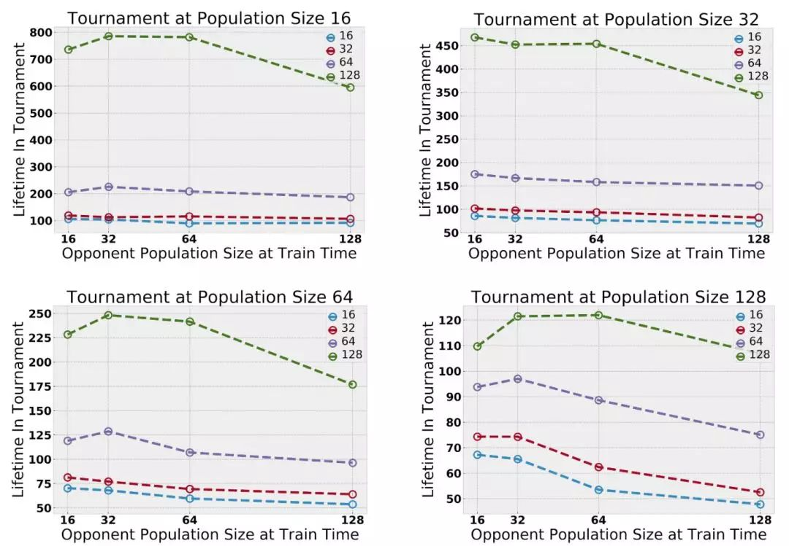

OpenAI 今天重磅发布 **Neural MMO**，这是一个 “**大规模多智能体**” 虚拟训练平台，它将 AI 智能体扔进一个类似 RPG 的世界 —— 一个拥有资源收集机制和玩家对战机制的完整游戏世界！

OpenAI 在最新博客文章中写道：“大型多人在线游戏 (Massively Multiplayer Online Games, MMOs) 这个游戏类型模拟了一个庞大的生态系统，其中有数量不等的玩家在持续而广阔的环境中进行竞争。”

“包含许多智能体和物种能够带来更好的探索、迥异的生态位形成，以及更强的整体能力。”

AI 智能体在 Neural MMO 环境中随机生成，Neural MMO 环境中还包含自动生成的预定大小的瓦片地图 (tile maps)。其中一些 tile 是可穿越的，如 “森林”(里边有食物)，其他则不能穿越 (如水和石头)。

agent 观察以各自位置为中心的方块 tile，在每个 timestamp 进行一次移动和一次攻击，解决诸如**寻找有限的 “食物” 和 “水” 资源的任务** (通过踩到 forest tile 或走到 water tile 旁边)，以及**与其他 agent 战斗** (“近战 ,” “远攻”, “法术” 等)。

请看 demo：

<iframe src="https://www.zhihu.com/video/1086252902322036736?player={%22autoplay%22:false}" allowfullscreen="" frameborder="0" class="css-1mzat5w-VideoWrapper" style="width: 688px; height: 387px;"></iframe>

OpenAI 使用 Neural MMO 训练了一个 AI 系统，通过奖励 agent 的 lifetime (即 agent 能够维持活着的时间) 来实现。

他们发现，**智能体之间彼此交互的时间越长，它们在某些任务中的表现就越好**，并且**增加同时存在的智能体的最大数量有助于 “放大” 它们的探索**。

有趣的是，他们还发现，增加智能体的种群规模可以促使它们分散到地图的不同区域，而**在较大环境中训练的智能体 “始终” 优于在较小环境中训练的智能体**。

OpenAI 在 GitHub 上发布了 Neural MMO，它的设计支持大量智能体 (100 台并行服务器每台最多支持 128 个智能体)。Neural MMO 封装在基线中 (在 100 多个世界中训练)，可以比较 agent 的性能，并且计算开销相对较低 —— **训练只需要单个桌面 CPU**。

OpenAI 在博客文章中详细介绍了 Neural MMO 强化学习环境的技术细节：

## **多智能体强化学习两大挑战**

近年来，多智能体设置已经成为深入强化学习研究的一个有效平台。尽管取得了许多进展，多智能体强化学习仍然面临两个主要挑战。

我们**需要创建具有高度复杂性上限的开放式任务**：当前的环境要么虽然复杂但过于狭窄，要么虽然开放但过于简单。持续性和大规模等属性也很关键，但是我们还**需要更多的基准环境 (benchmark environments)** 来量化在具有大规模和持续性条件下的学习进度。

大型多人在线游戏 (Massively Multiplayer Online Games, MMOs) 这个游戏类型模拟了一个大型生态系统，该系统由数量不等的玩家在持续且广阔的环境中进行竞争。

为了应对这些挑战，我们构建了 Neural MMO，它符合以下标准：

- **持续性 (Persistence)**：在没有环境重置的情况下，agent 可以在其他学习 agent 存在的情况下同时学习。策略必须考虑长期范围，并适应其他 agent 行为中潜在的快速变化。
- **规模 (Scale)**：环境支持大量且可变数量的实体。我们的实验考虑了在 100 个并行服务器中，每个服务器 128 个并行智能体的长达 100M 的 lifetimes。
- **效率 (Efficiency)**：进入 Neural MMO 的计算障碍很低。我们可以在单个桌面 CPU 上训练有效的策略。
- **扩展 (Expansion)**：与现有 MMO 类似，Neural MMO 的设计旨在更新新内容。目前的核心功能包括 tile-based 地形的程序化生成、食物和水的觅食系统，以及战略作战系统。未来有机会进行开源的扩展。

## **Neural MMO 环境**

**玩家 (智能体)** 可以加入任何可用的**服务器 (环境)**，每个服务器 (环境) 都包含一个自动生成的可配置大小的 **tile-based 游戏地图**。有些 tile，如生长食物的森林瓦片和草地瓦片，是可穿越的。其他的，如水和固体石头，则不能穿越。

智能体在环境边缘的随机位置生成。它们必须获得食物和水，并避免被其他智能体打倒，以维持生命。踩在森林瓦片上或靠近水的地方，分别会重新补充食物供应或水供应。

然而，森林瓦片的食物供应有限，随着时间的推移，食物会缓慢再生。这意味着智能体们必须竞争食物瓦片，同时周期性地从无限的水瓦片中补充水的供应。

玩家在战斗中使用三种战斗风格，分别是近战 (Melee)，远攻 (Range) 和法术 (Mage)。

**输入：**智能体观察以当前位置为中心的方形瓦片地图，包括瓦片地形类型和入侵者的属性 (健康、食物、水和位置)。

**输出：**智能体为下一个 timestep 输出动作选项，动作包括一次移动和一次攻击。 

平台为价值函数、地图瓦片可视化分布和学习策略的 agent-agent 依赖关系提供了一个程序环境生成器 (procedural environment generator) 和可视化工具。 Baseline 使用超过 100 个世界的策略梯度进行训练。

## **模型**

作为一个简单的 baseline，我们使用普通的策略梯度训练了一个小型的、完全连接的架构，将值函数基线和奖励折扣作为唯一的增强。智能体不会因为实现了特定的目标而获得奖励，而是只根据其 lifetime (轨迹长度) 进行优化：在其 lifetime 中，每个 tick 都会获得 1 的奖励。我们通过计算所有玩家的最大值将可变长度的观察值 (比如周围玩家的列表) 转换为单个长度向量 (OpenAI Five 也使用了这个技巧)。

GitHub 开源的版本包含了完全分布式训练实现，基于 PyTorch 和 Ray。

## **评估结果**

训练时的最大 population size 在 (16、32、64、128) 之间。为了提高效率，策略在由 16 个智能体组成的组之间共享。在测试时，我们将在成对实验中的 populations 合并，并在一个固定的 population size 下评估 lifetime。我们只对觅食任务进行评估，因为作战策略更难直接比较。结果显示，**在更大的 population 中训练出来的智能体总是表现得更好**。

智能体的策略是从多个群体中均匀采样的 —— 不同群体的智能体共享架构，但只有相同群体中的智能体共享权重。初步实验表明，随着多智能体交互作用的增加，智能体的能力逐渐增强。增加同时存在的玩家的最大数量能够放大探索；群体数量的增加扩大了生态位的形成，也就是说，扩大了群体在地图不同区域的扩散和觅食的趋势。

## **服务器合并锦标赛：多智能体增强了竞争力**

MMO 之间没有标准的程序来评估跨多个服务器的相对玩家能力。然而，MMO 服务器有时会经历合并，即来自多个服务器的玩家基地被放置在单个服务器中。我们通过合并在不同服务器上训练的玩家基地来实现 “锦标赛” 风格的评估。这使我们能够直接比较在不同实验环境中学习到的策略。我们改变了测试时间范围，发现在较大环境中训练的智能体始终优于在较小环境中训练的智能体。

<iframe src="https://www.zhihu.com/video/1086253209420500992?player={%22autoplay%22:false}" allowfullscreen="" frameborder="0" class="css-1mzat5w-VideoWrapper" style="width: 688px; height: 387px;"></iframe>

增大群体规模扩大了探索

Population size 的增大扩大了探索范围：智能体会分散开来，以避免竞争。视频最后几帧显示了学习值函数叠加。

在自然界中，动物之间的竞争可以激励它们分散开来，以避免冲突。我们观察到，随着同时存在的智能体数量的增加，地图覆盖率也在增加。智能体学习探索仅仅是因为其他智能体的存在提供了这样做的自然动机。

## **物种数量的增加扩大了生态位的形成**

物种数量 (populations 的数量) 放大了生态位形成 (niche formation)。探索地图覆盖了游戏地图；不同的颜色对应不同的物种。训练单一种群往往会产生单一的深度探索路径。训练 8 个种群会导致许多更浅的路径：种群分散以避免物种间的竞争。

在一个足够大且资源丰富的环境中，我们发现不同的智能体种群分布在整个地图上，以避免在种群增长时与其他智能体竞争。由于实体无法在竞争中胜过其种群中的其他智能体 (即与它们共享权重)，它们倾向于在地图上寻找包含足够资源以维持其人口的区域。DeepMind 在并发多智能体研究中也独立观察到类似的效果。

**其他启发**

每个方形地图显示了位于地图中心的智能体对其周围智能体存在的响应。我们展示了初始化和训练早期的觅食地图，额外的依赖关系图对应于不同的觅食和战斗形式。

我们通过将智能体固定在假想地图的中心来可视化 agent-agent 依赖关系。对于该智能体可见的每个位置，我们将显示如果在该位置有第二个智能体，值函数将是什么。我们发现，在觅食和战斗环境中，agent 学习依赖于其他 agent 的策略。当智能体学习环境中的战斗机制时，它们开始适当地评估有效的接近范围和接近的角度。

## **下一步的研究**

我们的 Neural MMO 解决了之前基于游戏环境的两个主要限制，但仍有许多问题尚未解决。 Neural MMO 在环境复杂性和人口规模之间找到了一个中间地带。我们在设计这个环境时考虑到了开源扩展，并将其作为研究社区的基础。

## **开源**

[openai/neural-mmogithub.com/openai/neural-mmo](https://link.zhihu.com/?target=https%3A//github.com/openai/neural-mmo)

此存储库包含基于 THREE.js 的主要神经 MMO 项目的 3D 浏览器客户端。 它虽然是用 Javascript 写的，但读起来像 Python。

**安装**

你不需要手动 clone 这个库，只需遵循 OpenAI Repo 中的安装说明 (下方链接)：

[https://docs.google.com/document/d/1_76rYTPtPysSh2_cFFz3Mfso-9VL3_tF5ziaIZ8qmS8/edit?usp=sharing](https://link.zhihu.com/?target=https%3A//docs.google.com/document/d/1_76rYTPtPysSh2_cFFz3Mfso-9VL3_tF5ziaIZ8qmS8/edit%3Fusp%3Dsharing)

该链接将下载 THREE.js。如果你不希望下载整个源代码库，可以手动完成此操作。

**性能**

在高端台式机上大约 50-60 FPS，负载在 3s 左右，在 Razer 笔记本电脑上大约 30 FPS，负载在 10s 左右。

**已知局限性**

客户端已经在 Ubuntu 上用 Firefox 进行了测试。不要使用 Chrome。它应该可以在其他 Linux 发行版和 mac 上运行。

如果硬件设置允许，请使用 Nvidia 驱动程序。唯一真正的需求是支持每个着色器超过 16 个纹理。这只在 Counts visualizer 中需要 —— 如果在切换叠加时地形图消失，那么你将知道你的设置是错误的。

这是因为研究叠加层被编写为原始 glsl 着色器。 特别地，计数探索可视化器硬编码对应于探索地图的八个纹理。 这超出了允许的纹理数量。 

论文：

[https://s3-us-west-2.amazonaws.com/openai-assets/neural-mmo/neural-mmo-arxiv.pdfs3-us-west-2.amazonaws.com/openai-assets/neural-mmo/neural-mmo-arxiv.pdf](https://link.zhihu.com/?target=https%3A//s3-us-west-2.amazonaws.com/openai-assets/neural-mmo/neural-mmo-arxiv.pdf)

GitHub：

[openai/neural-mmogithub.com/openai/neural-mmo](https://link.zhihu.com/?target=https%3A//github.com/openai/neural-mmo)

------