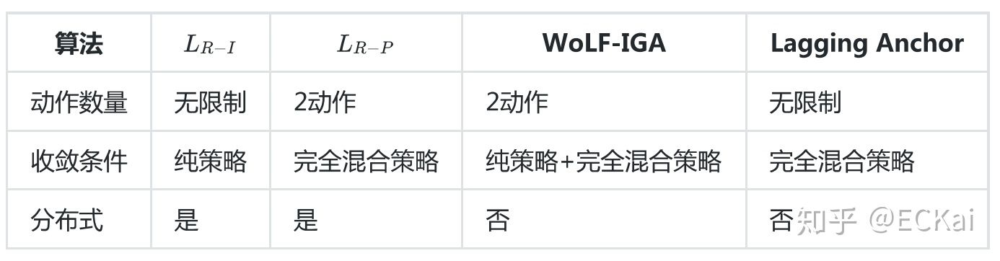

# 多智能体强化学习

tags: #笔记 #文献  #内容/MARL 

https://github.com/gsverhoeven/gt_rl_course/tree/master//gsverhoeven/gt_rl_course/tree/master/能体强化学习 

# 相关基础知识：

### 博弈论

分为[[potential game]]

[[求解标准形式博弈]]

# 相关学习

[[学习多智能体强化学习]]

[[学习强化学习]]

# 相关应用平台

[AI-Economist平台](https://github.com/salesforce/ai-economist)
	[[AI-Economist工具学习笔记]]
	相关文献：
		[[Zheng_Trott_et-al_2021_The AI economist - Optimal economic policy design via two-level deep.pdf]]

PettingZoo平台
	[[PettingZoo工具学习笔记]]

# 相关资料

[[多智能体强化学习相关资料]]

[[强化学习之混合动作空间]]

## 评价算法

评价算法技术指标：合理性、收敛性。

## 简述算法

[[Minimax-Q]]算法适用于两人零和随机博弈；求解线性规划；耗时；

[[Nash Q-Learning]]基于Minimax-Q，扩展零和博弈至多人一般和博弈；求解二次规划；耗时；

[Hu J, Wellman M P, 2003. Nash Q-Learning for General-Sum Stochastic Games[J] ](zotero://select/library/items/LLKDUEVX)

Friend-or-Foe Q-Learning算法基于Minimax-Q，通过区分两类：敌友，转化多智能体一般和博弈为双智能体零和博弈；求解线性规划；耗时；

Unity基于[[Multi-Agent Policy Gradients (COMA)]]提出[[Multi-Agent POsthumous Credit Assignment (MA-POCA)]]

[Cohen A, Teng E, Berges V-P, 等, 2021. On the Use and Misuse of Absorbing States in Multi-Agent Reinforcement Learning: arXiv:2111.05992[Z/OL]. arXiv(2021–11–10)[2022–05–28]. [http://arxiv.org/abs/2111.05992](http://arxiv.org/abs/2111.05992).](zotero://select/library/items/NM8W3Q5W)

比较$L_{R-I}$、$L_{R-P}$、WoLF-IGA、Lagging Anchor算法得出结论：

[[DQN算法]]属于深度强化学习算法，特点是[[无模型]]、[[离轨策略学习]]，是[[深度强化学习]]之开山之作，具体见笔记[[Mnih_Kavukcuoglu_et-al_2015_Human-level control through deep reinforcement learning]]。

> 参考：
> [多智能体强化学习入门（二）——基础算法（MiniMax-Q，NashQ，FFQ，WoLF-PHC） - 知乎](https://zhuanlan.zhihu.com/p/53563792)
> 
> [多智能体强化学习入门（三）——矩阵博弈中的分布式学习算法 - 知乎](https://zhuanlan.zhihu.com/p/53622102)